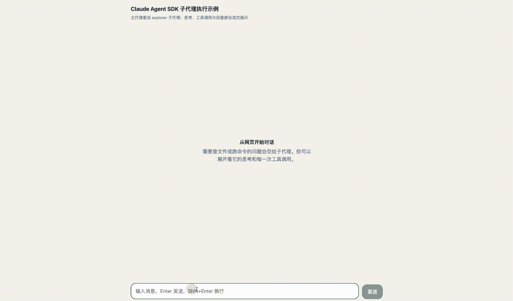
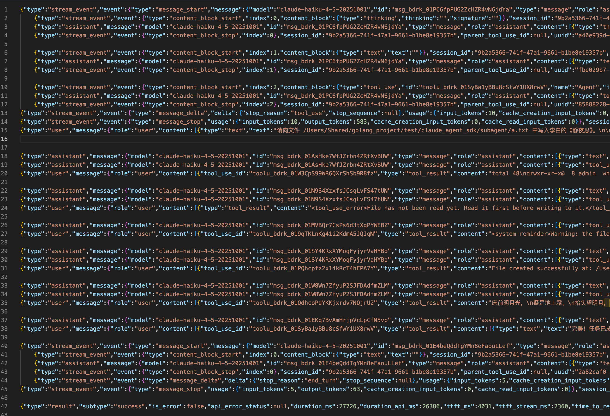
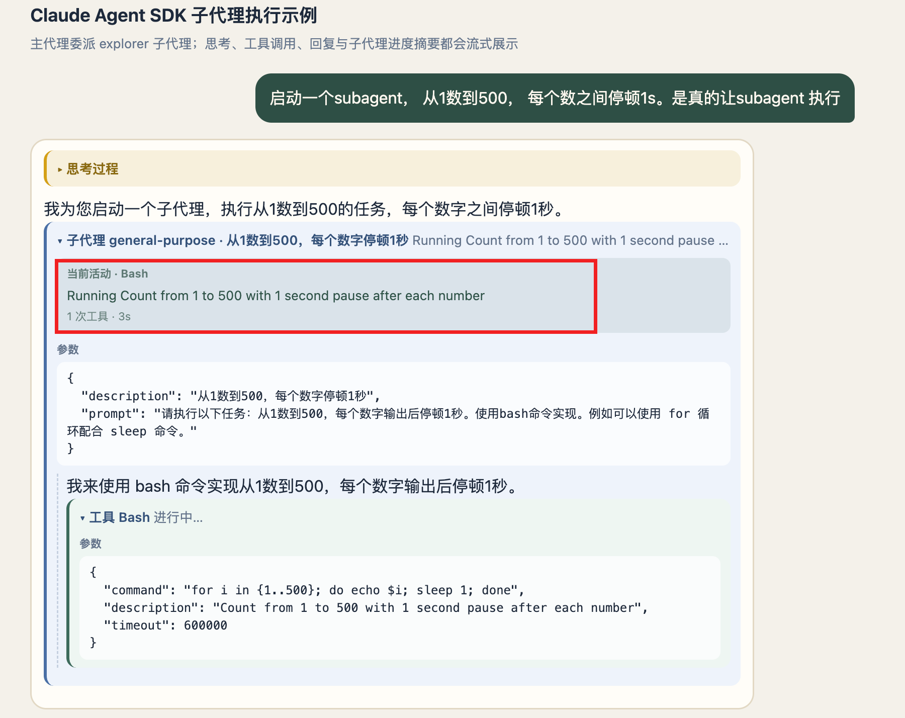
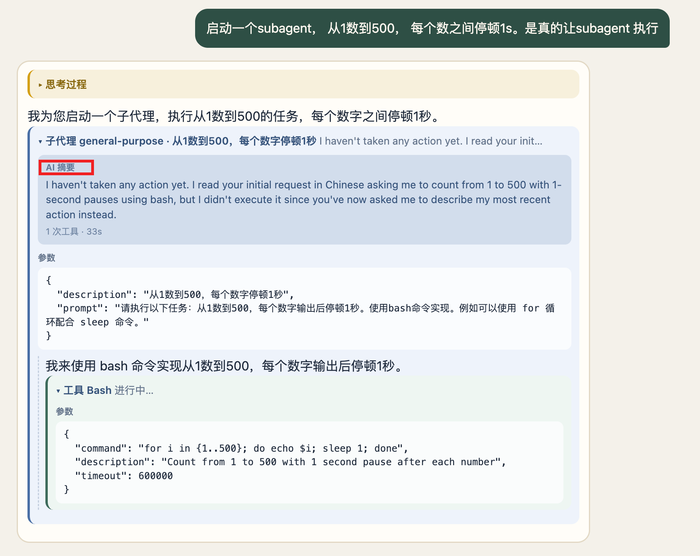

> 需求：subagent 作为一个 可以独立执行任务的工具，其执行过程我们也是很关心的。

##  Agent 调用

### 效果



在这个 subagent 的调用中， 该subagent 进行了5次工具调用，工具调用过程穿插了输出块。最后是工具调用结果。

然后，主agent 进行了一个总结。



### subagent 消息归属

主agent 可以输出一条消息，subagent 也可以输出一条消息。那么如何知道一条消息是属于谁的呢？

主agent在调用时会设置工具调用的id: `toolu_bdrk_01SyBa1yBBu8cSfwY1UX8rwV`

```json
{
  "type": "stream_event",
  "event": {
    "type": "content_block_start",
    "index": 2,
    "content_block": {
      "type": "tool_use",
      "id": "toolu_bdrk_01SyBa1yBBu8cSfwY1UX8rwV",
      "name": "Agent",
      "input": {}
    }
  },
  "session_id": "9b2a5366-741f-47a1-9661-b1be8e19357b",
  "parent_tool_use_id": null,
  "uuid": "8159a50a-3ea6-4725-bece-a07c02d7d471"
}
```

Subagent 输出消息时会携带这个id, 字段是 `parent_tool_use_id`

而且只有subagent 消息的`parent_tool_use_id`字段会有值

```json
{
  "type": "assistant",
  "message": {
    "model": "claude-haiku-4-5-20251001",
    "id": "msg_bdrk_01AsHke7WfJZrbn4ZRtXvBUW",
    "type": "message",
    "role": "assistant",
    "content": [
      {
        "type": "text",
        "text": "我来帮你完成这个任务。首先检查目录是否存在，然后写入文件。"
      }
    ],
    "stop_reason": null,
    "stop_sequence": null,
    "usage": {
      "input_tokens": 3,
      "cache_creation_input_tokens": 3021,
      "cache_read_input_tokens": 19054,
      "cache_creation": {
        "ephemeral_5m_input_tokens": 3021,
        "ephemeral_1h_input_tokens": 0
      },
      "output_tokens": 1
    },
    "context_management": null
  },
  "parent_tool_use_id": "toolu_bdrk_01SyBa1yBBu8cSfwY1UX8rwV",
  "session_id": "9b2a5366-741f-47a1-9661-b1be8e19357b",
  "uuid": "18f03c53-44fd-411c-a789-f3bac8e844d7",
  "subagent_type": "general-purpose",
  "task_description": "向文件写入静夜思"
}
```

## 转发Subagent消息

默认情况下，

## Subagent 进度摘要

Subagent 在执行过程中，有时很长一段时间都不调用工具，在前端的表现就像是静默了一样。

可以在 query conds 参数设置 `agentProgressSummaries = true`， 主agent 会定时发送subagent 的任务进度摘要消息。





### 消息

打开 `agentProgressSummaries: true` 后，SDK 并不会单独再开一条「摘要流」。子代理进度统一走 `system` / `task_progress`。同一条 `task_id` 上会交错出现两类帧，消费时必须先拆开。

|                | 活动脉冲                                                     | AI 摘要                                                      |
| :------------- | :----------------------------------------------------------- | ------------------------------------------------------------ |
| 触发           | 子代理每次 `tool_use`，立刻发出                              | 默认约 30s 的定时器                                          |
| 有没有模型调用 | 没有，本地拼文案                                             | 有，fork 子代理对话打一轮                                    |
| 特征字段       | `last_tool_name` + `description`，无 `summary`               | 有 `summary`，通常没有 `last_tool_name`                      |
| 文案从哪来     | 工具自己的 `getActivityDescription`，例如 Bash → `Running Count from 1 to 100...` | 模型按「3–5 个词、现在进行时」生成，例如 `Checking script existence` |
| 成本           | 免费                                                         | 复用子代理 prompt cache，通常很低                            |

判断规则很简单：有 `summary` 就是 AI 摘要，否则就是活动脉冲。

不要被时间间隔误导。日志里第一帧经常出现在 3s 左右，那只是子代理刚好那时调用了第一个工具，不是 3 秒心跳。

**和主线程心跳的区别**

主会话里跑很久的工具，会另发 `tool_progress` 且 `heartbeat: true`，大约每 30s 一次，带 `tool_name` 和 `elapsed_time_seconds`，用来区分「还在跑」和「会话卡死」。

Agent / Task 本身不走这条。 子代理内部的工具调用也不会发这种心跳。子代理进度只看 `task_progress`。

### 如何处理消息

后端不要把两类帧揉成同一个字段。有 `summary` 标 `source: 'summary'`，否则标 `source: 'activity'`，并带上 `usage.duration_ms` / `tool_uses`。

```ts
    if (msg.type === 'system' && msg.subtype === 'task_progress') {
      return [
        {
          type: 'task_progress',
          toolUseId: msg.tool_use_id,
          description: msg.description,
          summary: msg.summary,
          lastToolName: msg.last_tool_name,
          subagentType: msg.subagent_type,
          source: msg.summary ? 'summary' : 'activity',
          durationMs: msg.usage.duration_ms,
          toolUses: msg.usage.tool_uses,
          totalTokens: msg.usage.total_tokens,
        },
      ];
    }
```

前端按 `tool_use_id` 挂到对应的 Agent/Task 卡片，不要用进度文案覆盖最初的任务标题：

```ts
if (event.summary) {
  tool.progress = event.summary;       // AI 摘要
  tool.progressSource = 'summary';
} else if (event.description) {
  tool.progress = event.description;   // 活动脉冲
  tool.progressSource = 'activity';
}
```

UI 上可以拆开：活动脉冲做「当前活动 · Bash」，AI 摘要做卡片上那句更像人话的进度。长任务卡住、脉冲停更时，`duration_ms` 仍能证明任务还活着；也可以再听主线程的 `tool_progress` 心跳，但那是另一条通道。

一句话：活动脉冲跟着工具走，AI 摘要才是 30 秒 fork 出来的那句现在进行时。前端要把两种帧都接到同一块进度上，用户才能看到更新。

### 主 Agent 心跳

主Agent中某个工具跑太久时，大约每 30 秒发一条：

```ts
    if (msg.type === 'tool_progress' && msg.heartbeat) {
      return [
        {
          type: 'tool_heartbeat',
          id: msg.tool_use_id,
          name: msg.tool_name,
          elapsedSeconds: msg.elapsed_time_seconds,
          parentToolUseId: msg.parent_tool_use_id,
        },
      ];
    }
```

用来区分「工具还在跑」和「会话卡死了」。`heartbeat: true` 才是这类保活帧；没有这个字段的 `tool_progress` 可能是别的进度（比如重试），这里故意丢掉。

这段代码做的事：

1. 只收主线程心跳：`type === 'tool_progress' && heartbeat`
2. 转成前端用的 `tool_heartbeat`
3. 带上工具 id、名字、已运行秒数，以及 `parentToolUseId`（嵌套时用来对上父工具）

注意：Agent / Task 本身不会发这种心跳，子代理内部的 Bash/Read 也不会。子代理进度走的是上面的 `task_progress`。所以这段在「主代理自己调了一个跑很久的工具、且没有委派给子代理」时才会有输出。