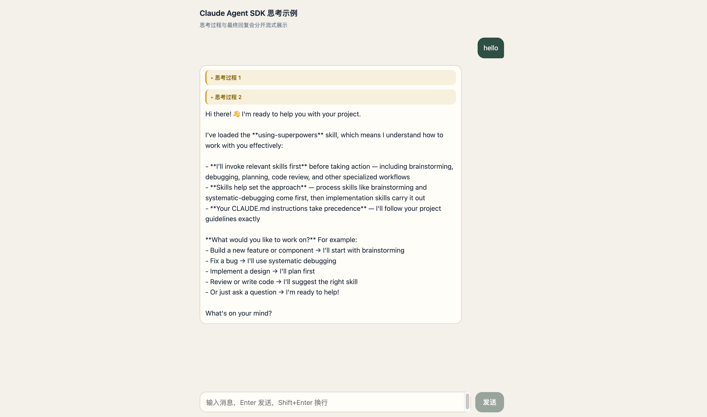
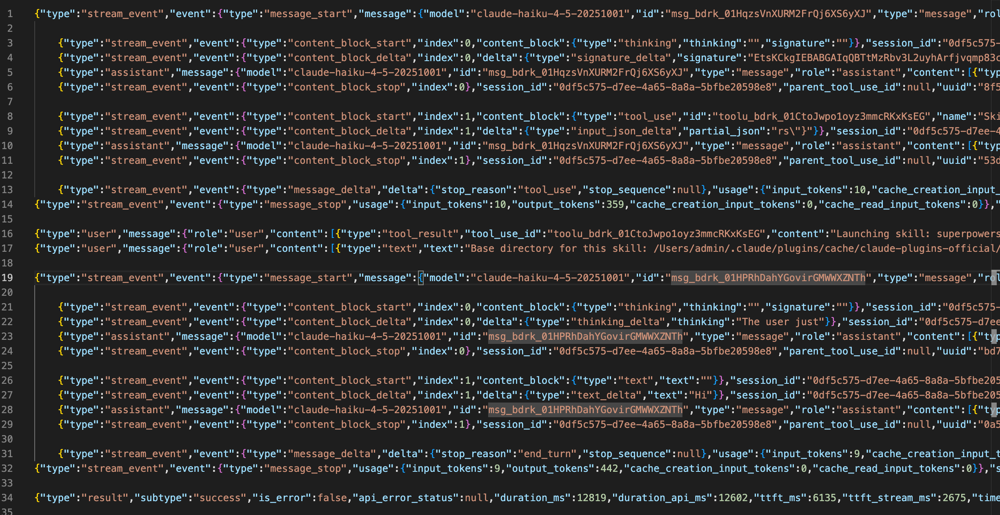
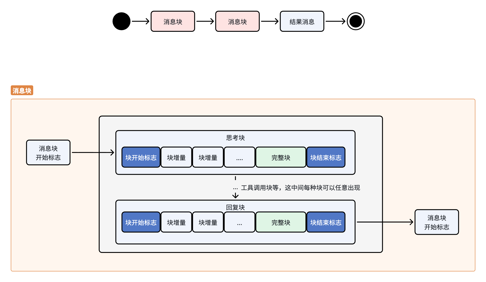

> 需求：现状是只能获取到AI执行任务后的输出，它思考过程以及工具调用情况完全是个黑盒。在思考时，用户瞪眼干等。

## 效果

我发出了一个消息，AI进行了两次思考。



此处刻意将多次思考分开渲染，这里想说明一个问题，既然能分开，必然是两次思考之间有明显的标志。

事实上，前边我们已经大概接触过`块`的结构了。如下图所示



这里我移除一些增量内容，每行就是claude 发出的一条消息。

消息块是有开始和结束标志的。

比较让人不舒服的是，所有块结束的消息只写块结束，它不告诉你具体是什么块，还得自己维护index或者找规律。

如上图所示，我们可以找一下最顶层消息的规律，就是如下图的样子。



所以，我们可以封装一个流式消息处理器。在解析消息的时候，同时维护块的索引类型。


## API

这里不涉及新的参数或接口，从消息中解析就可以。

本例子我们改为在前端网页交互。

### 核心代码

```ts
class PartialAssistantMessageHandler {
  // stop 事件只有 index，需要靠 start 时记下每个块的类型
  private blockTypeByIndex = new Map<number, string>();

  map(msg: SDKMessage): ChatEvent | undefined {
    if (msg.type === 'stream_event') return this.fromStreamEvent(msg.event);
    if (msg.type === 'result' && msg.is_error) {
      return { type: 'error', message: msg.subtype };
    }
  }

  private fromStreamEvent(event: StreamEvent): ChatEvent | undefined {
    if (event.type === 'message_start') {
      this.blockTypeByIndex.clear();
      return;
    }
    if (event.type === 'content_block_start') {
      this.blockTypeByIndex.set(event.index, event.content_block.type);
      if (event.content_block.type === 'thinking') {
        return { type: 'thinking_start' };
      }
      return;
    }
    if (event.type === 'content_block_delta') {
      if (event.delta.type === 'thinking_delta' && event.delta.thinking) {
        return { type: 'thinking', text: event.delta.thinking };
      }
      if (event.delta.type === 'text_delta' && event.delta.text) {
        return { type: 'text', text: event.delta.text };
      }
      return;
    }
    if (event.type === 'content_block_stop') {
      const blockType = this.blockTypeByIndex.get(event.index);
      this.blockTypeByIndex.delete(event.index);
      if (blockType === 'thinking') {
        return { type: 'thinking_end' };
      }
    }
  }
}

/**
 * 发送一轮对话，通过 stream_event 拆出 thinking / text 增量，返回 sessionId 供下一轮 resume。
 */
async function* ask(userMessage: string, sessionId?: string): AsyncGenerator<ChatEvent> {
  const q = query({
    prompt: userMessage,
    options: {
      pathToClaudeCodeExecutable: '/opt/homebrew/bin/claude',
      model: 'claude-haiku-4-5-20251001',
      resume: sessionId,
      includePartialMessages: true,
      thinking: { type: 'enabled', budgetTokens: 8000 },
    },
  });

  let sid = sessionId;
  const handler = new PartialAssistantMessageHandler();

  for await (const msg of q) {
    if (msg.type !== 'system') writeMsgToFile(msg);
    if (msg.type === 'stream_event' || msg.type === 'assistant' || msg.type === 'result') {
      sid = msg.session_id;
    }
    const event = handler.map(msg);
    if (event) yield event;
  }

  yield { type: 'done', sessionId: sid };
}
```


