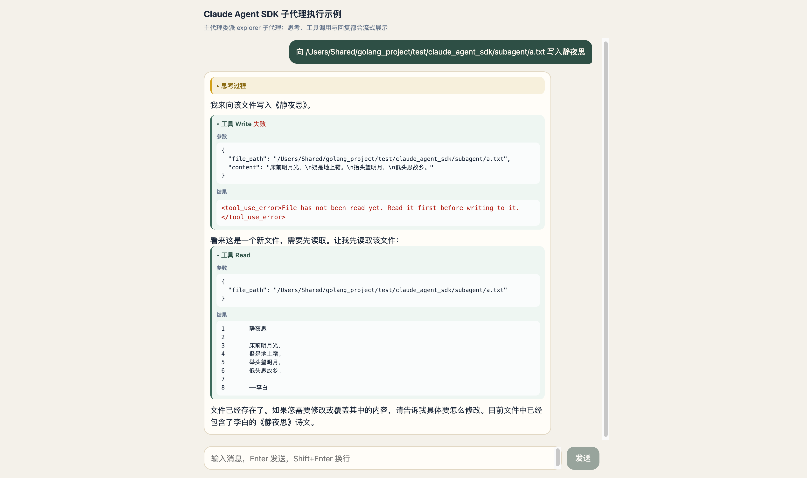
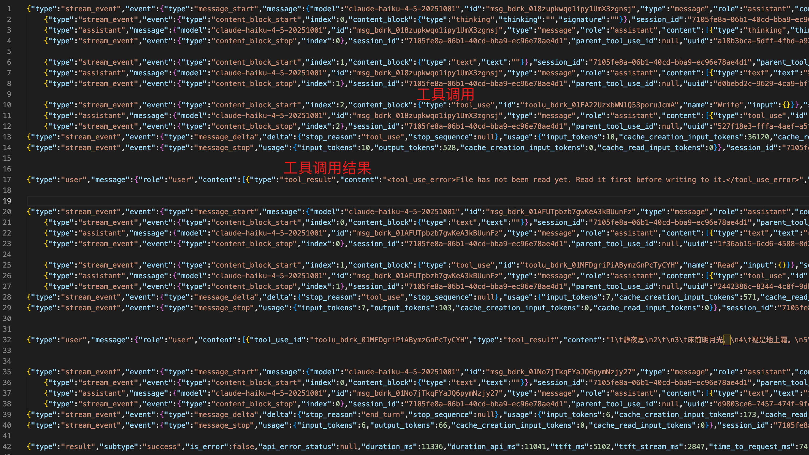
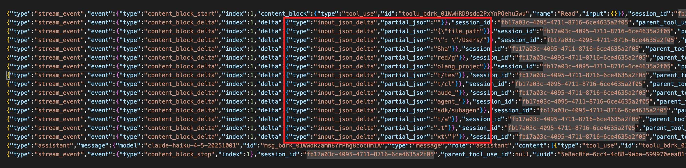

> 需求：在前端展示工具调用过程

## 非Agent工具调用

在介绍Agent之前，有必要先了解一下非Agent工具调用的流程，因为 Agent 这个工具太特殊，会引入并发。所以，先了解非并发下的个工具调用是怎样的。

### 效果



上述结果对应的消息如下



#### 工具调用参数

工具调用参数是 agent 自己生成的，agent sdk 通过流式增量输出。由于本例子输出消息日志时将增量丢弃了，这里展示另一个例子的工具调用参数作为一个示意吧。



```json
{
  "type": "stream_event",
  "event": {
    "type": "content_block_delta",
    "index": 1,
    "delta": {
      "type": "input_json_delta",
      "partial_json": "{\"file_path"
    }
  },
  "session_id": "fb17a03c-4095-4711-8716-6ce4635a2f05",
  "parent_tool_use_id": null,
  "uuid": "7353f6c0-f292-45aa-8777-d08f38d87c71"
}
```

#### 工具调用结果

先看工具调用结果的消息格式，然后发出你的疑问。

```json
{
  "type": "user",
  "message": {
    "role": "user",
    "content": [
      {
        "type": "tool_result",
        "content": "<tool_use_error>File has not been read yet. Read it first before writing to it.</tool_use_error>",
        "is_error": true,
        "tool_use_id": "toolu_bdrk_01FA22UzxbWN1Q53poruJcmA"
      }
    ]
  },
  "parent_tool_use_id": null,
  "session_id": "7105fe8a-06b1-40cd-bba9-ec96e78ae4d1",
  "uuid": "f5bb6e81-a105-44d8-81e2-1d55a4a3ce66",
  "timestamp": "2026-08-14T09:20:43.392Z",
  "tool_use_result": "Error: File has not been read yet. Read it first before writing to it."
}
```

> 为什么工具调用结果的消息类型是 user?

根本原因：Anthropic API 的消息角色规范。

在 Anthropic 的 Messages API 中，对话遵循严格的 **user/assistant 轮次交替** 模式。工具调用结果（`tool_result`）在协议层面被归类为 **用户消息**，这是因为：

1. **Assistant 发起工具调用** → assistant 消息中包含 `tool_use` block
2. **返回工具结果** → 必须以 `user` 角色发送 `tool_result` block

这不是"用户输入"的语义，而是协议规定：**所有非 AI 生成的内容，都以 `user` 角色传递给模型**。工具的执行发生在模型之外（在客户端/环境侧），所以结果自然属于"user"侧的信息。

对应到消息结构上就是  `user`->`message 块` -> `user` -> `message 块` -> `result`

顺带提一句， `user`->`message 块` 这一对构成一个来回，称作一个`turn`。

