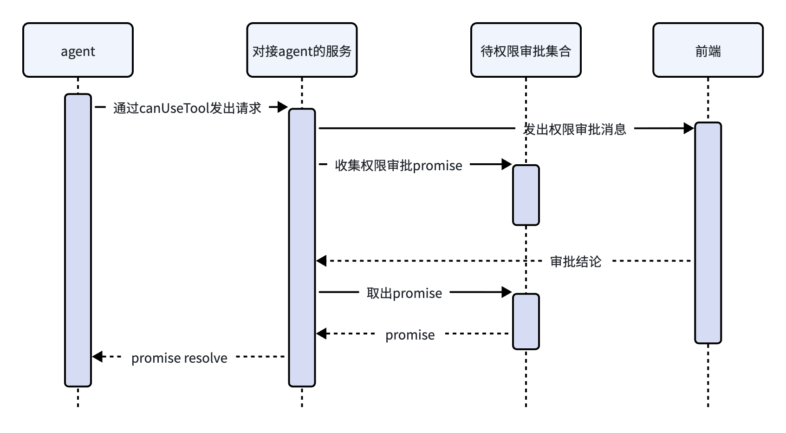

## API 

权限审批不同通过消息发出的。

通过 claude agent sdk 发出请求时，可以使用`options`的 `canUseTool` 字段注册回调函数。

注意一下，下边这个函数类型的定义，前边都是入参，用来给我们使用的。返回值是一个promise

```ts
/**
 * 用于控制工具是否可用的权限回调。
 * 每次真正执行工具之前都会调用，用来判断这次调用是否允许。
 *
 * 只有在调用方已经通过带外通道发过 control_response 之后，才应返回 `null`
 * （例如用签名后的 HTTP POST 回传 `requestId`）；此时 SDK 会跳过自己的传输层写入。
 * 失败即关闭：如果不小心返回了 null，就不会发出 control_response，工具会一直卡在阻塞状态
 * ——权限提示没有超时/停放截止时间。
 */
export declare type CanUseTool = (
  toolName: string,
  input: Record<string, unknown>,
  options: {
    /** 若操作应中止，会通过该信号通知。 */
    signal: AbortSignal;
    /**
     * 建议的权限更新，目的是让用户本会话内不再反复被询问同一工具。
     *
     * 典型用法：如果 UI 提供「始终允许」之类选项，
     * 用户选中后应把这份完整 suggestions 作为 PermissionResult 的
     * `updatedPermissions` 返回。
     */
    suggestions?: PermissionUpdate[];
    /**
     * 触发这次权限请求的文件路径（如果有）。
     * 例如 Bash 命令试图访问允许目录之外的路径时。
     */
    blockedPath?: string;
    /** 说明为什么会弹出这次权限请求。 */
    decisionReason?: string;
    /**
     * bridge 渲染好的完整权限提示句（例如
     * "Claude wants to read foo.txt"）。有这个字段时，应直接当主提示文案，
     * 不要再自己用 toolName + input 拼一句。
     */
    title?: string;
    /**
     * 工具动作的短名词短语（例如 "Read file"），
     * 适合做按钮文案或紧凑 UI。
     */
    displayName?: string;
    /**
     * 来自 bridge 的可读副标题（例如
     * "Claude will have read and write access to files in ~/Downloads"）。
     */
    description?: string;
    /**
     * 这次工具调用在 assistant 消息里的唯一 ID。
     * 同一条 assistant 消息里的多个工具调用会有不同的 toolUseID。
     */
    toolUseID: string;
    /** 如果当前跑在子代理上下文里，则为该子代理的 ID。 */
    agentID?: string;
    /**
     * control_request 信封上的 `request_id`。走带外回复的 control_response
     * （例如签名 HTTP POST，而不是 SDK 的 WebSocket 写入）
     * 必须原样回传这个值，worker 才能对上对应请求。
     */
    requestId: string;
    /**
     * 当用户配置的 ask 规则（permissions.ask）强制弹出这次提示，
     * 同时 ask 还带着工具自己的 decisionReason 时会设置。
     * Host 若按原因做策略（例如对 safetyCheck 自动拒绝），
     * 或做 Host 侧自动批准，遇到带这个字段的 ask 应视为「规则强制弹窗」：
     * 用户的明确意图就是必须问人。
     */
    matchedAskRule?: {
      source: string;
      toolName: string;
      ruleContent?: string;
    };
  },
) => Promise<PermissionResult | null>;
```

在权限处理这块，语言描述不方便，我绘制了一个时序图



返回的 PermissionResult 结构如下

```ts
export declare type PermissionResult = {
    behavior: 'allow';
    updatedInput?: Record<string, unknown>;
    updatedPermissions?: PermissionUpdate[];
    toolUseID?: string;
    decisionClassification?: PermissionDecisionClassification;
} | {
    behavior: 'deny';
    message: string;
    interrupt?: boolean;
    toolUseID?: string;
    decisionClassification?: PermissionDecisionClassification;
};
```

### 参数解释

- **input**

`input` 是这次工具调用的入参对象（Claude 真正要交给工具的参数），类型是 `Record<string, unknown>`。`toolName` 告诉你调哪个工具，`input` 告诉你怎么调。

这里有个例子：`{ "command": "ls -la", "description": "列出当前目录的所有文件和目录" }`

其他字段没必要详细解释，感兴趣的大概看下上边代码的注释即可。

