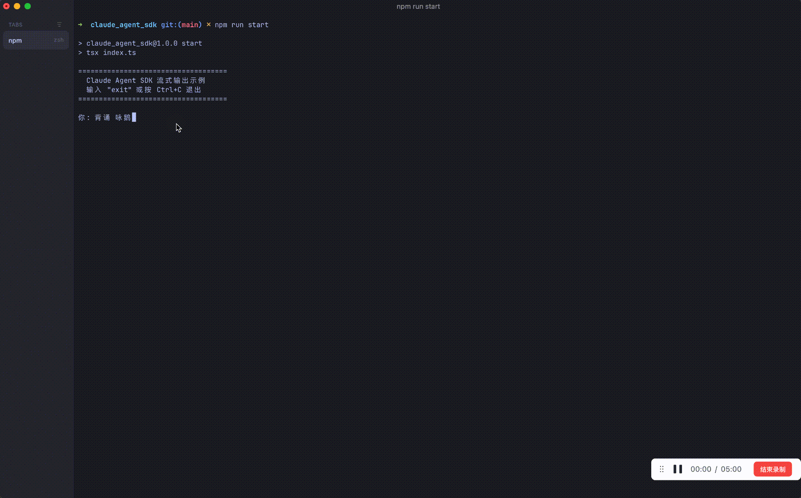

> 需求：通过 agent sdk 实现聊天消息的流逝输出

## 消息

流式消息的结构与上一个例子不同了，消息开始增加一些标志，而且引入了块的概念。


### 流式部分消息

```js
type SDKPartialAssistantMessage = {
  type: "stream_event";
  event: BetaRawMessageStreamEvent; // 来自 Anthropic SDK
  parent_tool_use_id: string | null;
  uuid: UUID;
  session_id: string;
  ttft_ms?: number; // 首个令牌的时间（毫秒），仅在 message_start 事件上显示
};
```

上图中除了完整块和最后的结果消息，中间其他的都变成了`stream_event`消息。建议先自己整体看下[完整消息流水](#完整消息流水)。

上述结构在本例子中没有什么特别可介绍的，摘几个重要的节点。

完整块的结构就是非流式输出中的`message`。

结果消息与 第一个例子 也是相同的。

- **消息开始标志**

  ```json
  {
    "type": "stream_event",
    "event": {
      "type": "message_start",
      "message": {
        "model": "claude-haiku-4-5-20251001",
        "id": "msg_bdrk_01N7yzbHnSkQBSGYnyDyGBDy",
        "type": "message",
        "role": "assistant",
        "content": [],
        "stop_reason": null,
        "stop_sequence": null,
        "usage": {
          "input_tokens": 10,
          "cache_creation_input_tokens": 0,
          "cache_read_input_tokens": 31828,
          "cache_creation": {
            "ephemeral_5m_input_tokens": 0,
            "ephemeral_1h_input_tokens": 0
          },
          "output_tokens": 7
        }
      }
    },
    "session_id": "c32b31c3-1abf-48db-abbc-eda31be92346",
    "parent_tool_use_id": null,
    "uuid": "8c162957-cb99-443a-9833-2c793f3ae0a3",
    "ttft_ms": 2681
  }
  ```

- **块开始标志**

  ```json
  {
    "type": "stream_event",
    "event": {
      "type": "content_block_start",
      "index": 0,
      "content_block": {
        "type": "thinking",
        "thinking": "",
        "signature": ""
      }
    },
    "session_id": "c32b31c3-1abf-48db-abbc-eda31be92346",
    "parent_tool_use_id": null,
    "uuid": "d1905d8b-5298-4020-beda-3f662ea47a4b"
  }
  ```

  ` "index": 0`这个是块的索引，本次消息共有两个块，一个思考块和一个回复块。思考块的索引是0

- **块增量**

  ```json
  {
    "type": "stream_event",
    "event": {
      "type": "content_block_delta",
      "index": 0,
      "delta": {
        "type": "thinking_delta",
        "thinking": "The user is asking me to rec"
      }
    },
    "session_id": "c32b31c3-1abf-48db-abbc-eda31be92346",
    "parent_tool_use_id": null,
    "uuid": "4cfaa446-7f2c-4a30-9bc7-70b31f5a59aa"
  }
  ```

  

- **块结束标志**

  ```ts
  {
    "type": "stream_event",
    "event": {
      "type": "content_block_stop",
      "index": 0
    },
    "session_id": "c32b31c3-1abf-48db-abbc-eda31be92346",
    "parent_tool_use_id": null,
    "uuid": "eea7eda3-ae4b-4b51-bc58-7984dc9e8e53"
  }
  ```

- **消息结束标志**

  ```json
  {
    "type": "stream_event",
    "event": {
      "type": "message_stop",
      "usage": {
        "input_tokens": 10,
        "output_tokens": 658,
        "cache_creation_input_tokens": 0,
        "cache_read_input_tokens": 0
      }
    },
    "session_id": "c32b31c3-1abf-48db-abbc-eda31be92346",
    "parent_tool_use_id": null,
    "uuid": "e9a109e8-af72-4eac-8fde-5f5853874677"
  }
  ```
  
  
  

## API

### 调用示例

```ts
query({
    prompt: userMessage,
    options: {
      pathToClaudeCodeExecutable: '/opt/homebrew/bin/claude',
      model: 'claude-haiku-4-5-20251001',
      resume: sessionId,
      
      // 开启 partial 消息，才会收到 type: 'stream_event' 的增量事件
      includePartialMessages: true,
    },
  });
```

很简单，请求时加个配置就好 `includePartialMessages: true`



### 完整代码

```ts
import { query, type SDKMessage } from '@anthropic-ai/claude-agent-sdk';
import { appendFileSync, mkdirSync } from 'fs';
import { dirname, join } from 'path';
import { createInterface } from 'readline';
import { fileURLToPath } from 'url';

const rl = createInterface({ input: process.stdin, output: process.stdout });
const ask = (prompt: string): Promise<string> =>
  new Promise((resolve) => rl.question(prompt, resolve));

const LOG_DIR = join(dirname(fileURLToPath(import.meta.url)), 'logs');
const LOG_FILE = join(LOG_DIR, `sdk-messages-${new Date().toISOString().replace(/[:.]/g, '-')}.jsonl`);
function writeMsgToFile(msg: SDKMessage): void {
  mkdirSync(LOG_DIR, { recursive: true });
  appendFileSync(LOG_FILE, `${JSON.stringify(msg)}\n`, 'utf8');
}

async function sendMessage(userMessage: string, sessionId?: string): Promise<string | undefined> {
  const q = query({
    prompt: userMessage,
    options: {
      pathToClaudeCodeExecutable: '/opt/homebrew/bin/claude',
      model: 'claude-haiku-4-5-20251001',
      resume: sessionId,
      // 开启 partial 消息，才会收到 type: 'stream_event' 的增量事件
      includePartialMessages: true,
    },
  });

  let sid = sessionId;

  for await (const msg of q) {
    switch (msg.type) {
      case 'system': {
        break;
      }
      default: {
        writeMsgToFile(msg);
        break;
      }
    }
    switch (msg.type) {
      case 'stream_event': {
        // 真正的流式增量：content_block_delta + text_delta
        sid = msg.session_id;
        const event = msg.event;
        if (
          event.type === 'content_block_delta' &&
          event.delta.type === 'text_delta'
        ) {
          process.stdout.write(event.delta.text);
        }
        break;
      }
      case 'assistant': {
        // 完整消息会在流结束后再来一次；正文已由 stream_event 打出，这里只记 session
        sid = msg.session_id;
        break;
      }
      case 'result': {
        if (msg.is_error) {
          console.error(`\n[错误] ${msg.subtype}`);
        } else {
          process.stdout.write('\n');
        }
        break;
      }
      default:
        break;
    }
  }

  return sid;
}

export async function streamingOutput(): Promise<void> {
  console.log('====================================');
  console.log('  Claude Agent SDK 流式输出示例');
  console.log('  输入 "exit" 或按 Ctrl+C 退出');
  console.log('====================================\n');

  let sessionId: string | undefined;

  while (true) {
    let userInput: string;
    try {
      userInput = await ask('你: ');
    } catch {
      break;
    }

    userInput = userInput.trim();
    if (!userInput) continue;
    if (userInput.toLowerCase() === 'exit') break;

    process.stdout.write('\nClaude: ');

    try {
      sessionId = await sendMessage(userInput, sessionId);
    } catch (sdkErr) {
      console.error(`\n[SDK 错误] ${(sdkErr as Error).message}`);
    }

    console.log();
  }

  console.log('\n再见！');
  rl.close();
}

```


## 附件

### 完整消息流水

推荐使用 https://jsonl.co/zh/tools 查看如下内容

```
{
  "type": "stream_event",
  "event": {
    "type": "message_start",
    "message": {
      "model": "claude-haiku-4-5-20251001",
      "id": "msg_bdrk_01N7yzbHnSkQBSGYnyDyGBDy",
      "type": "message",
      "role": "assistant",
      "content": [],
      "stop_reason": null,
      "stop_sequence": null,
      "usage": {
        "input_tokens": 10,
        "cache_creation_input_tokens": 0,
        "cache_read_input_tokens": 31828,
        "cache_creation": {
          "ephemeral_5m_input_tokens": 0,
          "ephemeral_1h_input_tokens": 0
        },
        "output_tokens": 7
      }
    }
  },
  "session_id": "c32b31c3-1abf-48db-abbc-eda31be92346",
  "parent_tool_use_id": null,
  "uuid": "8c162957-cb99-443a-9833-2c793f3ae0a3",
  "ttft_ms": 2681
}
{
  "type": "stream_event",
  "event": {
    "type": "content_block_start",
    "index": 0,
    "content_block": {
      "type": "thinking",
      "thinking": "",
      "signature": ""
    }
  },
  "session_id": "c32b31c3-1abf-48db-abbc-eda31be92346",
  "parent_tool_use_id": null,
  "uuid": "d1905d8b-5298-4020-beda-3f662ea47a4b"
}
{
  "type": "stream_event",
  "event": {
    "type": "content_block_delta",
    "index": 0,
    "delta": {
      "type": "thinking_delta",
      "thinking": "The user is asking me to rec"
    }
  },
  "session_id": "c32b31c3-1abf-48db-abbc-eda31be92346",
  "parent_tool_use_id": null,
  "uuid": "4cfaa446-7f2c-4a30-9bc7-70b31f5a59aa"
}
{
  "type": "stream_event",
  "event": {
    "type": "content_block_delta",
    "index": 0,
    "delta": {
      "type": "thinking_delta",
      "thinking": "ite \""
    }
  },
  "session_id": "c32b31c3-1abf-48db-abbc-eda31be92346",
  "parent_tool_use_id": null,
  "uuid": "30a1f33b-4e49-49b1-bc01-0e886905f5da"
}
{
  "type": "stream_event",
  "event": {
    "type": "content_block_delta",
    "index": 0,
    "delta": {
      "type": "thinking_delta",
      "thinking": "咏鹅\" (Y"
    }
  },
  "session_id": "c32b31c3-1abf-48db-abbc-eda31be92346",
  "parent_tool_use_id": null,
  "uuid": "8aabad30-36ea-4ee4-9f0d-260e0a85306c"
}
{
  "type": "stream_event",
  "event": {
    "type": "content_block_delta",
    "index": 0,
    "delta": {
      "type": "thinking_delta",
      "thinking": "ong"
    }
  },
  "session_id": "c32b31c3-1abf-48db-abbc-eda31be92346",
  "parent_tool_use_id": null,
  "uuid": "94d00840-3ba4-4c8f-8638-1a8dd0d1f28f"
}
{
  "type": "stream_event",
  "event": {
    "type": "content_block_delta",
    "index": 0,
    "delta": {
      "type": "thinking_delta",
      "thinking": " E"
    }
  },
  "session_id": "c32b31c3-1abf-48db-abbc-eda31be92346",
  "parent_tool_use_id": null,
  "uuid": "a8581b77-5999-4734-b649-a279143da4d6"
}
{
  "type": "stream_event",
  "event": {
    "type": "content_block_delta",
    "index": 0,
    "delta": {
      "type": "thinking_delta",
      "thinking": "),"
    }
  },
  "session_id": "c32b31c3-1abf-48db-abbc-eda31be92346",
  "parent_tool_use_id": null,
  "uuid": "337c2284-f888-45c2-9520-78514bd8cb75"
}
{
  "type": "stream_event",
  "event": {
    "type": "content_block_delta",
    "index": 0,
    "delta": {
      "type": "thinking_delta",
      "thinking": " which is a famous"
    }
  },
  "session_id": "c32b31c3-1abf-48db-abbc-eda31be92346",
  "parent_tool_use_id": null,
  "uuid": "5f13f35f-97e9-40a0-ae2b-a5c3d0ccab8e"
}
{
  "type": "stream_event",
  "event": {
    "type": "content_block_delta",
    "index": 0,
    "delta": {
      "type": "thinking_delta",
      "thinking": " classical"
    }
  },
  "session_id": "c32b31c3-1abf-48db-abbc-eda31be92346",
  "parent_tool_use_id": null,
  "uuid": "04703668-d2ab-44b5-a5b9-7f8a9f4d4892"
}
{
  "type": "stream_event",
  "event": {
    "type": "content_block_delta",
    "index": 0,
    "delta": {
      "type": "thinking_delta",
      "thinking": " Chinese poem. This is a straightforwar"
    }
  },
  "session_id": "c32b31c3-1abf-48db-abbc-eda31be92346",
  "parent_tool_use_id": null,
  "uuid": "b40a9692-cef0-4112-adca-885e487fd780"
}
{
  "type": "stream_event",
  "event": {
    "type": "content_block_delta",
    "index": 0,
    "delta": {
      "type": "thinking_delta",
      "thinking": "d request to recite a well"
    }
  },
  "session_id": "c32b31c3-1abf-48db-abbc-eda31be92346",
  "parent_tool_use_id": null,
  "uuid": "da5159c9-f8cd-477d-856b-598814e78941"
}
{
  "type": "stream_event",
  "event": {
    "type": "content_block_delta",
    "index": 0,
    "delta": {
      "type": "thinking_delta",
      "thinking": "-known poem.\n\nLet"
    }
  },
  "session_id": "c32b31c3-1abf-48db-abbc-eda31be92346",
  "parent_tool_use_id": null,
  "uuid": "ebcb62d9-105f-4c2b-b93e-98ffc5ca8baa"
}
{
  "type": "stream_event",
  "event": {
    "type": "content_block_delta",
    "index": 0,
    "delta": {
      "type": "thinking_delta",
      "thinking": " me check if"
    }
  },
  "session_id": "c32b31c3-1abf-48db-abbc-eda31be92346",
  "parent_tool_use_id": null,
  "uuid": "ab54b2b5-5c83-4283-a5b6-533e6e116364"
}
{
  "type": "stream_event",
  "event": {
    "type": "content_block_delta",
    "index": 0,
    "delta": {
      "type": "thinking_delta",
      "thinking": " any"
    }
  },
  "session_id": "c32b31c3-1abf-48db-abbc-eda31be92346",
  "parent_tool_use_id": null,
  "uuid": "f99e92f9-0701-4297-af48-0627786b3924"
}
{
  "type": "stream_event",
  "event": {
    "type": "content_block_delta",
    "index": 0,
    "delta": {
      "type": "thinking_delta",
      "thinking": " skills"
    }
  },
  "session_id": "c32b31c3-1abf-48db-abbc-eda31be92346",
  "parent_tool_use_id": null,
  "uuid": "4f7b102a-9ec8-4971-a250-2957795f0fd8"
}
{
  "type": "stream_event",
  "event": {
    "type": "content_block_delta",
    "index": 0,
    "delta": {
      "type": "thinking_delta",
      "thinking": " apply"
    }
  },
  "session_id": "c32b31c3-1abf-48db-abbc-eda31be92346",
  "parent_tool_use_id": null,
  "uuid": "74410110-5403-44b9-b89c-2db307da208a"
}
{
  "type": "stream_event",
  "event": {
    "type": "content_block_delta",
    "index": 0,
    "delta": {
      "type": "thinking_delta",
      "thinking": " here:\n-"
    }
  },
  "session_id": "c32b31c3-1abf-48db-abbc-eda31be92346",
  "parent_tool_use_id": null,
  "uuid": "b1830074-7922-41f4-8b48-d0edc097e74e"
}
{
  "type": "stream_event",
  "event": {
    "type": "content_block_delta",
    "index": 0,
    "delta": {
      "type": "thinking_delta",
      "thinking": " This"
    }
  },
  "session_id": "c32b31c3-1abf-48db-abbc-eda31be92346",
  "parent_tool_use_id": null,
  "uuid": "cb94d40e-5aac-4531-ad1a-a53ea87a97f0"
}
{
  "type": "stream_event",
  "event": {
    "type": "content_block_delta",
    "index": 0,
    "delta": {
      "type": "thinking_delta",
      "thinking": " is not"
    }
  },
  "session_id": "c32b31c3-1abf-48db-abbc-eda31be92346",
  "parent_tool_use_id": null,
  "uuid": "6126b4f6-524d-413e-9787-7c47e2c4b478"
}
{
  "type": "stream_event",
  "event": {
    "type": "content_block_delta",
    "index": 0,
    "delta": {
      "type": "thinking_delta",
      "thinking": " a"
    }
  },
  "session_id": "c32b31c3-1abf-48db-abbc-eda31be92346",
  "parent_tool_use_id": null,
  "uuid": "707447e3-1e14-4533-b8fa-3ed2cb99c365"
}
{
  "type": "stream_event",
  "event": {
    "type": "content_block_delta",
    "index": 0,
    "delta": {
      "type": "thinking_delta",
      "thinking": " development"
    }
  },
  "session_id": "c32b31c3-1abf-48db-abbc-eda31be92346",
  "parent_tool_use_id": null,
  "uuid": "01db2a66-0517-42a7-b4d5-49de36206f5a"
}
{
  "type": "stream_event",
  "event": {
    "type": "content_block_delta",
    "index": 0,
    "delta": {
      "type": "thinking_delta",
      "thinking": "/"
    }
  },
  "session_id": "c32b31c3-1abf-48db-abbc-eda31be92346",
  "parent_tool_use_id": null,
  "uuid": "e3db5da6-3ed7-4fda-a257-befb08f375c2"
}
{
  "type": "stream_event",
  "event": {
    "type": "content_block_delta",
    "index": 0,
    "delta": {
      "type": "thinking_delta",
      "thinking": "coding task\n- This is not a"
    }
  },
  "session_id": "c32b31c3-1abf-48db-abbc-eda31be92346",
  "parent_tool_use_id": null,
  "uuid": "1bb5024f-023a-47dc-a588-7a903f409d42"
}
{
  "type": "stream_event",
  "event": {
    "type": "content_block_delta",
    "index": 0,
    "delta": {
      "type": "thinking_delta",
      "thinking": " bug"
    }
  },
  "session_id": "c32b31c3-1abf-48db-abbc-eda31be92346",
  "parent_tool_use_id": null,
  "uuid": "e12b1e86-1f78-4659-a812-e5feca31e388"
}
{
  "type": "stream_event",
  "event": {
    "type": "content_block_delta",
    "index": 0,
    "delta": {
      "type": "thinking_delta",
      "thinking": " fix"
    }
  },
  "session_id": "c32b31c3-1abf-48db-abbc-eda31be92346",
  "parent_tool_use_id": null,
  "uuid": "216c5ba6-7502-4fd0-b32b-49e4ea924407"
}
{
  "type": "stream_event",
  "event": {
    "type": "content_block_delta",
    "index": 0,
    "delta": {
      "type": "thinking_delta",
      "thinking": " ("
    }
  },
  "session_id": "c32b31c3-1abf-48db-abbc-eda31be92346",
  "parent_tool_use_id": null,
  "uuid": "8019255a-1889-4272-a299-f9eac45c1aa5"
}
{
  "type": "stream_event",
  "event": {
    "type": "content_block_delta",
    "index": 0,
    "delta": {
      "type": "thinking_delta",
      "thinking": "systematic"
    }
  },
  "session_id": "c32b31c3-1abf-48db-abbc-eda31be92346",
  "parent_tool_use_id": null,
  "uuid": "b2a6810d-cb1b-4363-8df7-ba7ee8ee8701"
}
{
  "type": "stream_event",
  "event": {
    "type": "content_block_delta",
    "index": 0,
    "delta": {
      "type": "thinking_delta",
      "thinking": "-"
    }
  },
  "session_id": "c32b31c3-1abf-48db-abbc-eda31be92346",
  "parent_tool_use_id": null,
  "uuid": "9b423bca-bed1-4bc1-b54c-982641babef6"
}
{
  "type": "stream_event",
  "event": {
    "type": "content_block_delta",
    "index": 0,
    "delta": {
      "type": "thinking_delta",
      "thinking": "debugging"
    }
  },
  "session_id": "c32b31c3-1abf-48db-abbc-eda31be92346",
  "parent_tool_use_id": null,
  "uuid": "5a625ed7-c339-438e-8334-ee7f3bd6351a"
}
{
  "type": "stream_event",
  "event": {
    "type": "content_block_delta",
    "index": 0,
    "delta": {
      "type": "thinking_delta",
      "thinking": ")\n- This is not a creative"
    }
  },
  "session_id": "c32b31c3-1abf-48db-abbc-eda31be92346",
  "parent_tool_use_id": null,
  "uuid": "828ce2d1-fa57-475c-9ea1-5b24a5ebfb43"
}
{
  "type": "stream_event",
  "event": {
    "type": "content_block_delta",
    "index": 0,
    "delta": {
      "type": "thinking_delta",
      "thinking": " work"
    }
  },
  "session_id": "c32b31c3-1abf-48db-abbc-eda31be92346",
  "parent_tool_use_id": null,
  "uuid": "990771f5-1005-48eb-851a-499b8448b4e1"
}
{
  "type": "stream_event",
  "event": {
    "type": "content_block_delta",
    "index": 0,
    "delta": {
      "type": "thinking_delta",
      "thinking": " requiring"
    }
  },
  "session_id": "c32b31c3-1abf-48db-abbc-eda31be92346",
  "parent_tool_use_id": null,
  "uuid": "9ef3fb60-1719-43a2-a324-e6fb5eb8943f"
}
{
  "type": "stream_event",
  "event": {
    "type": "content_block_delta",
    "index": 0,
    "delta": {
      "type": "thinking_delta",
      "thinking": " bra"
    }
  },
  "session_id": "c32b31c3-1abf-48db-abbc-eda31be92346",
  "parent_tool_use_id": null,
  "uuid": "5a721c44-9f98-405a-9d5c-f93bf9ee1341"
}
{
  "type": "stream_event",
  "event": {
    "type": "content_block_delta",
    "index": 0,
    "delta": {
      "type": "thinking_delta",
      "thinking": "instorming\n- This is just"
    }
  },
  "session_id": "c32b31c3-1abf-48db-abbc-eda31be92346",
  "parent_tool_use_id": null,
  "uuid": "c7bf4533-bd1a-4d57-ae02-b46f12892151"
}
{
  "type": "stream_event",
  "event": {
    "type": "content_block_delta",
    "index": 0,
    "delta": {
      "type": "thinking_delta",
      "thinking": " a simple request"
    }
  },
  "session_id": "c32b31c3-1abf-48db-abbc-eda31be92346",
  "parent_tool_use_id": null,
  "uuid": "dba93de6-a1d3-4f65-8b05-60788e14779e"
}
{
  "type": "stream_event",
  "event": {
    "type": "content_block_delta",
    "index": 0,
    "delta": {
      "type": "thinking_delta",
      "thinking": " to recite a poem\n\nThe system"
    }
  },
  "session_id": "c32b31c3-1abf-48db-abbc-eda31be92346",
  "parent_tool_use_id": null,
  "uuid": "4f1c3ac8-5d69-4ae6-ae7d-e4268597eaa3"
}
{
  "type": "stream_event",
  "event": {
    "type": "content_block_delta",
    "index": 0,
    "delta": {
      "type": "thinking_delta",
      "thinking": " reminder"
    }
  },
  "session_id": "c32b31c3-1abf-48db-abbc-eda31be92346",
  "parent_tool_use_id": null,
  "uuid": "249e42bf-13d2-49ff-9f29-d1826433b8ac"
}
{
  "type": "stream_event",
  "event": {
    "type": "content_block_delta",
    "index": 0,
    "delta": {
      "type": "thinking_delta",
      "thinking": " about sup"
    }
  },
  "session_id": "c32b31c3-1abf-48db-abbc-eda31be92346",
  "parent_tool_use_id": null,
  "uuid": "328e462b-e9fa-4827-8764-be8658e4e473"
}
{
  "type": "stream_event",
  "event": {
    "type": "content_block_delta",
    "index": 0,
    "delta": {
      "type": "thinking_delta",
      "thinking": "erpowers says"
    }
  },
  "session_id": "c32b31c3-1abf-48db-abbc-eda31be92346",
  "parent_tool_use_id": null,
  "uuid": "a09631ee-4027-437e-8146-08228e67e0d8"
}
{
  "type": "stream_event",
  "event": {
    "type": "content_block_delta",
    "index": 0,
    "delta": {
      "type": "thinking_delta",
      "thinking": " \"If"
    }
  },
  "session_id": "c32b31c3-1abf-48db-abbc-eda31be92346",
  "parent_tool_use_id": null,
  "uuid": "cca72b33-7e0d-4759-806c-79fe41f526c3"
}
{
  "type": "stream_event",
  "event": {
    "type": "content_block_delta",
    "index": 0,
    "delta": {
      "type": "thinking_delta",
      "thinking": " you think"
    }
  },
  "session_id": "c32b31c3-1abf-48db-abbc-eda31be92346",
  "parent_tool_use_id": null,
  "uuid": "12edcce5-ac57-49d1-94c6-cb2defeddfec"
}
{
  "type": "stream_event",
  "event": {
    "type": "content_block_delta",
    "index": 0,
    "delta": {
      "type": "thinking_delta",
      "thinking": " there"
    }
  },
  "session_id": "c32b31c3-1abf-48db-abbc-eda31be92346",
  "parent_tool_use_id": null,
  "uuid": "85e3a9d7-41a6-453f-90cb-fbae3ffcf42d"
}
{
  "type": "stream_event",
  "event": {
    "type": "content_block_delta",
    "index": 0,
    "delta": {
      "type": "thinking_delta",
      "thinking": " is"
    }
  },
  "session_id": "c32b31c3-1abf-48db-abbc-eda31be92346",
  "parent_tool_use_id": null,
  "uuid": "91c8401d-45a4-4c8e-8eb4-52ba9fcdd8f8"
}
{
  "type": "stream_event",
  "event": {
    "type": "content_block_delta",
    "index": 0,
    "delta": {
      "type": "thinking_delta",
      "thinking": " even"
    }
  },
  "session_id": "c32b31c3-1abf-48db-abbc-eda31be92346",
  "parent_tool_use_id": null,
  "uuid": "f02437bf-8f09-48f1-9b83-817365406540"
}
{
  "type": "stream_event",
  "event": {
    "type": "content_block_delta",
    "index": 0,
    "delta": {
      "type": "thinking_delta",
      "thinking": " a"
    }
  },
  "session_id": "c32b31c3-1abf-48db-abbc-eda31be92346",
  "parent_tool_use_id": null,
  "uuid": "762f23cb-4d76-4865-af54-ca23d46cf307"
}
{
  "type": "stream_event",
  "event": {
    "type": "content_block_delta",
    "index": 0,
    "delta": {
      "type": "thinking_delta",
      "thinking": " "
    }
  },
  "session_id": "c32b31c3-1abf-48db-abbc-eda31be92346",
  "parent_tool_use_id": null,
  "uuid": "bdc12c12-0fdb-4b18-bb7d-ddd19bdafc1b"
}
{
  "type": "stream_event",
  "event": {
    "type": "content_block_delta",
    "index": 0,
    "delta": {
      "type": "thinking_delta",
      "thinking": "1% chance a"
    }
  },
  "session_id": "c32b31c3-1abf-48db-abbc-eda31be92346",
  "parent_tool_use_id": null,
  "uuid": "f961b12b-0a0a-46fb-92e9-d171176ed06e"
}
{
  "type": "stream_event",
  "event": {
    "type": "content_block_delta",
    "index": 0,
    "delta": {
      "type": "thinking_delta",
      "thinking": " skill"
    }
  },
  "session_id": "c32b31c3-1abf-48db-abbc-eda31be92346",
  "parent_tool_use_id": null,
  "uuid": "82e43607-d4b6-4fa3-bb7f-3594bf1a2c4e"
}
{
  "type": "stream_event",
  "event": {
    "type": "content_block_delta",
    "index": 0,
    "delta": {
      "type": "thinking_delta",
      "thinking": " might"
    }
  },
  "session_id": "c32b31c3-1abf-48db-abbc-eda31be92346",
  "parent_tool_use_id": null,
  "uuid": "a8eafaba-29b5-4236-9084-7cf0539311a1"
}
{
  "type": "stream_event",
  "event": {
    "type": "content_block_delta",
    "index": 0,
    "delta": {
      "type": "thinking_delta",
      "thinking": " apply"
    }
  },
  "session_id": "c32b31c3-1abf-48db-abbc-eda31be92346",
  "parent_tool_use_id": null,
  "uuid": "afc95e31-86b5-4a97-945b-e4fd67a29e24"
}
{
  "type": "stream_event",
  "event": {
    "type": "content_block_delta",
    "index": 0,
    "delta": {
      "type": "thinking_delta",
      "thinking": " to what"
    }
  },
  "session_id": "c32b31c3-1abf-48db-abbc-eda31be92346",
  "parent_tool_use_id": null,
  "uuid": "d6c77fa1-7920-418a-9d0c-edee310fd720"
}
{
  "type": "stream_event",
  "event": {
    "type": "content_block_delta",
    "index": 0,
    "delta": {
      "type": "thinking_delta",
      "thinking": " you are"
    }
  },
  "session_id": "c32b31c3-1abf-48db-abbc-eda31be92346",
  "parent_tool_use_id": null,
  "uuid": "b9e445e9-e7eb-4131-92af-dc5f556388ba"
}
{
  "type": "stream_event",
  "event": {
    "type": "content_block_delta",
    "index": 0,
    "delta": {
      "type": "thinking_delta",
      "thinking": " doing, you"
    }
  },
  "session_id": "c32b31c3-1abf-48db-abbc-eda31be92346",
  "parent_tool_use_id": null,
  "uuid": "741e000a-a4ec-4d53-820c-ae37105dc3b6"
}
{
  "type": "stream_event",
  "event": {
    "type": "content_block_delta",
    "index": 0,
    "delta": {
      "type": "thinking_delta",
      "thinking": " ABSOLUTELY"
    }
  },
  "session_id": "c32b31c3-1abf-48db-abbc-eda31be92346",
  "parent_tool_use_id": null,
  "uuid": "a24f6efa-75f6-4234-bf94-26669be1b0fa"
}
{
  "type": "stream_event",
  "event": {
    "type": "content_block_delta",
    "index": 0,
    "delta": {
      "type": "thinking_delta",
      "thinking": " MUST invoke"
    }
  },
  "session_id": "c32b31c3-1abf-48db-abbc-eda31be92346",
  "parent_tool_use_id": null,
  "uuid": "6c2026bb-3297-4747-b5d3-342eb7cc266e"
}
{
  "type": "stream_event",
  "event": {
    "type": "content_block_delta",
    "index": 0,
    "delta": {
      "type": "thinking_delta",
      "thinking": " the"
    }
  },
  "session_id": "c32b31c3-1abf-48db-abbc-eda31be92346",
  "parent_tool_use_id": null,
  "uuid": "d05aa69b-6a80-4c75-bac5-acd955c69893"
}
{
  "type": "stream_event",
  "event": {
    "type": "content_block_delta",
    "index": 0,
    "delta": {
      "type": "thinking_delta",
      "thinking": " skill"
    }
  },
  "session_id": "c32b31c3-1abf-48db-abbc-eda31be92346",
  "parent_tool_use_id": null,
  "uuid": "bc96a8f4-ffe9-411c-adb2-2c8711d71a6d"
}
{
  "type": "stream_event",
  "event": {
    "type": "content_block_delta",
    "index": 0,
    "delta": {
      "type": "thinking_delta",
      "thinking": ".\" However"
    }
  },
  "session_id": "c32b31c3-1abf-48db-abbc-eda31be92346",
  "parent_tool_use_id": null,
  "uuid": "9e2aa166-9617-42f0-9fd0-f49747f6f421"
}
{
  "type": "stream_event",
  "event": {
    "type": "content_block_delta",
    "index": 0,
    "delta": {
      "type": "thinking_delta",
      "thinking": ", this is"
    }
  },
  "session_id": "c32b31c3-1abf-48db-abbc-eda31be92346",
  "parent_tool_use_id": null,
  "uuid": "1d3aadc2-5ca0-40bf-981a-4d9aa9805649"
}
{
  "type": "stream_event",
  "event": {
    "type": "content_block_delta",
    "index": 0,
    "delta": {
      "type": "thinking_delta",
      "thinking": " clearly"
    }
  },
  "session_id": "c32b31c3-1abf-48db-abbc-eda31be92346",
  "parent_tool_use_id": null,
  "uuid": "5f6c5e59-d1f3-491f-9f2d-23f5fa5f08a4"
}
{
  "type": "stream_event",
  "event": {
    "type": "content_block_delta",
    "index": 0,
    "delta": {
      "type": "thinking_delta",
      "thinking": " not a"
    }
  },
  "session_id": "c32b31c3-1abf-48db-abbc-eda31be92346",
  "parent_tool_use_id": null,
  "uuid": "fd16967c-179a-4dbb-9552-be11b5c58809"
}
{
  "type": "stream_event",
  "event": {
    "type": "content_block_delta",
    "index": 0,
    "delta": {
      "type": "thinking_delta",
      "thinking": " task"
    }
  },
  "session_id": "c32b31c3-1abf-48db-abbc-eda31be92346",
  "parent_tool_use_id": null,
  "uuid": "f573cd0e-938f-46b1-bba4-304564afee1d"
}
{
  "type": "stream_event",
  "event": {
    "type": "content_block_delta",
    "index": 0,
    "delta": {
      "type": "thinking_delta",
      "thinking": " relate"
    }
  },
  "session_id": "c32b31c3-1abf-48db-abbc-eda31be92346",
  "parent_tool_use_id": null,
  "uuid": "71277f9a-e805-4aef-87af-f07198646edc"
}
{
  "type": "stream_event",
  "event": {
    "type": "content_block_delta",
    "index": 0,
    "delta": {
      "type": "thinking_delta",
      "thinking": "d to coding, development, or any of"
    }
  },
  "session_id": "c32b31c3-1abf-48db-abbc-eda31be92346",
  "parent_tool_use_id": null,
  "uuid": "d9ac225e-c220-4476-94e6-ecfa6be36702"
}
{
  "type": "stream_event",
  "event": {
    "type": "content_block_delta",
    "index": 0,
    "delta": {
      "type": "thinking_delta",
      "thinking": " the available"
    }
  },
  "session_id": "c32b31c3-1abf-48db-abbc-eda31be92346",
  "parent_tool_use_id": null,
  "uuid": "e54d82da-1057-4ddc-b199-2abbbe1c9811"
}
{
  "type": "stream_event",
  "event": {
    "type": "content_block_delta",
    "index": 0,
    "delta": {
      "type": "thinking_delta",
      "thinking": " skills liste"
    }
  },
  "session_id": "c32b31c3-1abf-48db-abbc-eda31be92346",
  "parent_tool_use_id": null,
  "uuid": "470a9065-bb22-4204-a6e3-4762580a5e36"
}
{
  "type": "stream_event",
  "event": {
    "type": "content_block_delta",
    "index": 0,
    "delta": {
      "type": "thinking_delta",
      "thinking": "d."
    }
  },
  "session_id": "c32b31c3-1abf-48db-abbc-eda31be92346",
  "parent_tool_use_id": null,
  "uuid": "6194d205-b92a-43d4-b51e-4bef08215624"
}
{
  "type": "stream_event",
  "event": {
    "type": "content_block_delta",
    "index": 0,
    "delta": {
      "type": "thinking_delta",
      "thinking": " This"
    }
  },
  "session_id": "c32b31c3-1abf-48db-abbc-eda31be92346",
  "parent_tool_use_id": null,
  "uuid": "6b63d5c1-a62e-45af-b22d-88fca952333f"
}
{
  "type": "stream_event",
  "event": {
    "type": "content_block_delta",
    "index": 0,
    "delta": {
      "type": "thinking_delta",
      "thinking": " is a simple"
    }
  },
  "session_id": "c32b31c3-1abf-48db-abbc-eda31be92346",
  "parent_tool_use_id": null,
  "uuid": "c8609fd0-4487-4467-9a8b-5a1cea7bc187"
}
{
  "type": "stream_event",
  "event": {
    "type": "content_block_delta",
    "index": 0,
    "delta": {
      "type": "thinking_delta",
      "thinking": " request to recite classical"
    }
  },
  "session_id": "c32b31c3-1abf-48db-abbc-eda31be92346",
  "parent_tool_use_id": null,
  "uuid": "9d72c5ed-4633-43ed-bdba-e661771c46eb"
}
{
  "type": "stream_event",
  "event": {
    "type": "content_block_delta",
    "index": 0,
    "delta": {
      "type": "thinking_delta",
      "thinking": " poetry"
    }
  },
  "session_id": "c32b31c3-1abf-48db-abbc-eda31be92346",
  "parent_tool_use_id": null,
  "uuid": "c35c70d2-5623-4c11-828d-e8a12e3f8d5d"
}
{
  "type": "stream_event",
  "event": {
    "type": "content_block_delta",
    "index": 0,
    "delta": {
      "type": "thinking_delta",
      "thinking": ".\n\nLooking"
    }
  },
  "session_id": "c32b31c3-1abf-48db-abbc-eda31be92346",
  "parent_tool_use_id": null,
  "uuid": "edb4a61e-21ee-4e72-9787-d2abb7e8398a"
}
{
  "type": "stream_event",
  "event": {
    "type": "content_block_delta",
    "index": 0,
    "delta": {
      "type": "thinking_delta",
      "thinking": " at the skills available"
    }
  },
  "session_id": "c32b31c3-1abf-48db-abbc-eda31be92346",
  "parent_tool_use_id": null,
  "uuid": "4fdeb45c-3bd1-48ed-854a-3b816d1c1ac8"
}
{
  "type": "stream_event",
  "event": {
    "type": "content_block_delta",
    "index": 0,
    "delta": {
      "type": "thinking_delta",
      "thinking": ":\n-"
    }
  },
  "session_id": "c32b31c3-1abf-48db-abbc-eda31be92346",
  "parent_tool_use_id": null,
  "uuid": "7abb365a-7e48-48f5-86d7-9d39354bf142"
}
{
  "type": "stream_event",
  "event": {
    "type": "content_block_delta",
    "index": 0,
    "delta": {
      "type": "thinking_delta",
      "thinking": " Most"
    }
  },
  "session_id": "c32b31c3-1abf-48db-abbc-eda31be92346",
  "parent_tool_use_id": null,
  "uuid": "be88a11a-b829-4e60-aa5f-f2b4dfbfbd54"
}
{
  "type": "stream_event",
  "event": {
    "type": "content_block_delta",
    "index": 0,
    "delta": {
      "type": "thinking_delta",
      "thinking": " are"
    }
  },
  "session_id": "c32b31c3-1abf-48db-abbc-eda31be92346",
  "parent_tool_use_id": null,
  "uuid": "3dec6ca7-5e1f-4036-ac17-d07173d47956"
}
{
  "type": "stream_event",
  "event": {
    "type": "content_block_delta",
    "index": 0,
    "delta": {
      "type": "thinking_delta",
      "thinking": " related to coding"
    }
  },
  "session_id": "c32b31c3-1abf-48db-abbc-eda31be92346",
  "parent_tool_use_id": null,
  "uuid": "e3da2b4e-ea78-4a2f-8bea-d85ea5cda32e"
}
{
  "type": "stream_event",
  "event": {
    "type": "content_block_delta",
    "index": 0,
    "delta": {
      "type": "thinking_delta",
      "thinking": "/development (draw"
    }
  },
  "session_id": "c32b31c3-1abf-48db-abbc-eda31be92346",
  "parent_tool_use_id": null,
  "uuid": "9a5c06b8-75ce-4367-b1bf-b619fe9a962e"
}
{
  "type": "stream_event",
  "event": {
    "type": "content_block_delta",
    "index": 0,
    "delta": {
      "type": "thinking_delta",
      "thinking": "io, git"
    }
  },
  "session_id": "c32b31c3-1abf-48db-abbc-eda31be92346",
  "parent_tool_use_id": null,
  "uuid": "795d0c5b-7fa3-44bf-9a79-ac9417dc401a"
}
{
  "type": "stream_event",
  "event": {
    "type": "content_block_delta",
    "index": 0,
    "delta": {
      "type": "thinking_delta",
      "thinking": ", code"
    }
  },
  "session_id": "c32b31c3-1abf-48db-abbc-eda31be92346",
  "parent_tool_use_id": null,
  "uuid": "0878693e-0446-4203-85ee-631dd301e355"
}
{
  "type": "stream_event",
  "event": {
    "type": "content_block_delta",
    "index": 0,
    "delta": {
      "type": "thinking_delta",
      "thinking": "-"
    }
  },
  "session_id": "c32b31c3-1abf-48db-abbc-eda31be92346",
  "parent_tool_use_id": null,
  "uuid": "9f116f4b-8a5c-414a-93b3-88d8c53a5319"
}
{
  "type": "stream_event",
  "event": {
    "type": "content_block_delta",
    "index": 0,
    "delta": {
      "type": "thinking_delta",
      "thinking": "review"
    }
  },
  "session_id": "c32b31c3-1abf-48db-abbc-eda31be92346",
  "parent_tool_use_id": null,
  "uuid": "cf460907-93f0-4331-9fde-2a24e055c94f"
}
{
  "type": "stream_event",
  "event": {
    "type": "content_block_delta",
    "index": 0,
    "delta": {
      "type": "thinking_delta",
      "thinking": ", etc.)\n- Some are relate"
    }
  },
  "session_id": "c32b31c3-1abf-48db-abbc-eda31be92346",
  "parent_tool_use_id": null,
  "uuid": "a4c6df46-bb0f-4a7d-aa56-acd4f76bd94b"
}
{
  "type": "stream_event",
  "event": {
    "type": "content_block_delta",
    "index": 0,
    "delta": {
      "type": "thinking_delta",
      "thinking": "d to"
    }
  },
  "session_id": "c32b31c3-1abf-48db-abbc-eda31be92346",
  "parent_tool_use_id": null,
  "uuid": "6d6efaff-abcd-46dc-bb06-0d386a7c7aed"
}
{
  "type": "stream_event",
  "event": {
    "type": "content_block_delta",
    "index": 0,
    "delta": {
      "type": "thinking_delta",
      "thinking": " L"
    }
  },
  "session_id": "c32b31c3-1abf-48db-abbc-eda31be92346",
  "parent_tool_use_id": null,
  "uuid": "a64e3e3a-ef77-441a-83b7-0b0b3b4b3918"
}
{
  "type": "stream_event",
  "event": {
    "type": "content_block_delta",
    "index": 0,
    "delta": {
      "type": "thinking_delta",
      "thinking": "ark"
    }
  },
  "session_id": "c32b31c3-1abf-48db-abbc-eda31be92346",
  "parent_tool_use_id": null,
  "uuid": "66af7b74-e947-41a3-84fb-265a990ce8d1"
}
{
  "type": "stream_event",
  "event": {
    "type": "content_block_delta",
    "index": 0,
    "delta": {
      "type": "thinking_delta",
      "thinking": "/F"
    }
  },
  "session_id": "c32b31c3-1abf-48db-abbc-eda31be92346",
  "parent_tool_use_id": null,
  "uuid": "9fc54b61-b31f-4265-8814-8607908173ea"
}
{
  "type": "stream_event",
  "event": {
    "type": "content_block_delta",
    "index": 0,
    "delta": {
      "type": "thinking_delta",
      "thinking": "DS"
    }
  },
  "session_id": "c32b31c3-1abf-48db-abbc-eda31be92346",
  "parent_tool_use_id": null,
  "uuid": "95462914-a689-48c6-913d-cde6ddbe7580"
}
{
  "type": "stream_event",
  "event": {
    "type": "content_block_delta",
    "index": 0,
    "delta": {
      "type": "thinking_delta",
      "thinking": "/F"
    }
  },
  "session_id": "c32b31c3-1abf-48db-abbc-eda31be92346",
  "parent_tool_use_id": null,
  "uuid": "596bc1ea-ea04-40e1-9b40-dabe6c7a7bf2"
}
{
  "type": "stream_event",
  "event": {
    "type": "content_block_delta",
    "index": 0,
    "delta": {
      "type": "thinking_delta",
      "thinking": "DS ("
    }
  },
  "session_id": "c32b31c3-1abf-48db-abbc-eda31be92346",
  "parent_tool_use_id": null,
  "uuid": "ef2a7eed-883c-4ffe-8295-bd720619cd48"
}
{
  "type": "stream_event",
  "event": {
    "type": "content_block_delta",
    "index": 0,
    "delta": {
      "type": "thinking_delta",
      "thinking": "internal"
    }
  },
  "session_id": "c32b31c3-1abf-48db-abbc-eda31be92346",
  "parent_tool_use_id": null,
  "uuid": "a4f845d1-46ab-4c45-9ab5-26fe2d5c3c1e"
}
{
  "type": "stream_event",
  "event": {
    "type": "content_block_delta",
    "index": 0,
    "delta": {
      "type": "thinking_delta",
      "thinking": " tools)\n- The"
    }
  },
  "session_id": "c32b31c3-1abf-48db-abbc-eda31be92346",
  "parent_tool_use_id": null,
  "uuid": "29df32af-48fd-4576-ac0d-5adfed5a730a"
}
{
  "type": "stream_event",
  "event": {
    "type": "content_block_delta",
    "index": 0,
    "delta": {
      "type": "thinking_delta",
      "thinking": " sup"
    }
  },
  "session_id": "c32b31c3-1abf-48db-abbc-eda31be92346",
  "parent_tool_use_id": null,
  "uuid": "946c39cf-1ca6-4b4e-a5b1-1ab58cbd4ff0"
}
{
  "type": "stream_event",
  "event": {
    "type": "content_block_delta",
    "index": 0,
    "delta": {
      "type": "thinking_delta",
      "thinking": "erpowers skills"
    }
  },
  "session_id": "c32b31c3-1abf-48db-abbc-eda31be92346",
  "parent_tool_use_id": null,
  "uuid": "92883467-0197-415f-bceb-3a8b898f246f"
}
{
  "type": "stream_event",
  "event": {
    "type": "content_block_delta",
    "index": 0,
    "delta": {
      "type": "thinking_delta",
      "thinking": " are about"
    }
  },
  "session_id": "c32b31c3-1abf-48db-abbc-eda31be92346",
  "parent_tool_use_id": null,
  "uuid": "35f4d8c5-5128-492a-872e-2e5155c41203"
}
{
  "type": "stream_event",
  "event": {
    "type": "content_block_delta",
    "index": 0,
    "delta": {
      "type": "thinking_delta",
      "thinking": " development"
    }
  },
  "session_id": "c32b31c3-1abf-48db-abbc-eda31be92346",
  "parent_tool_use_id": null,
  "uuid": "046e4323-3e80-4101-aa05-6f9b15ad9e38"
}
{
  "type": "stream_event",
  "event": {
    "type": "content_block_delta",
    "index": 0,
    "delta": {
      "type": "thinking_delta",
      "thinking": " processes"
    }
  },
  "session_id": "c32b31c3-1abf-48db-abbc-eda31be92346",
  "parent_tool_use_id": null,
  "uuid": "163c0e6f-655e-4ab3-9a0d-ad5628b48fe0"
}
{
  "type": "stream_event",
  "event": {
    "type": "content_block_delta",
    "index": 0,
    "delta": {
      "type": "thinking_delta",
      "thinking": "\n- None"
    }
  },
  "session_id": "c32b31c3-1abf-48db-abbc-eda31be92346",
  "parent_tool_use_id": null,
  "uuid": "74512a41-392a-4f34-8549-14cc0bc73feb"
}
{
  "type": "stream_event",
  "event": {
    "type": "content_block_delta",
    "index": 0,
    "delta": {
      "type": "thinking_delta",
      "thinking": " of them apply"
    }
  },
  "session_id": "c32b31c3-1abf-48db-abbc-eda31be92346",
  "parent_tool_use_id": null,
  "uuid": "274ab074-d8e7-4b04-bc7f-551cac9a9d61"
}
{
  "type": "stream_event",
  "event": {
    "type": "content_block_delta",
    "index": 0,
    "delta": {
      "type": "thinking_delta",
      "thinking": " to rec"
    }
  },
  "session_id": "c32b31c3-1abf-48db-abbc-eda31be92346",
  "parent_tool_use_id": null,
  "uuid": "9f044d7f-742c-4aee-818e-c4a5b7b956f8"
}
{
  "type": "stream_event",
  "event": {
    "type": "content_block_delta",
    "index": 0,
    "delta": {
      "type": "thinking_delta",
      "thinking": "iting poetry"
    }
  },
  "session_id": "c32b31c3-1abf-48db-abbc-eda31be92346",
  "parent_tool_use_id": null,
  "uuid": "b738f473-7833-4a9c-acfa-06ab7f9a13bd"
}
{
  "type": "stream_event",
  "event": {
    "type": "content_block_delta",
    "index": 0,
    "delta": {
      "type": "thinking_delta",
      "thinking": "\n\nThis"
    }
  },
  "session_id": "c32b31c3-1abf-48db-abbc-eda31be92346",
  "parent_tool_use_id": null,
  "uuid": "434223a1-7a6d-4859-9a62-63715c4661c1"
}
{
  "type": "stream_event",
  "event": {
    "type": "content_block_delta",
    "index": 0,
    "delta": {
      "type": "thinking_delta",
      "thinking": " is"
    }
  },
  "session_id": "c32b31c3-1abf-48db-abbc-eda31be92346",
  "parent_tool_use_id": null,
  "uuid": "d3ccdb89-b343-4efc-96c0-ea5efdc66ebc"
}
{
  "type": "stream_event",
  "event": {
    "type": "content_block_delta",
    "index": 0,
    "delta": {
      "type": "thinking_delta",
      "thinking": " not"
    }
  },
  "session_id": "c32b31c3-1abf-48db-abbc-eda31be92346",
  "parent_tool_use_id": null,
  "uuid": "153fdaf2-db90-49f2-a31b-c556f60d7d71"
}
{
  "type": "stream_event",
  "event": {
    "type": "content_block_delta",
    "index": 0,
    "delta": {
      "type": "thinking_delta",
      "thinking": " a development task, so"
    }
  },
  "session_id": "c32b31c3-1abf-48db-abbc-eda31be92346",
  "parent_tool_use_id": null,
  "uuid": "d9e548d3-1b7a-4497-8057-684f841205fb"
}
{
  "type": "stream_event",
  "event": {
    "type": "content_block_delta",
    "index": 0,
    "delta": {
      "type": "thinking_delta",
      "thinking": " I should just"
    }
  },
  "session_id": "c32b31c3-1abf-48db-abbc-eda31be92346",
  "parent_tool_use_id": null,
  "uuid": "01fc96a8-f46d-4a8f-aebc-5e4699f3e0a3"
}
{
  "type": "stream_event",
  "event": {
    "type": "content_block_delta",
    "index": 0,
    "delta": {
      "type": "thinking_delta",
      "thinking": " provide the answer"
    }
  },
  "session_id": "c32b31c3-1abf-48db-abbc-eda31be92346",
  "parent_tool_use_id": null,
  "uuid": "4519ca99-fd64-40de-89ff-555273b00104"
}
{
  "type": "stream_event",
  "event": {
    "type": "content_block_delta",
    "index": 0,
    "delta": {
      "type": "thinking_delta",
      "thinking": " directly"
    }
  },
  "session_id": "c32b31c3-1abf-48db-abbc-eda31be92346",
  "parent_tool_use_id": null,
  "uuid": "e6d89a02-496b-41a7-9b69-d6078a22cae5"
}
{
  "type": "stream_event",
  "event": {
    "type": "content_block_delta",
    "index": 0,
    "delta": {
      "type": "thinking_delta",
      "thinking": "."
    }
  },
  "session_id": "c32b31c3-1abf-48db-abbc-eda31be92346",
  "parent_tool_use_id": null,
  "uuid": "12fd9313-cb8e-47b0-bb79-82aa127389bf"
}
{
  "type": "stream_event",
  "event": {
    "type": "content_block_delta",
    "index": 0,
    "delta": {
      "type": "thinking_delta",
      "thinking": " The skill"
    }
  },
  "session_id": "c32b31c3-1abf-48db-abbc-eda31be92346",
  "parent_tool_use_id": null,
  "uuid": "de25f0c6-e85e-47ac-8294-80a9599efb4a"
}
{
  "type": "stream_event",
  "event": {
    "type": "content_block_delta",
    "index": 0,
    "delta": {
      "type": "thinking_delta",
      "thinking": " instruction"
    }
  },
  "session_id": "c32b31c3-1abf-48db-abbc-eda31be92346",
  "parent_tool_use_id": null,
  "uuid": "7e3ad730-bb77-4e60-af8c-4fad60948289"
}
{
  "type": "stream_event",
  "event": {
    "type": "content_block_delta",
    "index": 0,
    "delta": {
      "type": "thinking_delta",
      "thinking": " says"
    }
  },
  "session_id": "c32b31c3-1abf-48db-abbc-eda31be92346",
  "parent_tool_use_id": null,
  "uuid": "c3ddd425-13e9-4f26-b139-ce8f92bd221b"
}
{
  "type": "stream_event",
  "event": {
    "type": "content_block_delta",
    "index": 0,
    "delta": {
      "type": "thinking_delta",
      "thinking": " \""
    }
  },
  "session_id": "c32b31c3-1abf-48db-abbc-eda31be92346",
  "parent_tool_use_id": null,
  "uuid": "3f0a8675-f419-4ea8-8bc5-c151d0264ae8"
}
{
  "type": "stream_event",
  "event": {
    "type": "content_block_delta",
    "index": 0,
    "delta": {
      "type": "thinking_delta",
      "thinking": "If it"
    }
  },
  "session_id": "c32b31c3-1abf-48db-abbc-eda31be92346",
  "parent_tool_use_id": null,
  "uuid": "a1404fad-e7ec-4b59-b799-7320886bfe9f"
}
{
  "type": "stream_event",
  "event": {
    "type": "content_block_delta",
    "index": 0,
    "delta": {
      "type": "thinking_delta",
      "thinking": " turns"
    }
  },
  "session_id": "c32b31c3-1abf-48db-abbc-eda31be92346",
  "parent_tool_use_id": null,
  "uuid": "17a757ad-4c43-4e58-b764-34562f0ef62c"
}
{
  "type": "stream_event",
  "event": {
    "type": "content_block_delta",
    "index": 0,
    "delta": {
      "type": "thinking_delta",
      "thinking": " out wrong"
    }
  },
  "session_id": "c32b31c3-1abf-48db-abbc-eda31be92346",
  "parent_tool_use_id": null,
  "uuid": "d4b705cb-f2ef-4482-b4c3-cd2c51d2eec7"
}
{
  "type": "stream_event",
  "event": {
    "type": "content_block_delta",
    "index": 0,
    "delta": {
      "type": "thinking_delta",
      "thinking": " for"
    }
  },
  "session_id": "c32b31c3-1abf-48db-abbc-eda31be92346",
  "parent_tool_use_id": null,
  "uuid": "4c170e8d-798d-4bcd-8396-f658b57e380a"
}
{
  "type": "stream_event",
  "event": {
    "type": "content_block_delta",
    "index": 0,
    "delta": {
      "type": "thinking_delta",
      "thinking": " the"
    }
  },
  "session_id": "c32b31c3-1abf-48db-abbc-eda31be92346",
  "parent_tool_use_id": null,
  "uuid": "d1397d2c-f612-409a-b094-855d78456c15"
}
{
  "type": "stream_event",
  "event": {
    "type": "content_block_delta",
    "index": 0,
    "delta": {
      "type": "thinking_delta",
      "thinking": " situation"
    }
  },
  "session_id": "c32b31c3-1abf-48db-abbc-eda31be92346",
  "parent_tool_use_id": null,
  "uuid": "91fa9a51-c1d1-4575-8168-594c7fe0d46c"
}
{
  "type": "stream_event",
  "event": {
    "type": "content_block_delta",
    "index": 0,
    "delta": {
      "type": "thinking_delta",
      "thinking": ", you don"
    }
  },
  "session_id": "c32b31c3-1abf-48db-abbc-eda31be92346",
  "parent_tool_use_id": null,
  "uuid": "11fa664d-7cd7-4389-98bc-4172b60d2ee0"
}
{
  "type": "stream_event",
  "event": {
    "type": "content_block_delta",
    "index": 0,
    "delta": {
      "type": "thinking_delta",
      "thinking": "'t have"
    }
  },
  "session_id": "c32b31c3-1abf-48db-abbc-eda31be92346",
  "parent_tool_use_id": null,
  "uuid": "b0bb60a3-5c7d-412b-8ddd-c031ac237b93"
}
{
  "type": "stream_event",
  "event": {
    "type": "content_block_delta",
    "index": 0,
    "delta": {
      "type": "thinking_delta",
      "thinking": " to use"
    }
  },
  "session_id": "c32b31c3-1abf-48db-abbc-eda31be92346",
  "parent_tool_use_id": null,
  "uuid": "2a1a0136-5827-4fc2-b491-affa09f7b934"
}
{
  "type": "stream_event",
  "event": {
    "type": "content_block_delta",
    "index": 0,
    "delta": {
      "type": "thinking_delta",
      "thinking": " it"
    }
  },
  "session_id": "c32b31c3-1abf-48db-abbc-eda31be92346",
  "parent_tool_use_id": null,
  "uuid": "9f0b4d4b-0dda-4b8f-a911-3bd01581a2d2"
}
{
  "type": "stream_event",
  "event": {
    "type": "content_block_delta",
    "index": 0,
    "delta": {
      "type": "thinking_delta",
      "thinking": "\""
    }
  },
  "session_id": "c32b31c3-1abf-48db-abbc-eda31be92346",
  "parent_tool_use_id": null,
  "uuid": "6c9598b0-ecf8-4529-aa10-7412be48a547"
}
{
  "type": "stream_event",
  "event": {
    "type": "content_block_delta",
    "index": 0,
    "delta": {
      "type": "thinking_delta",
      "thinking": " - an"
    }
  },
  "session_id": "c32b31c3-1abf-48db-abbc-eda31be92346",
  "parent_tool_use_id": null,
  "uuid": "c4dd85b4-36a8-4607-b454-faa3f27d2827"
}
{
  "type": "stream_event",
  "event": {
    "type": "content_block_delta",
    "index": 0,
    "delta": {
      "type": "thinking_delta",
      "thinking": "d this is clearly wrong"
    }
  },
  "session_id": "c32b31c3-1abf-48db-abbc-eda31be92346",
  "parent_tool_use_id": null,
  "uuid": "1f2f2513-aa40-4c5a-9196-7a6216b7ec93"
}
{
  "type": "stream_event",
  "event": {
    "type": "content_block_delta",
    "index": 0,
    "delta": {
      "type": "thinking_delta",
      "thinking": " for the"
    }
  },
  "session_id": "c32b31c3-1abf-48db-abbc-eda31be92346",
  "parent_tool_use_id": null,
  "uuid": "6160ad22-b833-415b-be4b-6bfc4d847e2a"
}
{
  "type": "stream_event",
  "event": {
    "type": "content_block_delta",
    "index": 0,
    "delta": {
      "type": "thinking_delta",
      "thinking": " situation"
    }
  },
  "session_id": "c32b31c3-1abf-48db-abbc-eda31be92346",
  "parent_tool_use_id": null,
  "uuid": "5b6cd138-8dfe-43a5-ac3f-21df92f0bd23"
}
{
  "type": "stream_event",
  "event": {
    "type": "content_block_delta",
    "index": 0,
    "delta": {
      "type": "thinking_delta",
      "thinking": ".\n\n\""
    }
  },
  "session_id": "c32b31c3-1abf-48db-abbc-eda31be92346",
  "parent_tool_use_id": null,
  "uuid": "3bb658f6-50e7-4e90-b3d6-ff71296a5f5f"
}
{
  "type": "stream_event",
  "event": {
    "type": "content_block_delta",
    "index": 0,
    "delta": {
      "type": "thinking_delta",
      "thinking": "咏鹅\" is"
    }
  },
  "session_id": "c32b31c3-1abf-48db-abbc-eda31be92346",
  "parent_tool_use_id": null,
  "uuid": "c4b6320d-f3c6-481c-8d77-c4f6db01f656"
}
{
  "type": "stream_event",
  "event": {
    "type": "content_block_delta",
    "index": 0,
    "delta": {
      "type": "thinking_delta",
      "thinking": " a famous"
    }
  },
  "session_id": "c32b31c3-1abf-48db-abbc-eda31be92346",
  "parent_tool_use_id": null,
  "uuid": "da81919f-51f9-47b8-a28f-99e7405a999b"
}
{
  "type": "stream_event",
  "event": {
    "type": "content_block_delta",
    "index": 0,
    "delta": {
      "type": "thinking_delta",
      "thinking": " poem"
    }
  },
  "session_id": "c32b31c3-1abf-48db-abbc-eda31be92346",
  "parent_tool_use_id": null,
  "uuid": "6996c893-b67b-4fcf-b349-142dbe6b82c3"
}
{
  "type": "stream_event",
  "event": {
    "type": "content_block_delta",
    "index": 0,
    "delta": {
      "type": "thinking_delta",
      "thinking": " by"
    }
  },
  "session_id": "c32b31c3-1abf-48db-abbc-eda31be92346",
  "parent_tool_use_id": null,
  "uuid": "f0a37d8b-5564-4f63-96ea-1d28aecf5189"
}
{
  "type": "stream_event",
  "event": {
    "type": "content_block_delta",
    "index": 0,
    "delta": {
      "type": "thinking_delta",
      "thinking": " L"
    }
  },
  "session_id": "c32b31c3-1abf-48db-abbc-eda31be92346",
  "parent_tool_use_id": null,
  "uuid": "5fc5e7cc-df9c-45c6-ba4b-1bba75d44a08"
}
{
  "type": "stream_event",
  "event": {
    "type": "content_block_delta",
    "index": 0,
    "delta": {
      "type": "thinking_delta",
      "thinking": "uo"
    }
  },
  "session_id": "c32b31c3-1abf-48db-abbc-eda31be92346",
  "parent_tool_use_id": null,
  "uuid": "926b9626-b547-4b70-a749-669ee5024f38"
}
{
  "type": "stream_event",
  "event": {
    "type": "content_block_delta",
    "index": 0,
    "delta": {
      "type": "thinking_delta",
      "thinking": " Bin"
    }
  },
  "session_id": "c32b31c3-1abf-48db-abbc-eda31be92346",
  "parent_tool_use_id": null,
  "uuid": "948d9564-5fe0-4ba3-92e1-a9bf556f4ac8"
}
{
  "type": "stream_event",
  "event": {
    "type": "content_block_delta",
    "index": 0,
    "delta": {
      "type": "thinking_delta",
      "thinking": "w"
    }
  },
  "session_id": "c32b31c3-1abf-48db-abbc-eda31be92346",
  "parent_tool_use_id": null,
  "uuid": "83435ee8-48db-4df9-92a7-3085b5a1b651"
}
{
  "type": "stream_event",
  "event": {
    "type": "content_block_delta",
    "index": 0,
    "delta": {
      "type": "thinking_delta",
      "thinking": "ang ("
    }
  },
  "session_id": "c32b31c3-1abf-48db-abbc-eda31be92346",
  "parent_tool_use_id": null,
  "uuid": "8fc8d9be-2929-4190-a2a7-336ddf687b83"
}
{
  "type": "stream_event",
  "event": {
    "type": "content_block_delta",
    "index": 0,
    "delta": {
      "type": "thinking_delta",
      "thinking": "骆"
    }
  },
  "session_id": "c32b31c3-1abf-48db-abbc-eda31be92346",
  "parent_tool_use_id": null,
  "uuid": "940cc074-b93a-4ff8-8140-58aa1d19e49a"
}
{
  "type": "stream_event",
  "event": {
    "type": "content_block_delta",
    "index": 0,
    "delta": {
      "type": "thinking_delta",
      "thinking": "宾王),"
    }
  },
  "session_id": "c32b31c3-1abf-48db-abbc-eda31be92346",
  "parent_tool_use_id": null,
  "uuid": "2fa1aac6-a08c-4692-a8ef-588a1c5e9917"
}
{
  "type": "stream_event",
  "event": {
    "type": "content_block_delta",
    "index": 0,
    "delta": {
      "type": "thinking_delta",
      "thinking": " a poet"
    }
  },
  "session_id": "c32b31c3-1abf-48db-abbc-eda31be92346",
  "parent_tool_use_id": null,
  "uuid": "366d6e29-2754-4311-9fcc-d9afa27bf910"
}
{
  "type": "stream_event",
  "event": {
    "type": "content_block_delta",
    "index": 0,
    "delta": {
      "type": "thinking_delta",
      "thinking": " from the Tang"
    }
  },
  "session_id": "c32b31c3-1abf-48db-abbc-eda31be92346",
  "parent_tool_use_id": null,
  "uuid": "f51faa9e-3e7b-481f-a9ad-e1a963acb272"
}
{
  "type": "stream_event",
  "event": {
    "type": "content_block_delta",
    "index": 0,
    "delta": {
      "type": "thinking_delta",
      "thinking": " Dynasty"
    }
  },
  "session_id": "c32b31c3-1abf-48db-abbc-eda31be92346",
  "parent_tool_use_id": null,
  "uuid": "f25d8b4e-3c57-49ac-b4b7-9efecacd1db1"
}
{
  "type": "stream_event",
  "event": {
    "type": "content_block_delta",
    "index": 0,
    "delta": {
      "type": "thinking_delta",
      "thinking": ". Let"
    }
  },
  "session_id": "c32b31c3-1abf-48db-abbc-eda31be92346",
  "parent_tool_use_id": null,
  "uuid": "fd418e3a-7cd0-4d57-b2bd-d5d3100c00f1"
}
{
  "type": "stream_event",
  "event": {
    "type": "content_block_delta",
    "index": 0,
    "delta": {
      "type": "thinking_delta",
      "thinking": " me provide"
    }
  },
  "session_id": "c32b31c3-1abf-48db-abbc-eda31be92346",
  "parent_tool_use_id": null,
  "uuid": "b6d5d0c3-207c-4b35-a5da-154e191ce9d9"
}
{
  "type": "stream_event",
  "event": {
    "type": "content_block_delta",
    "index": 0,
    "delta": {
      "type": "thinking_delta",
      "thinking": " the poem"
    }
  },
  "session_id": "c32b31c3-1abf-48db-abbc-eda31be92346",
  "parent_tool_use_id": null,
  "uuid": "831bb22a-bd77-4d57-8e47-a3b667d3ed8b"
}
{
  "type": "stream_event",
  "event": {
    "type": "content_block_delta",
    "index": 0,
    "delta": {
      "type": "thinking_delta",
      "thinking": "."
    }
  },
  "session_id": "c32b31c3-1abf-48db-abbc-eda31be92346",
  "parent_tool_use_id": null,
  "uuid": "007e435b-c9cd-408f-9f3b-942b45c9b902"
}
{
  "type": "stream_event",
  "event": {
    "type": "content_block_delta",
    "index": 0,
    "delta": {
      "type": "signature_delta",
      "signature": "ErsLCkgIEBABGAIqQOOV70AfE+9jMOUnQZ/wnm6gkgGUu4SoriY6Zyha+hV1X19mGtwKYC3+N7Lm/lNa8gnIvOT0RhS1a5pMEbtYY2MSDAEhTI7SIgOEkc/RgRoMVr+HLLblnx5dZVFpIjDX1cZFsB19NICP+Zaq3NjmjHkLuZx3WyjYii/H9cEc+QLraLlk/BlOlHL9H4ecn5sqoArcqR4NUWwM938ZK+oy0aGuovlLpUmB4idKJYK7O2TyYxeQlRcTHV2cPSnttvg/vrKCaGadaoBpy9J+vYWH47F5kInMWJehguifdmCNS2956zN/Ze0Yu8RluyfKYK7QicsgyqvVQjGjGYed9csw8humpekV30MJVVhbNfzXIBkNn0nrfZ8gTJp1jRU0pntBHYwf56Me42ngvKaQgles74KsKQncU2x2Dchl6HZ1HD0kDegbHZss9BulSk6Bjv8rGMLhnDFbH1sWbee6shB/LmPV6Z1lo8+Qp1DIW6nMIwkBgrwUsN2nS8dtq3zw9UiUu5gQU33sg5X1+je5jwB5etqUsSO2B2V4png0BoNE0QYsCV4zppFJOQMnBeb1Rer3+yPkrbKh4gPh9zelpz+69e3yjEwmQjK2dbJhz1L1o+hmWUih7oiJS+w7mKGvCCf5XA7Zd9JBwfFIOu3XE+BKAR454PBitbljhwidVfqQ2NWuQyTyGwgPki38i9dR87+PkC07pvAtHpj5qFvQq2cbgu+jxfYDUxbV/g2PdxxGD8JDMlp4wjcv2ndeUMRDImx0N/gAKaKb2i+b1hOOwx/bgpm5UVRYtcSbYTt2Ju+rzPvgsjreAukEjQ0TF07BENOkJavK4dIpVISLOqu4fB70vVQe1T4m4HWy3tDcdKFiyJDyfE/9O8C8wxTG2A0k5LMl/+oWesLKCUW2rno+5Om6ORep6gprna8A33gDw275ZBzvTkYpkXpS+a24MieasKFw91zbmNXUnpBpDD9IoZkdid4I6cNzOrr1Al7UZFNzXX4XJ6m1mFXvM/tDZ7uGYWXZK95p6cQrU+p8T8hxNikv+pYjl5vwnw8FjKLa6Eg/RfcrrI+474CrvUYMRDilWbBAHIDhiiRQY4zTWeKDVdCjpvlDtx9yb2dlTeCeN2A6HL/MmeKJkzDaCUwa1ktnHf1Ux4UAolTlOuOGkZRrBo57Z7jw0YuGbyRJOz0aFlvnEJ7SSCFCWJVz02KssrXmpmHXFyu+XUJfZoTX26jSScN8Lq6uqgZqP4kh6faYzqfoQuC5iU7rhQKcvb8o+z0jR+wgtsDxbUsDi9ZZqhHYvgFHgePbjGUVJkwcq9OCzSOTpYUaw253Vr4BFpDReVvZEqEonVgM6Xx3f5Cq7AVx1ArT1csp1ZtBzO4bxwY/pT4tBUWuPnfbFR/zdxmwOlamg5zi9sseVtxxZY/RemQUH7OVspegiQYCvV7q/EIl2JlEp7Q5mXBHTmh5B0s9T2JQ85HZUdj05oi+XEy4qtP/p5CZ7v2Xp5Pl2H917leH8QTqkLSdX/NvoeWr3D/4TdwSe5/vwWSbf7SBOLTyPBgJwPio6g7BBrXgR986A9J9H4yrzD9RRamQp9UPgXme9jj73RvMfZJObts/hcXeItdqew7ofVD8/hOh6Sz+O4XKq92X/Wkuin5541T4ILJE+5yUcT1cWO7HAVeeufpQJsdVKNEMLZr0vb+E/e+IXDOeChN/4aOIIYlvbMtd4mKQOuocKLgPyRjHf4b8Ipbxg8mjSlpRc+GaDLDoKQwYi4RQs9Op88gQwDc+14/gWjLXpvaDCuoXjJtK2t1xRA7reSAa6Tv3D5jYDWzs0695ANQK+453y2IJMxebqDhGwOeeKxvxEh9VqFe/eeCvY1w9E9AV0nE+qPXlXNNW+AseJzThWHkvDrBKM0/OhHBRSEIx6yBaG4j8UevlDIMvfqpQI9K63byIeaOiGAE="
    }
  },
  "session_id": "c32b31c3-1abf-48db-abbc-eda31be92346",
  "parent_tool_use_id": null,
  "uuid": "dc7229d1-4bd1-4e26-b3cb-acbc5914ab2e"
}
{
  "type": "assistant",
  "message": {
    "model": "claude-haiku-4-5-20251001",
    "id": "msg_bdrk_01N7yzbHnSkQBSGYnyDyGBDy",
    "type": "message",
    "role": "assistant",
    "content": [
      {
        "type": "thinking",
        "thinking": "The user is asking me to recite \"咏鹅\" (Yong E), which is a famous classical Chinese poem. This is a straightforward request to recite a well-known poem.\n\nLet me check if any skills apply here:\n- This is not a development/coding task\n- This is not a bug fix (systematic-debugging)\n- This is not a creative work requiring brainstorming\n- This is just a simple request to recite a poem\n\nThe system reminder about superpowers says \"If you think there is even a 1% chance a skill might apply to what you are doing, you ABSOLUTELY MUST invoke the skill.\" However, this is clearly not a task related to coding, development, or any of the available skills listed. This is a simple request to recite classical poetry.\n\nLooking at the skills available:\n- Most are related to coding/development (drawio, git, code-review, etc.)\n- Some are related to Lark/FDS/FDS (internal tools)\n- The superpowers skills are about development processes\n- None of them apply to reciting poetry\n\nThis is not a development task, so I should just provide the answer directly. The skill instruction says \"If it turns out wrong for the situation, you don't have to use it\" - and this is clearly wrong for the situation.\n\n\"咏鹅\" is a famous poem by Luo Binwang (骆宾王), a poet from the Tang Dynasty. Let me provide the poem.",
        "signature": "ErsLCkgIEBABGAIqQOOV70AfE+9jMOUnQZ/wnm6gkgGUu4SoriY6Zyha+hV1X19mGtwKYC3+N7Lm/lNa8gnIvOT0RhS1a5pMEbtYY2MSDAEhTI7SIgOEkc/RgRoMVr+HLLblnx5dZVFpIjDX1cZFsB19NICP+Zaq3NjmjHkLuZx3WyjYii/H9cEc+QLraLlk/BlOlHL9H4ecn5sqoArcqR4NUWwM938ZK+oy0aGuovlLpUmB4idKJYK7O2TyYxeQlRcTHV2cPSnttvg/vrKCaGadaoBpy9J+vYWH47F5kInMWJehguifdmCNS2956zN/Ze0Yu8RluyfKYK7QicsgyqvVQjGjGYed9csw8humpekV30MJVVhbNfzXIBkNn0nrfZ8gTJp1jRU0pntBHYwf56Me42ngvKaQgles74KsKQncU2x2Dchl6HZ1HD0kDegbHZss9BulSk6Bjv8rGMLhnDFbH1sWbee6shB/LmPV6Z1lo8+Qp1DIW6nMIwkBgrwUsN2nS8dtq3zw9UiUu5gQU33sg5X1+je5jwB5etqUsSO2B2V4png0BoNE0QYsCV4zppFJOQMnBeb1Rer3+yPkrbKh4gPh9zelpz+69e3yjEwmQjK2dbJhz1L1o+hmWUih7oiJS+w7mKGvCCf5XA7Zd9JBwfFIOu3XE+BKAR454PBitbljhwidVfqQ2NWuQyTyGwgPki38i9dR87+PkC07pvAtHpj5qFvQq2cbgu+jxfYDUxbV/g2PdxxGD8JDMlp4wjcv2ndeUMRDImx0N/gAKaKb2i+b1hOOwx/bgpm5UVRYtcSbYTt2Ju+rzPvgsjreAukEjQ0TF07BENOkJavK4dIpVISLOqu4fB70vVQe1T4m4HWy3tDcdKFiyJDyfE/9O8C8wxTG2A0k5LMl/+oWesLKCUW2rno+5Om6ORep6gprna8A33gDw275ZBzvTkYpkXpS+a24MieasKFw91zbmNXUnpBpDD9IoZkdid4I6cNzOrr1Al7UZFNzXX4XJ6m1mFXvM/tDZ7uGYWXZK95p6cQrU+p8T8hxNikv+pYjl5vwnw8FjKLa6Eg/RfcrrI+474CrvUYMRDilWbBAHIDhiiRQY4zTWeKDVdCjpvlDtx9yb2dlTeCeN2A6HL/MmeKJkzDaCUwa1ktnHf1Ux4UAolTlOuOGkZRrBo57Z7jw0YuGbyRJOz0aFlvnEJ7SSCFCWJVz02KssrXmpmHXFyu+XUJfZoTX26jSScN8Lq6uqgZqP4kh6faYzqfoQuC5iU7rhQKcvb8o+z0jR+wgtsDxbUsDi9ZZqhHYvgFHgePbjGUVJkwcq9OCzSOTpYUaw253Vr4BFpDReVvZEqEonVgM6Xx3f5Cq7AVx1ArT1csp1ZtBzO4bxwY/pT4tBUWuPnfbFR/zdxmwOlamg5zi9sseVtxxZY/RemQUH7OVspegiQYCvV7q/EIl2JlEp7Q5mXBHTmh5B0s9T2JQ85HZUdj05oi+XEy4qtP/p5CZ7v2Xp5Pl2H917leH8QTqkLSdX/NvoeWr3D/4TdwSe5/vwWSbf7SBOLTyPBgJwPio6g7BBrXgR986A9J9H4yrzD9RRamQp9UPgXme9jj73RvMfZJObts/hcXeItdqew7ofVD8/hOh6Sz+O4XKq92X/Wkuin5541T4ILJE+5yUcT1cWO7HAVeeufpQJsdVKNEMLZr0vb+E/e+IXDOeChN/4aOIIYlvbMtd4mKQOuocKLgPyRjHf4b8Ipbxg8mjSlpRc+GaDLDoKQwYi4RQs9Op88gQwDc+14/gWjLXpvaDCuoXjJtK2t1xRA7reSAa6Tv3D5jYDWzs0695ANQK+453y2IJMxebqDhGwOeeKxvxEh9VqFe/eeCvY1w9E9AV0nE+qPXlXNNW+AseJzThWHkvDrBKM0/OhHBRSEIx6yBaG4j8UevlDIMvfqpQI9K63byIeaOiGAE="
      }
    ],
    "stop_reason": null,
    "stop_sequence": null,
    "usage": {
      "input_tokens": 10,
      "cache_creation_input_tokens": 0,
      "cache_read_input_tokens": 31828,
      "cache_creation": {
        "ephemeral_5m_input_tokens": 0,
        "ephemeral_1h_input_tokens": 0
      },
      "output_tokens": 7
    },
    "context_management": null
  },
  "parent_tool_use_id": null,
  "session_id": "c32b31c3-1abf-48db-abbc-eda31be92346",
  "uuid": "5a3bdf93-9b8a-405f-b8ae-a3bdbe793c4c"
}
{
  "type": "stream_event",
  "event": {
    "type": "content_block_stop",
    "index": 0
  },
  "session_id": "c32b31c3-1abf-48db-abbc-eda31be92346",
  "parent_tool_use_id": null,
  "uuid": "eea7eda3-ae4b-4b51-bc58-7984dc9e8e53"
}
{
  "type": "stream_event",
  "event": {
    "type": "content_block_start",
    "index": 1,
    "content_block": {
      "type": "text",
      "text": ""
    }
  },
  "session_id": "c32b31c3-1abf-48db-abbc-eda31be92346",
  "parent_tool_use_id": null,
  "uuid": "409b583a-041b-406c-87eb-27f9e0d1c4ee"
}
{
  "type": "stream_event",
  "event": {
    "type": "content_block_delta",
    "index": 1,
    "delta": {
      "type": "text_delta",
      "text": "《"
    }
  },
  "session_id": "c32b31c3-1abf-48db-abbc-eda31be92346",
  "parent_tool_use_id": null,
  "uuid": "4c5e7ff3-b9b3-4d1f-8b7c-ecb276248a6e"
}
{
  "type": "stream_event",
  "event": {
    "type": "content_block_delta",
    "index": 1,
    "delta": {
      "type": "text_delta",
      "text": "咏鹅》是"
    }
  },
  "session_id": "c32b31c3-1abf-48db-abbc-eda31be92346",
  "parent_tool_use_id": null,
  "uuid": "2384d6b3-0787-4189-92e2-fdd538475e80"
}
{
  "type": "stream_event",
  "event": {
    "type": "content_block_delta",
    "index": 1,
    "delta": {
      "type": "text_delta",
      "text": "骆宾王创"
    }
  },
  "session_id": "c32b31c3-1abf-48db-abbc-eda31be92346",
  "parent_tool_use_id": null,
  "uuid": "c719536e-b53e-4cd9-a3e3-b35a743fb118"
}
{
  "type": "stream_event",
  "event": {
    "type": "content_block_delta",
    "index": 1,
    "delta": {
      "type": "text_delta",
      "text": "作的一首五"
    }
  },
  "session_id": "c32b31c3-1abf-48db-abbc-eda31be92346",
  "parent_tool_use_id": null,
  "uuid": "92ddc6ae-ac2a-43f1-b487-59398a8ec019"
}
{
  "type": "stream_event",
  "event": {
    "type": "content_block_delta",
    "index": 1,
    "delta": {
      "type": "text_delta",
      "text": "言"
    }
  },
  "session_id": "c32b31c3-1abf-48db-abbc-eda31be92346",
  "parent_tool_use_id": null,
  "uuid": "e68b060a-966e-44ca-a07a-70d8049203cf"
}
{
  "type": "stream_event",
  "event": {
    "type": "content_block_delta",
    "index": 1,
    "delta": {
      "type": "text_delta",
      "text": "绝句，是"
    }
  },
  "session_id": "c32b31c3-1abf-48db-abbc-eda31be92346",
  "parent_tool_use_id": null,
  "uuid": "2c46560c-4808-424c-8261-e5024caae9c3"
}
{
  "type": "stream_event",
  "event": {
    "type": "content_block_delta",
    "index": 1,
    "delta": {
      "type": "text_delta",
      "text": "中国古代"
    }
  },
  "session_id": "c32b31c3-1abf-48db-abbc-eda31be92346",
  "parent_tool_use_id": null,
  "uuid": "995c2576-0398-48b0-a153-b66de8e29804"
}
{
  "type": "stream_event",
  "event": {
    "type": "content_block_delta",
    "index": 1,
    "delta": {
      "type": "text_delta",
      "text": "儿童启"
    }
  },
  "session_id": "c32b31c3-1abf-48db-abbc-eda31be92346",
  "parent_tool_use_id": null,
  "uuid": "e23e68e2-5835-44b4-96ee-b09a1fa47f31"
}
{
  "type": "stream_event",
  "event": {
    "type": "content_block_delta",
    "index": 1,
    "delta": {
      "type": "text_delta",
      "text": "蒙读"
    }
  },
  "session_id": "c32b31c3-1abf-48db-abbc-eda31be92346",
  "parent_tool_use_id": null,
  "uuid": "a0971a90-e57a-4adf-a85c-c23ac0535881"
}
{
  "type": "stream_event",
  "event": {
    "type": "content_block_delta",
    "index": 1,
    "delta": {
      "type": "text_delta",
      "text": "物。全"
    }
  },
  "session_id": "c32b31c3-1abf-48db-abbc-eda31be92346",
  "parent_tool_use_id": null,
  "uuid": "17ba58b8-c864-434c-a983-57b350bf5161"
}
{
  "type": "stream_event",
  "event": {
    "type": "content_block_delta",
    "index": 1,
    "delta": {
      "type": "text_delta",
      "text": "文如"
    }
  },
  "session_id": "c32b31c3-1abf-48db-abbc-eda31be92346",
  "parent_tool_use_id": null,
  "uuid": "4605e074-790a-432a-ac83-328a272547ff"
}
{
  "type": "stream_event",
  "event": {
    "type": "content_block_delta",
    "index": 1,
    "delta": {
      "type": "text_delta",
      "text": "下：\n\n**"
    }
  },
  "session_id": "c32b31c3-1abf-48db-abbc-eda31be92346",
  "parent_tool_use_id": null,
  "uuid": "892650c5-e760-4436-9be5-6fce50e039d7"
}
{
  "type": "stream_event",
  "event": {
    "type": "content_block_delta",
    "index": 1,
    "delta": {
      "type": "text_delta",
      "text": "咏鹅**"
    }
  },
  "session_id": "c32b31c3-1abf-48db-abbc-eda31be92346",
  "parent_tool_use_id": null,
  "uuid": "4bc6f95a-0f99-4a9b-8638-6265bcebc18e"
}
{
  "type": "stream_event",
  "event": {
    "type": "content_block_delta",
    "index": 1,
    "delta": {
      "type": "text_delta",
      "text": "\n骆宾王"
    }
  },
  "session_id": "c32b31c3-1abf-48db-abbc-eda31be92346",
  "parent_tool_use_id": null,
  "uuid": "6fe18f4c-8488-41fe-8ba5-c76b337b90ca"
}
{
  "type": "stream_event",
  "event": {
    "type": "content_block_delta",
    "index": 1,
    "delta": {
      "type": "text_delta",
      "text": "\n\n鹅，"
    }
  },
  "session_id": "c32b31c3-1abf-48db-abbc-eda31be92346",
  "parent_tool_use_id": null,
  "uuid": "ee3e545c-ab98-4688-a1bf-0f3f7433d6f7"
}
{
  "type": "stream_event",
  "event": {
    "type": "content_block_delta",
    "index": 1,
    "delta": {
      "type": "text_delta",
      "text": "鹅，鹅，"
    }
  },
  "session_id": "c32b31c3-1abf-48db-abbc-eda31be92346",
  "parent_tool_use_id": null,
  "uuid": "76116883-05dc-40b5-b326-8e7cb2bf3784"
}
{
  "type": "stream_event",
  "event": {
    "type": "content_block_delta",
    "index": 1,
    "delta": {
      "type": "text_delta",
      "text": "\n曲"
    }
  },
  "session_id": "c32b31c3-1abf-48db-abbc-eda31be92346",
  "parent_tool_use_id": null,
  "uuid": "70b04e21-a21e-41b4-93c4-4a4159513786"
}
{
  "type": "stream_event",
  "event": {
    "type": "content_block_delta",
    "index": 1,
    "delta": {
      "type": "text_delta",
      "text": "项"
    }
  },
  "session_id": "c32b31c3-1abf-48db-abbc-eda31be92346",
  "parent_tool_use_id": null,
  "uuid": "67af406f-a4e1-4370-a017-fbaf231db5c6"
}
{
  "type": "stream_event",
  "event": {
    "type": "content_block_delta",
    "index": 1,
    "delta": {
      "type": "text_delta",
      "text": "向天歌。"
    }
  },
  "session_id": "c32b31c3-1abf-48db-abbc-eda31be92346",
  "parent_tool_use_id": null,
  "uuid": "b4cd13cb-deea-46e6-b906-de69fbc74908"
}
{
  "type": "stream_event",
  "event": {
    "type": "content_block_delta",
    "index": 1,
    "delta": {
      "type": "text_delta",
      "text": "\n白"
    }
  },
  "session_id": "c32b31c3-1abf-48db-abbc-eda31be92346",
  "parent_tool_use_id": null,
  "uuid": "d939a318-3ecc-406a-93e6-933b4639a1b1"
}
{
  "type": "stream_event",
  "event": {
    "type": "content_block_delta",
    "index": 1,
    "delta": {
      "type": "text_delta",
      "text": "毛浮绿水，"
    }
  },
  "session_id": "c32b31c3-1abf-48db-abbc-eda31be92346",
  "parent_tool_use_id": null,
  "uuid": "fb2ea307-fcf6-4d87-9978-eaf21992bff1"
}
{
  "type": "stream_event",
  "event": {
    "type": "content_block_delta",
    "index": 1,
    "delta": {
      "type": "text_delta",
      "text": "\n红"
    }
  },
  "session_id": "c32b31c3-1abf-48db-abbc-eda31be92346",
  "parent_tool_use_id": null,
  "uuid": "e883a355-73d0-4063-addd-180378ab9181"
}
{
  "type": "stream_event",
  "event": {
    "type": "content_block_delta",
    "index": 1,
    "delta": {
      "type": "text_delta",
      "text": "掌"
    }
  },
  "session_id": "c32b31c3-1abf-48db-abbc-eda31be92346",
  "parent_tool_use_id": null,
  "uuid": "6dc8951f-edda-499d-96e5-9f7e54c23e0c"
}
{
  "type": "stream_event",
  "event": {
    "type": "content_block_delta",
    "index": 1,
    "delta": {
      "type": "text_delta",
      "text": "拨"
    }
  },
  "session_id": "c32b31c3-1abf-48db-abbc-eda31be92346",
  "parent_tool_use_id": null,
  "uuid": "44a5736f-3912-447e-bf34-899e1201964d"
}
{
  "type": "stream_event",
  "event": {
    "type": "content_block_delta",
    "index": 1,
    "delta": {
      "type": "text_delta",
      "text": "清波。\n\n---"
    }
  },
  "session_id": "c32b31c3-1abf-48db-abbc-eda31be92346",
  "parent_tool_use_id": null,
  "uuid": "61e7910c-c7c3-40c4-ba69-b85534b11496"
}
{
  "type": "stream_event",
  "event": {
    "type": "content_block_delta",
    "index": 1,
    "delta": {
      "type": "text_delta",
      "text": "\n\n**"
    }
  },
  "session_id": "c32b31c3-1abf-48db-abbc-eda31be92346",
  "parent_tool_use_id": null,
  "uuid": "f31235f8-5224-4357-bc4e-6c11a26bd652"
}
{
  "type": "stream_event",
  "event": {
    "type": "content_block_delta",
    "index": 1,
    "delta": {
      "type": "text_delta",
      "text": "释"
    }
  },
  "session_id": "c32b31c3-1abf-48db-abbc-eda31be92346",
  "parent_tool_use_id": null,
  "uuid": "3858b862-ec00-4bfa-a441-fa22b59a4f15"
}
{
  "type": "stream_event",
  "event": {
    "type": "content_block_delta",
    "index": 1,
    "delta": {
      "type": "text_delta",
      "text": "义："
    }
  },
  "session_id": "c32b31c3-1abf-48db-abbc-eda31be92346",
  "parent_tool_use_id": null,
  "uuid": "0afb2437-c3d6-445d-9ea7-c1fb1a01b8a9"
}
{
  "type": "stream_event",
  "event": {
    "type": "content_block_delta",
    "index": 1,
    "delta": {
      "type": "text_delta",
      "text": "**\n- **"
    }
  },
  "session_id": "c32b31c3-1abf-48db-abbc-eda31be92346",
  "parent_tool_use_id": null,
  "uuid": "9f595835-8878-4063-967b-ddcc0aee60c4"
}
{
  "type": "stream_event",
  "event": {
    "type": "content_block_delta",
    "index": 1,
    "delta": {
      "type": "text_delta",
      "text": "鹅，"
    }
  },
  "session_id": "c32b31c3-1abf-48db-abbc-eda31be92346",
  "parent_tool_use_id": null,
  "uuid": "a1f914ba-e139-408b-8ed8-50876b8f273d"
}
{
  "type": "stream_event",
  "event": {
    "type": "content_block_delta",
    "index": 1,
    "delta": {
      "type": "text_delta",
      "text": "鹅，鹅**"
    }
  },
  "session_id": "c32b31c3-1abf-48db-abbc-eda31be92346",
  "parent_tool_use_id": null,
  "uuid": "0cdac977-d24c-4e67-a1c0-5c232c7ce0c2"
}
{
  "type": "stream_event",
  "event": {
    "type": "content_block_delta",
    "index": 1,
    "delta": {
      "type": "text_delta",
      "text": " - 三"
    }
  },
  "session_id": "c32b31c3-1abf-48db-abbc-eda31be92346",
  "parent_tool_use_id": null,
  "uuid": "825dcf4c-8a77-4fca-ac3e-6fa72db92cb4"
}
{
  "type": "stream_event",
  "event": {
    "type": "content_block_delta",
    "index": 1,
    "delta": {
      "type": "text_delta",
      "text": "声"
    }
  },
  "session_id": "c32b31c3-1abf-48db-abbc-eda31be92346",
  "parent_tool_use_id": null,
  "uuid": "a6408c2b-5efa-4529-81fe-05561b717e4c"
}
{
  "type": "stream_event",
  "event": {
    "type": "content_block_delta",
    "index": 1,
    "delta": {
      "type": "text_delta",
      "text": "呼"
    }
  },
  "session_id": "c32b31c3-1abf-48db-abbc-eda31be92346",
  "parent_tool_use_id": null,
  "uuid": "a855e2a6-4dbc-4337-b845-067ec0ec7edb"
}
{
  "type": "stream_event",
  "event": {
    "type": "content_block_delta",
    "index": 1,
    "delta": {
      "type": "text_delta",
      "text": "唤，表"
    }
  },
  "session_id": "c32b31c3-1abf-48db-abbc-eda31be92346",
  "parent_tool_use_id": null,
  "uuid": "885b4eab-0cf5-4965-b4f2-d5bc6d95b768"
}
{
  "type": "stream_event",
  "event": {
    "type": "content_block_delta",
    "index": 1,
    "delta": {
      "type": "text_delta",
      "text": "现"
    }
  },
  "session_id": "c32b31c3-1abf-48db-abbc-eda31be92346",
  "parent_tool_use_id": null,
  "uuid": "52b37e8f-5a9f-4711-8efc-e200a6862423"
}
{
  "type": "stream_event",
  "event": {
    "type": "content_block_delta",
    "index": 1,
    "delta": {
      "type": "text_delta",
      "text": "出鹅的形"
    }
  },
  "session_id": "c32b31c3-1abf-48db-abbc-eda31be92346",
  "parent_tool_use_id": null,
  "uuid": "9ccb8c45-ae67-43c4-98fd-2a9bcbaf02ea"
}
{
  "type": "stream_event",
  "event": {
    "type": "content_block_delta",
    "index": 1,
    "delta": {
      "type": "text_delta",
      "text": "象生"
    }
  },
  "session_id": "c32b31c3-1abf-48db-abbc-eda31be92346",
  "parent_tool_use_id": null,
  "uuid": "928a38fb-efe8-4c2f-bf4d-fd1db0907aae"
}
{
  "type": "stream_event",
  "event": {
    "type": "content_block_delta",
    "index": 1,
    "delta": {
      "type": "text_delta",
      "text": "动"
    }
  },
  "session_id": "c32b31c3-1abf-48db-abbc-eda31be92346",
  "parent_tool_use_id": null,
  "uuid": "047ed5de-11fc-4cc4-8c2f-17f16a346c6e"
}
{
  "type": "stream_event",
  "event": {
    "type": "content_block_delta",
    "index": 1,
    "delta": {
      "type": "text_delta",
      "text": "有"
    }
  },
  "session_id": "c32b31c3-1abf-48db-abbc-eda31be92346",
  "parent_tool_use_id": null,
  "uuid": "985a90f8-e320-4f20-abf8-5be43bab8acb"
}
{
  "type": "stream_event",
  "event": {
    "type": "content_block_delta",
    "index": 1,
    "delta": {
      "type": "text_delta",
      "text": "趣\n- **曲项"
    }
  },
  "session_id": "c32b31c3-1abf-48db-abbc-eda31be92346",
  "parent_tool_use_id": null,
  "uuid": "691aac54-dd67-4b5e-8214-8d57cb360ff1"
}
{
  "type": "stream_event",
  "event": {
    "type": "content_block_delta",
    "index": 1,
    "delta": {
      "type": "text_delta",
      "text": "向天歌** - "
    }
  },
  "session_id": "c32b31c3-1abf-48db-abbc-eda31be92346",
  "parent_tool_use_id": null,
  "uuid": "7176daee-8bdc-4d64-aa53-aa2a45a07b29"
}
{
  "type": "stream_event",
  "event": {
    "type": "content_block_delta",
    "index": 1,
    "delta": {
      "type": "text_delta",
      "text": "鹅"
    }
  },
  "session_id": "c32b31c3-1abf-48db-abbc-eda31be92346",
  "parent_tool_use_id": null,
  "uuid": "64a88cbf-6f58-4024-a59d-e09bd632439e"
}
{
  "type": "stream_event",
  "event": {
    "type": "content_block_delta",
    "index": 1,
    "delta": {
      "type": "text_delta",
      "text": "弯"
    }
  },
  "session_id": "c32b31c3-1abf-48db-abbc-eda31be92346",
  "parent_tool_use_id": null,
  "uuid": "522592e9-7d25-4227-879e-2a3323cf91cd"
}
{
  "type": "stream_event",
  "event": {
    "type": "content_block_delta",
    "index": 1,
    "delta": {
      "type": "text_delta",
      "text": "曲着"
    }
  },
  "session_id": "c32b31c3-1abf-48db-abbc-eda31be92346",
  "parent_tool_use_id": null,
  "uuid": "30276111-1d77-4d0b-9773-1d1a51dbe5e8"
}
{
  "type": "stream_event",
  "event": {
    "type": "content_block_delta",
    "index": 1,
    "delta": {
      "type": "text_delta",
      "text": "脖"
    }
  },
  "session_id": "c32b31c3-1abf-48db-abbc-eda31be92346",
  "parent_tool_use_id": null,
  "uuid": "c8685328-7fbc-4b5a-8a9f-7cb02a52e43e"
}
{
  "type": "stream_event",
  "event": {
    "type": "content_block_delta",
    "index": 1,
    "delta": {
      "type": "text_delta",
      "text": "子向"
    }
  },
  "session_id": "c32b31c3-1abf-48db-abbc-eda31be92346",
  "parent_tool_use_id": null,
  "uuid": "0965d914-9660-4097-a950-0fc40bda1638"
}
{
  "type": "stream_event",
  "event": {
    "type": "content_block_delta",
    "index": 1,
    "delta": {
      "type": "text_delta",
      "text": "天"
    }
  },
  "session_id": "c32b31c3-1abf-48db-abbc-eda31be92346",
  "parent_tool_use_id": null,
  "uuid": "36db253b-aab3-4771-9934-e9d03e56afe3"
}
{
  "type": "stream_event",
  "event": {
    "type": "content_block_delta",
    "index": 1,
    "delta": {
      "type": "text_delta",
      "text": "鸣"
    }
  },
  "session_id": "c32b31c3-1abf-48db-abbc-eda31be92346",
  "parent_tool_use_id": null,
  "uuid": "8f6809c9-8b08-472e-880a-a3550b16442d"
}
{
  "type": "stream_event",
  "event": {
    "type": "content_block_delta",
    "index": 1,
    "delta": {
      "type": "text_delta",
      "text": "叫，形容"
    }
  },
  "session_id": "c32b31c3-1abf-48db-abbc-eda31be92346",
  "parent_tool_use_id": null,
  "uuid": "ab3c4378-8489-4cfe-98ee-77a9d9996a76"
}
{
  "type": "stream_event",
  "event": {
    "type": "content_block_delta",
    "index": 1,
    "delta": {
      "type": "text_delta",
      "text": "鹅的"
    }
  },
  "session_id": "c32b31c3-1abf-48db-abbc-eda31be92346",
  "parent_tool_use_id": null,
  "uuid": "d0a7dcec-f8e9-4660-bbfe-9502a2262462"
}
{
  "type": "stream_event",
  "event": {
    "type": "content_block_delta",
    "index": 1,
    "delta": {
      "type": "text_delta",
      "text": "姿态"
    }
  },
  "session_id": "c32b31c3-1abf-48db-abbc-eda31be92346",
  "parent_tool_use_id": null,
  "uuid": "0fc73f51-c699-4daf-ab1b-c9b8169fcaad"
}
{
  "type": "stream_event",
  "event": {
    "type": "content_block_delta",
    "index": 1,
    "delta": {
      "type": "text_delta",
      "text": "\n- **白毛浮"
    }
  },
  "session_id": "c32b31c3-1abf-48db-abbc-eda31be92346",
  "parent_tool_use_id": null,
  "uuid": "64fde5bc-73a3-47d2-be0e-aa0b35413efe"
}
{
  "type": "stream_event",
  "event": {
    "type": "content_block_delta",
    "index": 1,
    "delta": {
      "type": "text_delta",
      "text": "绿水** - 白色的"
    }
  },
  "session_id": "c32b31c3-1abf-48db-abbc-eda31be92346",
  "parent_tool_use_id": null,
  "uuid": "fa629fd6-615b-48f9-b4c3-262f7cf4030a"
}
{
  "type": "stream_event",
  "event": {
    "type": "content_block_delta",
    "index": 1,
    "delta": {
      "type": "text_delta",
      "text": "羽毛"
    }
  },
  "session_id": "c32b31c3-1abf-48db-abbc-eda31be92346",
  "parent_tool_use_id": null,
  "uuid": "e29db751-ceeb-4d0b-bccf-9f1c6be22d3e"
}
{
  "type": "stream_event",
  "event": {
    "type": "content_block_delta",
    "index": 1,
    "delta": {
      "type": "text_delta",
      "text": "浮在绿色"
    }
  },
  "session_id": "c32b31c3-1abf-48db-abbc-eda31be92346",
  "parent_tool_use_id": null,
  "uuid": "e6dbd11d-1359-4c7d-a4d0-f1442b5043c1"
}
{
  "type": "stream_event",
  "event": {
    "type": "content_block_delta",
    "index": 1,
    "delta": {
      "type": "text_delta",
      "text": "的水面上，构"
    }
  },
  "session_id": "c32b31c3-1abf-48db-abbc-eda31be92346",
  "parent_tool_use_id": null,
  "uuid": "f9678aeb-5b33-4ac6-99b7-a1e5b12ae103"
}
{
  "type": "stream_event",
  "event": {
    "type": "content_block_delta",
    "index": 1,
    "delta": {
      "type": "text_delta",
      "text": "成美"
    }
  },
  "session_id": "c32b31c3-1abf-48db-abbc-eda31be92346",
  "parent_tool_use_id": null,
  "uuid": "61e01c51-f808-44dc-b4e6-cff70efe880c"
}
{
  "type": "stream_event",
  "event": {
    "type": "content_block_delta",
    "index": 1,
    "delta": {
      "type": "text_delta",
      "text": "丽的画面\n- **"
    }
  },
  "session_id": "c32b31c3-1abf-48db-abbc-eda31be92346",
  "parent_tool_use_id": null,
  "uuid": "4c362cdd-e8b3-4482-a318-b44da1a12ca2"
}
{
  "type": "stream_event",
  "event": {
    "type": "content_block_delta",
    "index": 1,
    "delta": {
      "type": "text_delta",
      "text": "红掌拨清波**"
    }
  },
  "session_id": "c32b31c3-1abf-48db-abbc-eda31be92346",
  "parent_tool_use_id": null,
  "uuid": "79063f73-9d64-4958-ad95-f56b342c35f3"
}
{
  "type": "stream_event",
  "event": {
    "type": "content_block_delta",
    "index": 1,
    "delta": {
      "type": "text_delta",
      "text": " - 红色的"
    }
  },
  "session_id": "c32b31c3-1abf-48db-abbc-eda31be92346",
  "parent_tool_use_id": null,
  "uuid": "afd50ae7-6b9c-4e51-9496-9d1e3e46bc5b"
}
{
  "type": "stream_event",
  "event": {
    "type": "content_block_delta",
    "index": 1,
    "delta": {
      "type": "text_delta",
      "text": "脚"
    }
  },
  "session_id": "c32b31c3-1abf-48db-abbc-eda31be92346",
  "parent_tool_use_id": null,
  "uuid": "1e767417-a15e-4d1c-a1f8-a6ada77c2b38"
}
{
  "type": "stream_event",
  "event": {
    "type": "content_block_delta",
    "index": 1,
    "delta": {
      "type": "text_delta",
      "text": "掌"
    }
  },
  "session_id": "c32b31c3-1abf-48db-abbc-eda31be92346",
  "parent_tool_use_id": null,
  "uuid": "61c154b3-c4fd-4cde-a394-3026f94c401f"
}
{
  "type": "stream_event",
  "event": {
    "type": "content_block_delta",
    "index": 1,
    "delta": {
      "type": "text_delta",
      "text": "拨动清"
    }
  },
  "session_id": "c32b31c3-1abf-48db-abbc-eda31be92346",
  "parent_tool_use_id": null,
  "uuid": "bb676b0b-ddd3-49d2-8f4c-451fdb19c67d"
}
{
  "type": "stream_event",
  "event": {
    "type": "content_block_delta",
    "index": 1,
    "delta": {
      "type": "text_delta",
      "text": "澈的水波"
    }
  },
  "session_id": "c32b31c3-1abf-48db-abbc-eda31be92346",
  "parent_tool_use_id": null,
  "uuid": "2807cf75-c436-435e-be9f-ea2fa634a151"
}
{
  "type": "stream_event",
  "event": {
    "type": "content_block_delta",
    "index": 1,
    "delta": {
      "type": "text_delta",
      "text": "\n\n这首诗以"
    }
  },
  "session_id": "c32b31c3-1abf-48db-abbc-eda31be92346",
  "parent_tool_use_id": null,
  "uuid": "e6316ade-b40b-4a99-b984-bd56a8fab44c"
}
{
  "type": "stream_event",
  "event": {
    "type": "content_block_delta",
    "index": 1,
    "delta": {
      "type": "text_delta",
      "text": "简"
    }
  },
  "session_id": "c32b31c3-1abf-48db-abbc-eda31be92346",
  "parent_tool_use_id": null,
  "uuid": "5bdea0e2-9778-4556-80d9-83eebe1f88c2"
}
{
  "type": "stream_event",
  "event": {
    "type": "content_block_delta",
    "index": 1,
    "delta": {
      "type": "text_delta",
      "text": "洁生"
    }
  },
  "session_id": "c32b31c3-1abf-48db-abbc-eda31be92346",
  "parent_tool_use_id": null,
  "uuid": "6445918e-a159-46e0-b1c4-8671d78afd3e"
}
{
  "type": "stream_event",
  "event": {
    "type": "content_block_delta",
    "index": 1,
    "delta": {
      "type": "text_delta",
      "text": "动的语"
    }
  },
  "session_id": "c32b31c3-1abf-48db-abbc-eda31be92346",
  "parent_tool_use_id": null,
  "uuid": "f0849ae7-24d7-4f70-b688-83b7f4f09b4f"
}
{
  "type": "stream_event",
  "event": {
    "type": "content_block_delta",
    "index": 1,
    "delta": {
      "type": "text_delta",
      "text": "言，"
    }
  },
  "session_id": "c32b31c3-1abf-48db-abbc-eda31be92346",
  "parent_tool_use_id": null,
  "uuid": "8f1b9bde-afe1-4593-81a5-d07891328142"
}
{
  "type": "stream_event",
  "event": {
    "type": "content_block_delta",
    "index": 1,
    "delta": {
      "type": "text_delta",
      "text": "形象地描绘了"
    }
  },
  "session_id": "c32b31c3-1abf-48db-abbc-eda31be92346",
  "parent_tool_use_id": null,
  "uuid": "9c3f02be-2e24-41a6-a089-cc826cdc3daa"
}
{
  "type": "stream_event",
  "event": {
    "type": "content_block_delta",
    "index": 1,
    "delta": {
      "type": "text_delta",
      "text": "鹅在"
    }
  },
  "session_id": "c32b31c3-1abf-48db-abbc-eda31be92346",
  "parent_tool_use_id": null,
  "uuid": "e8051a73-d8ca-43dc-89b2-ef6b92b015ce"
}
{
  "type": "stream_event",
  "event": {
    "type": "content_block_delta",
    "index": 1,
    "delta": {
      "type": "text_delta",
      "text": "水"
    }
  },
  "session_id": "c32b31c3-1abf-48db-abbc-eda31be92346",
  "parent_tool_use_id": null,
  "uuid": "5c67e145-e50f-4ce9-bfd1-00656d740e27"
}
{
  "type": "stream_event",
  "event": {
    "type": "content_block_delta",
    "index": 1,
    "delta": {
      "type": "text_delta",
      "text": "中活"
    }
  },
  "session_id": "c32b31c3-1abf-48db-abbc-eda31be92346",
  "parent_tool_use_id": null,
  "uuid": "e46e686a-ad39-48df-afb7-cdab249bf40d"
}
{
  "type": "stream_event",
  "event": {
    "type": "content_block_delta",
    "index": 1,
    "delta": {
      "type": "text_delta",
      "text": "动的情景，"
    }
  },
  "session_id": "c32b31c3-1abf-48db-abbc-eda31be92346",
  "parent_tool_use_id": null,
  "uuid": "c72199bb-cacd-40c0-b79e-8021fb380e04"
}
{
  "type": "stream_event",
  "event": {
    "type": "content_block_delta",
    "index": 1,
    "delta": {
      "type": "text_delta",
      "text": "朗"
    }
  },
  "session_id": "c32b31c3-1abf-48db-abbc-eda31be92346",
  "parent_tool_use_id": null,
  "uuid": "e33cceed-b909-4577-978d-d02fcf6505be"
}
{
  "type": "stream_event",
  "event": {
    "type": "content_block_delta",
    "index": 1,
    "delta": {
      "type": "text_delta",
      "text": "朗上口，容"
    }
  },
  "session_id": "c32b31c3-1abf-48db-abbc-eda31be92346",
  "parent_tool_use_id": null,
  "uuid": "1ab45a40-b03f-4a48-a1e0-fc2d6f0f8d9c"
}
{
  "type": "stream_event",
  "event": {
    "type": "content_block_delta",
    "index": 1,
    "delta": {
      "type": "text_delta",
      "text": "易记忆，"
    }
  },
  "session_id": "c32b31c3-1abf-48db-abbc-eda31be92346",
  "parent_tool_use_id": null,
  "uuid": "e09f80ae-c070-4964-8026-b6178e7a4d74"
}
{
  "type": "stream_event",
  "event": {
    "type": "content_block_delta",
    "index": 1,
    "delta": {
      "type": "text_delta",
      "text": "是广为"
    }
  },
  "session_id": "c32b31c3-1abf-48db-abbc-eda31be92346",
  "parent_tool_use_id": null,
  "uuid": "672669a8-ed06-4493-953b-b85b668653a4"
}
{
  "type": "stream_event",
  "event": {
    "type": "content_block_delta",
    "index": 1,
    "delta": {
      "type": "text_delta",
      "text": "流"
    }
  },
  "session_id": "c32b31c3-1abf-48db-abbc-eda31be92346",
  "parent_tool_use_id": null,
  "uuid": "49130580-93e8-47e8-8c0e-ea2e9c686f39"
}
{
  "type": "stream_event",
  "event": {
    "type": "content_block_delta",
    "index": 1,
    "delta": {
      "type": "text_delta",
      "text": "传的"
    }
  },
  "session_id": "c32b31c3-1abf-48db-abbc-eda31be92346",
  "parent_tool_use_id": null,
  "uuid": "a5821c39-9f19-4a0d-a3f7-5a34f2f71a6a"
}
{
  "type": "stream_event",
  "event": {
    "type": "content_block_delta",
    "index": 1,
    "delta": {
      "type": "text_delta",
      "text": "儿童读物。"
    }
  },
  "session_id": "c32b31c3-1abf-48db-abbc-eda31be92346",
  "parent_tool_use_id": null,
  "uuid": "7fa5d784-e8d1-4b5c-9f8e-5df72d1418cc"
}
{
  "type": "assistant",
  "message": {
    "model": "claude-haiku-4-5-20251001",
    "id": "msg_bdrk_01N7yzbHnSkQBSGYnyDyGBDy",
    "type": "message",
    "role": "assistant",
    "content": [
      {
        "type": "text",
        "text": "《咏鹅》是骆宾王创作的一首五言绝句，是中国古代儿童启蒙读物。全文如下：\n\n**咏鹅**\n骆宾王\n\n鹅，鹅，鹅，\n曲项向天歌。\n白毛浮绿水，\n红掌拨清波。\n\n---\n\n**释义：**\n- **鹅，鹅，鹅** - 三声呼唤，表现出鹅的形象生动有趣\n- **曲项向天歌** - 鹅弯曲着脖子向天鸣叫，形容鹅的姿态\n- **白毛浮绿水** - 白色的羽毛浮在绿色的水面上，构成美丽的画面\n- **红掌拨清波** - 红色的脚掌拨动清澈的水波\n\n这首诗以简洁生动的语言，形象地描绘了鹅在水中活动的情景，朗朗上口，容易记忆，是广为流传的儿童读物。"
      }
    ],
    "stop_reason": null,
    "stop_sequence": null,
    "usage": {
      "input_tokens": 10,
      "cache_creation_input_tokens": 0,
      "cache_read_input_tokens": 31828,
      "cache_creation": {
        "ephemeral_5m_input_tokens": 0,
        "ephemeral_1h_input_tokens": 0
      },
      "output_tokens": 7
    },
    "context_management": null
  },
  "parent_tool_use_id": null,
  "session_id": "c32b31c3-1abf-48db-abbc-eda31be92346",
  "uuid": "4e42b4ee-69a5-4918-9563-545f6753d533"
}
{
  "type": "stream_event",
  "event": {
    "type": "content_block_stop",
    "index": 1
  },
  "session_id": "c32b31c3-1abf-48db-abbc-eda31be92346",
  "parent_tool_use_id": null,
  "uuid": "33c72b2f-eadc-42a8-b979-f858da132866"
}
{
  "type": "stream_event",
  "event": {
    "type": "message_delta",
    "delta": {
      "stop_reason": "end_turn",
      "stop_sequence": null
    },
    "usage": {
      "input_tokens": 10,
      "cache_creation_input_tokens": 0,
      "cache_read_input_tokens": 31828,
      "output_tokens": 658,
      "cache_creation": {
        "ephemeral_5m_input_tokens": 0,
        "ephemeral_1h_input_tokens": 0
      }
    }
  },
  "session_id": "c32b31c3-1abf-48db-abbc-eda31be92346",
  "parent_tool_use_id": null,
  "uuid": "faa24603-a395-45a2-975c-6bd409598b8d"
}
{
  "type": "stream_event",
  "event": {
    "type": "message_stop",
    "usage": {
      "input_tokens": 10,
      "output_tokens": 658,
      "cache_creation_input_tokens": 0,
      "cache_read_input_tokens": 0
    }
  },
  "session_id": "c32b31c3-1abf-48db-abbc-eda31be92346",
  "parent_tool_use_id": null,
  "uuid": "e9a109e8-af72-4eac-8fde-5f5853874677"
}
{
  "type": "result",
  "subtype": "success",
  "is_error": false,
  "api_error_status": null,
  "duration_ms": 8060,
  "duration_api_ms": 7948,
  "ttft_ms": 5999,
  "ttft_stream_ms": 2744,
  "time_to_request_ms": 63,
  "num_turns": 1,
  "result": "《咏鹅》是骆宾王创作的一首五言绝句，是中国古代儿童启蒙读物。全文如下：\n\n**咏鹅**\n骆宾王\n\n鹅，鹅，鹅，\n曲项向天歌。\n白毛浮绿水，\n红掌拨清波。\n\n---\n\n**释义：**\n- **鹅，鹅，鹅** - 三声呼唤，表现出鹅的形象生动有趣\n- **曲项向天歌** - 鹅弯曲着脖子向天鸣叫，形容鹅的姿态\n- **白毛浮绿水** - 白色的羽毛浮在绿色的水面上，构成美丽的画面\n- **红掌拨清波** - 红色的脚掌拨动清澈的水波\n\n这首诗以简洁生动的语言，形象地描绘了鹅在水中活动的情景，朗朗上口，容易记忆，是广为流传的儿童读物。",
  "stop_reason": "end_turn",
  "session_id": "c32b31c3-1abf-48db-abbc-eda31be92346",
  "total_cost_usd": 0.0064828,
  "usage": {
    "input_tokens": 10,
    "cache_creation_input_tokens": 0,
    "cache_read_input_tokens": 31828,
    "output_tokens": 658,
    "server_tool_use": {
      "web_search_requests": 0,
      "web_fetch_requests": 0
    },
    "service_tier": "standard",
    "cache_creation": {
      "ephemeral_1h_input_tokens": 0,
      "ephemeral_5m_input_tokens": 0
    },
    "inference_geo": "",
    "iterations": [],
    "speed": "standard"
  },
  "modelUsage": {
    "claude-haiku-4-5-20251001": {
      "inputTokens": 10,
      "outputTokens": 658,
      "cacheReadInputTokens": 31828,
      "cacheCreationInputTokens": 0,
      "webSearchRequests": 0,
      "costUSD": 0.0064828,
      "contextWindow": 200000,
      "maxOutputTokens": 32000
    }
  },
  "permission_denials": [],
  "terminal_reason": "completed",
  "fast_mode_state": "off",
  "uuid": "366a8019-0220-4247-9092-175d1f000765"
}
```

