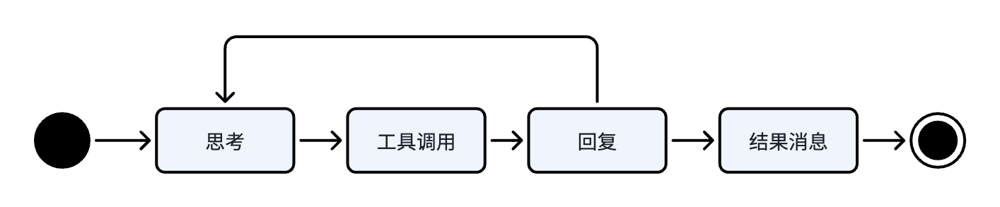
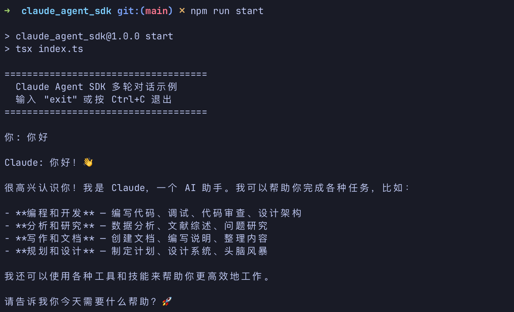

> 需求：通过 agent sdk 实现简单的聊天

# 消息

## 示例消息

我们打印了响应的消息流水到日志文件，列出来看下消息是啥样的, 就3条非系统消息。

系统消息我们暂时不关注。

agent 的工作流程大概可以总结为如下



如下三条消息不涉及工具调用，分别是：思考、回复、结果消息。

总结结束后意味着本次沟通对话结束。

```json
{
  "type": "assistant",
  "message": {
    "model": "claude-haiku-4-5-20251001",
    "id": "msg_bdrk_01M7bRpzT5AFPvQx3w6Ws7Go",
    "type": "message",
    "role": "assistant",
    "content": [
      {
        "type": "thinking",
        "thinking": "The user has sent a greeting in Chinese: \"你好\" (Hello).\n\nLet me check the system reminders:\n1. I have superpowers available - specifically the \"using-superpowers\" skill mentioned that I should use skills BEFORE any response, including clarifying questions\n2. I have many skills available listed in the system-reminder\n3. The user's private instructions say not to add superpowers folder content to version control\n\nSince the user is just greeting me, this is the start of a conversation. According to the superpowers:using-superpowers skill, I should establish how to find and use skills before any response. However, I should also consider whether a skill actually applies here.\n\nThe user is just saying hello - there's no actual task or question being asked yet. They're initiating a conversation. The using-superpowers skill is meant for when \"starting any conversation\" - but in this context, a simple greeting doesn't require me to invoke a skill before responding. The skill is meant to establish how to use skills for when actual tasks come up.\n\nI should greet the user back warmly in Chinese and let them know I'm ready to help with their tasks.",
        "signature": "EqcKCkgIEBABGAIqQHfAKfEtdv6sd7ZmOquZBQjtqFmwtsWbctOJL5+NAx8XqLjBwGj0se8cpoYf1HN0mPG33LfTyZulW2iEfztWk/USDMwMFxrSR/z04HEuEhoMNoFSZH/JR6bkXZ7lIjAvJ65De67cygyfmIoRbSj4HrdcuUP3g+OzcJr9d9p+D6erGgZhIklS+fevKJt51mgqjAk6xYZKasOxObHda5FvNz0lo92wkT4w/iDUcCOSQIdO3ge9UhwCmO/5ft+JXLfi3+m7DdRGB2AQ/Ln2UgbYgaBZdz9qi20hMJipielneHaXB44FYRIEsn5i/a/oztEx8Kvunh654GJHMp2I1YNqIGYUvyuDiv/AFBc0sce1mTkn7WAinjpwPZbGY9vHiLtai6++ZWMPYgBeArU9MV1KW2HDK8jCU/Ue1xDEL4Kz+x39hzTJ+Cvy2ah+4jbccHh0vWbBbbQ9FzJWFmFVe3oy6WrX2QICr4w4diZd/B0g40rM78QwlLyTVv4gALzM6etH2X5RgIl8x9r7rKOmiW7FjpT97Hp60GgCApFRvB2HOb59t6z5l7ss49xJJNY+vIE+5CFlLuLnunLRhJQazdu5MVXhEAQWlk5pQ+tS0suEkhdIhoXucWVF2YGJuma79mSVhnZ24UhU/5WTWZLyrIZvlZltPOhf6/CsRGwihQw4w8mCK3AylwW6l6fIPyN6LC1GggH68xvY53ZZSUF60TIP25RYaHkfoO7GUZOTMzRKC/DJdHeWUiTTvDXlOdeSp+wcbzdEJxpY03we0EaPfCWW0EhZ4H8yjrEJrq22Slf9nL4D3RQl/2nGTcaaH1C5k9X2LcVrj/mPSbU42v3oCVIKVKibIKPmRftCv10Xc8cGnu0akMHGcVA0HinPsaJ9j1b6DSI/Cu6tAJiYxOqMaT/9Cdx817dnxuHMMI9nwMfG0rU1yhKLkcAVhRCdM/K0P83eejjJJbXNRDzOzqNcZWtDM360xQVtR6Zn0aHtrP2RyVz9OZyWvjnmDuUP6rTEncp8EcK0jGXv1uOTjEQ7jsRrV8T+E5vjpbcvMuZv8f47hpb2BUEFWuEbXutIvBYhjHCAHHVNRZvur/uveTNrvLTRy0uv1XeUcQQOhAcBMczJPEsToGk6/yHgSPNnJjSNAuWL+vrsPnompn3p3W3emFVfFbLjVpSG/7BSjiz4bBv+tkgansIOPHnTSp1pDMBi3/nnn0Pq6gePQWFDQY3WLowXzOB+GJOTE4A+dLWTvBC/ADxHvrvBUSGEpQXfkmh0xKumUzhV4aqdDpVDBLwu1yv73olY+yJYU4appSoncDjdQwS/psKniJ2nrgglQtzoAYU7Y8uPOqg/+hKC9oOQZpPMxCX4+/rxE/pq4krShWU+LN/Vye4I8Mifqn4w2KWVINVNBXJlpkAhfpnFaVR0snBJsRCezR4FiZ1UV+D4EorDVIivshaB4qxVxzk3RsuQeMgFX5XyuqLNkcY6LXTZSkxHTbjbr9l0WcL1TyKjqrx3TqO4Dc2xiQ0Lx8XU5fAGPrQTKMpIFjAZjj4B+tMNUmBPyyxJAetCHzqa2I/9eSfIBv+GbXd97SL9F+PJF9j/C38EKfULsVJmPd0q+lCGxPFUyWtHolwecPjypaCaEI99IGpno5rmiGkxRhl4MJPzgyapGNpuTNNkNK/G7/XEVgzqZq/9C4ixv6GNyt6jfNdBlNdZIONWnMWFQyR/TC9+tYdzI0ku6D9PFdaSkQNFqX8YAQ=="
      }
    ],
    "stop_reason": null,
    "stop_sequence": null,
    "usage": {
      "input_tokens": 10,
      "cache_creation_input_tokens": 0,
      "cache_read_input_tokens": 31821,
      "cache_creation": {
        "ephemeral_5m_input_tokens": 0,
        "ephemeral_1h_input_tokens": 0
      },
      "output_tokens": 5
    },
    "context_management": null
  },
  "parent_tool_use_id": null,
  "session_id": "ed5207db-6302-4341-a8d3-fff79dc92f43",
  "uuid": "82112708-0c7e-40c1-ad12-0576bef487fc"
}
```

```json
{
  "type": "assistant",
  "message": {
    "model": "claude-haiku-4-5-20251001",
    "id": "msg_bdrk_01M7bRpzT5AFPvQx3w6Ws7Go",
    "type": "message",
    "role": "assistant",
    "content": [
      {
        "type": "text",
        "text": "你好！👋\n\n很高兴认识你！我是 Claude，一个 AI 助手。我可以帮助你完成各种任务，比如：\n\n- **编程和开发** — 编写代码、调试、代码审查、设计架构\n- **分析和研究** — 数据分析、文献综述、问题研究\n- **写作和文档** — 创建文档、编写说明、整理内容\n- **规划和设计** — 制定计划、设计系统、头脑风暴\n\n我还可以使用各种工具和技能来帮助你更高效地工作。\n\n请告诉我你今天需要什么帮助？🚀"
      }
    ],
    "stop_reason": null,
    "stop_sequence": null,
    "usage": {
      "input_tokens": 10,
      "cache_creation_input_tokens": 0,
      "cache_read_input_tokens": 31821,
      "cache_creation": {
        "ephemeral_5m_input_tokens": 0,
        "ephemeral_1h_input_tokens": 0
      },
      "output_tokens": 5
    },
    "context_management": null
  },
  "parent_tool_use_id": null,
  "session_id": "ed5207db-6302-4341-a8d3-fff79dc92f43",
  "uuid": "3f3d6415-e575-4843-a3e6-dbfa829b5673"
}
```

```json
{
  "type": "result",
  "subtype": "success",
  "is_error": false,
  "api_error_status": null,
  "duration_ms": 6907,
  "duration_api_ms": 6769,
  "ttft_ms": 5261,
  "ttft_stream_ms": 2943,
  "time_to_request_ms": 66,
  "num_turns": 1,
  "result": "你好！👋\n\n很高兴认识你！我是 Claude，一个 AI 助手。我可以帮助你完成各种任务，比如：\n\n- **编程和开发** — 编写代码、调试、代码审查、设计架构\n- **分析和研究** — 数据分析、文献综述、问题研究\n- **写作和文档** — 创建文档、编写说明、整理内容\n- **规划和设计** — 制定计划、设计系统、头脑风暴\n\n我还可以使用各种工具和技能来帮助你更高效地工作。\n\n请告诉我你今天需要什么帮助？🚀",
  "stop_reason": "end_turn",
  "session_id": "ed5207db-6302-4341-a8d3-fff79dc92f43",
  "total_cost_usd": 0.0054970999999999996,
  "usage": {
    "input_tokens": 10,
    "cache_creation_input_tokens": 0,
    "cache_read_input_tokens": 31821,
    "output_tokens": 461,
    "server_tool_use": {
      "web_search_requests": 0,
      "web_fetch_requests": 0
    },
    "service_tier": "standard",
    "cache_creation": {
      "ephemeral_1h_input_tokens": 0,
      "ephemeral_5m_input_tokens": 0
    },
    "inference_geo": "",
    "iterations": [],
    "speed": "standard"
  },
  "modelUsage": {
    "claude-haiku-4-5-20251001": {
      "inputTokens": 10,
      "outputTokens": 461,
      "cacheReadInputTokens": 31821,
      "cacheCreationInputTokens": 0,
      "webSearchRequests": 0,
      "costUSD": 0.0054970999999999996,
      "contextWindow": 200000,
      "maxOutputTokens": 32000
    }
  },
  "permission_denials": [],
  "terminal_reason": "completed",
  "fast_mode_state": "off",
  "uuid": "dcfb86d1-f615-4f90-b559-a93ad816d609"
}
```

## 消息结构

不同的消息具有不同的结构，上边例子我们看到了两种消息类型：助手消息和结果消息。这里主要介绍一下这两种消息类型

### 助手消息

```ts
type SDKAssistantMessage = {
  type: "assistant";
  uuid: UUID;
  session_id: string;
  message: BetaMessage; // 来自 Anthropic SDK
  parent_tool_use_id: string | null;
  error?: SDKAssistantMessageError;
};
```

本例子涉及的字段解释如下

| 字段         | 说明                                                         | 枚举                  |
| ------------ | ------------------------------------------------------------ | --------------------- |
| `type`       | 消息种类标识，固定为 `"assistant"`，表示这是模型产出的助手消息（过程消息，不是 `result` 收尾）。 | [消息类型](#消息类型) |
| `uuid`       | 本条 SDK 消息的唯一 ID，流式消息的不同增量该值相同。         |                       |
| `session_id` | 所属会话 ID；多轮对话时用它 `resume`，把后续请求接到同一会话上下文。 |                       |
| `message`    | Anthropic Messages API 的完整助手消息体（含 `id`、`content`、`model`、`stop_reason`、`usage` 等）。UI/流式展示主要读这里的 `content`。 |                       |
| `error`      | 可选。本条助手消息关联的错误类别（如 `rate_limit`、`billing_error`、`max_output_tokens`）；正常成功时通常没有该字段。 |                       |

BetaMessage 也选几个关键介绍一下

| 字段            | 说明                                                                                                           | 枚举            |
| ------------- | ------------------------------------------------------------------------------------------------------------ | ------------- |
| `id`          | 这次 API 消息 ID。同一轮里多条 `assistant` SDK 消息可能共用同一个 `id`（例如先 thinking、再 text）。                                     |               |
| `model`       | 模型id。                                                                                                        |               |
| `content`     | 模型输出内容块数组。这里只有一块 `type: "thinking"`，是内部推理；真正给用户看的回复通常在后续另一条消息的 `type: "text"` 里。                             | [内容类型](#内容类型) |
| `stop_reason` | 停止原因。为 `null` 常见于流式/分块尚未结束；整轮结束时常见 `"end_turn"`、`"tool_use"` 等。                                              | [停止原因](#停止原因) |
| `usage`       | Token 用量。例子中 `cache_read_input_tokens: 31821` 很大，说明大量上下文命中了 prompt cache；`output_tokens: 5` 是本块输出量，不是整轮最终总量。 |               |

### 结果消息

结果消息就是在agent 干完活后对所干内容的总结。大多数情况下，我们更关心结果消息的错误结果。

```ts
type SDKResultMessage = SuccessResult | ErrorResult;
```

```ts
type SDKResultMessage =
  | {
      type: "result";
      subtype: "success";
      uuid: UUID;
      session_id: string;
      duration_ms: number;
      duration_api_ms: number;
      is_error: boolean;
      api_error_status?: number | null;
      num_turns: number;
      result: string;
      stop_reason: string | null;
      ttft_ms?: number;
      ttft_stream_ms?: number;
      total_cost_usd: number;
      usage: NonNullableUsage;
      modelUsage: { [modelName: string]: ModelUsage };
      permission_denials: SDKPermissionDenial[];
      structured_output?: unknown;
      deferred_tool_use?: { id: string; name: string; input: Record<string, unknown> };
      terminal_reason?: TerminalReason;
      fast_mode_state?: FastModeState;
      origin?: SDKMessageOrigin;
    }
  | {
      type: "result";
      subtype:
        | "error_max_turns"
        | "error_during_execution"
        | "error_max_budget_usd"
        | "error_max_structured_output_retries";
      uuid: UUID;
      session_id: string;
      duration_ms: number;
      duration_api_ms: number;
      is_error: boolean;
      num_turns: number;
      stop_reason: string | null;
      total_cost_usd: number;
      usage: NonNullableUsage;
      modelUsage: { [modelName: string]: ModelUsage };
      permission_denials: SDKPermissionDenial[];
      errors: string[];
      terminal_reason?: TerminalReason;
      fast_mode_state?: FastModeState;
      origin?: SDKMessageOrigin;
    };
```

# API

```ts
function query({
  prompt,
  options
}: {
  prompt: string | AsyncIterable<SDKUserMessage>;
  options?: Options;
}): Query;
```

## 调用示例

```ts
query({
    prompt: userMessage,
    options: {
      model: 'claude-haiku-4-5-20251001',
      // resume 上一轮 session，保留对话上下文
      resume: sessionId,
    },
  });
```



## 完整代码

```ts
import { query, type SDKMessage } from '@anthropic-ai/claude-agent-sdk';
import { appendFileSync, mkdirSync } from 'fs';
import { dirname, join } from 'path';
import { createInterface } from 'readline';
import { fileURLToPath } from 'url';

// 小例子，不搞那么麻烦，就在终端进行交互
// 为了在终端输入，使用 readline 库
const rl = createInterface({ input: process.stdin, output: process.stdout });
const ask = (prompt: string): Promise<string> =>
  new Promise((resolve) => rl.question(prompt, resolve));


// 仅仅为了打日志，查看消息内容
const LOG_DIR = join(dirname(fileURLToPath(import.meta.url)), 'logs');
const LOG_FILE = join(LOG_DIR, `sdk-messages-${new Date().toISOString().replace(/[:.]/g, '-')}.jsonl`);
function writeMsgToFile(msg: SDKMessage): void {
  mkdirSync(LOG_DIR, { recursive: true });
  appendFileSync(LOG_FILE, `${JSON.stringify(msg)}\n`, 'utf8');
}

/**
 * 发送一轮对话，流式打印 Claude 响应，返回 sessionId 供下一轮 resume 使用。
 */
async function sendMessage(userMessage: string, sessionId?: string): Promise<string | undefined> {
  const q = query({
    prompt: userMessage,
    options: {
      // 我本地安装了 claude cli, 想使用本地的，所以这里配置了路径
      pathToClaudeCodeExecutable: '/opt/homebrew/bin/claude',
      model: 'claude-haiku-4-5-20251001',
      // resume 上一轮 session，保留对话上下文
      resume: sessionId,
    },
  });

  let sid = sessionId;

  for await (const msg of q) {
    // 输出消息明细到文件
    switch (msg.type) {
      case 'system': {
        break;
      }
      default: {
        writeMsgToFile(msg);
        break;
      }
    }
    // 输出消息内容到终端
    switch (msg.type) {
      case 'assistant': {
        sid = msg.session_id;
        for (const block of msg.message.content) {
          if (block.type === 'text') {
            process.stdout.write(block.text);
          }
        }
        break;
      }
      case 'result': {
        if (msg.is_error) {
          console.error(`\n[错误] ${msg.subtype}`);
        } else {
          process.stdout.write('\n');
        }
        break;
      }
      default:
        break;
    }
  }

  return sid;
}

// 入口
export async function talkOnly(): Promise<void> {
  console.log('====================================');
  console.log('  Claude Agent SDK 多轮对话示例');
  console.log('  输入 "exit" 或按 Ctrl+C 退出');
  console.log('====================================\n');

  let sessionId: string | undefined;

  while (true) {
    let userInput: string;
    try {
      userInput = await ask('你: ');
    } catch {
      break;
    }

    userInput = userInput.trim();
    if (!userInput) continue;
    if (userInput.toLowerCase() === 'exit') break;

    process.stdout.write('\nClaude: ');

    try {
      sessionId = await sendMessage(userInput, sessionId);
    } catch (err) {
      console.error(`\n[SDK 错误] ${(err as Error).message}`);
    }

    console.log();
  }

  console.log('\n再见！');
  rl.close();
}

```

## 参数解释

`prompt`不需要解释，主要解释下`options`中的参数

| 参数                         | 类型      | 含义                                                         | 本例取值                                                 |
| ---------------------------- | --------- | ------------------------------------------------------------ | -------------------------------------------------------- |
| `pathToClaudeCodeExecutable` | `string?` | Claude Code 可执行文件路径；claude aegnt sdk 也内置了一个可执行文件， 未指定时会使用内置的。 | `'/opt/homebrew/bin/claude'`（本地 Homebrew 安装的 CLI） |
| `model`                      | `string?` | 使用的 Claude 模型；未指定时用 CLI 默认模型。                | `'claude-haiku-4-5-20251001'`                            |
| `resume`                     | `string?` | 传入session id, 表示要在哪个session 下继续聊天。             | 上一轮返回的 `sessionId`；首轮为 `undefined`             |

# 


# 枚举值

## 消息类型

| 枚举值               | 含义                                                         |
| -------------------- | ------------------------------------------------------------ |
| `assistant`          | 助手完整消息（含 `message` 正文）                            |
| `user`               | 用户消息（含输入或工具结果回传；含 replay）                  |
| `result`             | 一轮 `query()` 结束结果（成功或错误，细节看 `subtype`）      |
| `system`             | 系统/会话事件（初始化、状态、hook、任务、通知等，细节看 `subtype`） |
| `stream_event`       | 流式增量事件（`includePartialMessages` 开启时）              |
| `tool_progress`      | 工具执行进度                                                 |
| `tool_use_summary`   | 工具调用摘要                                                 |
| `auth_status`        | 鉴权状态变更                                                 |
| `rate_limit_event`   | 限流相关事件                                                 |
| `prompt_suggestion`  | 提示词/后续提问建议                                          |
| `conversation_reset` | 会话被重置（如 `/clear`）                                    |

## 内容块类型

| 枚举值                                   | 含义                                                    |
| ---------------------------------------- | ------------------------------------------------------- |
| `thinking`                               | 可读的扩展思考过程                                      |
| `redacted_thinking`                      | 被安全脱敏的思考块，仅含不透明 `data`，无可读文本       |
| `text`                                   | 最终可见文本回复                                        |
| `tool_use`                               | 客户端工具调用（需由本地/宿主执行并回传 `tool_result`） |
| `server_tool_use`                        | 服务端工具调用（由 Anthropic 侧执行）                   |
| `web_search_tool_result`                 | 网页搜索工具的结果块                                    |
| `web_fetch_tool_result`                  | 网页抓取工具的结果块                                    |
| `code_execution_tool_result`             | 代码执行工具的结果块                                    |
| `bash_code_execution_tool_result`        | Bash 代码执行工具的结果块                               |
| `text_editor_code_execution_tool_result` | 文本编辑器类代码执行工具的结果块                        |
| `tool_search_tool_result`                | 工具搜索的结果块                                        |
| `mcp_tool_use`                           | MCP 工具调用                                            |
| `mcp_tool_result`                        | MCP 工具执行结果                                        |
| `container_upload`                       | 容器上传相关内容块                                      |
| `compaction`                             | 上下文压缩相关内容块                                    |
| `advisor_tool_result`                    | Advisor 工具结果块                                      |
| `fallback`                               | 兼容/回退用内容块                                       |

## 停止原因

| 枚举值                          | 含义                                                   |
| ------------------------------- | ------------------------------------------------------ |
| `null`                          | 流式未结束或尚未给出停止原因                           |
| `end_turn`                      | 模型自然结束本轮回复                                   |
| `max_tokens`                    | 触达请求的 `max_tokens` 或模型输出上限                 |
| `stop_sequence`                 | 命中自定义停止串；具体字符串见 `message.stop_sequence` |
| `tool_use`                      | 模型发起客户端工具调用，等待工具结果                   |
| `pause_turn`                    | 长回合被暂停，可将响应原样回传以继续                   |
| `refusal`                       | 策略/分类器介入，拒绝继续生成                          |
| `model_context_window_exceeded` | 超出模型上下文窗口                                     |
| `compaction`                    | （beta）发生上下文压缩相关停止                         |