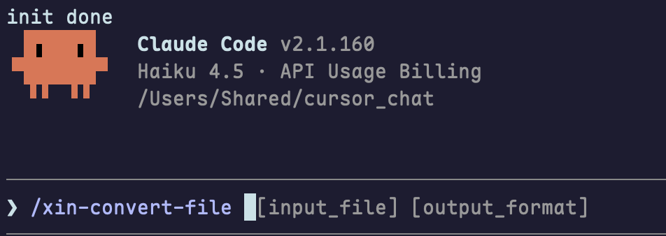

Skill 是 Claude Code 中的一种可复用工作流或操作规范，本质上是一段结构化的指令文件夹。Claude Code 给 Skill 的定义是一个封装了一些能力或知识的工具包。

## Agent Skills 规范

初学者先看一下skills 规范，很简单，看完就会写skill。但是会写和好用是两回事，笔者也一直在探索Skill 的设计模式。

### 目录结构

Skill是一个文件夹，最少需要包含一个 `SKILL.md` 文件：

```
my-skill/
├── SKILL.md          # 必需：技能元数据、触发规则、核心执行指令
├── scripts/          # 可选：可执行代码脚本（自动化核心逻辑，不占用上下文）
│   └── helper.py
├── references/       # 可选：详细参考文档、业务规范、拓展说明
└── assets/           # 可选：模板文件、图片、静态资源
```

**`SKILL.md` 格式**

`SKILL.md` 文件必须包含 YAML 前置元数据，后跟 Markdown 内容。

| 字段                       | 使用频率 | 描述                                                         | 图示                                                         |
| :------------------------- | :------: | :----------------------------------------------------------- | ------------------------------------------------------------ |
| `description`              | 5        | skill 的描述，建议写什么时候用，而不是skill 能干什么。       |                                                              |
| `name`                     | 5        | Skill 列表中显示的显示名称。默认为目录名称。                 |                                                              |
| `model`                    | 4        | 当此 skill 处于活动状态时要使用的模型。覆盖适用于当前轮的其余部分，不保存到设置；会话模型在你的下一个提示时恢复。接受与 [`/model`](https://code.claude.com/docs/zh-CN/model-config) 相同的值，或 `inherit` 以保持活动模型。 |                                                              |
| `context`                  | 3        | 设置为 `fork` 以在分叉的 subagent 上下文中运行。subagent 会有自己的上下文窗口，当subagent结束时仅将结果返回给主Agent, 不会将大量对主线任务无关的内容带到主Agent的上下文中。 |                                                              |
| `disable-model-invocation` | 3        | 设置为 `true`时，agent 将不会自动调用该skill, 只能手动调用。默认值为`false` |                                                              |
| `when_to_use`              | 2        | 关于 Claude 何时应该调用该 skill 的额外上下文，例如触发短语或示例请求。附加到 skill 列表中的 `description`，并计入 1,536 个字符的上限。 |                                                              |
| `allowed-tools`            | 2        | 当此 skill 处于活动状态时，Claude 可以使用而**无需请求权限**的工具。接受空格分隔的字符串或 YAML 列表。后续会在权限部分详解。 |                                                              |
| `disallowed-tools`         | 2        | 当此 skill 处于活动状态时从 Claude 的可用工具池中移除的工具。用于不应该调用某些工具的自主 skills，例如用于后台循环的 `AskUserQuestion`。接受空格分隔的字符串或 YAML 列表。当你发送下一条消息时，限制会清除。 |                                                              |
| `user-invocable`           | 2        | 设置为 `false` 以从 `/` 菜单中隐藏。用于用户不应直接调用的背景知识。默认值：`true`。 |                                                              |
| `hooks`                    | 2        | 限定于此 skill 生命周期的 hooks。有关配置格式，请参阅 [Skills 和代理中的 Hooks](https://code.claude.com/docs/zh-CN/hooks#hooks-in-skills-and-agents)。 |                                                              |
| `argument-hint`            | 1        | 该skill需要使用的参数提示。示例：`[issue-number]` 或 `[filename] [format]`。 |  |
| `arguments`                | 1        | 用于 skill 内容中`$name` 替换的命名位置参数。接受空格分隔的字符串或 YAML 列表。名称按顺序映射到参数位置。 |  |
| `effort`                   | 1        | 默认继承自会话，详见[effort](琐碎内容.md#effort)             |                                                              |
| `agent`                    | 1        | 当设置 `context: fork` 时要使用的 subagent 类型。            |                                                              |
| `paths`                    | 1        | Glob 模式，限制何时激活此 skill。接受逗号分隔的字符串或 YAML 列表。设置后，Claude 仅在处理与模式匹配的文件时自动加载该 skill。使用与[路径特定规则](https://code.claude.com/docs/zh-CN/memory#path-specific-rules)相同的格式。 |                                                              |
| `shell`                    | 1        | 用于此 skill 中 `!`command`` 和 ````!` 块的 shell。接受 `bash`（默认）或 `powershell`。设置 `powershell` 在 Windows 上通过 PowerShell 运行内联 shell 命令。需要 `CLAUDE_CODE_USE_POWERSHELL_TOOL=1`。 |                                                              |

主体内容是 Markdown 格式的文本，编写任何有助于智能体有效执行任务的内容。

claude 官方推荐 将 `SKILL.md` 保持在 500 行以下。将详细的参考资料移到单独的文件中。这是渐进加载的思想，可以在 `SKILL.md` 中创建类似于目录的索引，指引 AI 更详细的内容去哪里获取。

我个人感受，超过100行时用起来就不是很舒服了。


### Skill 文件夹存放的位置

| 位置 | 路径                            | 适用于         |
| :--- | :------------------------------ | :------------- |
| 个人 | `~/.claude/skills/<skill-name>` | 你的所有项目   |
| 项目 | `.claude/skills/<skill-name>`   | 仅此项目       |
| 插件 | `<plugin>/skills/<skill-name>`  | 启用插件的位置 |

## 渐进式披露

这里给一个渐进披露的示例。展示如何从「概要级」到「全量级」分层设计 Skill 内容，让 AI 在对话中按需加载，提升响应效率和上下文利用率。

```
daily-note
├── assets
│   └── template.md
├── references
│   └── style.md
├── scripts
│   └── helper.py
└── SKILL.md
```

每个文件内容如下：

- SKILL.md

~~~md
---
name: daily-note
description: 在写每日便签、daily note时使用。
---

# daily-note

生成一则当日便签。

## 执行步骤

1. 在 skill 根目录运行（不要读源码，报错排障除外）：

   ```bash
   python3 scripts/helper.py
   ```

   stdout 是 JSON，形如 `{"date":"2026-08-27","weekday":"周四"}`。直接用字段，不要复述脚本实现。

2. 读取 [assets/template.md](assets/template.md)，按占位符填空后整份交给用户（保留标题和三个章节，不要改结构）：

   | 占位符 | 填法 |
   |--------|------|
   | `{{date}}` / `{{weekday}}` | 用脚本 JSON |
   | `{{note}}` | 用户原话压成一句；没给内容时写「待补充」 |
   | `{{next}}` | 用户提到的下一步；没有则写「无」 |
   | `{{memo}}` | 专有名词、链接、人名等需要原样留下的信息；没有则写「无」 |

3. 把填好的 Markdown 交给用户。不要输出 JSON，不要贴脚本源码。

4. 仅当用户追问语气或字数时，再读 [references/style.md](references/style.md) 并按其约束改一版。


~~~

- helper.py

```python
#!/usr/bin/env python3
"""Print today's date as JSON. Execute this file; do not read the source."""

import json
from datetime import datetime

now = datetime.now().astimezone()
weekday = "一二三四五六日"[now.weekday()]
print(json.dumps({"date": now.strftime("%Y-%m-%d"), "weekday": f"周{weekday}"}, ensure_ascii=False))

```

- template.md

```
# 每日便签 · {{date}}

| 项目 | 内容 |
|------|------|
| 日期 | {{date}} |
| 星期 | {{weekday}} |

## 一句话

{{note}}

## 下一步

{{next}}

## 备忘

{{memo}}

```

- style.md

```
# 便签语气与格式

`{{note}}` 只写一句中文，读完不超过两秒。

## 句子

- 长度：含标点不超过 40 字；超了就删修饰，不拆成两句。
- 结构：谁 + 做了/要做 + 对象。能删的「的 / 了 / 进行」一律删。
- 不用表情、不用感叹号、不用「非常 / 顺利 / 认真」这类形容词。
- 不用第一人称铺垫（「我觉得今天…」→ 直接写事实）。
- 用户没给内容时写「待补充」，不要编造日程。

## 压缩用户原话

1. 先抽出动词和对象，去掉时间套话（「今天下午抽空」→ 删）。
2. 多个事项只留最重要的一件，其余不写。
3. 保留专有名词（仓库名、接口名、人名），不要意译。

| 原话 | 便签 |
|------|------|
| 今天下午我非常顺利地把登录接口联调完了，感觉还不错 | 完成登录接口联调 |
| 明天打算先看看文档，然后再试试改一下超时 | 阅读超时相关文档 |
| 没啥特别的 | 待补充 |

## 校验

- [ ] 只有一句
- [ ] ≤ 40 字
- [ ] 无表情、无形容词堆砌
- [ ] 专有名词与用户一致

```

