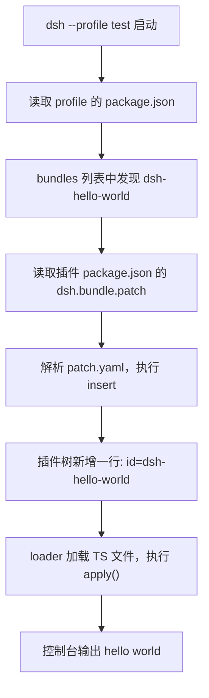

> **读完这篇你能**：写出一个最小插件，装进 test profile，并在启动时看到它打印 `hello world`。
>
> **前置**：[插件与 profile](01-插件与profile.md)。约 15 分钟。

## 目标

写一个最小插件，让它在 DSH 的 `test` profile 启动时打印一句 `hello world`。

## 目录结构

```text
dsh-hello-world/                         ← 插件包（bundle）
├── dsh-hello-world.ts                   ← 插件本体：name + apply
├── package.json                        ← 身份 + dsh.bundle 声明
└── patch.yaml                          ← 挂载指令
```

## 最小插件

```ts
// dsh-hello-world.ts
import type { Context } from '@deepseek-ai/cordis'

export const name = 'dsh-hello-world'

export function apply(ctx: Context) {
    console.log('hello world')
}
```

- `name`：插件的唯一 id
- `apply`：挂载时执行什么

仅此而已。这就是一个合法插件。

但是要区分一下注册和挂载两个动作，注册是我们将 bundle 添加到profile 中。挂载是运行时概念，dsh 启动时将某个功能挂载到 dsh 的运行时上下文中。

## bundle 声明

光有代码不够，DSH 不知道"这段代码该怎么进插件树"。所以一个 bundle 需要两个文件：

### package.json

```json
{
  "name": "dsh-hello-world",
  "version": "0.1.0",
  "type": "module",
  "dependencies": {
    "@deepseek-ai/cordis": "^4.0.1"
  },
  "dsh": {
    "bundle": {
      "patch": "./patch.yaml"
    }
  }
}
```

注意最后那个 `dsh.bundle.patch`——**这是 DSH 专属字段**，npm/pnpm 完全不认识它。DSH 靠它找到补丁文件。

### patch.yaml

```yaml
- insert:
    - id: dsh-hello-world
      name: '/绝对/路径/dsh-hello-world.ts'
```

意思是：往插件树里插一行——id 叫 `dsh-hello-world`，代码在哪个文件。

> `patch.yaml` 这个名字是我们自己起的。**内核不认文件名，只认 `package.json` 里 `dsh.bundle.patch` 指到哪个文件**——上面写 `./patch.yaml`，所以读这个；改成 `./挂载.yaml` 也照样跑，官方模板里同一个文件叫 `cordis.patch.yml`。
>
> 名字里有 `cordis.patch.yml` 时别搞混：它只有在 **profile 目录**（`~/.dsh/profiles/<名字>/`）和 `~/.dsh/` 下才是内核写死的约定（用户覆盖层，自动读取）；插件包里的那份和本文的 `patch.yaml` 是同一个角色，只是被 `dsh.bundle.patch` 声明进树。
>
> `dsh.bundle.patch` 的值可以是一个文件，也可以是一个**有序数组**：同一个包想按不同界面／场景挂不同的行，就备多份补丁文件，让命令行或环境决定读哪一份。



> 小坑：`name` 要用绝对路径。DSH 加载器的基准目录是 profile 目录本身，相对路径会找不到文件。

## 安装到 profile

```bash
cd 你的插件目录
dsh plugin --profile test add link:.
```

这条命令做了三件事：

1. 把 `link:.` 翻译成插件目录的绝对路径
2. 在 profile 目录里执行 `pnpm add`（是的，它只是 pnpm 的"转手人"）
3. 检查装上的依赖里哪些声明了 `dsh.bundle`，把它们的包名追加进 profile 的 `dsh.profile.bundles`

注意第 2 步的 cwd 是 **profile 目录**，不是你的插件目录。所以它只改 profile 的装配清单，永远不碰插件自己的 `package.json`——插件代码要 `import` 的包，得你在插件目录里自己加。

## 验证

```bash
dsh --profile test --dump-config
```

这条命令会把组合好的插件树打印出来。看到这一节就成功了：

```yaml
# == dsh-hello-world
- id: dsh-hello-world
  name: /绝对路径/dsh-hello-world.ts
```

然后启动 DSH，日志里出现 `hello world`。


---

**下一篇**：[改掉 DSH 的默认装配](03-改掉DSH的默认装配.md)——刚写的 `patch.yaml` 到底在干什么，以及怎么用同一套写法改掉 DSH 自己装的那 150 多行。