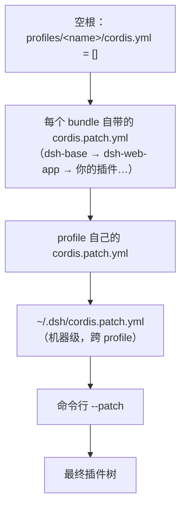

> **读完这篇你能**：用一份 patch 文件关掉不需要的内置插件、改掉内置插件的参数，不动 `node_modules` 里的一行源码。
>
> **前置**：[第一个插件](02-第一个插件.md)。约 20 分钟。

[第一个插件](02-第一个插件.md)只写了插件**自己**的 `patch.yaml`。这篇写**你的** patch——用来改 DSH 装的那 150 多行。

## 什么时候需要

```bash
dsh --profile web --dump-config | grep -c '^- id:'
```

我这台机器是 154 行，全来自 `node_modules` 里的现成代码。于是这些需求都无处下手：

- 内置插件的一个参数想换（比如 bash 的命令超时）；
- 内置能力想整行关掉；
- 所有 profile 关掉同一个东西。

## patch 的工作原理

插件树从一个空根开始，由一层层 patch 叠出来：



后一层改前一层，所以只写要改的那几行就够。

## 三个 patch

写进 `~/.dsh/profiles/test/cordis.patch.yml`：

```yaml
# 1) 让 bash 命令的超时从 60 秒缩到 3 秒
- id: bash-sandbox
  config:
    timeoutMs: 3000

# 2) 让自动生成的会话标题短到肉眼可见
- id: session-title
  config:
    fallbackMaxWords: 3
    fallbackMaxBytes: 16
    maxTitleBytes: 30

# 3) 插一行自己的插件
- insert:
    - id: dsh-note
      name: '/绝对路径/dsh-patch-demo/my-note.ts'
```

| # | 写法 | 作用 | 这条的效果 |
| --- | --- | --- | --- |
| 1 | `id` + `config` | 找到那一行，替换字段 | 跑个 `sleep 10`，命令 3 秒就被掐断，输出里带 `[timed out after 3000ms]` |
| 2 | `id` + `config` | 找到那一行，替换字段 | 新开一个会话，标题明显变短 |
| 3 | `insert:` | 往列表尾部追加行 | 启动日志多打印一行 |

> 1、2 两条故意做成"一眼能看出来生效"，所以都不太能用：3 秒的超时只够演示，标题截到 30 字节只够好看。改完记得调回合适值。

再短也就到这儿了——一条 patch 最少就是一个 `id` 加一个字段，或者一个 `insert`。

**`disabled` 是同一个写法**，只是把字段换成它。想停用某一行，加一条就行：

```yaml
- id: <dump 里的 id>
  disabled: true
```

要留意内置行：它们的 `disabled` 本来就是 `!!js` 表达式（`bash-sandbox` 那条是"Windows 上不启动"），你写常量会把整个表达式换掉——写 `true` 就是在所有平台都停用。

`id` 就是 `--dump-config` 打印的那个 `id:`，别背，去 dump 里抄。

## 用 `--dump-config` 验证

```bash
dsh --profile test --dump-config
```

```yaml
# == @deepseek-ai/dsh-base, patched by ~/.dsh/profiles/test/cordis.patch.yml
- id: bash-sandbox
  name: '@deepseek-ai/dsh-bash-sandbox'
  config:
    timeoutMs: 3000
- id: session-title
  config:
    fallbackMaxWords: 3
    fallbackMaxBytes: 16
    maxTitleBytes: 30
```

`timeoutMs` 换掉了，`# ==` 那行注明了是哪一层改的——都对，patch 就生效了。

`--dump-config` 只做合成，不启动插件，也不执行 `!!js`，随时可以跑。

## patch 语法

patch 文件是一个顶层数组，每条 patch 两种形状：`insert:`，或者 `id` 加上要覆盖的字段。完整可跑的版本在 `dsh_plugin/dsh-patch-demo/`。

### insert：追加一行

```yaml
- insert:
    - id: dsh-note
      name: '/绝对路径/dsh-patch-demo/my-note.ts'
```

`name` 可以是包名、绝对路径，或相对路径——相对路径按 patch 文件所在目录锚成 `file://` URL。

被插进来的一行会真的执行：`my-note.ts` 里就一句 `console.log`，启动后日志出现 `[dsh-note] 我被 patch 插进了插件树，apply() 执行了`。

带 `id` 的 `insert` 是"插到那一行下面"，前提是目标行是 `group: true` 的分组行。默认的 profile 树里没有，遇到再查[加载器文档](https://deepseek-harness.github.io/deepseek-harness/)。

### id：覆盖字段

```yaml
- id: dsh-hello-world
  disabled: true
```

`id` 必写。字段逐个覆盖到目标行，**没写的字段保持原样**——上面那条 `bash-sandbox` 只写了 `timeoutMs`，它原带的 `cwd`、`maxTimeoutMs` 等键都不受影响。这里覆盖的是"行"这一层，不是 `config` 对象那一层（见易错点 1）。

`disabled` 只是可覆盖的字段之一，和 `config` 平级：写 `true` 这行就不启动；写 `!!js` 表达式，就按条件决定（下一节）。

加一个 `name:` 可以做校验：与目标行的 `name` 不一致就跳过。想确认自己没改错行时才用。

找不到 `id` 时只警告、继续跑。这是故意的——同一份 patch 可能同时喂给 web 和 tui，各自的行不一样。

### `!!js` 表达式

值可以在加载时算出来，作用域里有 `process.env`、`process.platform` 和 `ctx`：

```yaml
- id: bash-sandbox
  name: '@deepseek-ai/dsh-bash-sandbox'
  disabled: !!js process.platform === 'win32'
```

`dsh-base` 里有一批这样的行。`better-sidebar` 那段"有人挂过我就不挂"也是同一个机制：

```yaml
- id: better-sidebar
  name: dsh-better-sidebar
  disabled: !!js >-
    [...ctx.loader.entries()].some((e) => e.options.name === 'dsh-better-sidebar'
      && e.options.id !== 'better-sidebar' && !e.disabled)
```

同一个包挂两遍会让路由注册撞车，把整棵树搞崩，所以这一行在发现别人已经挂了同一个包时禁用自己。表达式只能看见排在它前面的行，守卫得写在被守卫的行之前。

## 三个易错点

### 1. `config` 是整块替换

上面 `session-title` 那条把三个键全写了，就是因为这个。只写一个键，其余会回落到插件 schema 的默认值——如果那个键根本没有默认值，整行就起不来：

```yaml
# 踩法：写一个键，丢掉另外两个
- id: session-title
  config:
    fallbackMaxWords: 3
```

这个插件的 schema 里 `fallbackMaxBytes` 和 `maxTitleBytes` 是必填的，于是启动时直接失败：

```text
Error: dsh: plugin tree failed to load: … failed to apply loader entry session-title
  (@deepseek-ai/dsh-session-title): invalid config:
  - $.fallbackMaxBytes missing required value (at fallbackMaxBytes)
```

反过来，`bash-sandbox` 的 `cwd`、`maxTimeoutMs` 这些键各自有默认值，所以那条只写 `timeoutMs` 就够了。**有没有默认值，去 [Cordis API 文档](../dsh/cordis_api.md)或包自己的类型里看一眼**，别猜。

### 2. id 写错静默跳过

```text
dsh: [/tmp/patch.yml] patch: entry "bash-sandbax" not found
```

只警告，插件照原样启动，现象是"配置没生效"。改完记得认 `# == ... patched by ...` 那行。

### 3. patch 文件写错启动失败

YAML 语法错、顶层不是数组、元素不是映射，都在启动时直接抛错退出。

两种待遇是故意的：能自证的错误当场失败，引用不到的东西只警告。

## patch 放哪

| 放哪 | 作用范围 | 适合什么 |
| --- | --- | --- |
| `profiles/<name>/cordis.patch.yml` | 这个 profile | 这台机器上的偏好 |
| `~/.dsh/cordis.patch.yml` | 所有 profile | 跨 profile 的机器级选择 |
| 命令行 `--patch <file>` | 这一次启动 | 临时试验，满意了再落进上两处 |

```bash
dsh --profile test --dump-config --patch ./tmp.yml
```

`~/.dsh/cordis.patch.yml` 这一层大于 profile 自己那层——想让所有 profile 都关掉同一个内置能力时写这里。

## 完整代码

`dsh_plugin/dsh-patch-demo/` 下三个文件：`cordis.patch.yml`（本文的完整 patch）、`my-note.ts`（`insert` 插进去的插件）、`install.sh`（填绝对路径，复制进指定 profile）。

```bash
cd dsh_plugin/dsh-patch-demo && ./install.sh
```

装好后两层都验证一遍：

```bash
# 装配层：值都落上去了
dsh --profile test --dump-config | grep -A5 'id: bash-sandbox'

# 运行层：insert 那行真的跑起来了
dsh --profile test --no-open --port 3099
```

`--dump-config` 证明不了插件能跑，所以 insert 这类改动要真启动一次看日志。3099 是躲开正在跑的 3080。

前两条的效果要用一次才看得见：跑个 `sleep 10` 会被 3 秒掐断，新开一个会话能看到标题被截断。

## 注意事项

- **id 从 dump 里抄**，它不是包名，也不是插件自己的 `name`。
- **改完要重启。** `test` profile 没开配置热重载。
- **禁用有依赖的东西，dump 里看不出来。** 消费者会在启动时报错，记得看启动日志。
- **`--dump-default-config`** 是不含你那一层的树，怀疑 patch 写坏了用它对照。

---

**下一篇**：[给页面加背景](04-给页面加背景.md)。

参考：[profile 与插件包结构](参考/profile与插件包结构.md)，[让插件可配置](06-让插件可配置.md)。
