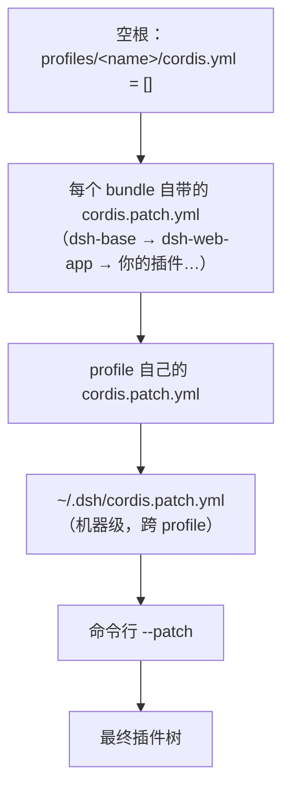

> **读完这篇你能**：用一份 patch 文件关掉不需要的内置插件、改掉内置插件的参数，不动 `node_modules` 里的一行源码。
>
> **前置**：[第一个插件](02-第一个插件.md)。约 20 分钟。

[上一篇](02-第一个插件.md)结尾留了个钩子：`patch.yaml` 到底在干什么，能不能用同一套写法改 DSH 自己装的东西。这篇就回答它。

先看清一件事：`test` profile 启动时，插件树里有一百多行，几乎全是 DSH 自己装的。两个 bundle 层层叠出来——`@deepseek-ai/dsh-base` 铺底座，`@deepseek-ai/dsh-web-app` 在上面盖 Web 界面。它们躺在 `node_modules` 里，不是你仓库的一部分，所以想动它们，只能从装配层下手。

好消息是改起来很便宜：后面的层只写要改的那几行，前面那一百多行照旧。这篇要学会的就是“那几行”怎么写。

## 目标

不用改任何源码，让 `test` profile 里的默认装配听你的话：

- **改参数**：把内置 bash 命令的超时从 60 秒缩到 3 秒，把自动生成的会话标题截短。
- **加一行**：往树里插一个自己的插件。
- **停一行**：不需要的内置插件，让它不启动。

改完全部验证一遍：装配层用 `--dump-config` 看值有没有落上去，运行层真启动一次看日志。

## patch 的工作原理

插件树从一个空根开始，由一层层 patch 叠出来：



后一层改前一层，所以只写要改的那几行就够。**patch 文件就是这张“改动清单”**，文件里一条，对应树里改一处。

清单本身也是分层的，越靠后越有话语权。要写的只有第一层——profile 自己那份；另两层先知道它们存在就够了：

| patch 文件 | 作用范围 | 适合什么 |
| --- | --- | --- |
| `profiles/<name>/cordis.patch.yml` | 这个 profile | 这台机器上的偏好 |
| `~/.dsh/cordis.patch.yml` | 所有 profile | 跨 profile 的机器级选择 |
| 命令行 `--patch <file>` | 这一次启动 | 临时试验，满意了再落进上两处 |

## 三个 patch

先拿三条改动把 patch 跑通：把 bash 命令的超时缩短、把自动生成的会话标题截短、往树里插一行自己的插件。

它们都写进上面的第一层，`~/.dsh/profiles/test/cordis.patch.yml`：

```yaml
# 1) 让 bash 命令的超时从 60 秒缩到 3 秒
- id: bash-sandbox
  config:
    timeoutMs: 3000

# 2) 让自动生成的会话标题短到肉眼可见
- id: session-title
  config:
    fallbackMaxWords: 3
    fallbackMaxBytes: 16
    maxTitleBytes: 30

# 3) 插一行自己的插件
- insert:
    - id: dsh-note
      name: '/绝对路径/dsh-patch-demo/my-note.ts'
```

| #   | 写法              | 作用         | 这条的效果                                                    |
| --- | --------------- | ---------- | -------------------------------------------------------- |
| 1   | `id` + `config` | 找到那一行，替换字段 | 跑个 `sleep 10`，命令 3 秒就被掐断，输出里带 `[timed out after 3000ms]` |
| 2   | `id` + `config` | 找到那一行，替换字段 | 新开一个会话，标题明显变短                                            |
| 3   | `insert:`       | 往列表尾部追加行   | 启动日志多打印一行                                                |

> 1、2 两条故意做成“一眼能看出来生效”，所以都不太能用：3 秒的超时只够演示，标题截到 30 字节只够好看。改完记得调回合适值。

一条 patch 最少就是一个 `id` 加一个字段，或者一个 `insert`。

**`disabled` 是同一个写法**，只是把字段换成它。想停用某一行，加一条就行：

```yaml
- id: <某行的 id>
  disabled: true
```

前面那三条，配上这条停用写法，就是一整套 patch 能做的事。

## 用 `--dump-config` 验证

patch 写完，得先知道它有没有落到树上。`--dump-config` 就是干这个的：

```bash
dsh --profile test --dump-config
```

它把合成后的整棵树打印出来，每行的来源标在上一行的注释里：

```yaml
# == @deepseek-ai/dsh-base, patched by ~/.dsh/profiles/test/cordis.patch.yml
- id: bash-sandbox
  name: '@deepseek-ai/dsh-bash-sandbox'
  config:
    timeoutMs: 3000
- id: session-title
  config:
    fallbackMaxWords: 3
    fallbackMaxBytes: 16
    maxTitleBytes: 30
```

`timeoutMs` 变成 3000 了；`# ==` 那行注明了改动来自哪一层——写的是你的 profile patch，就对上了。

`--dump-config` 只做合成：不启动插件，也不去算 `!!js`（后面会讲）——表达式原样打印出来。所以它随时可以跑，但也只能证明“装配层写对了”，证明不了插件能跑起来。

## patch 语法

拆开看，patch 文件里每条只有两种形状：**改一行**（`id` 加上要覆盖的字段），或者**加一行**（`insert`）。

上面三条里，`bash-sandbox` 和 `session-title` 是第一种，`dsh-note` 是第二种。下面把两种写法各自讲透，完整可跑的版本在 `dsh_plugin/dsh-patch-demo/`。

### insert：追加一行

**加一行**就是把一个新插件追加到列表尾部。它不找目标，所以除了 `insert:` 之外没有别的键：

```yaml
- insert:
    - id: dsh-note
      name: '/绝对路径/dsh-patch-demo/my-note.ts'
```

`name` 可以是包名、绝对路径，或相对路径——相对路径按 patch 文件所在目录锚成 `file://` URL。

被插进来的一行会真的执行：`my-note.ts` 里就一句 `console.log`，启动后日志出现 `[dsh-note] 我被 patch 插进了插件树，apply() 执行了`。

带 `id` 的 `insert` 是另一个变体：`insert` 下面写 `id` 时，新行插到那一行下面，而不是列表尾部。这个变体要求目标行是 `group: true` 的分组行——默认的 profile 树里一个都没有，遇到再查[加载器文档](https://deepseek-harness.github.io/deepseek-harness/)。

### id：覆盖字段

**改一行**要用 `id` 指名目标。`id` 是 dump 里那个 `id:`（不是包名，也不是插件自己的 `name`），别背，去 dump 里抄。一条 patch 里能写的字段有四个：`id`（必写，定位用）、`name`（可选，校验用）、`disabled`、`config`。

想停用一行，就只写 `disabled`：

```yaml
# 这一行原样来自上面 dump 的输出，id 照抄
- id: <某行的 id>
  disabled: true # 这行从此不启动，它的 name、config 都还留在树上
```

覆盖是**逐个字段**的：只写 `disabled`，那一行的 `name`、`config` 都照旧。`name` 可选，填上目标行的包名做校验，与目标行的 `name` 不一致就警告并跳过这条 patch——想确认自己没改错行时才用。

`id` 找不到时也只警告、继续跑。这是故意的：同一份 patch 可能同时喂给不同的 profile，web 和 tui 装的行本来就不一样，对不上是常态。

`config` 是这四个字段里唯一一个**不逐个**的：它会整块替换掉目标行的 `config`（见易错点 1）。

### `!!js` 表达式

上面那几个字段，值不一定非得写死。同一份 patch 要跟平台走、要跟环境变量走、要按别人的装配情况决定时，就写一条表达式，值在加载那一刻算出来。作用域里有 `process.env`、`process.platform` 和 `ctx`：

```yaml
- id: bash-sandbox
  name: '@deepseek-ai/dsh-bash-sandbox'
  disabled: !!js process.platform === 'win32'
```

`dsh-base` 里有一批这样的行，上面这条就是从那里抄来的：Windows 上不启动，别的平台照常。

`better-sidebar` 是另一个装进来的插件，它用同一机制做“有人挂过我就不挂”：

```yaml
- id: better-sidebar
  name: dsh-better-sidebar
  disabled: !!js >-
    [...ctx.loader.entries()].some((e) => e.options.name === 'dsh-better-sidebar'
      && e.options.id !== 'better-sidebar' && !e.disabled)
```

同一个包挂两遍会让路由注册撞车，把整棵树搞崩，所以这一行在发现别人已经挂了同一个包时禁用自己。注意表达式只能看见排在它前面的行，守卫得写在被守卫的行之前。

## 三个易错点

patch 写错有两种待遇：改错了地方只警告，文件本身写坏了直接退出。下面三条是最容易撞上的。

### 1. `config` 是整块替换

前面反复提“覆盖是逐个字段的”，`config` 是唯一的例外：它不是“哪几个键写哪几个键改”，而是整块顶掉目标行原来的 `config`。

写的时候容易只想着要改的那个键。上面 `session-title` 那条把三个键全写了，就是因为这个——只写一个键，另外两个就等于没写，而它们没有默认值可回落，整行直接起不来：

```yaml
# 踩法：写一个键，丢掉另外两个
- id: session-title
  config:
    fallbackMaxWords: 3
```

这个插件的 schema 里 `fallbackMaxBytes` 和 `maxTitleBytes` 是必填的，于是启动时直接失败：

```text
Error: dsh: plugin tree failed to load: … failed to apply loader entry session-title
  (@deepseek-ai/dsh-session-title): invalid config:
  - $.fallbackMaxBytes missing required value (at fallbackMaxBytes)
```

反过来，`bash-sandbox` 那条只写 `timeoutMs` 就够了：这个插件的必填键只有 `timeoutMs`，其余键（`cwd`、`maxTimeoutMs` 等）都可选。**某个键是必填还是可选，去 [Cordis API 文档](../dsh/cordis_api.md)或包自己的类型里看一眼**，别猜。

### 2. id 写错只警告

```text
dsh: [/tmp/patch.yml] patch: entry "bash-sandbax" not found
```

只警告、继续跑，插件照原样启动，现象是“配置没生效”。（报错里的文件路径是 `--patch` 传的临时文件，见下面「patch 放哪」。）

改完记得认 `# == ... patched by ...` 那行：它没出现，或者值还是旧的，多半就是 id 写错了。

### 3. patch 文件写错启动失败

YAML 语法错、顶层不是数组、元素不是映射（`insert:` 那一条不是键值对），都在启动时直接抛错退出。

两种待遇是故意的：这类错误自己就能证伪，当场失败最省事；引用不到的东西只警告，因为它可能只是属于别的 profile。

## patch 放哪

三个位置在开头那张表里列过了，这里补两点使用上的差别。

profile 那层是默认选择：要动的内置装配都属于某个 profile。换到 `~/.dsh/cordis.patch.yml` 就跨 profile 生效——所有 profile 都不想要同一个内置能力时写这里，代价是它同时也影响别的 profile，写之前先确认这一点。

`--patch` 是叠在最后的一次性层，适合先试再落盘：

```bash
dsh --profile test --dump-config --patch ./tmp.yml
```

## 完整代码

把前面散着讲的东西收成一份可跑的：`dsh_plugin/dsh-patch-demo/` 下三个文件——`cordis.patch.yml`（本文那三条 patch）、`my-note.ts`（`insert` 插进去的插件）、`install.sh`（填绝对路径，复制进指定 profile）。

```bash
cd dsh_plugin/dsh-patch-demo && ./install.sh
```

装好后，前面讲过的两层验证再各跑一遍：

```bash
# 装配层：值都落上去了
dsh --profile test --dump-config | grep -A5 'id: bash-sandbox'

# 运行层：insert 那行真的跑起来了
dsh --profile test --no-open --port 3099
```

第一条看的是装配：值落上去了没有。第二条才看运行：`--dump-config` 只证明合成对了，证明不了插件跑得起来，所以 `insert` 这类改动必须真启动一次，在日志里找 `[dsh-note]`。3099 是躲开正在跑的 3080。

至于前两条的效果，得用一次才看得见：跑个 `sleep 10` 会被 3 秒掐断，新开一个会话能看到标题被截断。

## 注意事项

- **id 从 dump 里抄**，它不是包名，也不是插件自己的 `name`。
- **改完要重启。** patch 只在启动那一刻合成一次，进程里的树不会跟着文件变。这个 `test` profile 也没开配置热重载。
- **禁用有依赖的东西，dump 里看不出来。** dump 只显示装配，不显示谁在用谁，被禁用的插件如果有消费者，会在启动时报错——记得看启动日志。
- **`--dump-default-config`** 打印的是不含你那一层的树，也就是 patch 之前的样子。怀疑自己哪条写坏了，拿它对照最快。

---

**下一篇**：[给页面加背景](04-给页面加背景.md)。

参考：[profile 与插件包结构](参考/profile与插件包结构.md)，[让插件可配置](06-让插件可配置.md)。
