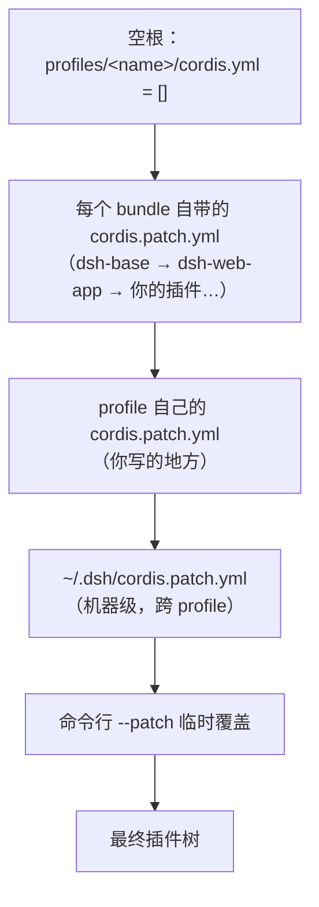

> **读完这篇你能**：用一份 patch 文件关掉不需要的内置插件、改掉内置插件的参数，而不动 `node_modules` 里的一行源码。
>
> **前置**：[第一个插件](02-第一个插件.md)。约 20 分钟。

[第一个插件](02-第一个插件.md)留下了两样东西：一份**插件自己的** `patch.yaml`（把自己挂上树），和一句"注册和挂载是两件事"。这篇把"挂载"这一半讲完——**DSH 树上的其它行，包括所有内置插件，你也能用同一套写法去改。**

## 什么时候需要

先看一个数字。在你自己的电脑上跑一次：

```bash
dsh --profile web --dump-config | grep -c '^- id:'
```

我这台机器是 154——web profile 一启动，就有 154 个插件行被挂上去。（换台机器数字不一样，看你装了几个插件。）它们来自四个 bundle——`dsh-base`、`dsh-web-app`、`dsh-better-sidebar`、`dsh-plugin-patent-claims`——全是 `node_modules` 里的现成代码。

于是下面这些需求全部无处下手：

- 内置的 `web-fetch-http`（联网抓网页）我不想让它跑，但源码在 `node_modules` 里，改了会被下一次安装冲掉；
- 某个内置插件的参数我想换（比如换个 API key 的环境变量名），但那是别人的包；
- 02 装进去的 hello world 我暂时不想让它跑了，想"停用"而不是卸载（卸载要重装一遍）；
- 我所有 profile 都要关掉同一个东西，不想每个 profile 写一遍。

**这篇讲的 patch，就是给这些问题准备的那一层。** 你不需要成为插件的作者，就能决定它装不装、怎么配。

## 先说结论：为什么"只写我想要的那几行"能改掉别人装的东西

DSH 的插件树不是写在一个文件里的。它是**从一个空根开始、由一层层 patch 叠出来的**：



**后一层能改前一层。** 所以要在最后压一条自己的 patch，只需要写"我要改的那几行"——不用把前面的 154 行抄一遍。

## 最小改动：三个 patch

在你自己的 profile 里新建 `~/.dsh/profiles/test/cordis.patch.yml`——01 建 profile 时它是空的 `[]`，现在往里面写三条：

```yaml
# ~/.dsh/profiles/test/cordis.patch.yml
# 1) 关掉内置的网页抓取插件
- id: web-fetch-http
  disabled: true

# 2) 内置搜索换个 key 的环境变量名
- id: web-search-deepseek
  config:
    apiKeyEnv: MY_DEEPSEEK_KEY

# 3) 插一行自己的插件
- insert:
    - id: dsh-note
      name: '/绝对路径/dsh-patch-demo/my-note.ts'
```

> 这份文件连同第 3 条要插的那个插件，都在 `dsh_plugin/dsh-patch-demo/` 里。目录里还有一个 `install.sh`：它会把 `__ABS_PATH__` 换成你机器上的真实路径，再复制进 test profile，省得手抄绝对路径。下面讲到哪一条，都可以对着那个目录看。

三条对应 patch 的三件事，就这么简单：

| 写法 | 作用 |
| --- | --- |
| `disabled: true` | 这一行不启动 |
| `id` + 字段 | 找到那一行，替换字段 |
| `insert:` | 往同一个列表尾部追加行 |

`id` 就是 `--dump-config` 里打印的那个 `id:`。**别背，去 dump 里抄。**

## 验证：`--dump-config` 就是你写 patch 的眼睛

两条命令，一条看现在的树，一条看写完之后的树：

```bash
# 现状：找到你想改的那一行的 id 和它现在的值
dsh --profile test --dump-config | grep -A4 'id: web-fetch-http'

# 改完：看 patch 到底落实了没有
dsh --profile test --dump-config
```

在我这台机器上（用 `--patch` 传同一个文件，效果与写进 profile 一样），改完后的相关几行是：

```yaml
# == @deepseek-ai/dsh-base, patched by ~/.dsh/profiles/test/cordis.patch.yml
- id: web-search-deepseek
  name: '@deepseek-ai/dsh-web-search-deepseek'
  config:
    apiKeyEnv: MY_DEEPSEEK_KEY
- id: web-fetch-http
  name: '@deepseek-ai/dsh-web-fetch-http'
  disabled: true
```

三个信号说明它成了：

1. **`disabled: true` 出现在 `web-fetch-http` 上**——这个插件这一轮不会启动；
2. **`web-search-deepseek` 的 `config` 变成了 `apiKeyEnv: MY_DEEPSEEK_KEY`**；
3. **`# ==` 注释里多了 `patched by`，后面正是你的 patch 文件路径**——它告诉你这一行被哪一层改过。这就是查"我的 patch 是不是真的生效了"的最快证据。

> `--dump-config` 只做合成，不启动插件，也不会执行 `!!js` 表达式，所以它是安全的、随时可以跑的诊断命令。

## 一次说清 patch 的语法

一份 patch 文件是一个顶层 YAML **数组**，每个元素是一条 patch，只有两种形状。

### 形状一：往列表里加行

```yaml
- insert:
    - id: dsh-note
      name: '/绝对路径/dsh-patch-demo/my-note.ts'
      config:
        whatever: 1
```

- 顶层是空的 `cordis.yml`，所以 `insert` 就是往这个列表尾部追加；
- `name` 可以是包名（`dsh-better-sidebar`）、绝对路径，或**相对路径**——相对路径会以 patch 文件所在目录为基准被转成 `file://` URL（`dsh-patch-demo/my-note.ts` 在 dump 里打印出来就是 `file:///…/dsh-patch-demo/my-note.ts`，就是这个规则）；
- `insert` 也可以带 `id`，含义变成"往那一行**下面**插"——前提是目标行是 `group: true` 的分组行（它的 `config` 本身是一份子行列表）。默认的 profile 树里没有这种行，遇到再查[加载器文档](https://deepseek-harness.github.io/deepseek-harness/)；
- 被插进来的这一行，`apply()` 会真的执行。`dsh-patch-demo/my-note.ts` 里就一句 `console.log`，启动后在日志里出现 `[dsh-note] 我被 patch 插进了插件树，apply() 执行了`，就是它跑起来的证据。

### 形状二：按 id 改一行

```yaml
- id: web-fetch-http
  disabled: true
```

- `id` 必写。后面的字段会**逐个覆盖**到目标行上；**你没写的字段保持原样**——这里覆盖的是"行"这一层，不是"config 对象"这一层（下一节是最容易踩的地方）；
- 还可以写 `name:` 做一次校验：只有当目标行的 `name` 和你写的一致时才应用，不一致就警告并跳过。想确认自己没改错行时才用；
- 找不到这个 `id` 怎么办？**警告一行，跳过继续跑**，不会中断启动。这是故意的：一份 patch 可能要同时喂给 web 和 tui 两个 profile，各自有各自的行。

### `!!js`：值可以在加载时算出来

字段的值可以是表达式，由加载器在加载时求值，作用域里能拿到 `process.env`、`process.platform` 和加载器上下文 `ctx`：

```yaml
- id: tool-bash
  disabled: !!js process.platform === 'win32'
```

这不是什么高级技巧，而是 DSH 内置插件的家常写法——`dsh-base` 里就有一批：

```yaml
- id: bash-sandbox
  name: '@deepseek-ai/dsh-bash-sandbox'
  disabled: !!js process.platform === 'win32'
```

我们之前看到过的那段"有人挂过我就不挂"，也是同一个机制：

```yaml
- id: better-sidebar
  name: dsh-better-sidebar
  disabled: !!js >-
    [...ctx.loader.entries()].some((e) => e.options.name === 'dsh-better-sidebar'
      && e.options.id !== 'better-sidebar' && !e.disabled)
```

它说的是：树里已经**有另一行**挂同一个包（`id` 不同、且没被禁用）时，这一行就自动禁用自己——因为同一个包挂两遍，注册路由时会直接 "duplicate route" 把整棵树搞崩。表达式只能看见排在它**前面**的行，所以这类守卫必须写在被守卫的行之前。

## 最容易踩的三个地方

### 1. `config` 是整块替换，不是逐字段合并

这条要单独记住。上面第 2 条 patch 写完，`web-search-deepseek` 的 `config` **只剩** `apiKeyEnv` 一个键——`dsh-base` 原本写在这一行上的其它键，全回落到插件自己 schema 的默认值，而不是保留。本专栏 06 里那句"覆盖是整块替换"，说的就是这里。

规矩由此而来：**覆盖一个行的 config，就把这个行你需要的键写全。** 不知道原来有哪些？先 `--dump-config` 看清楚再写。

### 2. id 写错 = 静默不生效

```text
dsh: [/tmp/patch.yml] patch: entry "web-fetch" not found
```

只警告、不报错，插件照常按原样启动。现象是"配置没生效"。所以改完一定跑一次 `--dump-config`，认 `# == ... patched by ...` 那行。

### 3. patch 文件本身写错 = 启动前就炸

YAML 语法错、顶层不是数组、元素不是映射，都会在启动时直接抛错退出——这跟"id 找不到"是两种待遇，故意的：**能自证的错误当场失败，引用不到的东西只警告**。

## 写进 profile、写进 home、还是 `--patch`？

三处都能放 patch，区别只在作用范围：

| 放哪 | 作用范围 | 适合什么 |
| --- | --- | --- |
| `profiles/<name>/cordis.patch.yml` | 只影响这个 profile | 这台机器上这个 profile 的偏好 |
| `~/.dsh/cordis.patch.yml` | 所有 profile | 跨 profile 的机器级选择：关掉一个内置能力、加一个我到处都想要的插件 |
| 命令行 `--patch <file>` | 只影响这一次启动 | 临时试验、排障。写完满意了再落进上两处 |

```bash
# 用临时 patch 试一下，不落盘
dsh --profile test --dump-config --patch ./tmp.yml
```

> 装插件时用的 `dsh plugin add` 会把挂载行追加进 `bundles`；而 `dsh.bundle.patch` 是**插件自带**的挂载声明，不用你写。这篇讲的是第三层——`cordis.patch.yml` 里**你自己**写的合成层。

## 完整代码：`dsh_plugin/dsh-patch-demo/`

| 文件 | 是什么 |
| --- | --- |
| `cordis.patch.yml` | 这篇的完整 patch，三种写法各一条，就是上面那份 |
| `my-note.ts` | `insert` 插进去的那个插件，只有 `name` + `apply()` 两行有效代码 |
| `install.sh` | 把 `__ABS_PATH__` 换成真实路径，再复制进指定 profile |

```bash
cd dsh_plugin/dsh-patch-demo
./install.sh          # 缺省装进 test profile；./install.sh web 可换
```

`install.sh` 只是替你做两件手工活得来的事：填绝对路径、`cp` 到 `~/.dsh/profiles/<profile>/cordis.patch.yml`（原文件会先备份）。不想用脚本，就照着 `cordis.patch.yml` 手抄一遍，把 `__ABS_PATH__` 换成本目录的绝对路径。

装好之后两件事都能验证：

```bash
# 装配层：三行都在
dsh --profile test --dump-config | grep -A4 'id: web-fetch-http'

# 运行层：insert 那一行真的跑起来了
dsh --profile test --no-open --port 3099
# 日志里出现：[dsh-note] 我被 patch 插进了插件树，apply() 执行了
```

> `--port 3099` 是躲开正在跑的 3080。`--dump-config` 能证明"行挂上了"，但**证明不了插件能跑**——所以 insert 这类改动，一定要真启动一次看日志。

## 顺带解决：怎么"停用"一个插件

用同一招对付自己装的插件——比如 02 那个 hello world：

```yaml
# 不想用了，先停用，而不是卸载
- id: dsh-hello-world
  disabled: true
```

改主意只需删掉这两行；想彻底去掉再跑 `dsh plugin --profile test remove <包名>`。**先禁用再卸载**的好处就在这里：卸载要重装一遍，禁用只是删两行。

（后面 04 写的背景插件换成 `-config` 版本时，也会用这一招把旧的那份停掉。）

## 注意事项

- **id 从 dump 里抄。** 它是 `cordis.patch.yml` 里 `id:` 的取值，不是包名，也不是插件自己的 `name`。
- **改完要重启。** `test` profile 没开配置热重载，`cordis.patch.yml` 的改动在下次启动才生效。
- **禁用有依赖的东西，dump 里看不出来。** 比如把某个 service 的 provider 行禁用了，依赖它的消费者行会在启动时报错。`--dump-config` 只做静态合成，跑起来才知道——所以停用内置插件后，记得看一眼启动日志。
- **`--dump-default-config` 是不含你那一层的树。** 怀疑自己的 patch 写坏了、"树到底是不是我搞崩的"，用它对一次，比删文件重试快。

---

**下一篇**：[给页面加背景](04-给页面加背景.md)——写一个真正能动 UI 的插件，顺便用这篇的 patch 停掉不要的那份。

后面几篇还会接着用 patch：[effect 与插件生命周期](05-effect与生命周期.md) 里 patch 换来的那几行要在卸载时清干净，[让插件可配置](06-让插件可配置.md) 讲 `config` 的层叠与整块替换；再下一篇会讲怎么让 patch 的改动不用重启就生效。

patch 的完整合成模型、每一层文件归谁维护，见[profile 与插件包结构](参考/profile与插件包结构.md)。
