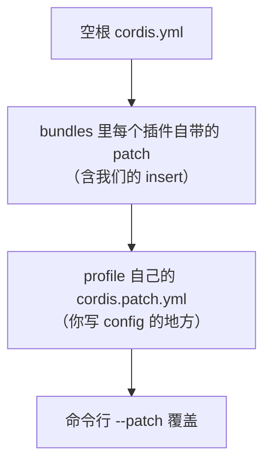

> **读完这篇你能**：把插件里写死的图片路径、透明度改成交互配置，不改代码、不重装就能换图。
>
> **前置**：[effect 与插件生命周期](05-effect与生命周期.md)。约 20 分钟。

[给页面加背景](04-给页面加背景.md)里，图片路径是写死的常量：

```ts
const IMAGE_PATH = new URL('../image.jpg', import.meta.url).pathname
```

样式表也不接受参数——透明度想要可调，得先有人把值送进 CSS。

想换张图、调个透明度，只能改源码——改完还要重装、重启。如果你一个人用、一辈子只换一次图，这没问题。下面任意一条成立，就该把它升级成配置：

- 换台机器（公司 / 家里）要换图，但不想每台机器维护一份不同的源码；
- 想现场试几个透明度，而不是"改一次、装一次、重启一次"；
- 插件要给别人用，别人不该碰你的源码。

这篇把 04 的背景插件做成可配置版本，代码单独放在 `dsh_plugin/dsh-chat-background-config/`。

## 目标

改完之后，换图只需要在 profile 里写一段配置：

```yaml
# ~/.dsh/profiles/test/cordis.patch.yml
- id: dsh-chat-background-config
  config:
    image: /Users/you/Pictures/cat.jpg
    opacity: 0.5
```

重启 DSH，背景变成 cat.jpg、透明度 0.5。什么都不写，就用插件自带的那张图、透明度 0.35。

## 第一步：导出 Config

Cordis 认一个约定：插件导出同名的 `Config` 类型和 `Config` schema，它就会在调用 `apply` 之前，用 schema 校验 entry 的 `config` 块，并把缺失的字段用默认值补齐。

```ts
// src/dsh-chat-background.ts（新增部分）
import Schema from '@deepseek-ai/schemastery'

// 04 里写死的图片路径，现在降级成"默认值"
const DEFAULT_IMAGE = new URL('../image.jpg', import.meta.url).pathname

export interface Config {
    /** 背景图片的绝对路径。 */
    image: string
    /** 图片显示强度：0 完全透明，1 完全不透明。 */
    opacity: number
}

export const Config: Schema<Config> = Schema.object({
    image: Schema.string().default(DEFAULT_IMAGE),
    opacity: Schema.number().min(0).max(1).default(0.35),
})

export function apply(ctx: Context, config: Config): void {
    // ...
}
```

三个要点：

- **名字必须叫 `Config`。** 类型给编辑器，`Schema` 值给 Cordis 运行时。只写 `interface Config` 不够——Cordis 要的是一个运行时的 [Standard Schema](https://standardschema.dev/) 验证器，普通对象没有 `~standard` 接口。
- **默认值写在 schema 里**（`.default(...)`），不要写成 `apply` 里的 `config.image ?? ...`。`apply` 拿到的永远是补齐后的完整配置，代码里不用再防 `undefined`。
- **约束也写在 schema 里。** `.min(0).max(1)` 表示透明度只能是 0~1，`Schema.string()` 表示图片路径必须是字符串。约束在这里声明，Cordis 就在加载时替你执行。


别忘了在本插件`package.json`中添加依赖——`Schema` 来自 `@deepseek-ai/schemastery`，不在 `cordis` 里。

```json
"dependencies": {
  "@deepseek-ai/cordis": "^4.0.1",
  "@deepseek-ai/dsh-host-webserver": "^0.1.2-alpha.2",
  "@deepseek-ai/schemastery": "^3.18.2"
}
```

这份 `package.json` 是"插件的清单"：插件代码 `import` 的包都写在这里；profile 的 `package.json` 是"要挂哪些插件"的清单。两个文件分属两层，别混。

```bash
cd dsh_plugin/dsh-chat-background-config
pnpm install
```

## 第二步：把写死的值换成 config

配置声明好了，接下来是"哪里用它"。两处。

### 路由 handler：读 config.image

图片路径可配之后，`content-type` 也得跟着路径走。先补一张扩展名对照表：

```ts
import { extname } from 'node:path'

// 允许的图片扩展名 → Content-Type；换成 PNG/WebP 时响应头要跟着变
const CONTENT_TYPES: Record<string, string> = {
    '.jpg': 'image/jpeg',
    '.jpeg': 'image/jpeg',
    '.png': 'image/png',
    '.webp': 'image/webp',
    '.gif': 'image/gif',
}
```

handler 只改一处——读 `config.image`，而不是模块顶层的常量：

```ts
ctx.inject(['webServer'], (serverCtx) => {
    const webServer = serverCtx.webServer
    ctx.effect(() => webServer.register({
        kind: 'exact',
        path: IMAGE_URL,
        handler: async (_req, res) => {
            const contentType = CONTENT_TYPES[extname(config.image).toLowerCase()]
                ?? 'application/octet-stream'
            res.writeHead(200, { 'content-type': contentType })
            res.end(await readFile(config.image))
        },
    }))
})
```

注意路由地址 `IMAGE_URL` 本身没变——浏览器拿图的通道是固定的，变的是**通道背后读哪个文件**。

### 注入的样式：把动态值提成 CSS 变量

04 的 `style.css` 是静态文件，透明度一进来它就不再静态了。改法是把唯一的动态值提成 CSS 变量，样式表本身尽量不动：

```ts
/** 用配置值生成样式：静态选择器来自 style.css，只有遮罩浓度随配置变化。 */
function buildStyle(config: Config): string {
    // 透明度的实现：在图片上盖一层与页面底色同色的遮罩，越不透明遮得越多
    const veilPercent = Math.round((1 - config.opacity) * 100)
    const veil = `color-mix(in srgb, var(--dsw-alias-bg-base) ${veilPercent}%, transparent)`
    const styleSheet = readFileSync(new URL('./style.css', import.meta.url), 'utf8')
    return `:root { --dsh-chat-background-veil: ${veil}; }\n${styleSheet}`
}
```

`style.css` 里对应改一行：

```css
div:has(> [data-shell-overlay]) {
    background-image:
        linear-gradient(var(--dsh-chat-background-veil), var(--dsh-chat-background-veil)),
        url('/dsh-chat-background-config/image.jpg');
    background-size: cover;
}
```

> 为什么不直接在 `style.css` 里写 `opacity: 0.35`？因为那会把整个布局根、连同里面的文字和按钮一起变透明。图片的"透明度"是盖一层与页面底色同色的遮罩实现的：`opacity` 越低，遮罩越浓。`--dsw-alias-bg-base` 是 DSH 主题里的页面底色变量，明暗主题各有一份。

## 第三步：config 写在哪

插件的 `patch.yaml` 只负责"把插件挂上树"，不写 config：

```yaml
- insert:
    - id: dsh-chat-background-config
      name: '/绝对路径/dsh-chat-background-config/src/dsh-chat-background.ts'
```

你机器上的偏好写在 **profile 的 `cordis.patch.yml`** 里，用 entry 的 `id` 定位：

```yaml
# ~/.dsh/profiles/test/cordis.patch.yml
- id: dsh-chat-background-config
  config:
    image: /Users/you/Pictures/cat.jpg
    opacity: 0.5
```

理由和 01 解释 profile 时是同一个：**插件是"能力"，配置是"这台机器上的选择"**。源码可以共享、可以发布；这台机器用哪张图，不该混进源码里。

## 第四步：装上去验证

```bash
cd 你的插件目录
dsh plugin --profile test add link:.
dsh --profile test --dump-config   # 插件树里出现 dsh-chat-background-config
dsh --profile test --no-open       # 启动，web 端口 3080
```

`--dump-config` 打印的是各层 patch 合成后的结果。改完 `cordis.patch.yml` 里的 config，再跑一次 `--dump-config`，就能确认新值真的进了配置树——比"重启后盯着页面猜"快得多。

`test` profile 没开配置热重载，改完记得重启启动命令。

## 配置的层叠：谁覆盖谁

一个 entry 的 config 不只一个来源。完整顺序是：



后面一层按 `id` 覆盖前面一层。**而且覆盖是整块替换，不是逐字段合并**：你写 `config: { opacity: 0.5 }`，这一行原来整个 config（比如 `{ image: ..., opacity: 0.35 }`）都会被换掉，`image` 回落到 **schema 默认值**，而不是保留上一层的值。

由此得到一条规矩：**默认值只写在 schema 一处。** 不要一半放 schema、一半放插件自带的 `patch.yaml`，否则你在 profile 里覆盖另一个字段时，前一半会悄无声息地消失。真要在 profile 层覆盖，就把要保留的字段一起写全。

## 非法配置要当场失败

schema 不只是文档，它在加载时执行。把透明度写成 1.5：

```yaml
- id: dsh-chat-background-config
  config:
    opacity: 1.5
```

插件不会"凑合用默认值"，而是在 `apply` 之前就失败：

```text
ValidationError: invalid config:
  - $.opacity expected number <= 1 but got 1.5 (at opacity)
```

对应的 fiber 停在 FAILED 状态，插件根本没启动。

这正是我们想要的：配置错误在加载时炸掉，**比**插件带着一个你没打算要的值跑起来、过一会儿表现成"背景看着不太对"**好排障**得多。所以不要把 schema 写得太宽松——类型、范围、枚举这些能表达的约束都写进去，别用"容错"把错误吞掉。

`image` 指向的文件不存在，schema 判不了——它不知道你的磁盘上有什么，只能在请求到达、`readFile` 报错时暴露。引用型的配置（文件、服务、别的插件）大多如此：能自证的约束在 schema 里当场失败，要引用别的东西的，得等解析到它时才失败。

## 注意事项

- **`id` 要对得上。** profile 的覆盖靠 entry 的 `id` 定位；`id` 写错，这条 patch 会警告"entry not found"然后跳过，插件照常按默认值启动——现象就是"配置没生效"。
- **图片路径写绝对路径。** `readFile` 解析相对路径时基准是 DSH 进程的工作目录，不稳定；配置里直接给绝对路径。
- **跟 04 的插件二选一。** 本文的插件是独立一份（名字带 `-config`）。两套都挂着时，两边会往同一个布局根注入背景样式，后注入的盖住前面的。先在 profile 里用[改掉 DSH 的默认装配](03-改掉DSH的默认装配.md)里那招停用 04 的那份（`- id: <它的 entry id>` + `disabled: true`）。
- **改 config 要重启。** `test` profile 没开配置热重载；怎么让改动即时生效，也是后面的篇目要讲的。

---

**主线到此结束（本栏目前写到 06）。** 到这里，我们自己的插件能挂载、能动 UI、能清理、能配置，DSH 自带的那 150 多行的装配也已经归我们管。

下一篇要讲的是「改了 patch 或源码不重启」。中间跳过的可以回头补：[改掉 DSH 的默认装配](03-改掉DSH的默认装配.md)、[effect 与插件生命周期](05-effect与生命周期.md)。

profile 目录里哪些文件能改、patch 怎么合成，见[profile 与插件包结构](参考/profile与插件包结构.md)；`ctx` 上还有哪些能力，见 [Cordis API 文档](../dsh/cordis_api.md)。
