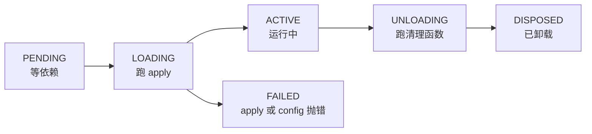

> **读完这篇你能**：改插件源码或改 `cordis.patch.yml` 之后不重启进程就让它生效，并知道哪些改动坐等也不会生效。
>
> **前置**：[让插件可配置](06-让插件可配置.md)。约 25 分钟。

## 目标

- 改 `cordis.patch.yml` 里的 `config`：插件重启，进程不动，端口和会话都还在。
- 改插件的 `.ts` 源码：插件重新加载，路由返回新值。

## 两条路

改的东西分两类，负责它们的机制不是一套：

| 改什么            | 谁负责                 | 生效单位                            | 默认                     |
| -------------- | ------------------- | ------------------------------- | ---------------------- |
| patch / config | profile 的 patch 监视器 | 重新组合装配，受影响的那行 restart           | `patchReload: live` 就开 |
| 插件源码           | HMR 服务（`hmr` 那行）    | 用到它的插件条目卸载、重新 import、重新 `apply` | 关着，要自己开                |

表里的 restart 是插件重启，不是进程重启。端口还是那个端口，会话也还在，浏览器不用刷，只有被改到的那个插件把自己的注册拆掉再来一遍。

这套东西要放到 05 篇之后讲，也是因为这个：重载时旧 fiber 会卸载，它注册过的东西都得能被撤掉。少一层 `ctx.effect`，重新注册时就会撞上 `duplicate route`。

## 第一步：patchReload 的两个值

这个字段写在 profile 的 `package.json` 里，只有两个取值：

```json
{ "dsh": { "profile": { "bundles": ["…"], "patchReload": "live" } } }
```

| 值 | 启动时做什么 | 适合什么场合 |
| --- | --- | --- |
| `live` | 装两个监视器，分别盯 profile 自己的 `cordis.patch.yml` 和 `~/.dsh/cordis.patch.yml`。每次有效编辑就重新组合装配；被拒绝的编辑保留上一个能用的版本。另外，如果树里没有 `hmr` 服务，launcher 会补一个只盯 config 的实例（`root` 是空的，不监视源码模块） | 正在写配置、调插件，想保存就看到结果 |
| `startup` | 什么都不装。patch 只在启动那一刻合成一次，之后文件再改也不看 | 跑长任务、无人值守，不希望一次保存动到运行中的进程 |

`live` 补的那个实例只盯 config 这件事，值得单独记一下：它管不了改 `.ts` 要不要生效，模块热重载是第二步里 `hmr` 那行的事。

省略这个字段时算哪个值，要分情况看：

- 自己建的 profile（我们的 `test` 就是）没写就按 `live` 算，这是保留下来的历史默认值，所以 test profile 不用改；
- 从随附模板来的 profile 不适用这条。`web` 模板是 `live`，`headless`、`acp`、`sdk`、`sdk-minimal` 是 `startup`；`--from-default-profile <模板>` 建的 profile 会把模板的值写进它的 `package.json`，bundle 组合跟某个随附模板完全一致的 profile 加载时也会被规范化成模板的值并写回文件。

所以"没写就是 live"只对自定义 profile 成立。想知道手上这个到底是哪个值，别猜，`cat ~/.dsh/profiles/test/package.json` 看一眼。

写成别的值不会静默退回默认，启动直接失败：

```text
dsh: profile manifest /Users/you/.dsh/profiles/test/package.json dsh.profile.patchReload must be "live" or "startup"
```

`live` 监视的两份文件是：

```text
~/.dsh/profiles/test/cordis.patch.yml    ← 这个 profile 的
~/.dsh/cordis.patch.yml                  ← 机器级的
```

`--patch` 传进来的那份不在里面，它本来就是一次性的。

被拒绝的那种情况要多说一句：进程不退出，终端也不提示，保存完看起来像什么都没发生。这一点后面注意事项里还会提到。

## 第二步：打开源码热重载

改源码由 `hmr` 这个插件负责。它在 `dsh-base` 里有一行，默认关着：

```yaml
# dsh --profile test --dump-config 里的原文
- id: hmr
  name: '@deepseek-ai/cordis-plugin-hmr'
  disabled: true
  config:
    root:
      - .
```

关着是有意的，dsh-base 的注释写了原因：patch 的热重载由 launcher 兜底，不需要这一行，模块热重载是每个 profile 自己决定要不要的。

打开还是写 patch：

```yaml
- id: hmr
  disabled: false
  config:
    root:
      - /绝对路径/dsh-hmr-demo
```

有三处容易写错：

- 光写 `disabled: false` 不够。原来 `root: ['.']` 指的是 profile 根，得换成放你源码的目录。
- `config` 是整块替换（03 篇的易错点 1），`root` 要写全。`ignored`、`debounce` 不写就落回 schema 默认值：默认忽略 `**/node_modules`、`**/.*`、`cache`、`data`，防抖 100 毫秒。
- `root` 里的相对路径以 HMR 自己的 base（默认是 profile 根）为基准，跟你在哪个目录敲命令无关，写绝对路径最省事。

写完先确认落上去了：

```bash
dsh --profile test --dump-config | grep -A5 'id: hmr'
```

看到 `disabled: false` 和你要的目录才算打开。patch 里 `id` 写错时只会往 stderr 打一行警告然后跳过，不看 dump 很容易以为已经写对了。

## 第三步：跑一遍看

演示代码在 `dsh_plugin/dsh-hmr-demo/`：一个插件、一份 patch、一个安装脚本。

```bash
cd dsh_plugin/dsh-hmr-demo && ./install.sh
dsh --profile test --no-open --port 3099
```

`install.sh` 会先备份 profile 里原有的 `cordis.patch.yml`，再把本目录的路径填进占位符写进去。端口写 3099 是躲开正在跑的 3080。

启动后第一眼是这样，第一行是插件自己打的：

```text
[dsh-hmr-demo] apply() 执行：tag=patched-v1，VERSION=src-v1
dsh web: http://127.0.0.1:3099/?token=…
```

### 改 config

进程别动，把 `~/.dsh/profiles/test/cordis.patch.yml` 里的 `patched-v1` 改成 `patched-v2`，保存。日志里会多一行：

```text
[dsh-hmr-demo] apply() 执行：tag=patched-v2，VERSION=src-v1
```

旧 fiber 卸载（路由跟着注销），新 fiber 带着新 config 重新 `apply`。端口、token、会话都没变。

### 改源码

再改 `dsh_plugin/dsh-hmr-demo/my-plugin.ts`：

```ts
const VERSION = 'src-v2'   // 原来是 src-v1
```

保存后再看日志和路由：

```bash
curl http://127.0.0.1:3099/dsh-hmr-demo/ping
# dsh-hmr-demo: tag=…, VERSION=src-v2
```

这里有个我自己踩到的现象，日志里能看到：

```text
[dsh-hmr-demo] apply() 执行：tag=patched-v1，VERSION=src-v2
```

`VERSION` 更新了，`tag` 却回到 `patched-v1`。模块热重载重新挂载插件时，用的是进程启动时那份 config，刚才改出来的 `patched-v2` 不在里面。想让它也变回来，把 patch 再存一次就行。

所以改 patch 和改源码虽然都不用重启，但走的不是同一条路，别把两边的结果混在一起判断。

### 改 bundle 列表

```bash
dsh plugin --profile test add link:.     # 往 profile 的 package.json 里加一个包
```

这条没人管。跑着的进程不会多出插件，得重启。

## 覆盖范围

HMR 按"改的文件是谁"分几种处理，下面这张表对应 `vendor/hmr` 和 `apps/cli/src/profile-boot.ts` 里的实现：

| 改了什么 | 结果 |
| --- | --- |
| 插件入口文件 | 那个插件条目重载：卸载、重新 import、重新 `apply` |
| 插件 import 的本地模块（不在 `node_modules` 里） | 顺着依赖找上来，用到它的插件条目一起重载 |
| `node_modules` 里的文件（第三方包、DSH 自己的包） | 不监视也不重载（默认在 `ignored` 里），要重启 |
| 插件运行时读的数据文件（CSS、JSON，不是 import 进来的） | 不算模块依赖，改了不重载，HMR 只发一个 `hmr/change`，顺手碰一下 `.ts` 才会重载 |
| profile 的 `package.json`、`.env`、命令行参数 | 没人管，重启才生效 |

另外两种情况值得单独记一下。

源码编译不过（比如语法写错），这次重载会放弃，模块缓存回滚，旧代码接着服务，终端上一样没有提示。

要是 import 成功、`apply` 里抛了错，情况更麻烦：旧 fiber 的注册已经卸载了，新 fiber 停在 FAILED，路由直接 404，进程还活着。把文件改回去再存一次，插件就回来了。

改坏文件的时候，热重载会把后果放大：插件当场消失，还没有任何提示。这是我用这套东西最不适应的地方。

## Fiber 状态机

热重载的单位是 fiber（05 篇），它的状态机不长，值得记一下：



- PENDING：`inject` 声明的依赖还没就绪；
- LOADING：正在执行 `apply`；
- ACTIVE：正常服务中；
- FAILED：`apply` 或 config 校验抛错；
- UNLOADING / DISPOSED：逆序跑完 `ctx.effect` 收起来的清理函数，然后结束。

一次热重载就是 `ACTIVE → UNLOADING → DISPOSED`，加上一个新 fiber 从 `PENDING → LOADING → ACTIVE`。05 篇说"注册必须能被撤掉"，在这里是硬要求：清理函数没跑干净，新 fiber 的 `register` 撞上旧的 `(kind, path)`，这次重载就被 `duplicate route` 打回去了。

FAILED 得自己救：改回去、再存一次。它是每个 fiber 各自的状态，一个插件挂了不影响别的。

## 用 dump 排查

`--dump-config` 只合成装配、不启动插件，查装配用它最快。三种用法：

```bash
# 1. 热重载那两行到底开没开
dsh --profile test --dump-config | grep -A5 'id: hmr'
```

```bash
# 2. id 写错：警告 + 跳过，装配照原样（现象 = 配置没生效）
$ dsh --profile test --dump-config
dsh: [/Users/you/.dsh/profiles/test/cordis.patch.yml] patch: entry "nonexistent-row" not found
```

```bash
# 3. patch 文件本身写坏：启动和 dump 都直接失败，报错带行号
$ dsh --profile test --dump-config
Error: dsh: failed to parse overlay /Users/you/.dsh/profiles/test/cordis.patch.yml:
  YAMLException: unexpected end of the stream within a flow collection (2:1)
```

dump 通过只能说明装配写对了，重载有没有发生它管不了。

## 注意事项

1. HMR 自己的日志默认看不见。`dsh-base` 没挂 console logger，`ctx.logger.info/warn` 不往终端打，所以"改了没反应"的时候终端可能安静得什么也不说。这篇一直用插件自己的 `console.log` 当证据，也建议你这么干。
2. `live` 下被拒绝的编辑是静默的。进程用上一个能用的版本接着跑，不做提示。改完 patch 先看一眼 `--dump-config`，或者在插件里把 config 打出来。
3. `root` 指错就等于什么都没发生。目录写错、或者文件不在这个目录下，HMR 也不报错。装配用 dump 确认，watch 有没有生效，靠改一下文件看插件重不重启。
4. 改坏源码等于把插件卸了，恢复方法是把文件改回去再存一次。
5. 前端（React 客户端组件）的热重载是另一套。`web-app` 里有个 `client-hmr` 管 `src/client` 那些浏览器端模块，12 篇之后再碰。
6. 热重载不是万能的。装包、改 bundles、改 `.env`、换 `patchReload`，都得重启，别等。

---

**主线到此结束（本栏目前写到 07）。** 到这里，我们自己的插件能挂载、能动 UI、能清理、能配置，改一行代码或一行 patch 也不用再重启进程。

中间跳过的可以回头补：[改掉 DSH 的默认装配](03-改掉DSH的默认装配.md)、[effect 与插件生命周期](05-effect与生命周期.md)。

profile 目录里哪些文件能改、patch 怎么合成，见[profile 与插件包结构](参考/profile与插件包结构.md)；`ctx` 上还有哪些能力，见 [Cordis API 文档](../dsh/cordis_api.md)。
