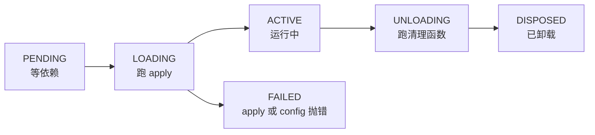

> **读完这篇你能**：改插件源码或改 `cordis.patch.yml` 之后不重启进程就让它生效，并知道哪些改动坐等也不会生效。
>
> **前置**：[用 Config schema 声明插件配置](06-用 Config schema 声明插件配置.md)。约 20 分钟。
>
> **示例代码**：[dsh-hmr-demo](https://github.com/anthonyzhao-4926/blog/tree/main/code/dsh_plugin/dsh-hmr-demo)

06 篇配好背景插件之后，我又改了两样东西：patch 里的 `config`，和插件自己的 `.ts`。

patch 那份，保存就生效了，插件带着新配置重跑一遍。`.ts` 那份，保存以后什么都没发生，路由还返回旧值。

差别不在改的是哪个文件，而在两个开关的默认值不一样：配置热重载默认开着，源码热重载默认关着。这篇从这两次实测讲起。

## 目标

- 改 `cordis.patch.yml` 里的 `config`：保存就生效，插件重启，进程不动。
- 改插件的 `.ts` 源码：保存也生效，路由返回新值。

两件事都不用重启进程：端口、会话、浏览器都还在。演示代码在 `dsh_plugin/dsh-hmr-demo/`，一个插件、一份 patch、一个安装脚本。

## 配置热重载

```bash
cd dsh_plugin/dsh-hmr-demo && ./install.sh
dsh --profile test --no-open --port 3099
```

`install.sh` 会先把 profile 里原有的 `cordis.patch.yml` 备份一份，再把本目录路径填进占位符写进去。端口用 3099 是为了躲开正在跑的 3080。

启动后日志里第一行是插件自己打的：

```text
[dsh-hmr-demo] apply() 执行：tag=patched-v1，VERSION=src-v1
dsh web: http://127.0.0.1:3099/?token=…
```

现在把 `~/.dsh/profiles/test/cordis.patch.yml` 里的 `patched-v1` 改成 `patched-v2`，保存。等一两秒，日志里会多出一行：

```text
[dsh-hmr-demo] apply() 执行：tag=patched-v2，VERSION=src-v1
```

旧 fiber 卸载（路由跟着注销），新 fiber 带着新 config 重新 `apply`。进程没动，token 还是刚才那个。

这件事归 base 组合包里 id 为 `hmr` 的那行管，原文长这样：

```yaml
# Profile configuration reloads by default; module roots are opt-in.
- id: hmr
  name: '@deepseek-ai/dsh-hmr'
  disabled: !!js "!ctx.get('profileContext')"
  config:
    root: []
```

三处要说明：

插件是 `@deepseek-ai/dsh-hmr`，一个插件同时管配置热重载和源码热重载，两者共用一个队列。配置那部分盯三份文件：profile 的 `cordis.patch.yml`、`~/.dsh/cordis.patch.yml`，还有 profile 的 `package.json`。

`disabled` 不是常量，是一条表达式：dsh 启动的 profile 会提供 `profileContext`，所以这行是启用的；没有这个上下文的宿主（比如把 DSH 嵌进自己程序里）会把它关掉。

`root: []` 是空列表，意思是"不监视任何源码目录，只保留配置监听"。前面改动能立刻生效，靠的就是配置监听这一半。

顺带提两种没有它的 profile。`headless`、`sdk`、`acp` 组合包在各自的 patch 里把这行 `disabled: true` 了，它们默认没有热重载，改 patch 得重启；想在那边用，在自己的 profile patch 里写 `disabled: false` 打开。

## 源码热重载

接着刚才那个进程，把 `dsh_plugin/dsh-hmr-demo/my-plugin.ts` 里的 `VERSION` 改成 `src-v2`：

```ts
const VERSION = 'src-v2'   // 原来是 src-v1
```

保存，等几秒，再看日志和路由：

```text
[dsh-hmr-demo] apply() 执行：tag=patched-v2，VERSION=src-v1   ← 还是老样子，没有新的一行

$ curl http://127.0.0.1:3099/dsh-hmr-demo/ping
dsh-hmr-demo: tag=patched-v2, VERSION=src-v1
```

没有反应。原因就是上面那个 `root: []`：它没在看任何源码目录，你的文件不在它的视野里。

把它填上，还是写 profile patch：

```yaml
- id: hmr
  config:
    root:
      - /绝对路径/dsh-hmr-demo
```

`config` 是整块替换（03 篇的易错点 1），所以 `root` 要写全，不要以为是在默认那行后面追加。`root` 里的相对路径以 HMR 自己的 base 为准（默认是 profile 根目录），跟你在哪个目录敲命令没关系，写绝对路径最省事。`ignored` 和 `debounce` 不写就落回默认值：默认忽略 `**/node_modules`、`**/.*`、`cache`、`data`，合并窗口 100 毫秒。

只写 `config` 就够，不用写 `disabled: false`。web profile 里这行本来就是启用的；要写 `disabled: false` 的是 headless、sdk、acp 那几种。

改完这个 patch，不用重启进程。配置热重载会把这行重建一遍，新的 `root` 立刻开始工作。接着把 `VERSION` 改成 `src-v3`，保存：

```text
[dsh-hmr-demo] apply() 执行：tag=patched-v2，VERSION=src-v3

$ curl http://127.0.0.1:3099/dsh-hmr-demo/ping
dsh-hmr-demo: tag=patched-v2, VERSION=src-v3
```

生效了。注意 `tag` 还是刚才改出来的 `patched-v2`：模块重载带过来的是当前那份 config，没有被重置回启动时的值。

## 重载过程

两次生效的迹象都是同一个：`apply()` 又执行了一遍。也就是说，插件被卸载后重新加载了一次，而不是进程重启。

重载的单位是 fiber（05 篇），它的状态机不长：



- PENDING：`inject` 声明的依赖还没就绪；
- LOADING：正在执行 `apply`；
- ACTIVE：正常服务中；
- FAILED：`apply` 或 config 校验抛错；
- UNLOADING / DISPOSED：逆序跑完 `ctx.effect` 收起来的清理函数。

一次热重载就是旧 fiber 走 `ACTIVE → UNLOADING → DISPOSED`，新 fiber 从 `PENDING → LOADING → ACTIVE`。所以 05 篇那句"注册必须能被撤掉"在这里是硬要求：清理函数没跑干净，新 fiber 的 `register` 会撞上旧的 `(kind, path)`，被 `duplicate route` 打回去。

还有一件事跟"等几秒"有关。配置监听用的是 Chokidar 的写入稳定窗口（`awaitWriteFinish`，默认 2 秒），编辑器分几次写完文件时，通知会等窗口结束才发。所以保存完先等一两秒，别马上断定没生效。模块那边的合并窗口是 `debounce`，默认 100 毫秒。

## 热重载的覆盖范围

HMR 按"改的文件是谁"分几种处理，下面这张表对应 `@deepseek-ai/dsh-hmr` 里的实现：

| 改了什么 | 结果 |
| --- | --- |
| 插件入口文件 | 重载那个条目：卸载、重新 import、重新 `apply` |
| 插件 import 的本地模块（不在 `node_modules` 里） | 顺着依赖找上来，用到它的插件条目一起重载 |
| `node_modules` 里的文件（第三方包、DSH 自己的包） | 不在监视范围（默认在 `ignored` 里），要重启 |
| 插件运行时读的数据文件（CSS、JSON，不是 import 进来的） | 不算模块依赖，不会重载，HMR 只发一个 `hmr/change` |
| 装包、换包版本（pnpm 的动作） | 不在热重载队列里，要重启 |
| `.env`、命令行参数 | 启动时读一次，之后不再看 |

改坏了会怎样，我在同一台进程上试了两次。

一次是语法写错。这次重载被放弃，模块缓存回滚，旧代码接着服务，日志里一行新东西都没有。

另一次是 `apply` 里抛错。这次插件会被回滚：新 fiber 挂了，旧插件重新挂上去，路由照常返回旧值，进程也还在。

两次的共同点是终端什么也不说。HMR 的提示都走 `ctx.logger`，而 base 没挂 console logger，这些 info/warn 不往终端打。想知道重载到底有没有发生，最省事的办法是插件自己打一行，就像演示里那样。

## 改动没生效时的排查

1. **先等一两秒。** 配置监听有 2 秒的写入稳定窗口，编辑器还在写的时候不算数。
2. **改的是源码，就用 dump 看 `root`。** 它得覆盖你那个文件所在的目录：

   ```bash
   dsh --profile test --dump-config | grep -A6 'id: hmr'
   ```

   目录写错、或者文件不在这里，HMR 不会报错，它只是没看见。

3. **改的是 config，就用 dump 看值和 id：**

   ```text
   $ dsh --profile test --dump-config
   dsh: [/Users/you/.dsh/profiles/test/cordis.patch.yml] patch: entry "nonexistent-row" not found
   ```

   `id` 写错只会打这么一行警告然后跳过，插件照原样启动，看着就像"配置没生效"。

4. **patch 文件本身写坏，dump 会直接失败**，报错带行号：

   ```text
   Error: dsh: failed to parse overlay /Users/you/.dsh/profiles/test/cordis.patch.yml:
     YAMLException: unexpected end of the stream within a flow collection (2:1)
   ```

5. **dump 看不出的部分，靠插件打印。** 它只合成装配、不启动插件，重载有没有发生它证明不了。

还有一种"没生效"是改错了地方：如果你改的是 `src/client` 里那些浏览器端模块，那归 `web-app` 里的 `client-hmr` 管，是另一套机制，12 篇之后再说。

---

**下一篇**：[替换内置能力的提供方与消费者](08-替换内置能力的提供方与消费者.md)——把 `web_search` 背后的搜索换成自己的源，消费者一行都不用改。

中间跳过的可以回头补：[用 patch 覆盖 DSH 的默认装配](03-用 patch 覆盖 DSH 的默认装配.md)、[插件生命周期与 ctx.effect](05-插件生命周期与 ctx.effect.md)。

profile 目录里哪些文件能改、patch 怎么合成，见[profile 与插件包结构](参考/profile与插件包结构.md)；`ctx` 上还有哪些能力，见 [Cordis API 文档](../dsh/cordis_api.md)。
