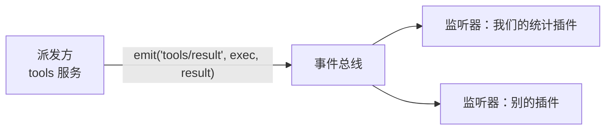

> **读完这篇你能**：订阅 DSH 内部的事件（工具调用、审批结果、会话记录），把计数挂到一条 HTTP 路由上；并且知道五种分发模式各自该用在什么地方。
>
> **前置**：[同一能力换个供应商](08-同一能力换个供应商.md)。约 30 分钟。

08 篇那个探针是"我发起一次搜索，看结果"。这篇反过来：模型自己跑起来之后，我看不见它做了什么。

我想知道的很具体——这一轮它调了哪些工具、各几次、花了多久、失败几次；审批被拒了几次；哪条记录落进了会话文件。这些都不用改模型、也不用翻日志：DSH 内部每一步都会发**事件**，订阅就行。

## 目标

- 一个插件订阅三类真实事件，把计数挂到 `/dsh-event-log/stats`；一轮结束再往日志里打一行汇总。
- 一个演示插件和一个探针，把五种分发模式的差别用六次 curl 看全。
- 全部代码在 `dsh_plugin/dsh-event-log/`，装法与 08 篇同一个 profile。

## 事件是什么

08 篇讲的是**服务调用**：消费者拿到 `ctx.web`，调它的 `search()`，一对一，要返回值。

事件是另一种通信方式：某个组件喊一声"这件事发生了"，谁想听谁听，喊的人不知道也不关心有几个监听器。



一个事件由三样东西构成，它们合起来就是事件的公开契约：

| 组成 | 例子 | 谁定 |
| --- | --- | --- |
| 事件名 | `tools/result` | 声明它的那个包 |
| 参数 | `(exec, result)` | 同上 |
| 分发模式 | `emit` | 同上，写进声明的 `@mode` 注释 |

契约写在 TypeScript 的 `interface Events` 里，用模块声明合并到 Cordis 的 `Events` 接口上——Cordis 把所有包声明的事件拼成一张总表，`ctx.emit` / `ctx.on` 的名字和参数才有类型。DSH 仓库的 `docs/event-producer-consumer.md` 就是这张总表的成品：事件名、模式、谁派发、谁监听，一百多行一案。

## 声明自己的事件

要发自己的事件，先在自己的包里声明。`src/events.ts` 全文：

```ts
/**
 * 我们自己声明的五个事件。
 *
 * 一个事件名只属于一种分发模式，所以五个模式各有自己的名字——这不是为了
 * 演示而拆的，harness 里的事件就是这么定的（`tools/result` 永远是广播，
 * `agent/pre-step` 永远是管道）。
 *
 * `declare module '@deepseek-ai/cordis'` 是类型层面的登记：Cordis 把所有
 * 插件声明的事件合并成一张总表，`ctx.emit` / `ctx.on` 的名字与参数才有类型。
 */
import type {} from '@deepseek-ai/cordis'

/** 一次实验带上的编号，以及监听器往里写话的轨迹数组。 */
export interface LabEvent {
    /** 本次实验的编号，探针每次请求自增。 */
    readonly run: number
    /** 令 `pipe` 的最外层监听器不调 `next()`，用来演示短路。 */
    readonly veto: boolean
    /** 监听器把"我跑了"写进这里；派发方读它，一次请求的结果就齐了。 */
    readonly trace: string[]
}

declare module '@deepseek-ai/cordis' {
    interface Events {
        /** 广播：每个监听器都跑一遍，返回值没人看。 */
        'event-lab/note'(payload: LabEvent): void
        /** 并发：每个监听器都跑一遍，派发方等最慢的那个。 */
        'event-lab/fanout'(payload: LabEvent): Promise<void>
        /** 顺序：依次 await，某个监听器返回非空值就停下。 */
        'event-lab/chain'(payload: LabEvent): string | void | Promise<string | void>
        /** 短路：同步依次调用，某个监听器返回非空值就停下。 */
        'event-lab/veto'(payload: LabEvent): string | void
        /** 管道：监听器包住 `next()`，不调 `next()` 就否决后面的监听器与内置行为。 */
        'event-lab/pipe'(payload: LabEvent, next: () => Promise<string>): Promise<string>
    }
}
```

三处要说明：

- **`declare module` 里那五行不是装饰。** 没有它，`ctx.emit('event-lab/note', payload)` 这行过不了类型检查；DSH 直接跑 `.ts` 时靠类型擦除，声明会在运行时被剥掉，但它是"这个事件存在"的唯一权威记录。
- **一个名字一种模式。** 同一个名字不能用 `emit` 发一次、再用 `waterfall` 发一次——派发方和监听方对"我会不会被调用、我要不要调 `next()`、返回值算不算数"的预期必须一致，模式就是这个预期。要换模式就换名字。
- **`waterfall` 的声明里带 `next`。** 别的模式参数就是数据；管道模式多一个"下一棒"参数，类型也签在声明里，这样监听器写错参数个数时你能立刻发现。

## 五种分发模式

| 模式 | 派发方法 | 等监听器吗 | 顺序 | 有返回值吗 |
| --- | --- | --- | --- | --- |
| 广播 | `ctx.emit` | 不等 | 按注册顺序 | 无 |
| 并发 | `ctx.parallel` | 等，全部 | 一起跑 | 无 |
| 顺序 | `ctx.serial` | 等，逐个 | 按注册顺序，可能中途停 | 第一个非空值 |
| 短路 | `ctx.bail` | 不等 | 同上，同步 | 第一个非空值 |
| 管道 | `ctx.waterfall` | 看监听器 | 层层包裹 | 最外层的返回值 |

四组差别各自解决一个问题：

- **`emit` 和 `parallel` 的区别是"等不等"**：发通知（记一笔、广播状态）用 `emit`，派发方马上继续；需要"都干完了再说"用 `parallel`，比如 `session/flush` 要等所有持久化监听器落盘。
- **`serial` 和 `bail` 的区别是"监听的 body 是不是异步"**：`serial` 逐个 `await`，适合监听器要读磁盘、发请求的场合；`bail` 同步跑，返回第一个非空值就停——Cordis 自己的 `internal/listener` 就是它，插件注册监听器时能被前面的插件拦下来。
- **`waterfall` 是唯一能让监听器"否决"的**：每个监听器拿到 `next`，调它 = 放行下游，不调 = 到此为止。`tools/pre-execute` 用的是它：11 篇要做的"拦住模型乱来"就是在这一层返回一个 `deny`。
- **`serial` 的"停"和 `waterfall` 的"否决"不是一回事**：前者是"我先说完了，后面的别跑了"，后者是"我包着后面的行为，我决定要不要让它发生"。

演示的监听器在 `src/dsh-event-lab.ts`（它只监听，不派发）：

```ts
import { setTimeout as sleep } from 'node:timers/promises'
import type { Context } from '@deepseek-ai/cordis'
import type {} from './events.ts'

export const name = 'dsh-event-lab'

export function apply(ctx: Context): void {
    // 广播：两个监听器都会跑，顺序就是注册顺序，返回值被忽略。
    ctx.on('event-lab/note', (payload) => { payload.trace.push(`note-A(#${payload.run})`) })
    ctx.on('event-lab/note', (payload) => { payload.trace.push(`note-B(#${payload.run})`) })

    // 并发：两个异步监听器一起跑，谁先睡醒谁先写；派发方等最慢的那个。
    ctx.on('event-lab/fanout', async (payload) => {
        await sleep(120)
        payload.trace.push(`fanout-A(#${payload.run}，睡了 120ms)`)
    })
    ctx.on('event-lab/fanout', async (payload) => {
        await sleep(20)
        payload.trace.push(`fanout-B(#${payload.run}，睡了 20ms)`)
    })

    // 顺序：依次 await；B 返回了一个字符串，C 不再执行。
    ctx.on('event-lab/chain', async (payload) => { payload.trace.push(`chain-A(#${payload.run})`) })
    ctx.on('event-lab/chain', (payload) => {
        payload.trace.push(`chain-B(#${payload.run})`)
        return 'chain-B 叫停'
    })
    ctx.on('event-lab/chain', (payload) => { payload.trace.push(`chain-C(#${payload.run})`) })

    // 短路：同步版；A 返回了字符串，B 不再执行。
    ctx.on('event-lab/veto', (payload) => {
        payload.trace.push(`veto-A(#${payload.run})`)
        return 'veto-A 叫停'
    })
    ctx.on('event-lab/veto', (payload) => { payload.trace.push(`veto-B(#${payload.run})`) })

    // 管道：先注册的在最外层，最后兜底的是派发方传进来的那段"内置行为"。
    ctx.on('event-lab/pipe', async (payload, next) => {
        payload.trace.push(`pipe-A 进(#${payload.run})`)
        if (payload.veto) {
            payload.trace.push('pipe-A 没调 next，直接返回')
            return '被 pipe-A 否决'
        }
        const inner = await next()
        payload.trace.push('pipe-A 出')
        return `A(${inner})`
    })
    ctx.on('event-lab/pipe', async (payload, next) => {
        payload.trace.push('pipe-B')
        const builtin = await next()
        return `B(${builtin})`
    })

    // 07 篇说过：ctx.logger 不往终端打，要肉眼可见的证据就自己 console.log。
    console.log(`[${name}] 5 个监听器已就位`)
}
```

派发方在 `src/dsh-event-probe.ts`（它只派发，不监听）：

```ts
import type { Context } from '@deepseek-ai/cordis'
import type { LabEvent } from './events.ts'
import type {} from './events.ts'
import type {} from '@deepseek-ai/dsh-host-webserver'

export const name = 'dsh-event-probe'

export const inject = ['webServer']

const PATH = '/dsh-event-lab/fire'

export function apply(ctx: Context): void {
    let run = 0
    ctx.effect(() => ctx.webServer.register({
        kind: 'exact',
        path: PATH,
        handler: async (req, res) => {
            const url = new URL(req.url ?? '/', 'http://127.0.0.1')
            const mode = url.searchParams.get('mode') ?? 'emit'
            const payload: LabEvent = {
                run: ++run,
                veto: url.searchParams.get('veto') === '1',
                trace: [],
            }
            const startedAt = Date.now()
            const returned = await fire(ctx, mode, payload)
            res.writeHead(200, { 'content-type': 'application/json; charset=utf-8' })
            res.end(JSON.stringify({
                mode,
                returned,
                elapsedMs: Date.now() - startedAt,
                trace: payload.trace,
            }, null, 2))
        },
    }))
}

/** 按模式派发。`waterfall` 多传一个参数：链条最内层的"内置行为"。 */
async function fire(ctx: Context, mode: string, payload: LabEvent): Promise<unknown> {
    switch (mode) {
        case 'emit':
            ctx.emit('event-lab/note', payload)
            return null
        case 'parallel':
            await ctx.parallel('event-lab/fanout', payload)
            return null
        case 'serial':
            return await ctx.serial('event-lab/chain', payload) ?? null
        case 'bail':
            return ctx.bail('event-lab/veto', payload) ?? null
        case 'waterfall':
            return await ctx.waterfall('event-lab/pipe', payload, async () => '内置行为')
        default:
            return `未知模式：${mode}`
    }
}
```

五个模式各打一枪，`trace` 就是每个监听器留给我的那句话：

```bash
for m in emit parallel serial bail waterfall; do
    curl -s "http://127.0.0.1:3099/dsh-event-lab/fire?mode=$m"; echo
done
```

```json
{ "mode": "emit",      "returned": null,    "elapsedMs": 0,
  "trace": ["note-A(#1)", "note-B(#1)"] }

{ "mode": "parallel",  "returned": null,    "elapsedMs": 122,
  "trace": ["fanout-B(#2，睡了 20ms)", "fanout-A(#2，睡了 120ms)"] }

{ "mode": "serial",    "returned": "chain-B 叫停", "elapsedMs": 1,
  "trace": ["chain-A(#3)", "chain-B(#3)"] }

{ "mode": "bail",      "returned": "veto-A 叫停",  "elapsedMs": 0,
  "trace": ["veto-A(#4)"] }

{ "mode": "waterfall", "returned": "A(B(内置行为))", "elapsedMs": 1,
  "trace": ["pipe-A 进(#5)", "pipe-B", "pipe-A 出"] }
```

（上面五段是各自单跑的真实回包，这里并排折行了。）

逐条看：

- `emit` 的两个监听器都跑了，顺序是注册顺序，`returned` 是 `null`——广播不收集返回值。
- `parallel` 花了 122ms，接近两个监听器里慢的那个（120ms），而 `trace` 里 B 先写：它们是同时开始的，谁先醒谁先写。派发方等的是"全部结束"，不是"最慢的那个"。
- `serial` 停在 `chain-B`：C 一次都没跑，`returned` 就是 B 返回的那个字符串。
- `bail` 只跑了 `veto-A`，连 `elapsedMs` 都是 0——同步派发。
- `waterfall` 的 `trace` 是"进、内层、出"的顺序，`returned` 是 `A(B(内置行为))`：内层 B 先把派发方给的"内置行为"包了一层，外层 A 又包了一层，返回值一层层往外走。

管道还能短路，加一个 `veto=1`：

```bash
curl -s 'http://127.0.0.1:3099/dsh-event-lab/fire?mode=waterfall&veto=1'
```

```json
{
  "mode": "waterfall",
  "returned": "被 pipe-A 否决",
  "elapsedMs": 0,
  "trace": [
    "pipe-A 进(#6)",
    "pipe-A 没调 next，直接返回"
  ]
}
```

B 和"内置行为"都没执行。这就是"否决"：不调 `next()` 就没有下游。

## 监听器归谁所有

`ctx.on` 会返回一个注销函数，但一般用不上。Cordis 里注册监听器是这样存的（`vendor/cordis/src/events.ts`）：

```ts
register(label: string, hooks: Hook[], callback: any, options: EventOptions): () => void {
    const method = options.prepend ? 'unshift' : 'push'
    return this.ctx.fiber.effect(() => {
        hooks[method]({ ctx: this.ctx, callback, ...options })
        return () => this.unregister(hooks, callback)
    }, label)
}
```

`this.ctx.fiber.effect(...)`——**注册监听器本身就是一次 effect**（05 篇的那种）。所以不需要自己写 `ctx.effect` 包一层，也不用维护"我注册过哪些监听器"的账本：插件卸载、重载、被 patch 停用，监听器跟着 fiber 一起摘掉。

验证方式是停掉 lab 那一行、留住探针行。在 profile 的 `cordis.patch.yml` 里写：

```yaml
- id: dsh-event-lab
  disabled: true
```

保存（配置热重载默认开着，不用重启），再打同一枪：

```json
{
  "mode": "emit",
  "returned": null,
  "elapsedMs": 0,
  "trace": []
}
```

`trace` 空了，但路由还在——探针插件没被牵连。把 `disabled` 去掉，监听器回来。注意恢复后那次请求里编号是 `#9`：停用期间也打了两次枪，编号一直在涨，说明探针的 `run` 计数器（在它自己的 `apply` 里）从头到尾没被重建，只有 lab 那一行被卸载过。

两个选项值得一提：

- `ctx.on(name, listener, true)` 或 `{ prepend: true }`：把这个监听器插到最前面。管道模式里"最前面"就是最外层——想否决别人，你得先被调用。
- `{ global: true }`：跳过作用域过滤。DSH 有些事件声明成 `this: Scoped<Agent>`（"哪个 agent 触发的"），只有作用域里的监听器收得到；普通插件（没被圈进任何 agent 作用域）不受这个过滤，会收到所有 agent 的事件。本篇的统计插件就属于这种：它统计的是整进程。

## 统计真实事件

`src/dsh-event-stats.ts` 全文：

```ts
/**
 * 统计真实发生在 DSH 里的事件，并把计数挂到一条 HTTP 路由上。
 *
 * 它监听三件不同的事：
 *   - `tools/execute`（管道）：包住一次工具执行，量它花了多久；
 *   - `tools/result`（广播）：一次调用结束，记成功/失败；
 *   - `session/event`（广播）：每有一条会话记录落日志就响一次。
 *
 * 三种用法各自对应一种分发模式的选择理由，正文里逐个说。
 */
import type { Context } from '@deepseek-ai/cordis'
import type {} from '@deepseek-ai/dsh-host-webserver'
import type {} from '@deepseek-ai/dsh-session'
import type {} from '@deepseek-ai/dsh-tools'
import type {} from '@deepseek-ai/dsh-user-approval'

export const name = 'dsh-event-stats'

// 故意不写模块级 inject：统计这件事本身不依赖任何服务，headless 里也要跑。
// 只有"把计数挂到路由上"这一段需要 webServer，所以用 04 篇的写法单独等它。
const PATH = '/dsh-event-log/stats'

interface ToolStat {
    calls: number
    failures: number
    totalMs: number
}

export function apply(ctx: Context): void {
    const tools = new Map<string, ToolStat>()
    /** 会话记录（写进 JSONL 的那些）按类型计数。 */
    const recorded = new Map<string, number>()
    /** 审批结果按 outcome 计数。 */
    const approvals = new Map<string, number>()
    /** callId → 本次调用耗时，由上面的管道写、下面的广播取。 */
    const durations = new Map<string, number>()
    let sessions = 0

    // 管道：包住一次执行量时长。next() 的结果要原样返回（换个值就是替换
    // 这次调用的结果），也不能不调 next()——那等于不让这次调用真的执行。
    ctx.on('tools/execute', async (exec, next) => {
        const startedAt = Date.now()
        try {
            return await next()
        } finally {
            durations.set(exec.callId, Date.now() - startedAt)
        }
    })

    // 广播：此刻结果已经定型，监听器只观察、不改写。
    ctx.on('tools/result', (exec, result) => {
        const ms = durations.get(exec.callId)
        durations.delete(exec.callId)
        const stat = tools.get(exec.name) ?? { calls: 0, failures: 0, totalMs: 0 }
        stat.calls += 1
        if (result.isError) stat.failures += 1
        stat.totalMs += ms ?? 0
        tools.set(exec.name, stat)
        console.log(`[${name}] ${exec.name} ${result.isError ? '失败' : '成功'}${ms === undefined ? '' : ` ${ms}ms`}`)
    })

    /** 当前的计数快照：路由用它，一轮结束时的那行日志也用它。 */
    const snapshot = () => ({
        sessions,
        tools: Object.fromEntries([...tools].map(([toolName, stat]) => [toolName, {
            ...stat,
            avgMs: Math.round(stat.totalMs / stat.calls),
        }])),
        approvals: sorted(approvals),
        recorded: sorted(recorded),
    })

    // 广播：会话记录落一条响一次。`event.type` 就是记录类型，`event.data` 是它的内容。
    ctx.on('session/event', (_session, event) => {
        bump(recorded, event.type)
        if (event.type === 'approval/decided') {
            bump(approvals, event.data.outcome)
        }
        // 一轮结束是个天然的结算点：headless 里没有路由可 curl，这行就是全部证据。
        if (event.type === 'turn/end') {
            console.log(`[${name}] 一轮结束：${JSON.stringify(snapshot())}`)
        }
    })

    ctx.on('session/created', () => { sessions += 1 })

    ctx.inject(['webServer'], (serverCtx) => {
        serverCtx.effect(() => serverCtx.webServer.register({
            kind: 'exact',
            path: PATH,
            handler: (_req, res) => {
                res.writeHead(200, { 'content-type': 'application/json; charset=utf-8' })
                res.end(JSON.stringify(snapshot(), null, 2))
            },
        }))
    })
}

function bump(counter: Map<string, number>, key: string): void {
    counter.set(key, (counter.get(key) ?? 0) + 1)
}

/** 次数多的在前；一样多就按名字。 */
function sorted(counter: Map<string, number>): Record<string, number> {
    return Object.fromEntries([...counter].sort((left, right) => right[1] - left[1] || left[0].localeCompare(right[0])))
}
```

四处要说明：

**量时长用管道。** 一个工具调用有没有"包住它的时机"？`tools/execute` 就是：它在工具真正执行之前被派发，`next()` 返回这次调用的结果。所以计时只需要"开始时间 → `await next()` → 结束时间"。用广播做不到——广播是在结果已经定型之后才响的，那会儿只能拿到结果的形状，量不出耗时。

**记结果用广播。** `tools/result` 的 JSDoc 写着"观察冻结后的最终结果"，也就是结果已经不可改了，这个时机只适合记账。这里还顺手用了 `result.isError` 分开成功与失败。广播的另一个好处是它容错：`tools` 服务在派发时把每个监听器包在 try/catch 里，抛错只记一条 warning（源码里那个 `notifyResult`），所以统计插件写崩了不会让用户的工具调用失败。管道就没这个待遇——在管道里抛错，错就是派发方的错。

**两个事件用 `callId` 串起来。** 时长在管道里写进 `durations`，广播里取出来就删；`exec.callId` 是这次调用的身份。之所以需要串，是因为两者是两次独立的派发，`tools/result` 不带耗时字段。

**`session/event` 和"会话事件"不是一回事。** `session/event` 是一个 Cordis 事件（广播），它的第二个参数 `event` 才是一条**会话记录**——`event.type` 是记录类型，`event.data` 是内容，落盘的是它。命名很像，但两个世界：

| Cordis 事件（本篇在订阅的） | 会话记录（写进 JSONL 的） | 谁在发 |
| --- | --- | --- |
| `tools/result` | `tool/result` | 工具执行结束 |
| `approval/request` | `approval/asked`、`approval/decided` | 审批被问、审批有结果 |
| `session/event` | 上面这些记录本身 | 会话提交一次记录 |

所以"审批被拒了几次"不用订阅审批服务：`approval/decided` 这条记录里带着 `outcome`，四个取值 `allowed-once` / `rejected` / `cancelled` / `unavailable` 各记一笔就够了。想知道哪些记录会进文件，也是同一份计数——`recorded` 里出现的类型，就是落盘的类型全集。

最后那段路由故意写在 `ctx.inject(['webServer'], …)` 里，而不是在模块顶层 `export const inject = ['webServer']`：统计和 HTTP 无关，headless profile 里没有 webServer，但统计照样该跑（下一个验证环节就是它）。

## 装配

```text
dsh-event-log/                    ← 插件包（bundle）
├── src/
│   ├── events.ts                 ← 五个事件的声明
│   ├── dsh-event-lab.ts          ← 监听器（可以被单独停用）
│   ├── dsh-event-probe.ts        ← 路由：派发一次、回传轨迹
│   └── dsh-event-stats.ts        ← 监听真实事件 + 计数路由
├── package.json
├── patch.yaml
├── tsconfig.json
└── install.sh
```

`package.json` 只有多了几个依赖：类型从 `dsh-tools`、`dsh-session`、`dsh-user-approval` 来（后两个包分别声明了工具与会话记录的类型，而且都是 `import type`，运行时会被剥掉）。

```json
"dependencies": {
    "@deepseek-ai/cordis": "^4.0.1",
    "@deepseek-ai/dsh-host-webserver": "^0.1.7-rc.1",
    "@deepseek-ai/dsh-session": "^0.1.7-rc.1",
    "@deepseek-ai/dsh-tools": "^0.1.7-rc.1",
    "@deepseek-ai/dsh-user-approval": "^0.1.7-rc.1"
}
```

本包的 `patch.yaml` 插三行：

```yaml
- insert:
    - id: dsh-event-lab
      name: '/绝对路径/dsh-event-log/src/dsh-event-lab.ts'

    - id: dsh-event-probe
      name: '/绝对路径/dsh-event-log/src/dsh-event-probe.ts'

    - id: dsh-event-stats
      name: '/绝对路径/dsh-event-log/src/dsh-event-stats.ts'
```

装完不写 profile 覆盖层——这三个插件没有配置项。所以 `install.sh` 只做两件事：`pnpm install`、`dsh plugin add`。别让它去覆盖 `cordis.patch.yml`：那里面还留着 08 篇的换源配置。

```bash
cd dsh_plugin/dsh-event-log && ./install.sh
```

## 验证

装配看起来对：

```bash
dsh --profile test --dump-config | tail -12
```

```yaml
# == dsh-event-log
- id: dsh-event-lab
  name: >-
    file:///绝对路径/dsh-event-log/src/dsh-event-lab.ts
- id: dsh-event-probe
  name: >-
    file:///绝对路径/dsh-event-log/src/dsh-event-probe.ts
- id: dsh-event-stats
  name: >-
    file:///绝对路径/dsh-event-log/src/dsh-event-stats.ts
```

web 起起来（端口挑一个没被占的），五种模式和"停用 lab 行"的实测就是上面那几段 curl。

真实事件得让模型跑起来才有。headless profile 里没有 HTTP，正好用来看 `console.log` 那两条线：

```bash
dsh --profile headless "两件事：1) 用 glob 列出 src 下所有 .ts 文件；2) 用 write 工具把一行 hello 写到 /etc/dsh-event-log-probe.txt。两步的结果都如实汇报。"
```

```text
[dsh-event-lab] 5 个监听器已就位
dsh: warning: 1 entry did not activate
dsh-event-probe (…/src/dsh-event-probe.ts): pending (waiting for service: webServer)
[dsh-event-stats] glob 成功 25ms
[dsh-event-stats] write 失败 8ms
[dsh-event-stats] write 失败 11ms
[dsh-event-stats] 一轮结束：{…}
```

三行工具日志：`glob` 成功一次，`write` 失败两次（模型自己重试了一次）。`pending (waiting for service: webServer)` 那行是探针——headless 里没有 webServer，它就一直等，而统计插件不受影响。最后那行 JSON 折开来是：

```json
{
  "sessions": 1,
  "tools": {
    "glob": { "calls": 1, "failures": 0, "totalMs": 25, "avgMs": 25 },
    "write": { "calls": 2, "failures": 2, "totalMs": 19, "avgMs": 10 }
  },
  "approvals": { "unavailable": 1 },
  "recorded": {
    "session-log-deepseek/delivery-accepted": 4,
    "assistant/message": 3, "step/end": 3, "step/start": 3,
    "tool/call": 3, "tool/result": 3,
    "agent/inbox/spliced": 2, "session/title": 2, "user/message": 2,
    "approval/asked": 1, "approval/decided": 1, "approval/policy": 1,
    "permission/preset": 1, "request/context": 1, "request/header": 1,
    "sandbox/mode": 1, "session/title-llm-request": 1, "system/message": 1,
    "turn/end": 1, "turn/start": 1
  }
}
```

`approvals` 里是 `unavailable` 而不是 `rejected`：headless 里没有审批通道，按 fail-closed 处理——没人能批，就是不批。换成有人在界面上点"拒绝"，同一个位置会记成 `{"rejected": 1}`。

`recorded` 这一坨就是"哪些事件会进 session 记录"的答案，而且能去磁盘上核对（会话日志是 zstd 压过的）：

```bash
zstd -dc ~/.dsh/sessions/<工作区目录>/<session-id>/session.v4.jsonl.zstd \
  | python3 -c 'import json,sys,collections;c=collections.Counter(json.loads(l)["type"] for l in sys.stdin if l.strip());print("\n".join(f"{n:3d}  {t}" for t,n in sorted(c.items(),key=lambda kv:(-kv[1],kv[0]))))'
```

```text
  4  session-log-deepseek/delivery-accepted
  3  assistant/message
  3  step/end
  3  step/start
  3  tool/call
  3  tool/result
  2  agent/inbox/spliced
  2  session/title
  2  user/message
  1  approval/asked
  1  approval/decided
  …
  1  session
```

和上面 `recorded` 一模一样，只多一行 `session`——文件第一行是会话头，不是事件。这条核对的意思是：`session/event` 不是"将要落盘"，是**已经提交**之后的通知，所以监听器数到的就是文件里的。

web profile 里同一个对象挂在路由上：

```bash
curl -s 'http://127.0.0.1:3099/dsh-event-log/stats'
```

进程刚起来、还没人聊过时它是空的：

```json
{
  "sessions": 0,
  "tools": {},
  "approvals": {},
  "recorded": {}
}
```

在界面上让模型跑一轮，再 curl 一次，结构和 headless 那份 JSON 完全相同——它们是同一个 `snapshot()`。

## 注意事项

- **一个事件名一种模式。** 用 `ctx.emit` 去发一个声明为 `waterfall` 的事件（或者反过来），类型检查会拦你；真绕过去了，两边对 `next` 和返回值的理解也不一致。Cordis 文档里那句"分发模式是事件公开约定的一部分"就是这个意思。
- **监听器里的活儿要短。** `emit` 和 `bail` 是同步派发：监听器函数体里同步的那部分跑完，派发方才继续。`parallel` 是并发，但错误会被包成 `AggregateError` 抛回派发方。要读磁盘、发请求，就写 `async` 并把慢活留给事件循环，别在监听器里同步做重活。
- **广播的错被兜住，管道的错不兜。** 观察者（`emit`）抛错只留一条 warning；在 `waterfall` 里抛错，错就是派发方的错，会变成这次调用的失败。写拦截类监听器时这条是双刃剑：能拦是因为你在链上，出事也是你的事。
- **统计是整进程的。** 没有作用域标签的插件会收到所有 agent、所有会话的事件，`sessions` 也会一直涨。要按会话分开算，就在 `session/event` 里按 `session.id` 分桶；要只算某个 agent，就得到那个 agent 的作用域里去注册（那是 subagent 篇的题目）。
- **想看全部事件流转**，可以临时订阅 Cordis 的内部事件 `internal/dispatch`：它带 `(mode, name, args, thisArg)`，在公共事件派发之前响一次，是排查"到底有没有发出来"的快照工具。它不是 harness 事件，别用在长期代码里。
- **有些通知不是记录。** `session/created`、`tools/change`、`llm/adapters-updated` 这类只用于"状态变了"的广播，不会出现在会话文件里——`recorded` 里没有它们，是正常的。

---

**主线到此结束（本栏目前写到 09）。** 到这里，我们自己的插件能挂载、能动 UI、能清理、能配置、能热重载，能把 DSH 的某项能力换成自己的实现，也能订阅 DSH 内部发生的事。

中间跳过的可以回头补：[改掉 DSH 的默认装配](03-改掉DSH的默认装配.md)、[effect 与插件生命周期](05-effect与生命周期.md)、[让插件可配置](06-让插件可配置.md)。

事件只是"知道发生了什么"；要让模型用上你自己的功能，得给它一个工具——那是下一篇。profile 目录里哪些文件能改、patch 怎么合成，见[profile 与插件包结构](参考/profile与插件包结构.md)；`ctx` 上还有哪些能力，见 [Cordis API 文档](../dsh/cordis_api.md)。
