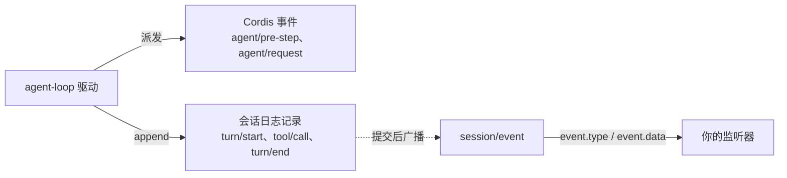
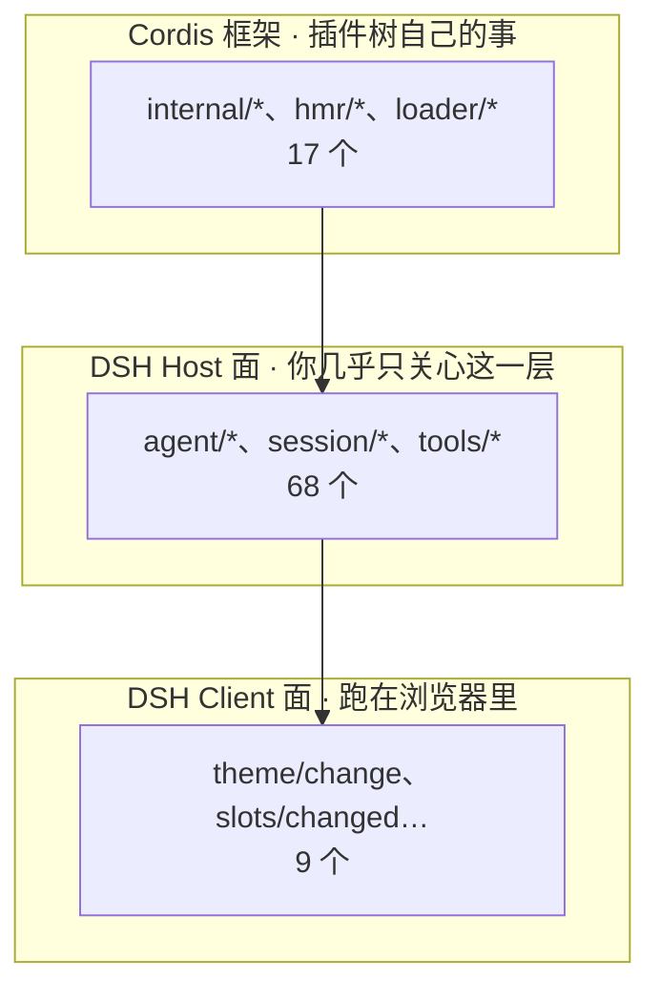

> **读完这篇你能**：说清 DSH 一共有哪些事件、各在什么时刻发出；分辨哪些是 Cordis 事件、哪些只是会话日志记录。
>
> **前置**：[想知道插件里发生了什么](09-想知道插件里发生了什么.md)。约 30 分钟。
>
> **示例代码**：[dsh-event-timeline](https://github.com/anthonyzhao-4926/blog/tree/main/code/dsh_plugin/dsh-event-timeline)

09 篇用三个事件就把计数做出来了：

```ts
ctx.on('tools/execute', async (exec, next) => { /* 量耗时 */ })
ctx.on('tools/result', (exec, result) => { /* 记成功失败 */ })
ctx.on('session/event', (_session, event) => { /* 按 event.type 计数 */ })
```

三个够用，但也容易让人以为事件就这么几个。实际有七十多个，分散在几条生命周期的不同时刻上。这篇把全貌理一遍。

## 目标

- 事件有多少、分成哪几层。
- 哪些名字听着像事件，其实不是。
- 写一个探针插件，把一轮对话的事件按顺序打出来。

## 不响的监听器

先看一个不响的监听器：

```ts
ctx.on('turn/end', () => { console.log('这一轮结束了') })
```

`turn/end` 是从 09 篇的统计结果里抄的，那里面列着它，还带着计数。但它一次都不会响，而**类型检查也不报错**——`ctx.on` 接受任何字符串，注册一个不存在的事件名，编译器和运行时都不吭声。

问题出在身份上。`turn/end` 不是 Cordis 事件，是**会话日志记录**。09 篇那张计数表（`turn/start`、`assistant/message`、`tool/call`……）整张都是记录类型。

两者住的地方不同：



事件是运行期的协调接口，管道模式的还能改结果。记录是已经提交的事实，落到会话文件里，回放和审计都靠它。事件能改，记录不能。

想听记录，入口只有 `session/event`：

```ts
ctx.on('session/event', (_session, event) => {
    if (event.type !== 'turn/end') return
    console.log('这一轮结束了')
})
```

判断一个名字的身份，办法只有一个：去源码里搜 `interface Events`。搜得到的是事件；只在 `SessionEventMap`（`packages/core/session/src/types.ts:276` 往后）里出现的，是记录。

`approval/decided` 也是记录。审批只有一个 waterfall（`approval/request`），"已决定"通过返回值和日志传递。

## 事件的三层

知道有两类身份之后，下一个问题是：真的那一类有多少？

七十多个。它们不平铺，按"谁声明的"分成三层：



最上面那层是 Cordis 框架自己的，管插件树怎么长、怎么收。`internal/plugin` 在插件建立和销毁时各响一次，`internal/dispatch` 在每次派发之前响一次（09 篇排查监听器归属时用过）。这一层不属于 harness，但排查"插件到底装上没有"时，它比任何日志都直接。

底下一层是 Client 面，跑在浏览器里，写界面侧模块才用得上（`theme/change`、`slots/changed`），14、15 篇会碰到。

中间那层才是插件作者的日常，68 个：`agent/*` 有 14 个，管一轮对话；`tools/*` 有 6 个，管工具执行；`session/*` 有 4 个，管会话的建立与落盘；剩下的散在 `system-prompt/*`、`llm/*`、`approval/*`、`subagent/*`、`workflow/*`、`fs/*` 里。

### 事件清单的三种查法

七十多个名字不用背。DSH 把它们生成了三份产物：

| 想干什么 | 看哪儿 |
| --- | --- |
| 一次看全：事件名、分发模式、谁声明、谁派发、谁监听 | `docs/event-producer-consumer.md` |
| 要精确签名、JSDoc、参数含义 | 各包的 `interface Events`，比如 `packages/core/agent/src/runtime-types.ts:246-404` |
| 不想翻仓库，想直接问 | 让模型调 `cordis_inspect`，它读的是生成产物 `api-catalog.ts` |

第一份由 TypeScript 程序生成，生成器对"声明了却没人派发"的事件直接报错，所以不用怀疑某一行是过期残留。

第三份最省事。说一句"用 cordis_inspect 查 `agent/pre-step` 的签名和模式"，模式和参数就出来了。

## 真实事件轨迹

清单回答不了真正关心的问题：**它们什么时候发**。

`agent/pre-step` 和 `agent/request` 谁先谁后？`tools/result` 是执行完立刻发，还是等同一步结束？这些从声明里看不出来。

于是写一个探针插件，只把事件按发生顺序打出来：`code/dsh_plugin/dsh-event-timeline/`。它和 09 篇那个统计插件不同——那个数事件、量耗时、挂路由；这个只按顺序落一行。

装好之后跑一句最简单的任务：

```bash
dsh headless '用 shell 工具执行 node -e "console.log(1+1)"，然后告诉我输出'
```

滤掉噪音（启动时一百多行 `internal/plugin`、落盘检查的 `session/flush`），剩下这一轮的骨架：

```text
+ 106ms  session/created             ← 会话建立
+ 107ms  agent/created    (serial)   ← agent 发布到注册表
+ 107ms  agent/inbox/inserted        ← 任务消息进收件箱
+ 107ms  agent/status  running
+ 108ms  · 记录 turn/start
+ 108ms  agent/inbox/claimed         ← 消息被本 turn 认领
+ 109ms  system-prompt/assemble (waterfall)   ← 拼系统提示
+ 109ms  agent/pre-step 进入    (waterfall)   ← 本 step 准入
+ 135ms  agent/pre-step 出来    → enter
+ 137ms  · 记录 step/start
+ 137ms  agent/request          (waterfall)   ← 冻结本次调用配置
+ 138ms  · 记录 user/message
+ 140ms  llm/stream             (waterfall)   ← 模型开始吐
+1465ms  · 记录 assistant/message             ← 模型说要调工具
+1467ms  · 记录 tool/call
+1468ms  tools/pre-execute      (waterfall)   ← 允许 / 拒绝 / 转审批 → allow
+1468ms  tools/execute 进       (waterfall)   ← 真正执行（包住它）
+1533ms  tools/execute 出
+1533ms  tools/post-execute     (waterfall)   ← 结果被接受 / 改写 / 拦掉
+1534ms  tools/result           (emit)        ← 冻结后的最终结果
+1534ms  · 记录 tool/result
+1534ms  · 记录 step/end
+1535ms  system-prompt/assemble / agent/pre-step / agent/request   ← 第二个 step 重来一遍
+2420ms  · 记录 assistant/message             ← 模型给出最终答复
+2421ms  · 记录 step/end
+2422ms  agent/turn-stopping    (serial)      ← turn 即将关闭
+2422ms  · 记录 turn/end
+2424ms  agent/status  idle
```

（`· 记录` 开头的行来自 `session/event`，是日志记录；其余是 Cordis 事件。）

这张表推翻了几处猜测，挑几段说。

## 会话与 turn 的建立

前四行是会话的诞生：

```text
session/created → agent/created → agent/inbox/inserted → agent/status running
```

`session/created` 先响，会话对象先建好；`agent/created` 随后把 agent 挂进注册表。**它的模式是 `serial`**，源码里声明的却是 `emit`——这是第一处源码与运行时不一致，后面还有一处。

任务消息进来不直接开跑，先 `agent/inbox/inserted` 进收件箱，再由 `agent/inbox/claimed` 被本 turn 认领。收件箱是为"模型正在跑，又追加了一句"准备的：补进来的消息不挤掉当前 step，排队等下一个。

`turn/start` 和 `agent/created` 挤在同一毫秒，看时间戳分不出先后。但它是记录——事件走完"发布 agent"，才轮到它落盘。两类东西混在同一张时间线上，才读得出"建会话 → 发布 agent → 落 turn 开始"的真实顺序。

`agent/session-start` 一次都没出现。源码里有它（`packages/core/agent-loop/src/index.ts:675`），声明还写着"一个会话只响一次"，但 0.2.0-rc.2 的运行时没发。

所以：**源码、文档、机器上跑的东西，可能三个版本三样**。监听器不响时，先怀疑版本。

## step 循环的两道准入

会话建立后进入 turn / step 循环。一轮对话由一个或多个 step 组成，每个 step 是一次"拼提示词 → 问模型 → 执行工具"的往返。

每个 step 开始前先过两关：

```text
system-prompt/assemble (waterfall)   ← 拼系统提示
agent/pre-step          (waterfall)  ← 本 step 准入
```

`system-prompt/assemble` 把系统提示拼出来，`agent/pre-step` 决定这一步进不进。它是 waterfall，`next()` 返回 `{ kind: 'enter', messages }` 或 `{ kind: 'reject' }`。09 篇只把它当广播用，其实它是**唯一能拦住某一步的地方**——返回 reject，这一步就不发生。

轨迹里 `pre-step 进入` 到 `出来` 隔了 26ms。这 26ms 就是所有监听器在跑：探针、压缩插件、时间上下文、skill 注入，都在这一步往消息里塞东西。

准入之后是 `agent/request`，拿到的是已冻结的调用配置（provider、model），可以在这层改。再往下才轮到 `llm/stream` 开始吐字。

然后就是等待。这一轮的第一个 step 里，模型想了大约 1.3 秒才决定调工具——`assistant/message` 那条记录（1465ms）就是这个决定落地的时刻。

## 工具执行的四步管线

执行工具不是一件事，是四步：

```text
tools/pre-execute    ← 批不批（allow / deny / ask）
tools/execute        ← 包住执行本身
tools/post-execute   ← 结果要不要改
tools/result         ← 冻结后的最终结果，只读
```

`pre-execute` 负责准入。12 篇讲拦截用的就是它，返回值 `allow` / `deny` / `ask` 决定这次调用走不走；要问人，它把请求转给 `approval/request`。

`execute` 是唯一包着**真正执行**的那一层。09 篇把耗时统计挂在它上面是对的：轨迹里 1468ms 进、1533ms 出，那 65ms 就是 `node -e` 真正跑掉的时间。

`post-execute` 拿到执行结果，可以接受、改写、甚至拦掉；`result` 是冻结之后的广播，只能看。

四步顺着读，还有个时间上的细节：`tool/call` 这条记录（1467ms）出现在 `tools/pre-execute` **之前**。也就是说 DSH 先把"模型要调这个工具"落了盘，再去走审批和执行——哪怕审批被拒，日志也不缺这一笔。执行完之后，是先派发 `tools/result`（1534ms），再把 `tool/result` 写进日志。

想审计"模型请求了什么"，看记录；想实时干预，听事件。

## 事件的作用域过滤

轨迹里每一行都带着 `this=有作用域`。这个字段解释了另一个问题：为什么 09 篇的统计插件能统计整进程。

大部分 `agent/*` 事件在派发时会带一个**作用域载体**。声明长这样：

```ts
'agent/created'(this: Scoped<Agent>, payload: { agent: Agent }): void
```

`Scoped<Agent>` 的意思是"只发给和这个 agent 有关的监听器"。过滤在派发时进行：载体上有个谓词，逐个问监听器"你注册在哪个作用域里"。有标签的监听器只能收到自己那条线（以及子代理）的事件。

探针插件什么都能收到，因为它不在任何 agent 的作用域里注册——它挂在进程的根上。**没有标签的监听器就是全局监听器**，过滤对它不生效。

要按 agent 分开算，就得进到那个 agent 的作用域里注册监听器，那时只能收到它自己的事件。这是 25、26 篇讲 subagent 和 workflow 的抓手。

另外两个选项：`ctx.on(name, fn, { global: true })` 让带标签的监听器也能收到全部事件；`ctx.on(name, fn, true)` 把它插到最前面——在 waterfall 里"最前面"就是最外层，想否决别人，得先被调用。

## 插件的源码

前面那些结论都出自下面这个插件，`src/index.ts` 全文。它订阅的东西分四类，按这个顺序读：Cordis 内部、agent 生命周期、会话与模型、工具与子流程。

```ts
/**
 * 把 DSH 真实派发过的事件按发生顺序打出来。
 *
 * 这不是"事件清单"，是"事件时刻表"：不聚合、不计数，只在每个事件发生时
 * 落一行，用来看谁在谁之前——也就是生命周期。
 *
 * 本插件没有任何作用域标签（不在任何 agent 的 ctx 里注册），按 scope 的规则会收到
 * 全部 agent 的事件：看到的是整进程。
 *
 * 关于类型：每个事件的名字与参数都由声明它的包登记进 Cordis 的 Events 总表，
 * 所以 ctx.on 的那一刻就有类型。中间那些 interface 只是把 payload 的形状抄出来，
 * 不导出、也不依赖那些包——真要用到完整类型，把声明事件的包（@deepseek-ai/dsh-agent、
 * -llm、-subagent、-workflow）加进 dependencies 即可。
 */
import type { Context } from '@deepseek-ai/cordis'
import type {} from '@deepseek-ai/dsh-session'
import type {} from '@deepseek-ai/dsh-tools'
import type {} from '@deepseek-ai/dsh-user-approval'

export const name = 'dsh-event-timeline'

/** `agent/*` 事件 payload 里带的那个 agent。 */
interface AgentRef {
    readonly id: string
}

/** `agent/status` 的取值。 */
type AgentStatus = 'idle' | 'running'

/** `agent/session-start` 的来源。 */
type SessionStartSource = 'startup' | 'resume' | 'clear' | 'compact'

/** `agent/pre-step` 里 `next()` 的返回值：进入这一步，或者拒绝。 */
type PreStepDecision = { kind: 'reject' } | { kind: 'enter'; messages: unknown[] }

/** `agent/request` 里 `next()` 的返回值：冻结的那次模型调用配置。 */
interface LlmCallConfig {
    provider: string
    model: string
}

/** `subagent/start` / `subagent/end` 的 payload。 */
interface SubagentRunInfo {
    readonly runId: string
    readonly provider: string
    readonly id: string
}

/** `workflow/start` / `workflow/end` 的 payload。 */
interface WorkflowRunInfo {
    readonly id: string
    readonly meta: { readonly name: string }
}

/** `internal/dispatch` 带过来的分发模式。 */
type DispatchMode = 'emit' | 'parallel' | 'serial' | 'bail' | 'waterfall'

/**
 * 只看这些 harness 事件。不加白名单，启动阶段就会被上百条 internal/* 刷屏；
 * system-prompt/change 这类无参广播跟一轮对话的节奏无关，也一并挡在外面。
 */
const WATCHED = new Set([
    'agent/created', 'agent/disposed', 'agent/session-start', 'agent/status',
    'agent/inbox/inserted', 'agent/inbox/claimed', 'agent/inbox/discarded',
    'agent/pre-step', 'agent/request', 'agent/request-error',
    'agent/turn-stopping', 'agent/error',
    'session/created', 'session/disposed', 'session/flush',
    'system-prompt/assemble', 'llm/stream',
    'tools/pre-execute', 'tools/execute', 'tools/post-execute', 'tools/result',
    'approval/request',
    'subagent/start', 'subagent/end',
    'workflow/start', 'workflow/phase', 'workflow/end',
])

/**
 * 会话日志记录类型白名单。
 *
 * 这些**不是** Cordis 事件，是 `session/event` 里 `event.type` 的取值（见
 * `SessionEventMap`）。放在同一张时间线上看，才知道"记录"紧跟在哪个"事件"后面。
 */
const RECORDED = new Set([
    'turn/start', 'turn/end', 'step/start', 'step/end',
    'user/message', 'assistant/message', 'assistant/attempt',
    'tool/call', 'tool/result', 'approval/decided', 'goal/change',
])

export function apply(ctx: Context): void {
    const startedAt = Date.now()

    /** 相对启动的毫秒，右对齐到 6 位，方便竖着扫。 */
    const at = (): string => `+${String(Date.now() - startedAt).padStart(6, ' ')}ms`
    const say = (line: string): void => { console.log(`[${name}] ${at()} ${line}`) }

    // ① 插件树：fiber 建立时 uid 有值，销毁时已被清空 —— 同一个事件名，两种含义。
    ctx.on('internal/plugin', (fiber) => {
        say(`internal/plugin  ${fiber.uid === null ? 'dispose' : 'create '}  ${fiber.name ?? '匿名'}`)
    })

    // 每次派发之前响一次，带 (mode, name, args, thisArg)。
    // 这是排查用的快照钩子，不是 harness 事件，别留在长期代码里。
    ctx.on('internal/dispatch', (mode, eventName, args, thisArg) => {
        if (!WATCHED.has(eventName)) return
        const scope = thisArg === null ? '无（不过滤）' : '有作用域'
        say(`dispatch  ${String(mode as DispatchMode).padEnd(9)} ${eventName}  this=${scope}  args=${args.length}`)
    })

    // ② agent 生命周期。监听器收到的就是 payload；agent 主体在 payload.agent 上。
    ctx.on('agent/created', ({ agent }: { agent: AgentRef }) => {
        say(`→ agent/created        agent=${agent.id}`)
    })
    ctx.on('agent/disposed', ({ agent }: { agent: AgentRef }) => {
        say(`→ agent/disposed       agent=${agent.id}`)
    })
    ctx.on('agent/session-start', ({ agent, source }: { agent: AgentRef; source: SessionStartSource }) => {
        say(`→ agent/session-start  agent=${agent.id} source=${source}`)
    })
    ctx.on('agent/status', ({ agent, status }: { agent: AgentRef; status: AgentStatus }) => {
        say(`→ agent/status         agent=${agent.id} → ${status}`)
    })
    ctx.on('agent/inbox/inserted', ({ agent, message }: { agent: AgentRef; message: { role: string } }) => {
        say(`→ inbox/inserted       agent=${agent.id} role=${message.role}`)
    })
    ctx.on('agent/inbox/claimed', ({ agent, message, turn }: { agent: AgentRef; message: { role: string }; turn: number }) => {
        say(`→ inbox/claimed        agent=${agent.id} turn=${turn} role=${message.role}`)
    })
    ctx.on('agent/inbox/discarded', ({ agent, message }: { agent: AgentRef; message: { role: string } }) => {
        say(`→ inbox/discarded      agent=${agent.id} role=${message.role}`)
    })

    // 管道：包住一次调用，看"前 / 后"两个时刻。必须调 next()；结果原样返回。
    ctx.on('agent/pre-step', async (payload: { turn: number; step: number }, next: () => Promise<PreStepDecision>) => {
        say(`→ pre-step 进入        turn=${payload.turn} step=${payload.step}`)
        const decision = await next()
        say(`→ pre-step 出来        ${decision.kind}`)
        return decision
    })
    ctx.on('agent/request', async (_payload: unknown, next: () => Promise<LlmCallConfig>) => {
        const config = await next()
        say(`→ request              provider=${config.provider} model=${config.model}`)
        return config
    })
    ctx.on('agent/request-error', async (payload: { failure: unknown }, next: () => Promise<unknown>) => {
        say(`→ request-error        ${String(payload.failure)}`)
        return next()
    })
    ctx.on('agent/turn-stopping', ({ turn }: { turn: number }) => {
        say(`→ turn-stopping        turn=${turn}（可在此 steer）`)
    })
    ctx.on('agent/error', ({ error }: { error: unknown }) => {
        say(`→ agent/error          ${String(error)}`)
    })

    // ③ 会话与模型：session/* 是事件；turn/* step/* 要从 session/event 里认。
    ctx.on('session/created', (session) => { say(`■ session/created      ${session.id}`) })
    ctx.on('session/disposed', (session) => { say(`■ session/disposed     ${session.id}`) })
    ctx.on('session/flush', (session) => { say(`■ session/flush        ${session.id}`) })

    ctx.on('session/event', (session, event) => {
        if (!RECORDED.has(event.type)) return
        say(`· 记录 ${event.type.padEnd(18)} ${session.id}`)
    })

    ctx.on('llm/stream', (_options: { model?: string }, next: () => unknown) => {
        say('→ llm/stream           （包住这一次流式调用）')
        return next()
    })

    // ④ 工具与子流程：工具执行是四步管线，不是一步。
    ctx.on('tools/pre-execute', async (exec, next) => {
        const decision = await next()
        say(`▲ tools/pre-execute    ${exec.name} → ${String((decision as { kind?: string }).kind ?? 'ok')}`)
        return decision
    })
    ctx.on('tools/execute', async (exec, next) => {
        say(`▲ tools/execute 进     ${exec.name}`)
        try {
            return await next()
        } finally {
            say(`▲ tools/execute 出     ${exec.name}`)
        }
    })
    ctx.on('tools/post-execute', async (_exec, _result, next) => {
        const decision = await next()
        say('▲ tools/post-execute   （结果被接受 / 改写 / 拦掉）')
        return decision
    })
    ctx.on('tools/result', (exec, result) => {
        say(`▲ tools/result         ${exec.name} ${result.isError ? '失败' : '成功'}`)
    })

    // 审批：返回值即"认领"，不返回就委派给下一个监听器 / 内置行为。
    ctx.on('approval/request', async (_req, next) => {
        say('▲ approval/request     需要人拍板')
        const outcome = await next()
        say(`▲ approval/request 出  ${String(outcome)}`)
        return outcome
    })

    // 子代理与编排：start / end 成对，phase 夹在中间。
    ctx.on('subagent/start', (info: SubagentRunInfo) => { say(`◆ subagent/start       ${info.provider}`) })
    ctx.on('subagent/end', (info: SubagentRunInfo) => { say(`◆ subagent/end         ${info.provider}`) })
    ctx.on('workflow/start', (info: WorkflowRunInfo) => { say(`◆ workflow/start       ${info.meta.name}`) })
    ctx.on('workflow/phase', (_info: WorkflowRunInfo, title: string) => { say(`◆ workflow/phase       ${title}`) })
    ctx.on('workflow/end', (info: WorkflowRunInfo) => { say(`◆ workflow/end         ${info.meta.name}`) })
}
```

写这个插件时有三处值得记下，都是观测类插件的通病：

**白名单要挑，不能贪。** 最初把 `system-prompt/change` 也放了进去，启动阶段就刷了 18 行。它是个无参广播，表示"某个 prompt provider 变了"，跟一轮对话的节奏无关。观测插件最容易犯的错，就是把"能收到"当成"值得打"。

**`internal/plugin` 一条记录有两种含义。** fiber 建立和销毁用同一个事件名，靠 `fiber.uid` 区分：非空是建立，`null` 是销毁。实测那一轮，启动刷了 118 行 `create`、退出刷了 122 行 `dispose`。想知道"插件到底加载成功没有"，盯这一行最快。

**`internal/dispatch` 会把 `parallel` 报成 `emit`。** 这是框架内部的一处疏漏。所以看到 `session/flush` 显示成 `emit` 别当成同步广播——它声明的是 `parallel`（`packages/core/session/src/index.ts:81`），派发时真的在 await 全部监听器。实测那一轮它响了 9 次，因为每次要求"现在落盘"都会检查一遍。

## 安装与验证

探针插件只监听、不注册路由，所以 headless 里也能用。装法和 09 篇一样，只是它自带生成脚本，不用手写路径：

```bash
cd code/dsh_plugin/dsh-event-timeline && ./install.sh test
```

`install.sh` 做三件事：用本机绝对路径生成 `patch.yaml`（所以那个文件不入库）、`pnpm install`、把包加进 profile。生成的 `patch.yaml` 只有一行：

```yaml
- insert:
    - id: dsh-event-timeline
      name: '/绝对路径/code/dsh_plugin/dsh-event-timeline/src/index.ts'
```

装完起 web，事件直接进控制台：

```bash
dsh --profile test --no-open --port 3099
```

不想碰现有 profile，就用一次性的 `DSH_HOME` 跑单次任务：

```bash
DSH_HOME=/tmp/dsh-试一下 dsh headless '用 shell 执行 node -e "console.log(1+1)"，再告诉我输出'
```

`headless` 的规矩是**答案走 stdout、诊断走 stderr**，而插件里 `console.log` 落的也是 stdout——所以上面那条命令，事件轨迹和最终答案会混在一起。想只留事件：

```bash
dsh headless '...' 2>/dev/null | grep dsh-event-timeline
```

## 注意事项

- **同名不同物。** `turn/end`、`tool/call`、`approval/decided`、`step/end` 都是会话日志记录，不是 Cordis 事件。`ctx.on('turn/end', ...)` 永远不会响，而且类型检查抓不到。可靠的判断是去源码里搜 `interface Events`。
- **`agent/session-start` 可能不会响。** 源码里它声明为"一个会话只响一次"（`packages/core/agent-loop/src/index.ts:675`），但实测那条轨迹里它一次都没出现——0.1.5-rc.2 的源码有，0.2.0-rc.2 的运行时没派发。
- **源码、文档、运行版本可能三不一致。** 本篇的行号、清单、"七十多个"这个数，都对着仓库里的 `local/deepseek-harness/`（`package.json` 写着 0.1.5-rc.2）读；本机 `dsh --version` 很可能是别的。已知两处不一致：`agent/created` 源码声明 `emit`、实测按 `serial` 派发；`agent/session-start` 源码有、运行时没有。跨版本时以 `node_modules/@deepseek-ai/*` 的类型声明为准，或者直接问 `cordis_inspect`。
- **`approval/request` 没有配套的"已决定"事件。** 审批只有一个 waterfall，结果通过 `next()` 的返回值和 `approval/decided` 记录传递。09 篇在 `session/event` 里数 `outcome` 就是这个原因。
- **别拿"名字带斜杠"当判据。** 两类东西都用 `namespace/action` 命名，分界线是声明位置。
- **事件是公开契约，模式是契约的一部分。** 一个事件名只有一种分发模式：`emit` 的用 `ctx.emit`，`waterfall` 的必须接 `next`。给自己的插件加事件时，照抄旁边声明的 `@mode` 标签。
- **监听器要短。** `agent/pre-step`、`tools/execute` 都在热路径上。轨迹里 `pre-step` 进入和出来之间那 26ms，是所有监听器的总和。

---

**下一篇**：[让模型用上我自己的功能](11-让模型用上我自己的功能.md)——事件是"知道发生了什么"；要让模型主动用上你自己的功能，下一步是给它一个工具。

事件的官方矩阵在 [docs/event-producer-consumer.md](../local/deepseek-harness/docs/event-producer-consumer.zh.md)；`ctx.on` 的完整选项与五种分发模式的精确语义，见 [Cordis 事件 API](../local/deepseek-harness/docs/cordis-api/events.zh.md)。
