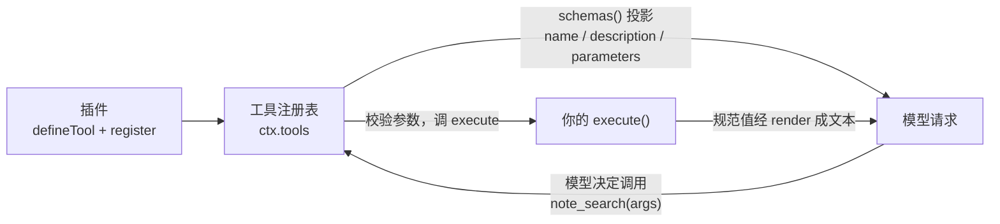

> **读完这篇你能**：给模型注册一个它本来没有的工具——对它说一句「帮我在这堆笔记里找 XX」，它就会调你写的 `note_search`，拿到命中列表再回答你。
>
> **前置**：[事件进阶](10-事件进阶.md)。约 30 分钟。
>
> **示例代码**：[dsh-note-search](https://github.com/anthonyzhao-4926/blog/tree/main/code/dsh_plugin/dsh-note-search)

到目前为止，模型手里的工具全是 DSH 自带的。08 篇把 `web_search` 的源换成了我的笔记，模型确实能搜到笔记了——但那是「借别人的工具」：得等模型自己想去搜公网，它才会顺路查到笔记。我想要的更直接：对它说一句「帮我在这堆笔记里找 XX」，它就调一个专门干这件事的工具。

这样的工具 DSH 没有，得自己写。这篇就写它：一个 `note_search`，按关键词匹配笔记的文件名和正文，返回路径、行号、片段。

## 目标

- 一个 host 插件注册 `note_search` 工具：参数 `{ query, limit? }`，返回命中列表。
- 笔记根目录可配（`Config` 的 `root` 字段，默认 `~/notes`，06 篇的机制）；演示包自带三篇笔记，装上就能跑。
- 全部代码在 `dsh_plugin/dsh-note-search/`，装法与 08/09 篇同一个 test profile。

## 工具的最小形态

模型能调什么，取决于每次请求发给它的**工具清单**。DSH 里这张清单由工具注册表（`ctx.tools`，来自 `@deepseek-ai/dsh-tools`）维护：插件往注册表里登记工具定义，装配下一次模型请求时，注册表把每个可见工具的 `name` / `description` / `parameters` 投影进请求——**模型能看到的只有这三样**，你的实现代码它永远看不到。

登记用 `defineTool` 包一层，再交给 `ctx.tools.register`：



```ts
import type { Context } from '@deepseek-ai/cordis'
import { defineTool } from '@deepseek-ai/dsh-tools'

export const name = 'my-tool'
export const inject = ['tools']

export function apply(ctx: Context) {
    ctx.tools.register(defineTool({
        name: 'greet',
        description: 'Greet someone by name.',
        parameters: {
            name: { type: 'string', required: true, description: 'The name to greet' },
        },
        output: {
            schema: { type: 'string' },
            render: (_args, value) => [{ type: 'text', text: value }],
        },
        async execute(args) {
            return `Hello, ${args.name}!`
        },
    }))
}
```

（这是 DSH 官方教程里的 `greet` 例子，本篇的 `note_search` 是它的放大版。）

一个工具定义有五件东西：

| 字段 | 给谁看 | 作用 |
| --- | --- | --- |
| `name` | 模型 | 工具名，惯例是蛇形（`note_search`、`web_search`） |
| `description` | 模型 | 什么时候该用这个工具、它返回什么 |
| `parameters` | 模型 | 参数 schema，模型照着填 |
| `output` | 注册表 | 声明 `execute` 返回值的 schema，以及怎么把它渲染成模型读的文本 |
| `execute` | 注册表 | 真正干活的函数 |

两个机制先交代清楚：

**`inject = ['tools']` 是必需依赖。** 08 篇见过这种写法：工具注册表不在，插件整体不启动。headless 和 web profile 里都有它，所以同一个插件两边都能跑。

**注册是 effect。** `ctx.tools.register` 和 08 篇的 `registerSearchProvider` 一样，注册落在调用方 fiber 上：插件被 patch 停用或卸载，工具跟着从注册表消失，下一次模型请求的清单里就没有它了。不需要自己写 `ctx.effect` 包一层，也不用维护注销账本。

## 完整代码

```text
dsh-note-search/                  ← 插件包（bundle）
├── src/
│   └── dsh-note-search.ts        ← note_search 工具
├── notes/                        ← 演示用笔记（root 默认指到这里，见「装配」）
│   ├── 缓存一致性.md
│   ├── 九月周会记录.md
│   └── 装修清单.md
├── package.json
├── patch.yaml
├── tsconfig.json
└── install.sh
```

`src/dsh-note-search.ts` 全文：

```ts
/**
 * 给模型一个搜索本地笔记的工具：note_search。
 *
 * 08 篇是把已有工具（web_search）背后的能力换成自己的实现；这个插件做的
 * 是另一件事——注册一个模型本来没有的工具。注册进 ctx.tools 之后，下一次
 * 模型请求的工具清单里就有它，模型按 name / description / parameters 决定
 * 什么时候调、怎么填参数。
 */
import { existsSync } from 'node:fs'
import { readFile, readdir } from 'node:fs/promises'
import { homedir } from 'node:os'
import { extname, join, relative } from 'node:path'
import type { Context } from '@deepseek-ai/cordis'
import Schema from '@deepseek-ai/schemastery'
import { defineTool } from '@deepseek-ai/dsh-tools'

export const name = 'dsh-note-search'

/** 必需依赖：工具注册表不在，本插件就不启动。 */
export const inject = ['tools']

export interface Config {
    /** 笔记根目录；开头是 `~` 时展开成本人主目录。 */
    root: string
}

export const Config: Schema<Config> = Schema.object({
    root: Schema.string().default('~/notes'),
})

const TEXT_EXTENSIONS = new Set(['.md', '.markdown', '.txt'])
/** 一次搜索最多看的文件数，给遍历一个上界。 */
const MAX_FILES = 2000

/** 一条命中：相对路径、1-based 行号（0 表示文件名命中）、那一行的内容。 */
interface Hit {
    path: string
    line: number
    snippet: string
}

/** 展开路径开头的 `~`；配置里写绝对路径时原样返回。 */
function expandHome(path: string): string {
    if (path === '~') return homedir()
    if (path.startsWith('~/')) return join(homedir(), path.slice(2))
    return path
}

/** 列出 root 下所有像笔记的文件，跳过点开头的目录（.git、.obsidian 之类）。 */
async function collectFiles(root: string): Promise<string[]> {
    const found: string[] = []
    const queue = [root]
    while (queue.length > 0 && found.length < MAX_FILES) {
        const dir = queue.shift() as string
        let entries
        try {
            entries = await readdir(dir, { withFileTypes: true })
        } catch {
            continue
        }
        for (const entry of entries) {
            if (entry.name.startsWith('.')) continue
            const full = join(dir, entry.name)
            if (entry.isDirectory()) queue.push(full)
            else if (TEXT_EXTENSIONS.has(extname(entry.name).toLowerCase())) found.push(full)
        }
    }
    return found
}

/** 在 root 里找所有包含 query 的行（大小写不敏感），文件名本身也算一个可命中的单位。 */
async function search(root: string, query: string, signal: AbortSignal): Promise<Hit[]> {
    const hits: Hit[] = []
    const needle = query.toLowerCase()
    for (const path of await collectFiles(root)) {
        // 用户点停止时 signal 会被中止：每读一篇查一次，别把已经没人要的结果做完
        signal.throwIfAborted()
        const relativePath = relative(root, path)
        if (relativePath.toLowerCase().includes(needle)) {
            hits.push({ path: relativePath, line: 0, snippet: relativePath })
        }
        const lines = (await readFile(path, 'utf8')).split('\n')
        lines.forEach((text, index) => {
            if (text.toLowerCase().includes(needle)) {
                hits.push({ path: relativePath, line: index + 1, snippet: text.trim() })
            }
        })
    }
    return hits
}

/** 把规范值排成模型读的文本：一行一条命中，结尾交代总数与截断。 */
function formatHits(value: { hits: Hit[]; total: number }): string {
    if (value.total === 0) return '笔记里没有命中。'
    const lines = value.hits.map(hit => hit.line === 0
        ? `- ${hit.path}（文件名命中）`
        : `- ${hit.path}:${hit.line} — ${hit.snippet}`)
    const suffix = value.total > value.hits.length
        ? `\n\n（共 ${value.total} 条命中，只显示了前 ${value.hits.length} 条。调大 limit 或换个更精确的关键词可以看到更多。）`
        : ''
    return `${lines.join('\n')}${suffix}`
}

export function apply(ctx: Context, config: Config): void {
    const root = expandHome(config.root)
    ctx.tools.register(defineTool({
        name: 'note_search',
        description: '在本地的 Markdown / 纯文本笔记里按关键词检索，文件名和正文都会匹配。返回命中行的路径、行号和内容片段。',
        parameters: {
            query: { type: 'string', required: true, description: '要检索的关键词，大小写不敏感。' },
            limit: { type: 'integer', description: '最多返回多少条命中，默认 5。' },
        },
        output: {
            schema: {
                type: 'object',
                additionalProperties: false,
                properties: {
                    hits: {
                        type: 'array',
                        required: true,
                        items: {
                            type: 'object',
                            additionalProperties: false,
                            properties: {
                                path: { type: 'string', required: true },
                                line: { type: 'integer', required: true },
                                snippet: { type: 'string', required: true },
                            },
                        },
                    },
                    total: { type: 'integer', required: true },
                },
            },
            render: (_args, value) => [{ type: 'text', text: formatHits(value) }],
            // 命中列表投影进 tool/result 的 meta 落盘，界面卡片从 meta 取回它（见「界面上的样子」）
            presentationMeta: (_args, value) => ({ hits: value.hits }),
        },
        // 只读检索，不改任何共享状态：允许和同一批里的其他工具调用并行。
        isConcurrencySafe: () => true,
        async execute(args, exec) {
            // schema DSL 表达不了的约束（非空、正数）在函数体里自己查；抛出的
            // Error 会变成这次调用的 isError 结果，消息原文发给模型。
            const query = args.query.trim()
            if (query.length === 0) throw new Error('query 不能为空字符串')
            const limit = args.limit ?? 5
            if (limit < 1) throw new Error('limit 必须是正整数')
            if (!existsSync(root)) throw new Error(`笔记根目录不存在：${root}`)
            const hits = await search(root, query, exec.signal)
            return { hits: hits.slice(0, limit), total: hits.length }
        },
        presentCall: args => ({ card: 'generic', title: args.query, kind: 'search' }),
    }))
    console.log(`[${name}] note_search 已注册（root=${root}）`)
}
```

遍历文件的 `collectFiles` 和 08 篇那个是同一份写法；`Config` 是 06 篇的机制，`root` 没配就用 `~/notes`。新的部分只有工具定义本身，下面分三节讲：参数、结果、以及 `presentCall` 那一行。

## 参数与描述

`parameters` 用的是 DSH 自己的一套 schema 声明写法（不是裸 JSON Schema，但子集对应）：每个属性一个节点，`type` 可以是 `string` / `number` / `integer` / `boolean` / `array` / `object` 等，**必填是逐属性标 `required: true`**——没标的 `limit` 就是可选参数。

模型怎么用这份声明，决定了怎么写它：

**`description` 是模型选择的唯一依据。** 模型决定「要不要调 `note_search`」时，读的是工具列表里的名字和描述；决定「`query` 填什么」时，读的是参数的 `description`。所以描述要回答两个问题：什么时候用（「在本地的 Markdown / 纯文本笔记里按关键词检索」）、返回什么（「返回命中行的路径、行号和内容片段」）。只写「搜索笔记」，模型分不清它和 `web_search` 该用哪个——尤其 08 篇之后你的 `web_search` 也能查笔记，两个工具的描述更要把分工说开。

**校验是 `defineTool` 做的，不用自己写。** 模型填的参数在进 `execute` 之前就按 schema 验过了：类型不对、缺了必填键，这次调用直接以 `INVALID_ARGS` 失败，错误文本发回模型，它自己会修正了重试。所以 `execute` 里的 `args` 类型是从 schema 推出来的（`query: string`、`limit?: number`），不是 `unknown`。

**schema 的 `default` 只是注解，不会真的填值。** 这套写法里 `default` 不参与校验也不参与填参，模型没给 `limit`，`args.limit` 就是 `undefined`。所以默认值在 `execute` 里兜底：`args.limit ?? 5`。「默认 5」这件事同时写在参数的 `description` 里，模型想多要时知道可以传。

**DSL 表达不了的约束，在函数体里查了抛错。** 「非空字符串」「正整数」这类约束 schema 说不出来，就在 `execute` 开头自己判断，不满足就 `throw new Error(...)`。抛错不是插件崩了——它是工具结果的一种正常形态，下一节讲。

## 结果的形态

`execute` 返回的不是直接给模型看的文本，而是一个**规范值**（canonical value）：一个普通 JSON 对象，结构由 `output.schema` 声明。注册表拿到它之后做三件事：按 `output.schema` 校验、冻结、然后交给 `output.render(args, value)` 投影成模型读的内容块（`[{ type: 'text', text: ... }]`）。

这么拆的原因是「程序用的结构」和「模型读的文本」是两种东西。规范值里 `hits` 是数组、`line` 是数字，字段各归各；模型读的则是一段排好版的文本。`render` 就是那个从结构到文本的纯函数，`note_search` 里是 `formatHits`：一行一条命中，被 `limit` 截断时在结尾交代总数。

加上失败，一次调用有三种结局：

| 结局 | 怎么发生 | 模型看到什么 |
| --- | --- | --- |
| 成功 | `execute` 返回的值通过 `output.schema` 校验 | `render` 投影出的文本 |
| 参数失败 | 模型填的参数不过 `parameters` 校验（`defineTool` 代查） | `INVALID_ARGS` 错误文本 |
| 执行失败 | `execute` 抛错，或返回值不过 `output.schema` | `isError` 结果，带上 `Error.message` 原文 |

第三条值得展开：**在 `execute` 里抛错是合法的返回方式。** 注册表会把异常兜成这次调用的 `isError` 结果，消息原文发给模型——模型读得懂「笔记根目录不存在：/xxx」，下一轮它会换个问法或者告诉你环境有问题。所以错误消息要写成给人读的句子，不要只抛一个码。反过来，「没搜到」不是失败：那是成功的领域结果，`hits` 为空、`total` 为 0，`render` 输出「笔记里没有命中。」——把正常空结果做成报错，模型会以为自己调错了。

还有一个不在表里的事实：**规范值不落盘。** 会话记录（09 篇的 `tool/result`）里存的是 `render` 后的 `content`、失败时的 `error`，以及可选的 `meta`（见「界面上的样子」）；`value` 只在执行期间存在。所以别让模型依赖「下次还能拿到这个对象」——它下次看到的是文本。

最后说 `exec`。`execute(args, exec)` 的第二个参数带着这次调用的身份和取消信号 `exec.signal`：用户在界面上点了停止，这个 signal 就会被中止。`search()` 每读一篇笔记查一次 `signal.throwIfAborted()`，被停就抛出去，剩下的文件不再读——和 08 篇 provider 里的约定是同一条：信号要一路传到底，别做完已经没人要的活。

## 长任务的后台执行

`note_search` 是有界的快操作（最多 2000 个文件，内存里过一遍），前台跑完就行。但不是所有工具都这样：跑一个构建、处理一批文件，可能要几分钟。前台调用一直占着这一轮对话，超时还会被杀——这种活 DSH 的规矩是**走后台任务**。

机制在 `ctx.jobs`（`@deepseek-ai/dsh-jobs`，任务注册表）和 `@deepseek-ai/dsh-tool-jobs`（模型侧的控制工具）两个包里。生产方（你的工具）在 `execute` 里不干活，而是把活登记成一个任务：

```ts
// 骨架，不是本篇 demo 的一部分
const jobId = ctx.jobs.start({
    kind: 'note-index',          // 任务种类，也是 id 前缀（note-index-1、note-index-2…）
    label: `索引 ${root}`,        // 一行给人看的说明
    ...exec.agent ? { owner: exec.agent.id } : {},  // 归属会话；它的 agent 销毁时任务跟着取消
    run: (job) => {
        // 在这里真正开始干活；job.append() 往输出里写，job.updateProgress() 更新进度行
        const controller = new AbortController()
        const done = doWork(controller.signal, job)  // 返回 Promise<JobOutcome>，不允许 reject
        return { cancel: () => controller.abort(), done }
    },
})
return { kind: 'background', jobId }  // 规范值：一个句柄，不是结果
```

`start` 一返回，`execute` 就带着 `{ kind: 'background', jobId }` 结束，这一轮对话立刻继续。之后模型用 `dsh-tool-jobs` 提供的三个通用工具跟任务打交道：`job_output` 读输出（可以等它跑完）、`job_list` 列任务、`job_kill` 终止。任务跑完时，完成通知会被送回归属的 agent——模型不用轮询也知道活干完了。

两条硬性约定：

- **后台分支要由配置门控。** `tool-bash` 的做法是 `enableRunInBackground` 配置（默认开）：部署方可以关掉它，关掉后模型连 `run_in_background` 参数都看不到，填了也会被拒绝。门控的原因是后台任务会脱离这一轮对话存活，部署方要有权不许它存在。
- **`start` 成功之后，取消就归任务管了。** 前台活的命拴在 `exec.signal` 上；后台任务一旦登记，外层调用被取消只是「不等了」，不会杀任务——杀它是 `job_kill`、归属 agent 销毁、或服务关停的事。所以 `run` 里要用自己的 `AbortController`，别再挂 `exec.signal`。

`tool-bash` 是这套机制的完整范本（它的前台调用其实也登记成任务，只是原地等它结束），真要给工具加后台分支时去读 `packages/shell/tool-bash/src/`。

## 界面上的样子

工具结果在对话里是一张卡片。这张卡片长什么样，工具可以在定义里**声明**——就是 `presentCall` 和 `presentResult` 两个可选方法，它们返回一个带 `card` 标签的「渲染意图」，由界面去兑现：

| `card` | 用在哪 | 例子 |
| --- | --- | --- |
| `generic` | 默认卡片：标题 + 内容 | 大多数工具 |
| `terminal` | 这次调用就是一条命令 | `bash` |
| `diff` | 这次调用创建/修改了文件 | `write` / `edit` |
| `read` | 结果是一个文件窗口 | `read` |
| `search` | 结果是按文件分组的命中或路径列表 | `grep` / `glob` |
| `web` | 结果是一次网页检索/抓取 | `web_search` / `web_fetch` |

`presentCall(args)` 管**进行中**的卡片，`presentResult(args, result)` 管**完成后**的卡片；都不写，界面就退回通用卡片（标题是工具名，内容是原始参数和结果文本）。`note_search` 只声明了 `presentCall`：调用进行中显示一张 `generic` 卡片，标题是关键词，`kind: 'search'` 让界面配一个搜索图标。完成后的卡片没声明——`render` 出的文本直接进通用卡片，对这个工具够用了。

`output` 里还有一行 `presentationMeta`：它把命中列表从规范值投影成一份可回放的 JSON，随 `tool/result` 落盘。现在没有消费者，留着是因为第 15 篇要给这个结果做真正的卡片，卡片的数据就从这份 `meta` 来。

两条规矩：

- **这两个方法必须是纯函数。** 它们在直播和会话回放时都会跑，只能依赖传进来的 `args` 和 `result`——不能读盘、读时钟、读会话状态。想在卡片上展示结果时刻才知道的数据（比如「这次命中的结构化列表」），走 `output.presentationMeta(args, value)`：它从规范值投影出一份可回放的 JSON，随 `tool/result` 落盘，`presentResult` 从 `result.meta` 里取回来。
- **声明归声明，渲染归渲染。** 这里返回的只是「我想要一张 search 卡片」这个意图，不 import 任何界面代码。Web 客户端里真正把它画成 React 卡片是另一套注册（按工具名认领），那是第 15 篇的事。

## 装配

`package.json` 比 09 篇少几个依赖——只用 `import type` 的包不用列，这里真正在运行时 import 的是 `defineTool` 和 `Schema`：

```json
{
  "name": "dsh-note-search",
  "version": "0.1.0",
  "private": true,
  "type": "module",
  "dsh": { "bundle": { "patch": "./patch.yaml" } },
  "dependencies": {
    "@deepseek-ai/cordis": "^4.0.1",
    "@deepseek-ai/dsh-tools": "^0.1.7-rc.1",
    "@deepseek-ai/schemastery": "^3.18.2"
  }
}
```

`patch.yaml` 插一行（插件路径写绝对路径，`install.sh` 会按本机位置重新生成这个文件）：

```yaml
- insert:
    - id: dsh-note-search
      name: '/绝对路径/dsh-note-search/src/dsh-note-search.ts'
```

`root` 的配置写在 profile 覆盖层里。`install.sh` 会往 `~/.dsh/profiles/test/cordis.patch.yml`（和 headless 的同名文件）**追加**下面这块——已有同 id 的块就跳过，文件里 08 篇留下的换源配置原样不动：

```yaml
# dsh-note-search：演示用笔记目录（10 篇）
- id: dsh-note-search
  config:
    root: '/绝对路径/dsh-note-search/notes'
```

指向演示包自带的 `notes/`，装上就有三篇笔记可搜；真要用起来，把这一处改成你的笔记目录（或者干脆删掉这块，用默认的 `~/notes`）。装：

```bash
cd dsh_plugin/dsh-note-search && ./install.sh
```

## 验证

装配层：

```bash
dsh --profile test --dump-config | grep -A3 'id: dsh-note-search'
```

```yaml
# == dsh-note-search
- id: dsh-note-search
  name: >-
    file:///绝对路径/dsh-note-search/src/dsh-note-search.ts
```

不看界面、直接让模型跑一句（headless profile 里也装了同一个插件）：

```bash
dsh --profile headless "用 note_search 在我的笔记里找「缓存」，告诉我当时定的结论是什么"
```

模型会调一次 `note_search`，参数大概是 `{"query": "缓存"}`。它收到的工具结果就是 `formatHits` 排出来的那段文本（对演示包自带的三篇笔记，内容是这个样子）：

```text
- 缓存一致性.md（文件名命中）
- 缓存一致性.md:1 — # 缓存一致性笔记
- 缓存一致性.md:3 — 九月那次会定的结论：缓存一律走「写穿透 + 短 TTL」，不做主动失效。
- 九月周会记录.md:3 — - 缓存方案定稿，细节见《缓存一致性笔记》
```

然后它用这段话回答你。09 篇的统计插件如果还装着，终端里会多一行 `[dsh-event-stats] note_search 成功 …ms`——`tools/result` 对我们注册的工具一样响，统计插件根本不认识 `note_search`，却已经在数它了。这就是「注册进注册表」的含义：从装配、策略、事件到 UI，整条管线对自带工具和第三方工具不加区分。

web profile 里验证的是另一头：启动 `dsh web`，在界面上说同一句话，调用进行中能看到标题为「缓存」的卡片（`presentCall` 声明的那张），完成后卡片里是上面那段文本。

再试一次失败路径，确认错误消息真的到了模型手里：

```bash
dsh --profile headless "用 note_search 找「缓存」，limit 传 0"
```

模型第一次调用会收到 `limit 必须是正整数` 的 `isError` 结果——然后它多半会自己改成 5 重试一次。你什么都没做，纠错发生在模型那一侧，因为错误消息写得能读懂。

## 注意事项

- **模型只看得到 `name` / `description` / `parameters`。** `execute`、`output`、各种 presenter 永远不会进模型请求。所以「这个工具什么时候用、返回什么」必须在这三样里说完；代码注释写得再好，模型也不知道。
- **工具名全局唯一。** 和同一层里已有的工具重名，注册直接失败。起名前可以先翻 `docs/tool-catalog.md` 里已有的名字。
- **`execute` 里别返回内容块。** 返回值必须过 `output.schema`——想过不了校验的结构，结果就是 `isError`（`INVALID_TOOL_OUTPUT`）。给模型看的排版全部放在 `render` 里。
- **空结果不是错误。** 「没命中」走成功路径（`hits: []`），让 `render` 说一句「没有命中」；只有「这次调用本身不成立」（参数非法、根目录不存在）才抛错。模型对两种结局的应对完全不同：前者换个关键词，后者怀疑自己用错了工具。
- **注册随插件卸载消失。** 在 `cordis.patch.yml` 里把 `dsh-note-search` 那行 `disabled: true`，保存后下一轮模型请求的清单里就没有 `note_search` 了——模型会立刻退回「没有工具可用」的行为，不会报一个「工具失踪」的错。排查「模型怎么不用我的工具了」时先想这一步。
- **presenter 必须是纯函数。** `presentCall` / `presentResult` 在直播和回放时都跑，读盘、读时钟、读会话状态都会让回放和直播不一致。要结果时刻的数据，用 `presentationMeta` 落盘后再从 `result.meta` 取。
- **改工具源码要重启。** 配置热重载管不到 `.ts` 源码；07 篇的源码热重载（`hmr` 行）可以管，默认是关的。

---

**下一篇**：[拦住模型乱来](12-拦住模型乱来.md)——工具注册得越多，模型能做的事越多；在执行前把危险调用拦下来，用的是工具管线的四个拦截点。
