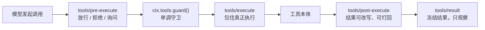

> **读完这篇你能**：在工具执行前拦下危险调用——写出工作区的文件、`rm -rf /` 这类命令——并把拒绝理由递到模型眼前；同时弄清工具执行管线上的几个拦截点各自适合什么。
>
> **前置**：[让模型用上我自己的功能](11-让模型用上我自己的功能.md)。约 25 分钟。
>
> **示例代码**：[dsh-tool-guard](https://github.com/anthonyzhao-4926/blog/tree/main/code/dsh_plugin/dsh-tool-guard)

10 篇给模型装了工具。`note_search` 只读笔记目录，没什么破坏力；但 `bash` 能跑任何命令、`write` 能写任何路径——模型跑起危险命令、写到不该写的目录，09 篇的统计只能事后记一笔。这篇要做的是事前的：执行之前拦下来。

拦不需要改模型，也不用改工具。DSH 的每一次工具调用都走同一条执行管线，管线上留着几个拦截点，挂一个插件进去就行。

## 目标

- 一个守卫插件 `dsh-tool-guard`，拦两类调用：`write` / `edit` 写到工作区之外的路径；`bash` 里的危险命令（`sudo`、`rm -rf /` 之类）。
- 拦截时给出**给模型看的理由**——它收到理由后会自己换做法，而不是只看到一句"失败了"。
- 弄清管线上每个拦截点的分工，以及权限、沙箱、审批这三个内置机制各挂在哪。

全部代码在 `dsh_plugin/dsh-tool-guard/`，装法与前几篇同一个 test profile。

## 工具执行管线

每次工具调用从模型发出到结果落盘，依次经过这些阶段（`docs/subsystems/tools.md`）：



其中能"拦"的有四个点：

| 拦截点 | 形态 | 能做什么 | 谁在用 |
| --- | --- | --- | --- |
| `tools/pre-execute` | waterfall 事件 | 返回 `PreToolDecision`：放行、拒绝、取消、询问 | 权限门禁、Claude Code / Codex hooks |
| `ctx.tools.guard()` | 同步函数，不是事件 | 返回理由即最终拒绝 | 部署方的不变式 |
| `tools/execute` | waterfall 事件 | 包住执行；不调 `next()` 调用就不会发生 | 超时（`timeout-policy`）、重试、指标 |
| `tools/post-execute` | waterfall 事件 | 接受、改写、带反馈打回结果 | 重复调用提醒（`repeat-tool-reminder`） |

`tools/result` 不在表里：它是广播，结果已经冻结，只能观察——09 篇的统计用的就是它。

waterfall 的语义（`next()`、否决、短路）09 篇讲过，本篇不重复。要决定的是：**你的拦截该挂在哪个点上**。本篇的需求——"这两类调用永远不许执行"——是一个不变式，答案是 `ctx.tools.guard()`。为什么不是 pre-execute，讲完这两个点本身再回答。

## 决策类型 `PreToolDecision`

`tools/pre-execute` 是管线的第一道门：一个 waterfall 事件，监听器拿到 `(exec, next)`，返回一个 `PreToolDecision`（`packages/core/tools/src/index.ts`）：

```ts
type PreToolDecision =
  | { kind: 'allow' }                                                      // 放行
  | { kind: 'deny'; reason: string; info?: ToolErrorInfo }                 // 拒绝，reason 给模型看
  | { kind: 'cancel' }                                                     // 取消，不算策略拒绝
  | { kind: 'ask'; reason?: string; displayReason?: { en: string; ... } }  // 先问人，批了才执行
```

一个最小的权限门禁长这样（`docs/cookbook/extension-cookbook.md` 里的例子）：

```ts
export function apply(ctx: Context) {
  ctx.on('tools/pre-execute', async (exec, next): Promise<PreToolDecision> => {
    if (!(await isAllowed(exec))) {
      return { kind: 'deny', reason: 'Denied by policy.' }
    }
    return next()
  })
}
```

两个特征决定了它适合什么：

- **可以异步。** 监听器是 `async` 的，能读磁盘、发请求、等人回答——`ask` 这个取值就是为"等"准备的。
- **结论受顺序影响。** 它是普通事件，后注册的监听器可以把下游传回来的决定换掉。灵活，但意味着**注册顺序能改变结论**。

`deny` 的 `reason` 会变成模型看到的工具失败内容（`Error: <reason>`），所以理由要写给模型看。

## 单调守卫 `ctx.tools.guard()`

`ctx.tools.guard()` 不是事件，是 `ctx.tools` 服务上的一个方法（`packages/core/tools/src/index.ts`）：

```ts
guard(guard: ToolGuard): () => void

type ToolGuard = (execution: Readonly<ToolExecution>) => string | undefined
```

传一个同步函数进去：返回一个字符串就是拒绝这次调用，返回 `undefined` 就是"我没意见"。它排在**整个 pre-execute 瀑布之后**、真正执行之前——pre-execute 放行的调用，还要过所有 guard；pre-execute 已经拒掉的调用不再过它。

它和 pre-execute 的差别就一条，但这条是硬约束：**guard 没有"允许"这个返回值**。它能拒绝、能弃权，永远不能把一个调用从"被拒"翻回"放行"——这就是单调不变式：只能收紧，不能放宽。pre-execute 里后注册的监听器可以推翻前面的结论；guard 里不存在这个维度，注册顺序不影响结果，任何一个 guard 说"不"，这次调用就死了。

代价是同步：guard 里不能 `await`。需要等什么的决定（比如问人）不属于这里，回 pre-execute 用 `ask`。

所以本篇的需求挂 guard 而不是 pre-execute："写出工作区"和"跑 `rm -rf /`"不是策略，是不变式——我不希望任何一个后注册的插件（包括自己哪天手滑写的）能把它推翻。

另外两个事实：

- **作用域。** 裸 `ctx` 上注册的 guard 全局生效；通过某个 agent 的 `agent.ctx` 注册，只管那个 agent。
- **归属。** `guard()` 和 `ctx.on` 一样，注册本身就是一次 effect：插件卸载、重载、被 patch 停用时守卫自动摘掉，返回的注销函数一般用不上。

## 执行与结果的拦截点

表里的后两个点本篇的 demo 用不上，但各自有明确的用途，各给一个仓库里的现成例子。

**`tools/execute` 包住真正执行。** 监听器拿到 `(exec, next)`，`next()` 的返回值就是这次调用的结果。09 篇用它量过时长；内置的 `timeout-policy`（`packages/guard/timeout-policy/`）用它实现超时：给声明了 `timeoutMs` 的工具武装一个 deadline，超时就替换成一个 `TOOL_TIMEOUT` 的失败结果。不调 `next()` 调用就不会发生，所以这个点也能拦——但它的语义是"包装"，拦是副作用，不是本职。

**`tools/post-execute` 处理结果。** 监听器拿到 `(exec, result, next)`，可以接受、改写，或者 `block`——把结果打回成一个带着纠正反馈的 `isError`。内置的 `repeat-tool-reminder`（`packages/guard/repeat-tool-reminder/`）在这个点上检测"同一个调用连着来好几次"，往结果上附一段提醒。注意执行已经发生了：这个点拦的是"结果怎么回到模型那里"，不是"事情做没做"。

## 权限、沙箱、审批的挂点

DSH 自带的三个相关机制，挂在管线的不同位置：

| 机制 | 挂在哪 | 干什么 |
| --- | --- | --- |
| 权限门禁 | `tools/pre-execute` 监听器 | 放行 / 拒绝 / 转询问的策略层；`hooks-claude-code` 的 `PreToolUse` 也映射到这里 |
| 审批 | pre-execute 返回 `ask` → tools 运行时调 `ctx.approval.request()`；回答方挂在 `approval/request` 瀑布上（UI 提供） | 把人拉进这一次调用的决定里 |
| 沙箱 | 不在管线事件上，在执行器内部 | `bash-sandbox` 用 `ctx.sandbox.confine()` 包住 argv；`write` / `edit` 把每次调用的沙箱策略传给 fs 后端，由后端把写围在工作区里 |

审批这条线值得说一句边界：pre-execute 的监听器只负责说"这个要问人"（返回 `ask`），怎么问、谁来答是审批服务的事；没人能答（比如 headless 里没有审批通道）就 fail-closed 处理成拒绝——09 篇统计里那个 `unavailable` 就是这么来的。让人拍板的一整套（`ApprovalRequest`、answerer 契约、会话级策略）是第 21 篇的题目，这里只需要知道它挂在哪。

沙箱是另一个方向：它不管"该不该"，管"能不能"——就算管线全放行，`workspace-write` 模式下被围住的进程也写不出工作区。模式来自会话的 `sandbox/mode` 记录和部署默认；`permission-presets` 把沙箱模式和审批策略两个旋钮打包成一个选择器，本身不执行任何策略。

本篇的 guard 和沙箱是互补的：沙箱是系统边界，guard 是策略层——哪怕哪天沙箱模式被切成 `danger-full-access`，guard 说不的行还是不行。

## 守卫插件

`src/dsh-tool-guard.ts` 全文：

```ts
/**
 * 工具守卫：在执行前拦下两类调用——
 *   1. write / edit 把文件写到工作区之外；
 *   2. bash 里的危险命令（sudo、rm -rf / 之类）。
 *
 * 拦截点是 `ctx.tools.guard()`：同步、单调——返回一个字符串就是最终拒绝，
 * 没有任何监听器顺序能把它翻回允许。这个字符串会成为模型看到的工具失败
 * 原因（`Error: <理由>`），所以理由要写给模型看：哪里错了、正确的做法
 * 是什么。
 *
 * @module dsh-tool-guard
 */
import nodePath from 'node:path'
import type { Context } from '@deepseek-ai/cordis'
import type { ToolExecution } from '@deepseek-ai/dsh-tools'

export const name = 'dsh-tool-guard'

// guard 挂在 ctx.tools 上，tools 是硬依赖：没有它这个插件没有意义。
export const inject = ['tools']

/**
 * 危险 bash 命令的黑名单：模式 + 给模型看的理由。
 * 这是演示用的最小集合，不是完备的安全边界（见文章「注意事项」）。
 */
const DANGEROUS_COMMANDS: readonly { pattern: RegExp; reason: string }[] = [
    {
        pattern: /\bsudo\b/,
        reason: '命令包含 sudo：提权操作不被允许。请改用不需要 root 权限的做法；确实需要时，把命令告诉我，由我自己执行。',
    },
    {
        pattern: /\brm\s+-[a-zA-Z]*r[a-zA-Z]*\s+\/(\s|$)/,
        reason: '这条 rm 以根目录 / 为目标：递归删除会毁掉整台机器。请把目标改成工作区内的具体路径。',
    },
    {
        pattern: /\b(mkfs|fdisk)\b|\bdd\b[^|;&]*\bof=\/dev\//,
        reason: '这条命令直接操作磁盘设备或分区，可能造成不可逆的数据丢失，一律拒绝。',
    },
    {
        pattern: /\b(shutdown|reboot|halt|poweroff)\b/,
        reason: '关机 / 重启不在你的权限范围内。请继续完成手头的任务。',
    },
]

export function apply(ctx: Context): void {
    // guard() 和 ctx.on 一样，注册本身就是一次 effect：插件卸载、重载、
    // 被 patch 停用时守卫跟着摘掉，不用自己记账。
    ctx.tools.guard(exec => checkWritePath(exec) ?? checkBashCommand(exec))
    console.log(`[${name}] 守卫已就位：工作区外写入、危险 bash 命令`)
}

/** 写文件类工具的路径检查：解析后的绝对路径必须落在工作区里。 */
function checkWritePath(exec: Readonly<ToolExecution>): string | undefined {
    if (exec.name !== 'write' && exec.name !== 'edit') return undefined
    const filePath = stringArg(exec.arguments, 'file_path')
    if (filePath === undefined) return undefined
    const root = workspaceRoot(exec)
    const resolved = nodePath.resolve(root, filePath)
    if (resolved === root || resolved.startsWith(root + nodePath.sep)) return undefined
    return `路径 ${filePath} 在工作区（${root}）之外。请把文件写到工作区内部；确实需要写外部路径时，先向我说明原因。`
}

/** bash 命令检查：命中黑名单就拒绝，理由写给模型看。 */
function checkBashCommand(exec: Readonly<ToolExecution>): string | undefined {
    if (exec.name !== 'bash') return undefined
    const command = stringArg(exec.arguments, 'command')
    if (command === undefined) return undefined
    for (const { pattern, reason } of DANGEROUS_COMMANDS) {
        if (pattern.test(command)) return reason
    }
    return undefined
}

/** 这次调用的工作区根：会话的 cwd；拿不到（无 agent 的调用）就退到进程 cwd。 */
function workspaceRoot(exec: Readonly<ToolExecution>): string {
    return exec.agent?.session.header.cwd ?? process.cwd()
}

/**
 * 从模型给的参数里取一个字符串字段。guard 跑在工具自己的参数校验之前，
 * arguments 是不可信的 JSON：不是对象、字段不是字符串，都当没看见，
 * 留给工具自己的校验去报错。
 */
function stringArg(args: unknown, key: string): string | undefined {
    if (typeof args !== 'object' || args === null) return undefined
    const value = (args as Record<string, unknown>)[key]
    return typeof value === 'string' ? value : undefined
}
```

几处要说明：

**理由写给模型看。** guard 返回的字符串会变成 `Error: <理由>` 出现在工具结果里，模型下一轮就读到它。所以每条理由都写清两件事：哪里错了（"路径在工作区之外"）、正确的做法是什么（"写到工作区内部"）。模型拿到这种理由会自己换路径重试，而不是反复撞同一堵墙。

**`arguments` 不可信。** guard 跑在工具自己的参数校验之前，`exec.arguments` 是模型给的原始 JSON：可能不是对象，字段可能不是字符串。`stringArg` 把"取不出字符串"统一当成"我没意见"，留给工具自己的校验去报错——guard 只管自己看得懂的情况。

**工作区根从会话拿。** `exec.agent?.session.header.cwd` 是这个会话的工作目录，也就是"工作区之内"的边界；拿不到的调用（没有 agent 的）退到进程 cwd。路径用 `nodePath.resolve` 解析成绝对路径再比前缀，`../..` 这种相对逃逸自然被解开。

**两个检查用 `??` 串起来。** 每个检查只认自己管的工具，不认的就返回 `undefined` 弃权；两个都弃权，这次调用照常执行。

## 装配

```text
dsh-tool-guard/                   ← 插件包（bundle）
├── src/
│   └── dsh-tool-guard.ts         ← 守卫插件
├── package.json
├── patch.yaml
├── tsconfig.json
└── install.sh
```

`package.json` 的依赖只有两个：`@deepseek-ai/cordis` 和 `@deepseek-ai/dsh-tools`（后者只 `import type`，运行时被剥掉）。

本包的 `patch.yaml` 插一行：

```yaml
- insert:
    - id: dsh-tool-guard
      name: '/绝对路径/dsh-tool-guard/src/dsh-tool-guard.ts'
```

插件没有配置项，`install.sh` 只做三件事：填绝对路径、`pnpm install`、`dsh plugin add`——不去碰 `cordis.patch.yml`（同 09 篇的惯例）：

```bash
cd dsh_plugin/dsh-tool-guard && ./install.sh
```

## 验证

装配层：

```bash
dsh --profile test --dump-config | grep -A2 'id: dsh-tool-guard'
```

```yaml
# == dsh-tool-guard
- id: dsh-tool-guard
  name: >-
    file:///绝对路径/dsh-tool-guard/src/dsh-tool-guard.ts
```

运行层，让模型故意踩线。headless 里最直接：

```bash
dsh --profile headless "把一行 hello 写到 /etc/dsh-guard-test.txt"
```

启动日志里先出现 `[dsh-tool-guard] 守卫已就位`；随后 `write` 调用被拦下，模型收到的工具结果形如：

```text
Error: 路径 /etc/dsh-guard-test.txt 在工作区（…）之外。请把文件写到工作区内部；确实需要写外部路径时，先向我说明原因。
```

模型读到理由后通常会改写到工作区内的路径——这正是"理由写给模型看"的意义。bash 也一样：

```bash
dsh --profile headless "用 sudo 清理一下系统日志"
```

`bash` 调用命中 `sudo` 黑名单，被同一条守卫拦下。

被拦的调用在 09 篇的统计里照样出现：被拒之后这次调用仍带着 `isError` 的结果走完 post-execute 和 `tools/result`，会话记录里也有对应的 `tool/result`。拦截不是让调用消失，是让"执行"这一步不发生。

停用验证用 03 篇的写法。在 profile 的 `cordis.patch.yml` 里加：

```yaml
- id: dsh-tool-guard
  disabled: true
```

保存即生效（配置热重载默认开着），同一个任务再跑一次，`write` 不再被拦——守卫跟着插件一起被摘掉了。

## 注意事项

- **guard 是同步的。** 要读文件、问人、查远程服务的决定，写在 `tools/pre-execute` 的 `async` 监听器里；guard 只放"看参数就能定"的检查。
- **黑名单只是演示。** 正则拦得住 `rm -rf /`，拦不住 `rm -r -f /`、变量拼接、写个脚本再执行。真正的安全边界是沙箱（第 20 篇）和审批（第 21 篇）；guard 是策略层，适合放"这个部署里永远不该发生"的规则，不适合假装成完备防御。
- **单调对所有人都成立。** 你的 guard 拒了的调用，别人的插件翻不回来；反过来，别人的 guard 拒了的，你也翻不回来。想放行被 guard 拒掉的调用，唯一的路是改掉那个 guard。
- **guard 里别抛错。** 抛错不会让调用漏过去，但会让这次调用以一个不可控的错误信息失败。检查逻辑写成全函数：看不懂的输入就返回 `undefined` 弃权。
- **拦截点选弱的那个。** DSH 自己的惯例是从弱到强：`ctx.tools.restrict()` 只能藏工具，guard 只能拒绝，pre-execute 能放行能询问但受顺序影响。需求用越弱的机制够得着，就越少踩别人的贡献。
- **其他写文件的工具自己加名单。** demo 只认 `write` 和 `edit`；部署里还有别的能写文件的工具（比如 `str_replace_editor`），按同样的方式加进 `checkWritePath` 的工具名单。

---

**下一篇**：[不想每次重复讲规矩](13-不想每次重复讲规矩.md)——把"配图放哪、命名怎么起"这类规矩写成 skill，让 DSH 每次自己带上，不用你重复讲。
