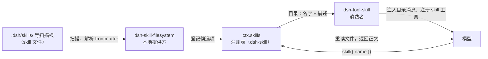

> **读完这篇你能**：给仓库写一份 skill，让模型每次会话都知道「文章文件名怎么起、配图放哪」，不用你再讲一遍；并且分清 skill 的两种形态、扫描根的优先级和两个调用开关。
>
> **前置**：[拦住模型乱来](12-拦住模型乱来.md)。约 25 分钟。
>
> **示例代码**：[dsh-blog-skill](https://github.com/anthonyzhao-4926/blog/tree/main/code/dsh_plugin/dsh-blog-skill)

这个博客仓库有规矩：文章文件名是 `NN-描述.md`，frontmatter 六个字段一个不能少，配图放专栏目录的 `assets/` 下。每次新开一个会话让模型帮忙写点东西，这些规矩都得重新讲一遍——写在 README 里也没用，README 不在模型的上下文里，它不会主动去读。

要的是「规矩放在那儿，模型需要时自己查得到」。DSH 里干这件事的机制叫 **skill**。

11 篇讲的是「拦」：guard 在执行前否决越界行为。这篇讲的是「告诉」：把规矩递到模型手里。一个是指令，一个是强制，管的不是同一段。

## 目标

- 给这个博客仓库写两个 skill：目录形态的 `blog-writing`（正文之外还带参考资料和模板），平铺形态的 `blog-publish`（一份发布前检查单，只许人唤起、不许模型自动加载）。
- 讲清：两种形态各什么时候用；扫描根的优先级；frontmatter 有哪些字段；「目录与正文分离」怎么省上下文；`user-invocable` / `disable-model-invocation` 两个开关。
- 全部文件在 `dsh_plugin/dsh-blog-skill/`，`install.sh` 把它们复制进博客仓库的项目级扫描根 `.dsh/skills/`。

## skill 的概念

skill 是**一份写给模型看的指令文档**：一个 markdown 文件，开头一段 YAML frontmatter（名字加一句话描述），正文是规矩本身。它不是 Cordis 插件——没有 `apply`、不用 `dsh plugin add`，文件放进规定的位置就生效。

它存在的原因是**上下文成本**。把所有规矩都塞进系统提示词，意味着每一轮对话都为这些规矩付 token，不管这一轮用不用得上。skill 把「目录」和「正文」分开：模型上下文里常驻的只有每个 skill 的名字和一句话描述；正文等模型判断「这个任务用得上」时才加载进来。规矩越多，省得越多。

DSH 里这套机制由三个包各管一段：

| 包 | 角色 | 管什么 |
| --- | --- | --- |
| `dsh-skill` | 注册表 | `ctx.skills`：各提供方往这里登记，消费者从这里查 |
| `dsh-skill-filesystem` | 本地提供方 | 从磁盘几个固定位置把 skill 文件扫出来、解析 frontmatter |
| `dsh-tool-skill` | 消费者 | 给模型注册一个叫 `skill` 的工具，并把当前可用的 skill 目录注入会话 |



模型视角看到的是两样东西：会话里有一条目录消息，`<available_skills>` 里每行一个 `` - `名字`: 描述 ``；工具列表里有一个 `skill({ name })` 工具（10 篇讲的 `defineTool` 注册的普通工具，只是它是内置的）。模型按描述判断哪个 skill 跟手头任务相关，调工具把正文取进来，然后照着做。

## 两种形态

本地提供方认两种文件布局：

- **目录包**：`<名字>/SKILL.md`。一个目录就是一个 skill，`SKILL.md` 是正文，目录里还可以放附属文件——参考资料、模板、脚本。
- **平铺文件**：`<名字>.md`。一个文件就是全部。

只看扫描根的**直属一层**：`.dsh/skills/a/b/SKILL.md` 这种嵌套不会被发现。

| | 目录包 `<名字>/SKILL.md` | 平铺 `<名字>.md` |
| --- | --- | --- |
| 正文 | `SKILL.md` | 文件本身 |
| 附属文件 | 可以有（`reference/`、`templates/`、脚本） | 没有 |
| 资源基准 | 自己的目录 | 所在的扫描根 |
| 适合 | 规矩之外还有查阅材料 | 一份文件装得下的规矩 |

什么时候用哪种，看有没有附属文件。规矩一份文件装得下，就平铺——少一层目录，搬动也方便。正文之外还有查阅型材料（完整的字段表、文章模板），就用目录包：正文里只放指针，材料等模型真要用时才读。本篇的 demo 两种各给一份，下面「按需加载」一节会讲这个指针为什么值得拆。

## 扫描根与优先级

本地提供方按固定的优先级扫六个根，数字小的赢：

| 优先级 | 来源 | 位置 |
| --- | --- | --- |
| 100 | `project-dsh` | `<项目根>/.dsh/skills` |
| 200 | `project-agents` | `<项目根>/.agents/skills` |
| 300 | `custom` | 配置项 `customSkillDirs` 列的目录 |
| 400 | `user-dsh` | `~/.dsh/skills` |
| 500 | `user-agents` | `~/.agents/skills` |
| 600 | `bundled` | 随包自带的 skill |

「项目根」指含 `.git` 的最近祖先目录；找不到就用当前工作目录。所以在仓库的任何一个子目录里开会话，命中的都是这个仓库的 `.dsh/skills/`。

优先级只在**同名**时起作用：两个根里都有 `blog-writing`，项目根（100）那份赢，用户根（400）那份被盖掉。由此得到摆放策略：「这个仓库的规矩」放项目根，跟着仓库走、同事 clone 就有；「我所有仓库通用」的放用户根。

custom 根走配置，写法是 06 篇的惯例——entry 的 `id` 是 `skill-filesystem`，在 profile 的 `cordis.patch.yml` 里写：

```yaml
- id: skill-filesystem
  config:
    customSkillDirs:
      - /path/to/shared/skills
```

两个零碎事实：`~/.dsh/skills/` 下的 `.system` 子目录会被跳过（那是 DSH 自己用的）；这些根目录都被监视着，增删改 skill 文件不用重启，下一个模型步骤目录就刷新。

上面这张表是全局层的优先级。除此之外，由 agent preset 常驻挂载的插件还可以往那个 preset 自己的层注册 skill，读取时就近层直接赢同名——那属于多 agent 的题目，本篇不展开。

## frontmatter

`SKILL.md`（或平铺的 `.md`）开头的 YAML 块里，本地提供方认这些字段：

| 字段 | 必填 | 作用 |
| --- | --- | --- |
| `name` | 是 | skill 的名字，kebab-case（小写字母、数字、连字符，如 `blog-writing`） |
| `description` | 是 | 一句话描述，进目录，是模型决定「要不要加载」的唯一依据 |
| `whenToUse` | 否 | 补充的选用提示 |
| `disable-model-invocation` | 否 | `true` 则模型侧看不到它（下节细讲） |
| `user-invocable` | 否 | `false` 则人不能用 `/名字` 唤起它（下节细讲） |
| `metadata` | 否 | 任意对象，给别的消费方用，模型看不到 |

写坏的待遇是**忽略，不炸**：缺 `name` 或 `description`、`name` 不合 kebab-case、YAML 解析失败，都是日志里一条 warn，这个文件被跳过，同根的其他 skill 不受影响。所以「装了但没出现」的第一站是日志。

`description` 值得认真写。模型手里只有名字和这一句话，它要靠这句话判断相关性——写清「什么时候用」，而不是只写「这是什么」。另外目录里的描述超长会被截断（默认 500 字符，`tool-skill` 的 `catalogDescriptionMaxLength` 可配），关键信息往前放。

## 按需加载

「目录常驻、正文按需」具体是这么运转的：

**目录消息。** `tool-skill` 在每个模型步骤之前（09 篇讲过的 `agent/pre-step` 管道）检查当前可用的 skill 列表，第一次非空就注入一条 `<system-reminder>`，之后列表有变化就整体替换。装好本篇的 demo 后，这条消息长这样（按 `tool-skill` 的渲染源码誊写）：

```text
<system-reminder>
A skill is a reusable set of task-specific instructions. The following skills are available in this session:

<available_skills>
- `blog-writing`: 本博客仓库的撰文规矩：专栏文章文件名 NN-描述.md、frontmatter 六个字段、配图放专栏的 assets/ 目录、文章骨架。在本仓库新建或修改专栏文章时使用。
</available_skills>

If the user names a skill, or the task clearly matches a skill's description, call the `skill` tool with the exact skill name before taking task actions. ...
</system-reminder>
```

里面只有名字和描述——没有正文、没有文件路径、没有来源。一百个 skill 常驻上下文的也就是一百行短句。注意 `blog-publish` 不在里面：它被 `disable-model-invocation: true` 挡住了。

**正文加载。** 模型调 `skill({ name: "blog-writing" })`，工具按调用时的工作目录找到胜出的那份，**重新读一次文件**，返回一个 `<skill_content>` 块：

```text
<skill_content name="blog-writing">
<skill_resources>
（这个 skill 的目录在哪，相对路径引用的资源自己去读）
</skill_resources>

<skill_instructions>
（SKILL.md 的正文，原样嵌入）
</skill_instructions>
</skill_content>
```

**目录与正文分离。** 目录包里的其他文件不随加载走：加载不枚举目录、不附带任何附属文件，`<skill_resources>` 只告诉模型「相对路径引用的东西在这个目录下，要读自己读」。所以长的参考资料放 `reference/`、模板放 `templates/`，正文只给一句「写什么之前先读哪个文件」。这是第二层按需：正文按需进上下文，正文里引用的材料再按需进一次。

「每次加载都重读文件」带来一个好用的性质：改 `SKILL.md` 的正文，保存即生效——下一次加载拿到的就是新内容，`name` / `description` 没变，连目录消息都不会刷新。

## 两个调用开关

frontmatter 里两个布尔字段控制「谁能用」，省略都相当于允许：

| `disable-model-invocation` | `user-invocable` | 效果 |
| --- | --- | --- |
| （省） | （省） | 模型能加载，人能唤起 |
| `true` | （省） | 仅人能唤起 |
| （省） | `false` | 仅模型能加载 |
| `true` | `false` | 两侧都看不到，只有代码里的 `ctx.skills.get()` 能取到 |

「模型看不到」是彻底的：目录消息里没有它，`skill` 工具按名字查到了也会拒绝。

「人唤起」的手势是在消息里写 `/名字`——比如发一句 `/blog-publish 12-不想每次重复讲规矩.md`。`tool-skill` 在下一个模型步骤把这份 skill 的正文作为指令注入会话，模型照着做。这是 `disable-model-invocation: true` 的 skill 唯一的入口：它不进目录，但你随时能把它递进去。适合「发布前检查单」这类东西——主动权在人，不需要模型自己想起来用它。

这个手势只认人亲手发的消息：工具结果、网页内容、skill 正文里出现 `/名字` 都不算数，外部文本伪造不了它。

## 完整代码

```text
dsh-blog-skill/
├── blog-writing/              ← 目录形态：一个目录一个 skill
│   ├── SKILL.md               ← 正文（规矩本身 + 指向附属文件的指针）
│   ├── reference/
│   │   └── frontmatter.md     ← 完整字段表，按需才被读
│   └── templates/
│       └── article.md         ← 文章骨架模板，按需才被读
├── blog-publish.md            ← 平铺形态：发布前检查单，仅 /blog-publish 唤起
└── install.sh                 ← 复制进博客仓库的 .dsh/skills/
```

`blog-writing/SKILL.md` 全文：

````markdown
---
name: blog-writing
description: 本博客仓库的撰文规矩：专栏文章文件名 NN-描述.md、frontmatter 六个字段、配图放专栏的 assets/ 目录、文章骨架。在本仓库新建或修改专栏文章时使用。
---

# 博客撰文规矩

本仓库是中文技术博客，文章按专栏组织，一个专栏一个目录（如 `dsh 插件开发学习/`），专栏 id 在根目录 `config.yml` 的 `columns:` 里注册。

## 文件名

- 正文文章一律 `NN-描述.md`，`NN` 是补零到两位的编号，必须与 frontmatter 的 `order` 一致（`tool/check-columns.sh` 会校验，对不上直接报错）。
- 不编号的只有两类：专栏首页 `README.md` 和 `参考/` 下的查阅卡片。参考卡片不写 `order`。

## frontmatter

每篇开头必须有 `title`、`date`、`tags`、`column`、`order`、`viewable` 六个字段，格式：

```yaml
---
title: <标题>
date: <YYYY-MM-DD>
tags:
  - <标签>
column: <专栏 id>
order: <整数>
viewable: true
---
```

每个字段的取值规则与常见错误见 `reference/frontmatter.md`，写文章前读一次。

## 配图

- 图片放在本专栏目录的 `assets/` 子目录下，正文用相对路径引用（`assets/文件名.png`）。
- 文件名带时间戳或语义（如 `20260930-skill-catalog.png`），不要叫 `image.png`、`1.png`。

## 文章骨架

新文章从 `templates/article.md` 复制骨架：开头三行（读完你能 / 前置 / 约 N 分钟）→ `## 目标` → 正文 → `## 注意事项` → `---` → 结尾的「下一篇」链接。小节标题一律用名词短语。

## 写完之后

运行 `tool/check-columns.sh <专栏目录名>` 校验文章间链接、图片存在、`order` 唯一，无报错才算写完。
````

注意这份正文的详略安排：六个字段只列了名字和格式，取值规则、常见错误这些查阅型内容全部推给了 `reference/frontmatter.md`；骨架不内联，指向 `templates/article.md`。正文因此只有一屏——它每次被加载都占上下文，附属文件只占指针的一行。

`blog-writing/reference/frontmatter.md` 全文：

````markdown
# frontmatter 字段规则

每篇正文文章的 frontmatter 六个字段，一个不能少：

```yaml
---
title: <标题>
date: <YYYY-MM-DD>
tags:
  - <标签>
column: <专栏 id>
order: <整数>
viewable: true
---
```

| 字段 | 规则 |
| --- | --- |
| `title` | 见名知意，不用「杂项」「其他」这类词 |
| `date` | 写成那天的日期，`YYYY-MM-DD` |
| `tags` | YAML 列表，一个标签一行 |
| `column` | 专栏 id，必须在根目录 `config.yml` 的 `columns:` 里注册过；不属于任何专栏才留空 |
| `order` | 整数，全专栏唯一、连续，决定阅读顺序；必须与文件名 `NN-描述.md` 的 `NN` 一致 |
| `viewable` | 固定 `true` |

## 常见错误

- **`NN` 与 `order` 不一致**：`tool/check-columns.sh` 直接报错。改了其中一个，另一个必须同步改。
- **给参考卡片编号**：`参考/` 下的卡片不写 `order`、文件名不带编号——它不在阅读序列里，不占文章号。
- **新增专栏忘了注册**：`column` 的值没进 `config.yml` 的 `columns:`，站点不会生成专栏落地页。
- **`README.md` 改名**：专栏首页必须叫 `README.md`，`config.yml` 的 `exclude` 按这个确切文件名把它排除在发布之外，改名会被当成文章发出去。
````

`blog-writing/templates/article.md` 全文：

```markdown
---
title: <标题>
date: <YYYY-MM-DD>
tags:
  - <标签>
column: <专栏 id>
order: <NN 对应的整数>
viewable: true
---

> **读完这篇你能**：<可验证的结果>。
>
> **前置**：<上一篇篇名>（<上一篇文件.md>）。约 <N> 分钟。

<一段动机：什么真实场景让人烦，所以要看这篇。>

## 目标

<这篇改完是什么样；不适用的人看到这里自己会走。>

<正文：具体做法 → 完整代码 / 代码解释。小节标题一律名词短语。>

## 注意事项

- <坑与边界。>

---

**下一篇**：<下一篇篇名>（<下一篇文件.md>）——<一句话>。
```

`blog-publish.md` 全文——平铺形态，一份文件装得下就不开目录；`disable-model-invocation: true` 让它不进模型的目录：

```markdown
---
name: blog-publish
description: 发布前检查单：核对本仓库一篇专栏文章是否满足发布条件。只由用户用 /blog-publish 唤起，模型不自动加载。
disable-model-invocation: true
---

# 发布前检查单

用户唤起时会指定一篇文章（或默认检查最近改动的那篇）。逐项核对并汇报结果，任何一项不过都明确说出来：

1. 文件名 `NN-描述.md` 的 `NN` 与 frontmatter 的 `order` 一致；
2. frontmatter 六个字段（`title` / `date` / `tags` / `column` / `order` / `viewable`）齐全，`column` 在根目录 `config.yml` 的 `columns:` 里注册过；
3. 开头三行（读完你能 / 前置 / 约 N 分钟）与结尾的「下一篇」链接都在；
4. 正文引用的图片文件真实存在于本专栏的 `assets/` 目录；
5. 运行 `tool/check-columns.sh <专栏目录名>` 无报错。
```

`install.sh` 全文。skill 不是插件，所以没有 `pnpm install`、没有 `dsh plugin add`——把文件复制进扫描根就是全部安装：

```bash
#!/usr/bin/env bash
set -euo pipefail

DIR="$(cd "$(dirname "${BASH_SOURCE[0]}")" && pwd)"

# 本包放在 <博客仓库>/dsh_plugin/dsh-blog-skill/，往上两级就是博客仓库根。
# 项目级扫描根是 <项目根>/.dsh/skills——项目根即含 .git 的最近祖先目录。
BLOG_ROOT="$(cd "$DIR/../.." && pwd)"
TARGET="$BLOG_ROOT/.dsh/skills"

# skill 不是 Cordis 插件：不用 pnpm install、不用 dsh plugin add，
# 文件进了扫描根就被 skill-filesystem 提供方发现。先清旧副本再复制，保证可重复执行。
mkdir -p "$TARGET"
rm -rf "$TARGET/blog-writing" "$TARGET/blog-publish.md"
cp -R "$DIR/blog-writing" "$TARGET/blog-writing"
cp "$DIR/blog-publish.md" "$TARGET/blog-publish.md"

echo "已装到 $TARGET："
echo "  blog-writing/SKILL.md  目录形态（正文 + reference/ + templates/）"
echo "  blog-publish.md        平铺形态（仅 /blog-publish 唤起）"
echo "扫描根有被监视，新会话的 skill 目录里就能看到，不用重启。"
```

## 装配与验证

```bash
cd dsh_plugin/dsh-blog-skill && ./install.sh
```

装完在博客仓库目录里起 dsh（哪个 profile 都行，skill 发现不依赖界面），开一个新会话，依次看三件事：

**目录里有 `blog-writing`，没有 `blog-publish`。** 新会话第一步注入的 `<available_skills>` 里应该有一行 `` - `blog-writing`: 本博客仓库的撰文规矩…… ``。`blog-publish` 不在——它被 `disable-model-invocation: true` 挡在模型侧之外，这正是要的效果。

**模型自己会加载。** 对它说「给 dsh 插件开发学习专栏起一篇新文章的骨架，先别写正文」。任务明显匹配 `blog-writing` 的描述，应该看到它先调一次 `skill` 工具，再按规矩给出 `NN-描述.md` 的文件名、六字段 frontmatter 和开头三行。如果它没调，先查日志里有没有 skill 被忽略的 warn，再检查 `.dsh/skills/` 的目录层次——嵌套多一层就不会被发现。

**`/blog-publish` 由人唤起。** 自己发一句 `/blog-publish`，下一步这份检查单的正文会作为指令注入，模型逐项核对并汇报。它从头到尾没进过目录，但你随时能把它递进去。

想亲眼确认优先级，可以把 `blog-writing/` 复制一份到 `~/.dsh/skills/`，改掉其中一份正文里的某条规矩，再让模型加载——赢的永远是项目根 `.dsh/skills/` 那份。验证完记得删掉用户根那份，不然以后在别的仓库里它也会冒出来。

卸载就是删除：删掉 `.dsh/skills/` 下的 `blog-writing/` 和 `blog-publish.md`，目录消息下一步自动刷新。

## 注意事项

- **skill 是指令，不是强制。** 模型读到规矩通常会照做，但「通常会」不是「保证会」。要硬约束——不许写某个目录、不许跑某类命令——回 11 篇的 guard，那是执行前的否决。skill 管「告诉它规矩是什么」，guard 管「不守规矩就拦下」。
- **skill 内容被当作可信本地内容。** 加载后正文原样嵌进模型上下文，模型会把它当指令执行。别往里贴来路不明的「规矩」，也别把密钥写进去。
- **写坏只 warn，不报错。** 缺 `name` / `description`、名字不合 kebab-case、YAML 写错，待遇都是日志一条 warn 加忽略。「装了没出现」先看日志，再核对目录层次（只扫直属一层）和文件名（目录形态必须叫 `SKILL.md`）。
- **同名覆盖只按优先级，目录里看不出来源。** 目录消息只有名字和描述，没有路径。排查「加载的到底是哪份」时按优先级表从上往下找：项目根 `.dsh/skills` → `.agents/skills` → `customSkillDirs` → `~/.dsh/skills` → `~/.agents/skills`。
- **改正文即时生效，改描述会刷目录。** 正文每次加载都重读，保存即生效；`name` / `description` 变了会触发一次目录替换消息，会话历史里多一条记录，属正常现象。
- **项目根靠 `.git` 认定。** 在仓库子目录里开会话，命中的仍是仓库根的 `.dsh/skills/`；在没有 `.git` 的目录里，当前工作目录自己就是「项目根」。

---

**下一篇**：[让别人自己配插件](14-让别人自己配插件.md)——把插件的偏好搬进设置页，同事在界面上自己配，不用碰 `cordis.yml`。
