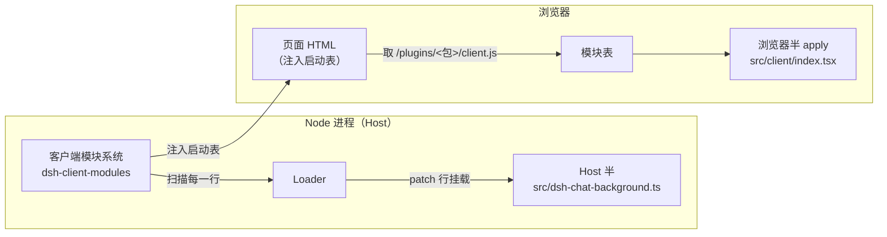
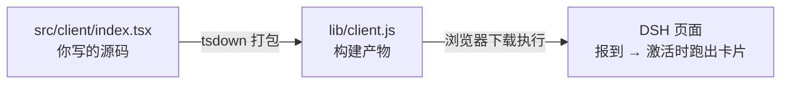
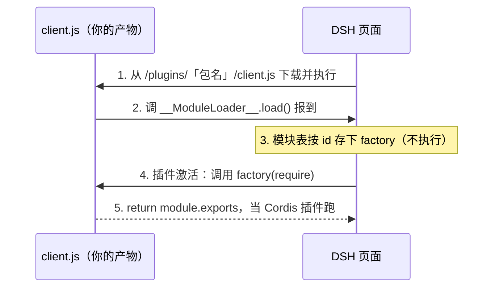
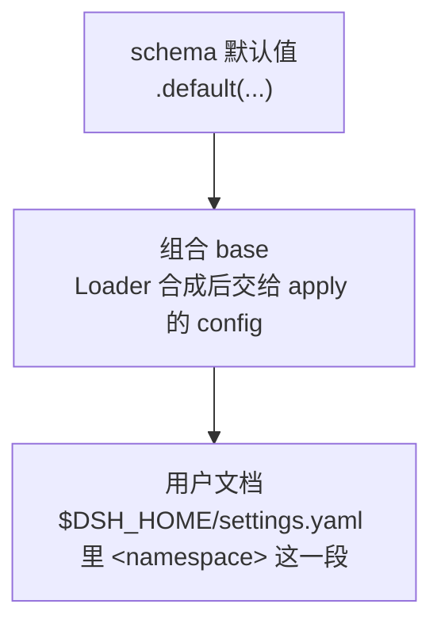

> **读完这篇你能**：把插件的配置项搬进设置页，同事在界面上改背景图、调透明度，不碰 `cordis.yml`；并且知道一个带界面的插件为什么要分 Host 与浏览器两半。
>
> **前置**：[用 Skill 固化提示词与规则](13-用 Skill 固化提示词与规则.md)。约 30 分钟。
>
> **示例代码**：[dsh-chat-background-settings](https://github.com/anthonyzhao-4926/blog/tree/main/code/dsh_plugin/dsh-chat-background-settings)

[用 Config schema 声明插件配置](06-用 Config schema 声明插件配置.md)把背景插件做成了可配置的：换图、调透明度不用改代码，在 profile 的 `cordis.patch.yml` 里写一段 `config` 就行。这套机制这篇原样保留——schema、层叠、非法值当场失败，一条都不动。

但插件给同事用时，「改 `cordis.yml`」本身就是门槛：他得找到 profile 目录、看懂 patch 语法、知道 `id` 不能写错、`config` 是整块替换——写错了插件还起不来。图片路径和透明度偏好每人不同，这些本该是「在界面上填个框」的事。

这篇给 06 的插件加一个人类用的界面。两件事：插件自己把这份配置**注册成一个设置项**（一个 namespace），交给设置服务解析、落盘；再给插件带上一小截浏览器代码，画一张配得上这个 namespace 的卡片，挂进设置页。同事打开页面、改值、保存，不碰任何 YAML。代码单独放在 `dsh_plugin/dsh-chat-background-settings/`。

## 目标

- 同一个背景插件，`image` / `opacity` 两个字段不变，升级成带设置页的版本：同事在「设置 → 插件 → 插件配置」里打开它的卡片直接改。
- 同事拿到插件只跑一条 `./install.sh`，之后换图、调透明度全部在界面上完成。
- 保存不重启插件：值落进 `$DSH_HOME/settings.yaml`，运行中的插件下一次读配置就是新值。
- 06 的 `Config` + schema + 层叠规则全部保留；这篇讲的是同一份配置上的第二个入口。

## 一个包两半

到目前为止，专栏里所有插件代码都跑在同一个地方：DSH 的 Node 进程（叫 Host）。它能读磁盘、注册 HTTP 路由，但它够不着浏览器里的页面——页面是 DSH 自己渲染的 React 应用，跑在另一个世界，那里没有 `node:fs`，也读不到你磁盘上的源码。

设置页是页面的一部分，所以插件要分两半：

- **Host 半**：就是原来那个插件（`src/dsh-chat-background.ts`），照旧由 Loader 按 patch 挂进 Host 进程，多做的事只有一件——把配置注册成设置项。
- **浏览器半**：一个新文件（`src/client/index.tsx`），跑在浏览器里，负责画那张卡片。它也叫**客户端模块**——插件随包携带的、由页面加载的那一截代码。

谁把浏览器半送进页面？DSH 的**客户端模块系统**（`dsh-client-modules`，web 界面自带的服务）。它做三件事：扫描 Loader 已挂载的行，找出声明了「我有浏览器半」的包；把每个包的浏览器半构建产物挂到 `/plugins/<包名>/client.js` 路由上；每次渲染页面 HTML 时，把当前这张「包 → 脚本地址」的表注入页面（`window.__DSH_BOOT__`）。浏览器里的模块表按表取回脚本、登记，然后在浏览器自己的 Cordis 上下文里把浏览器半当成一个插件跑起来——两边都是 Cordis 插件，只是各跑各的进程。



行与包的归属是这样定的：扫描从每一行的模块文件往上找最近的 `package.json`，那个包就是这一行的身份。我们的行写的是 `src/dsh-chat-background.ts` 的绝对路径，往上走就是本包自己的 `package.json`——所以「我有浏览器半」的声明写在它身上就行。

浏览器半的生死跟着行走：行被停用（比如 03 篇的 `disabled: true`），这个包的浏览器行就从启动表里消失，卡片跟着没有了；行回来，卡片也回来。Host 半与浏览器半不需要互相 import——两边各跑各的 `apply`，靠 **namespace 这一个字符串**会合：Host 侧注册它，浏览器侧把它当卡片的 key。

04 篇的 `webserver/index-inject` 能往页面里注入样式和脚本，为什么设置页不走那条路？注入的是死内容，而设置页是活的：它要读当前值、提交修改、跟着页面的主题和语言走。这些是页面应用内部的活，得由跑在页面里的代码来做。

## `dsh.client` 与 `./client`

「我有浏览器半」的声明是 `package.json` 里的两个字段：

```json
"exports": {
  "./client": "./lib/client.js"
},
"dsh": {
  "bundle": { "patch": "./patch.yaml" },
  "client": { "platform": "web" }
}
```

- `dsh.client`：声明这个包有浏览器半，`platform: 'web'` 表示它给 web 界面用。扫描看到这个字段才会继续；声明了却找不到 `./client` 导出，启动时直接报错——启动期的失败是响亮的，不会静默跳过。运行期（比如热重载之后）某个包的浏览器半坏了，只记一条警告，不拖累其他包。
- `exports["./client"]`：浏览器半的**构建产物**地址。注意它指向 `lib/client.js` 而不是源码——页面加载的是打包后的文件，所以包里多了一步构建（下节）。

`dsh.bundle` 那行是 02 篇就有的老声明，不变。

## 浏览器半的构建

浏览器很挑剔，只认识普通的 .js 文件。你的 `src/client/index.tsx` 直接丢给它会两眼一抹黑：写在 JS 里的标签语法（TSX）它原生不认识，`import { useState } from 'react'` 依赖的 `node_modules` 目录它也没有。所以浏览器半必须先**打包**——用打包工具从入口出发，顺着 `import` 把用到的代码编译、合并成一个自给自足的普通 JS 文件。整节的全景就三步：



中间那步「打包」和产物「长什么样、页面怎么用它」，就是这一节的全部内容。DSH 对产物的长相有硬性规定——不是随便一个 .js 页面都认。

**产物的长相：一次自我报到。** 产物必须长成一个固定样子，页面的模块表才认得：一个 CJS 脚本，首尾把代码包进一次登记调用。下面就是 `lib/client.js` 的骨架，四个部分挨个看：

```js
var module = { exports: {} }; var exports = module.exports;   // ① intro
window.__ModuleLoader__.load({ id: 'dsh-chat-background-settings', factory: (require) => {   // ② banner
  // ③ …你的全部代码 + 所有非基线依赖，打包后填在这里…
  //   里面写的 require('react') 原样保留，运行时由页面回答…
  return module.exports; } });   // ④ footer
```

1. **intro（垫一句）**：浏览器里本来没有 `module` 这个变量（那是 Node 的发明）。先手动造一个，后面代码里的 `module.exports = ...` 才不会报错。
2. **banner（报到）**：`window` 是浏览器的全局对象，`window.__ModuleLoader__` 是页面启动时自己装好的一个「登记台」。文件一执行就调它的 `load()`——自我报到：「我叫这个 id，我的代码装在 `factory` 函数里」。
3. **正文（你的代码）**：打包后的全部内容，装在 `factory` 这个**函数**里——登记这一刻不会执行。
4. **footer（交卷）**：factory 被调用时，把 `module.exports`（你的插件导出）return 给页面，页面把它当成一个 Cordis 插件跑起来。

两个名词顺便说清：**模块表**是登记台内部按 `id` 存 `factory` 的一张表；**CJS（CommonJS）**是一种模块格式——用 `require()` 拿别人的东西、用 `module.exports` 交出自己的东西。页面与 factory 之间的约定就是这套，所以构建格式选 `cjs`。

**从下载到激活：报到 ≠ 执行。** 页面拿到这个文件之后是这么用它的：



**factory 收到的 `require` 是页面特制的「发牌员」。** 浏览器里没有 `node_modules`，打包后代码里的 `require('react')` 由谁回答？由页面调用 factory 时传进来的这个 `require`。它手里有一份清单，只答得上清单上的包名；答不上的一律当场抛错。这份清单叫**平台基线模块**——页面自己已经加载好、愿意共享给所有插件的九个包，就是 `packages/client/web/src/platform.ts` 里的 `PLATFORM_MODULES`：`react`、`react/jsx-runtime`、`react-dom`、`react-dom/client`、`@deepseek-ai/cordis`、`@deepseek-ai/dsh-client-store`、`@deepseek-ai/dsh-client-ui-slots`、`@deepseek-ai/dsh-client-ui-primitives`、`@deepseek-ai/dsh-client-ui-dockkit`。

由此定下构建时的**两条铁律**：

- **清单里的九个包 → 不打包（外部引用）。** `require('react')` 原样留在产物里，运行时由页面回答。你的卡片用到 `react` 和 `dsh-client-store`，都在清单上。
- **清单外的一切依赖 → 必须打包进产物。** 发牌员不认识的包，只能事先把代码合并进 `client.js`，让产物自给自足，否则运行时必炸。

打个比方：页面是食堂，基线清单是它备好的公共餐具，插件来吃饭直接用食堂的，不许自己再带一副（原因见下段）。清单外真想要某个包，也可以在 `package.json` 的 `dsh.client.external` 里声明，让页面按包名去取——本篇用不到。

**基线里的包不能打进产物，React 那条最硬。** React 的 hooks（`useState` 这些）和 context 依赖「整个页面只有一份 React 实例」：

- **打了一份 React 进产物（错误）**：页面一份、你的产物里一份，两份互不认得。你的组件调 `useState`，找的是自己那份的内部状态表，渲染却归页面那份管——立刻报错（经典的 `Invalid hook call`），context 也永远取不到值。
- **共享页面那份 React（正确）**：产物不打包 React，运行时用 `require('react')` 向页面要它已经在用的那一份，组件和渲染器在同一份 React 里记账，一切正常。

清单里其他包没这么硬。比如 `dsh-client-store`，渲染器只把它当 `getSnapshot` / `subscribe` 这样的接口用，多打一份不会当场炸——但页面里多出一份同库副本，版本一旦漂移就很难查。所以规则一刀切：按清单整体外部化，不要自作聪明逐个判断「这个库打进去好像也没事」——判断错的代价是运行时才爆发的灵异 bug。

打包用 **tsdown**——一个打包工具（bundler）：从入口文件出发，顺着 `import` 把源码和依赖合成浏览器能跑的一个 .js。DSH 仓库内部用它的 `clientBundle` 预设产出上面那个格式（`packages/client/tsdown.client.ts`），但预设不随 npm 发布；仓库外的包（比如我们的）要自己复现这份契约。`tsdown.config.ts` 全文：

```ts
/**
 * 浏览器半的构建配置。
 *
 * DSH 仓库内用 packages/client/tsdown.client.ts 的 clientBundle 预设产出
 * 客户端包，但这个预设不随 npm 发布，仓库外的包要自己复现它的输出契约：
 * 一个 CJS 浏览器包，首尾把代码包进
 *   window.__ModuleLoader__.load({ id: <包名>, factory: (require) => { ... } })
 * 页面里的模块表按 id 登记 factory，插件被激活时调用它。
 *
 * neverBundle 列的就是页面的平台基线模块（packages/client/web/src/platform.ts
 * 里那份 PLATFORM_MODULES 清单）：factory 收到的 require 能直接答它们，所以
 * 一律保持外部引用。基线之外的依赖全部打包进产物——模块表答不上的 require
 * 会在运行时直接抛错。
 *
 * react 那几条最硬：页面里多一份 React，hooks 与 context 立刻不工作。其余几条
 * 是把页面已经共享给所有插件的那份实现再打一份进去，不会当场报错，但版本会
 * 各自漂移。按清单整体处理，不要逐个判断该不该外部化。
 */
import { defineConfig } from 'tsdown'

export default defineConfig({
    entry: { client: 'src/client/index.tsx' },
    outDir: 'lib',
    format: 'cjs',
    platform: 'browser',
    dts: false,
    sourcemap: true,
    deps: {
        neverBundle: [
            'react',
            'react/jsx-runtime',
            'react-dom',
            'react-dom/client',
            '@deepseek-ai/cordis',
            '@deepseek-ai/dsh-client-store',
            '@deepseek-ai/dsh-client-ui-slots',
            '@deepseek-ai/dsh-client-ui-primitives',
            '@deepseek-ai/dsh-client-ui-dockkit',
        ],
    },
    outputOptions: {
        // 产物名固定为 lib/client.js：/plugins 路由的组合地址按 <包名>/client.js 拼。
        entryFileNames: 'client.js',
        intro: 'var module = { exports: {} }; var exports = module.exports;',
        banner: `window.__ModuleLoader__.load({ id: 'dsh-chat-background-settings', factory: (require) => {`,
        footer: 'return module.exports; } });',
    },
})
```

逐字段看：

| 字段 | 作用 |
| --- | --- |
| `entry` | 入口文件，打包从这里开始，顺着 `import` 把用到的代码都收进来 |
| `outDir` + `entryFileNames` | 产物钉死为 `lib/client.js`——`exports["./client"]` 指向它，`/plugins` 路由也按 `<包名>/client.js` 拼地址 |
| `format: 'cjs'` | 输出 CommonJS 格式，配合 factory 用 `module.exports` 交导出的约定 |
| `platform: 'browser'` | 告诉打包器目标是浏览器，解析依赖时选浏览器版本 |
| `dts: false` | 不生成类型声明文件——浏览器半的产物不给别的包做类型引用 |
| `sourcemap: true` | 同时产出 `.map` 文件，浏览器开发者工具里的报错能对回 TSX 源码行号 |
| `deps.neverBundle` | 「永不打包」清单，照抄平台基线那九个包（两条铁律之一） |
| `outputOptions.intro` | 垫在文件**最开头**：造出 `module` 变量（骨架第 ① 段） |
| `outputOptions.banner` | 接在 intro 后面：登记调用的前半句（骨架第 ② 段） |
| `outputOptions.footer` | 垫在文件**最末尾**：`return module.exports; } });` 收尾（骨架第 ④ 段） |

`intro` / `banner` / `footer` 三行就是「包壳」：打包器把编译合并后的代码填在中间，三段壳一拼，产出物正好就是本节开头那个固定样子。

日常开发的循环是「要重新构建，但不用重启 DSH」：

1. **改 `src/client/` 下的代码，存盘。** 页面此时还拿着旧产物——它只从 `/plugins/<包名>/client.js` 这个地址拿产物文件，看不到你的源码。这是浏览器半与 Host 半的现实差别：Host 半走源码直载（07 篇的 tsx 钩子），改完就生效；浏览器半永远吃构建产物。
2. **跑 `pnpm run build`。** tsdown 重新产出 `lib/client.js`。
3. **`client-hmr` 自动接管。** 它是 web 组合包默认挂着的服务（HMR = Hot Module Replacement，热模块替换）：逐个盯住每个浏览器半的产物文件，记下大小与修改时间，一变就重算内容哈希，把这一行的新产物推给浏览器。
4. **页面就地换掉那段代码**，不重启 DSH，新卡片直接生效。

一句话记住：**「存盘 → `pnpm run build`」，不是「存盘 → 重启」。**

最后把本节的名词收在一起：

| 名词 | 一句话解释 |
| --- | --- |
| 构建 / 打包（bundle） | 用 tsdown 把 TSX 源码加依赖合成一个浏览器能跑的 `lib/client.js` |
| `window.__ModuleLoader__` | 页面挂在全局对象上的「登记台」，产物一执行就向它报到 |
| 模块表 | 登记台内部按 id 存 factory 的一张对照表，激活时才调用 |
| factory | 装着你全部代码的函数；页面激活插件时调用它，拿到你的导出 |
| `require`（factory 的参数） | 页面提供的「发牌员」，只答得上平台基线清单里的包 |
| CJS（CommonJS） | 一种模块格式：`require()` 拿东西，`module.exports` 交东西 |
| 平台基线模块 | 页面已加载、共享给所有插件的九个包（`platform.ts` 清单） |
| neverBundle / 外部引用 | 清单里的包不打包，运行时问页面要；清单外的必须打进产物 |
| banner / footer / intro | 在产物首尾包的壳，三段拼出完整的登记调用 |
| client-hmr / HMR | 热模块替换：盯着产物文件，变了就推给浏览器就地换码，不重启 |

## 设置项注册

设置服务（`ctx.settings`）负责一件事：让用户从界面上覆盖一份配置。它不认识你的 `Config` 类型，也不会去猜哪几个字段该露出来——插件得自己把要暴露的这份配置**声明成一个 namespace**（一份 schema，加一层 base）交给它；设置服务负责解析成当前值、提供给界面、把用户的修改落盘。一个 namespace 对应设置页上的一张卡片。

DSH 自带的 shell 执行器、agent loop、web search、模型适配器走的都是这一条：各自注册一个 namespace，界面上的卡片只是这份注册的一个视图。所以插件要「有设置页」，做的事不是改 schema 的写法，而是在 `apply` 里多注册一次。

注册用的方法是 `installSection`，五个参数：

```ts
installSection<const Namespace extends string, T>(
    owner: Context,
    ns: Namespace & SettingsNamespaceInput<Namespace>,
    schema: z<T>,
    entry: T,
    hooks: SettingsSectionHooks<T>,
): void
```

- `owner`：谁拥有这份设置。传插件自己的 `ctx`。注册挂在它的 fiber 上——插件卸载，namespace 跟着注销，不用自己收拾。
- `ns`：namespace 名。字符集是 `^[a-z][a-z0-9-]*$`：小写字母开头，后面只能是小写字母、数字、连字符。同一个进程里重复注册同一个名字会直接抛错。本篇用插件名 `dsh-chat-background-settings`。
- `schema`：解析这份配置的 Schemastery schema。06 那份 `Config` 原样拿来用，`.default(...)` 一个都不动——默认值是层叠最底下那层，位置没变。
- `entry`：注册时的 base 层。传 Loader 按 `cordis.yml` 与 patch 合成之后交给 `apply` 的那一份 `config`。用户什么都没改时，读到的就是它。
- `hooks`：三个回调，下面逐条说。

`hooks.setSource` 是这套机制的关键。安装成功时设置服务调它一次，参数是**一个取值函数**：

```ts
setSource: (current) => { source = current }
```

没有「框架把某个稳定引用替换掉」这回事，也不需要监听什么事件。设置服务把「当前该读哪份值」这件事交给插件自己保管，插件每次要用配置时调一次 `source()`。`apply` 里就按这个写法准备：

```ts
// 当前生效配置。设置服务挂上时由 setSource 换成设置服务的取值函数；
// 没有设置服务时，它就是 Loader 合成后交给 apply 的这份 config。
let source: () => Config = () => config
```

之后所有读配置的地方从 `config.image` 改成 `source().image`。这个读法就是「每次都是最新值」的全部来源：设置服务提交新值时不重启插件，插件下一次调 `source()` 就拿到了。

`hooks.onChange` 只在一种情况下需要写东西：配置变了、而你手里有**当时算出来的派生状态**（注册表、缓存、memo 过的实例）要跟着重建。像本篇这样每次用到时现读，空实现就够：

```ts
// 路由和样式都是用到时现读 source()，没有需要重建的派生状态。
onChange: () => {},
```

`hooks.validate` 是可选的第三个回调，给 schema 表达不了的约束用——跨字段的要求，或某个字段的合法性取决于另一个字段。它抛错就等于拒绝这次写入：调用方在写入那一刻就拿到失败，而不是先存下一个会让插件停摆的值。

三条语义要知道：

- **设置服务是可选的。** profile 没挂 settings provider 时，`ctx.settings` 这个服务根本不存在，`installSection` 那段回调不会跑，`source` 就一直停在 `() => config`。这份回落的意义是：插件在 `cordis.yml` 里照旧可配，装上设置服务之后，界面成为同一份配置的第二个入口。
- **一份 schema 一个 namespace，schema 里的字段整份进设置服务。** 没有字段级的开关。想少暴露几个字段，要么另写一份窄 schema 并把对应的子集当 `entry` 传进来（界面上还是同一张卡，只是它编辑的字段少了），要么让卡片只渲染其中几个输入框——DSH 自带的 shell 卡片就是后者，它编辑的是宿主 schema 的一个子集。
- **需要重启才算数的值不要注册进来。** 注册进 namespace 的值一律走「不重启、现读」这条路。某个值必须是构造期的输入（比如决定注入哪个服务），就把它留在 `cordis.yml` 的普通字段里。

Host 半全文：

```ts
// src/dsh-chat-background.ts
/**
 * 聊天背景插件（设置页版）的 Host 半：注册图片路由、往页面注入样式，
 * 并把这份配置注册成一个 settings namespace。
 *
 * 与 06 篇的 dsh-chat-background-config 是同一个插件，差别只有一处：apply 里把
 * 这份 config 交给设置服务（ctx.settings.installSection），换回来一个「当前生效
 * 配置」的取值函数。同事在设置页改，不碰 cordis.yml；写入后设置服务提交新值，
 * 本插件不重启，下一次 source() 就是新值。
 *
 * namespace 是插件自己起的字符串（约束见 SETTINGS_NS），与这一行在 profile 里的
 * entry id 无关。浏览器半（src/client/）注册卡片时用的 key 必须是同一个字符串，
 * 两边靠这一个名字会合。
 *
 * 这个文件跑在 Node 里（Host 进程）；浏览器里的卡片在 src/client/ 下。
 */
import { readFileSync } from 'node:fs'
import { readFile } from 'node:fs/promises'
import { extname } from 'node:path'
import type { Context } from '@deepseek-ai/cordis'
import Schema from '@deepseek-ai/schemastery'
// 只引入类型声明：ctx.settings 的 Context 合并，以及 webServer 的路由与
// webserver/index-inject 事件类型。编译后剥离，运行时零开销。
import type {} from '@deepseek-ai/dsh-host-webserver'
import type {} from '@deepseek-ai/dsh-settings'

export const name = 'dsh-chat-background-settings'

/** 设置服务里的 namespace：小写字母开头，只含小写字母、数字、连字符。 */
const SETTINGS_NS = 'dsh-chat-background-settings'

// 默认图是包内自带的 svg；同事在设置页填自己图片的绝对路径来覆盖它。
const DEFAULT_IMAGE = new URL('../image.svg', import.meta.url).pathname
// 路由地址不含扩展名：图片路径可配，Content-Type 按配置里那个文件的扩展名走。
const IMAGE_URL = '/dsh-chat-background-settings/image'

/** 允许的图片扩展名 → Content-Type。 */
const CONTENT_TYPES: Record<string, string> = {
    '.jpg': 'image/jpeg',
    '.jpeg': 'image/jpeg',
    '.png': 'image/png',
    '.webp': 'image/webp',
    '.gif': 'image/gif',
    '.svg': 'image/svg+xml',
}

export interface Config {
    /** 背景图片的绝对路径。 */
    image: string
    /** 图片显示强度：0 完全透明，1 完全不透明。 */
    opacity: number
}

// 06 的 schema 原样保留：默认值、值域、非法值当场失败都在这里。
export const Config: Schema<Config> = Schema.object({
    image: Schema.string().default(DEFAULT_IMAGE),
    opacity: Schema.number().min(0).max(1).default(0.35),
})

export function apply(ctx: Context, config: Config): void {
    // 当前生效配置。设置服务挂上时由 setSource 换成设置服务的取值函数；
    // 没有设置服务（profile 没挂 provider）时，它就是 Loader 合成后交给
    // apply 的这份 config——这份回落是 cordis.yml 之外保留的第二个入口。
    let source: () => Config = () => config

    // 设置服务是可选依赖，用 ctx.inject 等它出现；它不在，插件照旧可配。
    ctx.inject(['settings'], (settingsCtx) => {
        settingsCtx.settings.installSection(ctx, SETTINGS_NS, Config, config, {
            setSource: (current) => { source = current },
            // 路由和样式都是用到时现读 source()，没有需要重建的派生状态，
            // 所以这里空实现即可（有缓存或注册表要重建时才需要写）。
            onChange: () => {},
        })
    })

    // 路由每次请求现读一次 image：设置页保存后的下一次请求就用新图。
    ctx.inject(['webServer'], (serverCtx) => {
        ctx.effect(() => serverCtx.webServer.register({
            kind: 'exact',
            path: IMAGE_URL,
            handler: async (_req, res) => {
                const image = source().image
                const contentType = CONTENT_TYPES[extname(image).toLowerCase()]
                    ?? 'application/octet-stream'
                res.writeHead(200, { 'content-type': contentType })
                res.end(await readFile(image))
            },
        }))
    })

    // 样式在每次页面渲染时重新生成，所以透明度保存后刷新页面即生效。
    ctx.on('webserver/index-inject', (table) => {
        table.push({ kind: 'style', text: buildStyle(source().opacity) })
    })
}

/** 用配置值生成样式：静态选择器来自 style.css，只有遮罩浓度随配置变化。 */
function buildStyle(opacity: number): string {
    // 透明度的实现：在图片上盖一层与页面底色同色的遮罩，越不透明遮得越多。
    const veilPercent = Math.round((1 - opacity) * 100)
    const veil = `color-mix(in srgb, var(--dsw-alias-bg-base) ${veilPercent}%, transparent)`
    const styleSheet = readFileSync(new URL('./style.css', import.meta.url), 'utf8')
    return `:root { --dsh-chat-background-veil: ${veil}; }\n${styleSheet}`
}
```

## namespace 与卡片配对

Host 半注册完 namespace，页面还得知道「这个 namespace 的卡片长什么样」。这一半跑在浏览器里，由浏览器半自己注册，和 Host 半不互相 import。

DSH 的插件设置页给这种卡片留了一个槽位：`settings.plugin.item`。它是一个 keyed 槽位，key 就是 namespace。声明这个槽位的包（`@deepseek-ai/dsh-client-ui-settings-plugins`）在源码注释里把理由写得很直白：

> Keying on the namespace is what lets a plugin distributed outside this repository contribute a card: it registers its own settings namespace on the Host and its own card under that key in the browser, and the tab pairs the two without ever learning what the namespace means.

译：把 key 定成 namespace，才让一个在本仓库之外分发的插件也能贡献一张卡片——它在 Host 上注册自己的 settings namespace，在浏览器里把卡片注册到同一个 key 下，页签把两者对起来，全程不需要知道这个 namespace 是什么含义。

配对是**两个集合取交集**：一边是 Host 通过设置服务描述出来的 namespace 列表，一边是已经注册进 `settings.plugin.item` 的卡片的 key。只有两边都有，卡片才会被渲染。这带来两个直接后果：

- Host 没有服务的 namespace，卡片注册了也不出现（那属于别的界面，或者这个部署没装那个插件）。
- Host 服务了某个 namespace 但没人给它写卡片，页签也不会为它变出一张——**表单不会自动生成**，得自己写。

浏览器半要读值、写值，走的是页面里的 `ctx.settingsScope` 服务：给它一个 namespace，换回一份绑定好的 scope。

```ts
const scope = ctx.settingsScope.bind<BackgroundConfig>({ namespace: SETTINGS_NS })
```

scope 上最常用的几个成员：`getSnapshot()` 给当前快照，`subscribe()` 订阅快照替换，`set(field, value)` / `unset(field)` 改一个字段，`mutate(ops, revision)` 一次提交一组路径操作。卡片实际用到的是快照里这几个字段：

- `status`：`'loading'` / `'ready'` / `'unavailable'`。Host 不再服务这个 namespace（比如那一行被停用）时是 `'unavailable'`——卡片这时候什么都不渲染。
- `value`：schema 默认值、组合层 base、用户层三层叠完的结果。
- `user`：用户层原始内容。一个字段**出现在 `user` 里就算用户覆盖过**，哪怕值跟默认一样——所以判断「用户改没改过」要看 `user` 里有没有这个键，不能比 value。
- `revision`：这份 namespace 用户层的版本号。写的时候回传它，别人在你读之后改过，你这次写入会被拒。首次拿到快照前它可能是 `undefined`，直接透传给写方法即可（那边有回落）。
- `writable`：这个部署的设置文档收不收写入。

写入的返回语义要注意：**Host 拒绝写入时，`mutate` / `set` 是正常返回的，不抛错**。值不合法、版本过期走的是「返回并让客户端重读一次」这条路；只有传输层异常才 reject。所以「保存成功了吗」不能靠 `await` 有没有抛来判断，要**读回快照**：

```ts
// 写之后读回来看有没有落地：Host 拒绝写入时 scope.mutate 也是正常返回。
const written = (patch: BackgroundConfig): boolean => {
    const user = scope.getSnapshot().user as Record<string, unknown> | undefined
    return user !== undefined && Object.keys(patch).every(key => key in user)
}
```

最后一条纪律是浏览器半的写法：**组件拿不到 `ctx`**。注册时通过 `inject` 工厂把组件需要的东西——一个快照源加几个普通回调——递进去；渲染器会把 `hooks` 里的每个键绑成 `use<键名首字母大写>` 选择器。卡片自己不去够服务、不订阅、不读 React context，换成别的 UI 写法也一样成立。

`settings.plugin.item` 这个槽位由插件设置页声明，声明顺序不由我们控制，所以用 `ctx.slots.inject` 等它出现再注册，槽位消失（或本插件卸载）时自动撤销——和 Host 半注册 namespace 挂在 fiber 上是一个道理。

卡片什么时候消失：在 `cordis.patch.yml` 里给这一行加 `disabled: true`，Loader 释放这一行的 fiber，挂在同一个 fiber 上的 namespace 注册跟着注销，设置服务描述出来的列表里没有它了，页签的交集落空，卡片就不再被渲染；而在这之前，浏览器侧已经绑好的那份 scope 会把 `status` 翻成 `'unavailable'`，卡片自己就先什么都不渲染了。行改回来，namespace 重新注册，卡片回来。两边都不用自己收拾。

`src/client/index.tsx` 全文：

```tsx
/**
 * 聊天背景插件的浏览器半：在设置页「插件」的「插件配置」页签里，给 Host 半
 * 注册的那个 settings namespace 挂一张卡片。
 *
 * 这个文件不跑在 Node 里。它被打包成 lib/client.js，由客户端模块系统
 * （dsh-client-modules）送进浏览器，在页面里的另一个 Cordis 上下文上再跑一次
 * apply。两边唯一的约定是一个字符串：Host 半注册的 settings namespace 与这里
 * 注册进 settings.plugin.item 槽位的 key 必须一字不差，插件页把两者对起来，
 * 谁都不需要认识对方。
 *
 * 值从 ctx.settingsScope 绑定的 scope 上读，写也从它上面提交。组件拿不到 ctx，
 * 快照源与写回调由注册时的 inject 工厂递进去。
 */
import { useState } from 'react'
import { createSnapshotStore, type SnapshotStore } from '@deepseek-ai/dsh-client-store'
import type { Context } from '@deepseek-ai/cordis'
// 只引入类型声明（编译后剥离，运行时由页面的模块表提供实现）：
// ctx.slots 的 Context 合并，ctx.settingsScope 的 Context 合并，
// 以及 SlotMap 里的 settings.plugin.item 条目与卡片 props 份额。
import type { InjectFace, PropsRuntime } from '@deepseek-ai/dsh-client-ui-slots'
import type {} from '@deepseek-ai/dsh-client-ui-renderer/client'
import type { SettingsScopeSnapshot } from '@deepseek-ai/dsh-client-ui-settings/client'
import type {} from '@deepseek-ai/dsh-client-ui-settings-plugins/client'

/** 槽位 key = Host 半注册的 settings namespace，必须一字不差。 */
const SETTINGS_NS = 'dsh-chat-background-settings'

/** 本卡片编辑的字段：Host 那份 schema 的一个子集（这里刚好是全部）。 */
interface BackgroundConfig {
    image?: string
    opacity?: number
}

/** 本卡片的注入面：一个快照源加两个普通回调。组件永远拿不到 ctx。 */
interface BackgroundCardFace {
    hooks: { backgroundConfig: SnapshotStore<SettingsScopeSnapshot<BackgroundConfig>> }
    /** 提交一组字段修改，返回 Host 是否真的把它们写进了用户层。 */
    save: (patch: BackgroundConfig, revision: number | undefined) => Promise<boolean>
    /** 清掉某个字段的用户层覆盖，让它回落到组合层与 schema 默认值。 */
    reset: (field: keyof BackgroundConfig) => Promise<boolean>
}

/** 卡片 props：运行期份额 + 注入面（hooks 里的键会被绑成 useBackgroundConfig）。 */
export type BackgroundCardProps =
    PropsRuntime<'settings.plugin.item'>
    & InjectFace<BackgroundCardFace>

export const inject = ['slots', 'settingsScope']

export function apply(ctx: Context): void {
    // settingsScope 是页面里的服务：绑到 Host 那个 namespace 上，拿到它的
    // 快照与写方法。绑定的生命周期挂在本次 apply 的 fiber 上。
    const scope = ctx.settingsScope.bind<BackgroundConfig>({ namespace: SETTINGS_NS })
    const store = createSnapshotStore(scope.getSnapshot())
    ctx.effect(
        () => scope.subscribe(() => { store.set(scope.getSnapshot()) }),
        'dsh-chat-background-settings: settings mirror',
    )

    // 写之后要读回来看有没有落地：Host 拒绝写入时 scope.mutate 也是正常返回，
    // 不抛错，所以「保存成功了吗」不能靠 await 有没有 throw 判断。
    const written = (patch: BackgroundConfig): boolean => {
        const user = scope.getSnapshot().user as Record<string, unknown> | undefined
        return user !== undefined && Object.keys(patch).every(key => key in user)
    }

    // slots.inject 等槽位声明出现再注册，槽位消失（或本插件卸载）时撤销。
    ctx.slots.inject('settings.plugin.item', () => ctx.slots.register({
        name: 'settings.plugin.item',
        key: SETTINGS_NS,
        inject: () => ({
            hooks: { backgroundConfig: store },
            save: async (patch, revision) => {
                const ops = Object.entries(patch)
                    .filter(([, value]) => value !== undefined)
                    .map(([path, value]) => ({ op: 'set' as const, path: [path], value }))
                if (ops.length === 0) return true
                await scope.mutate(ops, revision)
                return written(patch)
            },
            reset: async (field) => {
                await scope.unset(field)
                const user = scope.getSnapshot().user as Record<string, unknown> | undefined
                return user?.[field] === undefined
            },
        }),
    }, BackgroundCard))
}

/**
 * 本插件那张卡片。页签把各家的卡片放进一个列表，所以最外层是 li。
 * 输入全部来自 props：inject 里 hooks 的 backgroundConfig 被渲染器绑成
 * useBackgroundConfig，两个回调直接是 inject 返回的成员。
 * @param props - 快照选择器与写回调。
 * @returns 卡片，或（Host 不再服务这个 namespace 时）什么都不渲染。
 */
function BackgroundCard(props: BackgroundCardProps) {
    const state = props.useBackgroundConfig(snapshot => snapshot)
    const [message, setMessage] = useState('')
    if (state.status === 'loading') return <li>正在读取当前配置…</li>
    if (state.status === 'unavailable') return null
    return (
        <li>
            <h3>背景图与透明度</h3>
            {/*
              key=revision：保存被接受后 revision 增加，表单重挂载，输入框回到新值；
              被拒绝时 revision 不变，用户填的还留在框里。
            */}
            <form key={String(state.revision)} onSubmit={(event) => {
                event.preventDefault()
                const data = new FormData(event.currentTarget)
                const patch: BackgroundConfig = {
                    image: String(data.get('image')),
                    opacity: Number(data.get('opacity')),
                }
                void props.save(patch, state.revision).then((ok) => { setMessage(
                    ok ? '已保存：刷新页面看新背景。' : '保存被拒绝：值不合法，或配置刚在别处被改过。',
                ) })
            }}>
                <p>
                    <label>背景图路径 <input name="image" size={40} defaultValue={state.value?.image} /></label>
                </p>
                <p>
                    <label>透明度（0–1） <input name="opacity" type="number" min={0} max={1} step={0.05} defaultValue={state.value?.opacity} /></label>
                </p>
                <button type="submit" disabled={!state.writable}>保存</button>
                <button
                    type="button"
                    disabled={!state.writable}
                    onClick={() => { void props.reset('opacity') }}
                >
                    重置透明度
                </button>
                <p>{message}</p>
            </form>
        </li>
    )
}
```

组件本身是最小形态：两个输入框、两个按钮，故意不用任何组件库、不引样式表——槽位、scope、namespace 这三样才是本篇的机制，React 部分换成你喜欢的任何写法都行。真要以仓库内插件的标准来写，还会补上折叠、脏值标记、字段级「已覆盖 / 恢复默认」这些（`settings.plugin.item` 的宿主组件就长这样）；它们不影响这篇讲的机制。

## 装配

```text
dsh-chat-background-settings/       ← 插件包（bundle）
├── src/
│   ├── dsh-chat-background.ts      ← Host 半：Config + installSection + apply
│   ├── style.css                   ← 背景样式（同 06）
│   └── client/
│       └── index.tsx               ← 浏览器半：注册卡片
├── image.svg                       ← 默认背景图（包内自带）
├── package.json                    ← dsh.bundle + dsh.client + ./client 导出
├── patch.yaml                      ← 挂载指令（install.sh 生成）
├── tsconfig.json
├── tsdown.config.ts                ← 浏览器半的构建
└── install.sh
```

`package.json` 全文：

```json
{
  "name": "dsh-chat-background-settings",
  "version": "0.1.0",
  "type": "module",
  "exports": {
    "./client": "./lib/client.js"
  },
  "dsh": {
    "bundle": {
      "patch": "./patch.yaml"
    },
    "client": {
      "platform": "web"
    }
  },
  "scripts": {
    "build": "tsdown"
  },
  "dependencies": {
    "@deepseek-ai/cordis": "^4.0.1",
    "@deepseek-ai/dsh-host-webserver": "^0.2.0-rc.2",
    "@deepseek-ai/dsh-settings": "^0.2.0-rc.2",
    "@deepseek-ai/schemastery": "^3.18.2"
  },
  "devDependencies": {
    "@deepseek-ai/dsh-client-store": "^0.2.0-rc.2",
    "@deepseek-ai/dsh-client-ui-renderer": "^0.2.0-rc.2",
    "@deepseek-ai/dsh-client-ui-settings": "^0.2.0-rc.2",
    "@deepseek-ai/dsh-client-ui-settings-plugins": "^0.2.0-rc.2",
    "@deepseek-ai/dsh-client-ui-slots": "^0.2.0-rc.2",
    "@types/react": "~18.3.1",
    "react": "^18.2.0",
    "tsdown": "^0.22.2"
  }
}
```

依赖分两边。Host 半的依赖在 `dependencies`：`cordis`、`schemastery` 是运行时真用到的，`dsh-host-webserver` 与 `dsh-settings` 只提供类型（`import type`，编译时剥掉），但留在 `dependencies` 里让类型检查有东西可解析。

浏览器半的依赖全在 `devDependencies`，因为运行时它们不由本包提供：`react` 和 `dsh-client-store` 由页面的模块表给（所以构建时列进 `neverBundle`），`dsh-client-ui-slots`、`dsh-client-ui-settings`、`dsh-client-ui-settings-plugins`、`dsh-client-ui-renderer` 只提供类型声明——它们各自带一段 `declare module` 合并，负责补上 `ctx.slots`、`ctx.settingsScope` 和 `settings.plugin.item` 这个槽位 key，编译后同样被剥掉。`tsdown` 是构建工具。

版本号按你本机 DSH 的版本来写。这里写的是 npm 上当前那一批：`@deepseek-ai/dsh-*` 用 `^0.2.0-rc.2`、cordis 用 `^4.0.1`。换版本时记得浏览器半那几个包要跟 Host 半同一批，别一半新一半旧。另外这些包是预发布，`latest` 这个 tag 还停在很早的一档，装的时候要么写死区间、要么显式带 `next` —— 细节在 [DSH 升级后的版本与兼容性排查](20-DSH 升级后的版本与兼容性排查.md)。

`style.css` 与 06 相同（遮罩变量 `--dsh-chat-background-veil` 由 Host 半注入），只有图片地址换成 `/dsh-chat-background-settings/image`。

`install.sh` 比 06 多一步构建浏览器半；不写 profile 覆盖层——配置留给设置页，`cordis.patch.yml` 里还留着 08 篇的换源配置。跑完后 `patch.yaml` 被生成为：

```yaml
- insert:
    - id: dsh-chat-background-settings
      name: '/绝对路径/dsh-chat-background-settings/src/dsh-chat-background.ts'
```

`install.sh` 本身：

```bash
#!/usr/bin/env bash
set -euo pipefail

DIR="$(cd "$(dirname "${BASH_SOURCE[0]}")" && pwd)"

cd "$DIR"
pnpm install

# 浏览器半：产出 lib/client.js（dsh.client 声明的 ./client 导出指向它）。
pnpm run build

# patch.yaml 里的插件行要写绝对路径，按本机位置重新生成。
cat > patch.yaml <<EOF
- insert:
    - id: dsh-chat-background-settings
      name: '$DIR/src/dsh-chat-background.ts'
EOF

# 与前几篇同一个 test profile。不写 profile 覆盖层——配置留给设置页，
# cordis.patch.yml 里还留着 08 篇的换源配置。
dsh plugin --profile test add "link:$DIR"

echo "装好了。启动 dsh --profile test --no-open，在「设置 → 插件 → 插件配置」里找 dsh-chat-background-settings 那张卡片。"
```

同事那边拿到这个目录，跑这一条就装完；之后的每次换图都在界面上。

## 配置的层叠

设置页读到的 `value` 不是某一层的内容，是三层叠完的结果，顺序就是 06 讲的那条链：



快照里 `base` 和 `user` 分开放，好让页面区分「这个值是组合来的」还是「用户改过的」——一个字段出现在 `user` 里就算用户覆盖，哪怕值跟默认一样。页面上的「重置」就是删掉用户层那一个键，值回落到组合 base 与 schema 默认值。

保存 = 设置服务把值写进**用户文档那一层**，也就是 `$DSH_HOME/settings.yaml` 里以 namespace 为顶层键的那一段：

```yaml
dsh-chat-background-settings:
  opacity: 0.6
```

这份文档和 06 里的 `cordis.patch.yml` 是两份不同的文件：`cordis.patch.yml` 属于**装载层**（Loader 读它合成插件行），`settings.yaml` 属于**设置服务**（它不参与装配，只覆盖配置的值）。两份各写各的：06 里同事手写的那段 `config` 还在原地，界面这一侧只往 `settings.yaml` 加覆盖，不会去改 patch 文件。

这也意味着 `--dump-config` 里看不到设置页写的那层——那个命令只合成 bundle 的 patch、profile 的 `cordis.patch.yml`、home patch 和 `--patch` 覆盖层。想核对界面上写了什么，直接打开 `settings.yaml`。

另一个后果是：**用户层的优先级高于装载层**。同一个 `image`，界面里填的值会盖住 patch 里的 `config`；要让某个值不被界面改掉，就别把它注册进 namespace。

## 两条生效路径

同一份配置有两条改动路径，生效方式不一样。选哪条路，就决定了插件要不要重启——这一点不由字段怎么声明决定，也不由插件自己决定。

**第一条：改装载层的配置。** 也就是 `cordis.yml`、bundle 的 patch、profile 的 `cordis.patch.yml`。这些文件在配置热重载的监听范围里（07 篇）：文件一变，HMR 认出它是装载配置文件，重新读一遍、跟当前的行树做一次差异合并，然后落进对应的行。对某一个插件行来说，变的是 `config` 时，落到的是「拿新配置重启这一个插件」——旧 fiber 被 dispose，`apply` 带着新的 `config` 再跑一遍。所以：

- 你在 `cordis.patch.yml` 里改 `image`，插件会重启，重启后读到的就是新值。
- 配置文件写坏了（YAML 不合法，或值过不了 schema），这一行保持原样继续跑，并留下一句配置刷新失败的告警（`hmr/config-update-failed`），不会静默换成一个半吊子状态。
- 给这一行加 `disabled: true`，走的是另一条分支：释放这一行的 fiber，而不是重启。注册在它上面的 namespace 跟着注销。

装载层的变化不发 `hmr/change`：那个事件是给「被监听的普通源码文件」用的，配置文件在更早的分支就被接走了。

**第二条：在设置页保存。** 这条路完全不碰装载层。Host 侧的顺序是：把用户提交的修改叠到用户层 → 用注册时那份 schema 解析出候选值 → 校验通过后落盘 `settings.yaml` → 提交新值 → 通知这份 namespace 的观察者。整个过程只有一个东西被换掉：这份 namespace 当前解析出来的值。插件没有被 dispose，`apply` 不会再跑一遍，`source()` 下一次调用就返回新值。

生效时机按插件怎么读配置来分：图片路由每次请求现读 `source().image`，下一次请求就是新图；样式在每次页面渲染时重新生成，所以透明度在刷新页面后看到。想让某个改动立刻可见，就把它做成「每次用的时候现读」。

两个边界情况：

- **非法值在落盘之前就被拒。** 候选值的解析与校验排在落盘之前：schema 过不去（`opacity: 1.5` 超过 `.max(1)`）或 `validate` 抛错，这次写入直接失败，文件不动、运行值也不动。装载层那条路同理——值过不了 schema，那一行回滚到原配置继续跑。
- **注册的 schema 决定表单的能力。** 设置服务把手里的 schema 序列化后一起给到页面，页面按它校验收到的值。所以你要给用户一个新字段，做的不是改卡片的输入框，而是改 Host 那份 schema；卡片只是它的一层渲染。

想确认「用户这次真改到了」，别去等装载层的事件，读回快照的用户层就行：`user` 里出现这个字段，就说明它已经是用户覆盖（哪怕值跟默认一样）。这也是卡片判断「保存到底成没成」的可靠依据。

## 安装与验证

```bash
cd dsh_plugin/dsh-chat-background-settings && ./install.sh
dsh --profile test --dump-config | grep -A3 'id: dsh-chat-background-settings'
dsh --profile test --no-open
```

`--dump-config` 里能看到这一行已经挂上：

```yaml
# == dsh-chat-background-settings
- id: dsh-chat-background-settings
  name: >-
    file:///绝对路径/dsh-chat-background-settings/src/dsh-chat-background.ts
```

打开「设置 → 插件」，切到「插件配置」页签，列表里找 `dsh-chat-background-settings` 那张卡片，展开就是表单。把透明度改成 0.6 保存，核对两处：

- `$DSH_HOME/settings.yaml` 里多出这一段（顶层键就是 namespace）：

```yaml
dsh-chat-background-settings:
  opacity: 0.6
```

- 刷新页面，背景变浓。

再把透明度填成 1.5 保存：被拒绝，`settings.yaml` 不动。06 的「非法配置当场失败」在设置页这条路上同样成立，只是失败发生在保存时而不是加载时。

最后验证一次生命周期：在 `cordis.patch.yml` 里给这一行加 `disabled: true`，保存后卡片消失；删掉再保存，卡片回来。浏览器半的注册跟着行走，不用自己收拾。

## 注意事项

- **跟 06 的插件二选一。** 两套都挂着时，两边往同一个布局根注入背景样式，后注入的盖住前面的。用[用 patch 覆盖 DSH 的默认装配](03-用 patch 覆盖 DSH 的默认装配.md)里那招停用旧的那份（`- id: dsh-chat-background-config` + `disabled: true`）。
- **图片路径写绝对路径。** 06 的老规矩在设置页里一样成立：`readFile` 解析相对路径的基准是 DSH 进程的工作目录，不稳定；表单里直接填绝对路径。
- **注册进 namespace 的字段整份可见。** 没有字段级开关：想少露几个字段，就另写一份窄 schema 当注册用的 schema，或者让卡片只渲染其中几个输入框。需要重启才算数的值留在 `cordis.yml` 的普通字段里，别注册进来。
- **密钥类字段不进表单响应。** schema 里标了 `role('secret')` 的字段，其值不会出现在描述响应里，页面只拿得到「设没设过」的标记（`secrets` 里那条 `set` 标志）；本插件没有这类字段，真有时用它标上。
- **一个包一个浏览器半。** 客户端模块系统按包名登记浏览器半：扫描从每个启用行的模块文件往上找最近的 `package.json`，包名就是浏览器行的 id。同一个包被两个不同的模块入口同时挂载（包根一行、子路径一行）时，它会直接报「这个包来自多个活跃 Loader 来源」并要求删掉一个，而不是替你挑一个用。哪个子插件需要独立页面，就把它拆成自己的包。
- **namespace 要全局唯一，且与卡片的 key 一致。** 同一个进程里重复注册同一个 namespace 直接抛错；两边名字写不一致的表现是卡片永远不出现（取交集为空就不渲染），而不是报错——排查时先核对这两个字符串。
- **改完 `src/client/` 要重新 `pnpm run build`。** 页面吃的是 `lib/client.js`，不是源码；不构建就一直是旧产物。但不用重启 DSH——客户端 HMR 盯着每个产物文件，变了就把这一行换掉。本演示的 tsdown 配置是输出契约的最小复现；仓库内的 `clientBundle` 预设还处理 CSS 模块、sourcemap 链接这些，插件做大了可以照着补。
- **非本机打开的页面写不进去。** 设置写入走本机文档这条路只在页面与 Host 同一台机器时成立（loopback）；远程打开的页面拿到的 scope 是进程内模式，`status` 是 `'unavailable'`，卡片直接不渲染。要给别人用，走[把插件打包成装配包](18-把插件打包成装配包.md)那条路。

---

**下一篇**：[把 Host 数据展示到界面](15-把 Host 数据展示到界面.md)——把 Host 里的数据经 `/api` 路由接到页面上，在设置页或侧边栏看自己插件攒下的数据。

profile 目录里哪些文件能改、patch 怎么合成，见[profile 与插件包结构](参考/profile与插件包结构.md)；设置项与卡片的完整字段表、hooks 契约见[设置项与卡片速查](参考/设置项与卡片速查.md)；`ctx` 上还有哪些能力，见 [Cordis API 文档](../dsh/cordis_api.md)。
