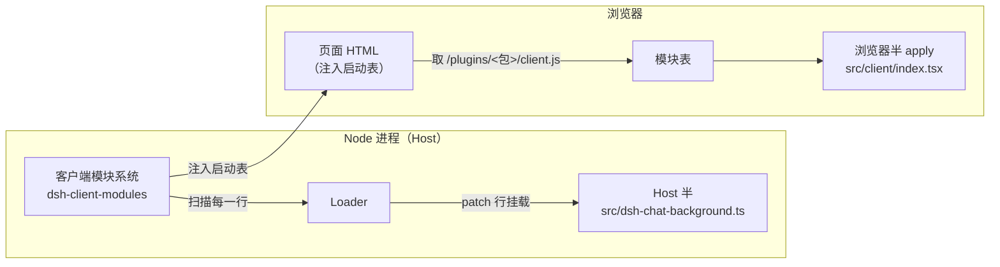
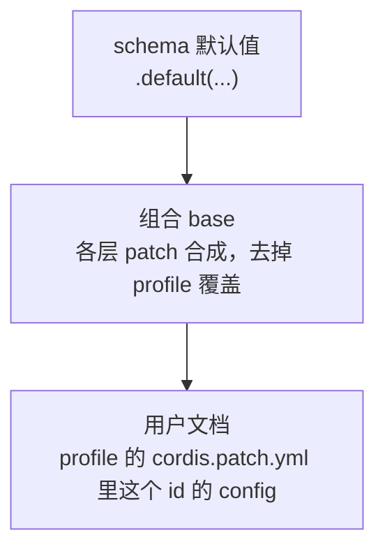

> **读完这篇你能**：把插件的配置项搬到设置页，同事在界面上改背景图、调透明度，不碰 `cordis.yml`；并且知道一个带界面的插件为什么要分 Host 与浏览器两半。
>
> **前置**：[不想每次重复讲规矩](13-不想每次重复讲规矩.md)。约 30 分钟。
>
> **示例代码**：[dsh-chat-background-settings](https://github.com/anthonyzhao-4926/blog/tree/main/code/dsh_plugin/dsh-chat-background-settings)

[让插件可配置](06-让插件可配置.md)把背景插件做成了可配置的：换图、调透明度不用改代码，在 profile 的 `cordis.patch.yml` 里写一段 `config` 就行。这套机制这篇原样保留——schema、层叠、非法值当场失败，一条都不动。

但插件给同事用时，「改 `cordis.yml`」本身就是门槛：他得找到 profile 目录、看懂 patch 语法、知道 `id` 不能写错、`config` 是整块替换——写错了插件还起不来。图片路径和透明度偏好每人不同，这些本该是「在界面上填个框」的事。

这篇给 06 的插件加一个人类用的界面。DSH 自带一个设置服务，能把插件 Config 里声明为「可现场改」的字段投影成表单；我们再给插件带上一小截浏览器代码，把表单挂到「插件」页上。同事打开页面、改值、保存，不碰任何 YAML。代码单独放在 `dsh_plugin/dsh-chat-background-settings/`。

## 目标

- 同一个背景插件，`image` / `opacity` 两个字段不变，升级成带设置页的版本：同事在侧边栏「插件」页打开它的配置页直接改。
- 同事拿到插件只跑一条 `./install.sh`，之后换图、调透明度全部在界面上完成。
- 保存即生效：值落进 profile 的 `cordis.patch.yml`（设置服务替你写），运行中的插件不重启就拿到新值。
- 06 的 `Config` + schema + 层叠规则全部保留；这篇讲的是同一条链上的新入口。

## 一个包两半

到目前为止，专栏里所有插件代码都跑在同一个地方：DSH 的 Node 进程（叫 Host）。它能读磁盘、注册 HTTP 路由，但它够不着浏览器里的页面——页面是 DSH 自己渲染的 React 应用，跑在另一个世界，那里没有 `node:fs`，也读不到你磁盘上的源码。

设置页是页面的一部分，所以插件要分两半：

- **Host 半**：就是原来那个插件（`src/dsh-chat-background.ts`），照旧由 Loader 按 patch 挂进 Host 进程。
- **浏览器半**：一个新文件（`src/client/index.tsx`），跑在浏览器里，负责把配置页挂到界面上。它也叫**客户端模块**——插件随包携带的、由页面加载的那一截代码。

谁把浏览器半送进页面？DSH 的**客户端模块系统**（`dsh-client-modules`，web 界面自带的服务）。它做三件事：扫描 Loader 已挂载的行，找出声明了「我有浏览器半」的包；把每个包的浏览器半构建产物挂到 `/plugins/<包名>/client.js` 路由上；每次渲染页面 HTML 时，把当前这张「包 → 脚本地址」的表注入页面（`window.__DSH_BOOT__`）。浏览器里的模块表按表取回脚本、登记，然后在浏览器侧的另一个 Cordis 上下文里跑浏览器半的 `apply`——两边都是 Cordis 插件，只是各跑各的进程。



行与包的归属是这样定的：扫描从每一行的模块文件往上找最近的 `package.json`，那个包就是这一行的身份。我们的行写的是 `src/dsh-chat-background.ts` 的绝对路径，往上走就是本包自己的 `package.json`——所以「我有浏览器半」的声明写在它身上就行。

浏览器半的生死跟着行走：行被停用（比如 03 篇的 `disabled: true`），它注册的配置页跟着消失；行回来，页面也回来。Host 半与浏览器半不需要互相 import——两边各跑各的 `apply`，靠 entry id 这个共同的名字在设置服务里会合。

04 篇的 `webserver/index-inject` 能往页面里注入样式和脚本，为什么设置页不走那条路？注入的是死内容，而设置页是活的：它要读当前值、提交修改、跟着页面的主题和语言走。这些是页面应用内部的活，得由跑在页面里的代码来做。

## `dsh.client` 与 `./client`

「我有浏览器半」的声明是 `package.json` 里的两个字段：

```json
"exports": {
  "./client": "./lib/client.js"
},
"dsh": {
  "bundle": { "patch": "./patch.yaml" },
  "client": { "platform": "web" }
}
```

- `dsh.client`：声明这个包有浏览器半，`platform: 'web'` 表示它给 web 界面用。扫描看到这个字段才会继续；声明了却找不到 `./client` 导出，启动时直接报错——启动期的失败是响亮的，不会静默跳过。运行期（比如热重载之后）某个包的浏览器半坏了，只记一条警告，不拖累其他包。
- `exports["./client"]`：浏览器半的**构建产物**地址。注意它指向 `lib/client.js` 而不是源码——页面加载的是打包后的文件，所以包里多了一步构建（下节）。

`dsh.bundle` 那行是 02 篇就有的老声明，不变。

## 浏览器半的构建

产物必须长成一个固定样子，页面的模块表才认得：一个 CJS 脚本，首尾把代码包进一次登记调用——

```js
window.__ModuleLoader__.load({ id: '<包名>', factory: (require) => {
  // …打包后的代码…
  return module.exports
} })
```

模块表按 `id` 登记 `factory`；插件被激活时调用它，并传入一个 `require`——页面已备好 `react`、`@deepseek-ai/cordis` 等平台基线模块，这个 `require` 能直接答它们。所以构建时这些包要保持外部引用，其余依赖一律打包进产物：模块表答不上的 `require` 在运行时直接抛错。格式选 `cjs` 也是跟着约定走：factory 约定用 `module.exports` 交出插件的导出。

DSH 仓库内部用 tsdown 的 `clientBundle` 预设产出这个格式，但预设不随 npm 发布；仓库外的包（比如我们的）要自己复现这份契约。`tsdown.config.ts` 全文：

```ts
/**
 * 浏览器半的构建配置：复现 clientBundle 预设的输出契约——
 * 一个 CJS 浏览器包，首尾包进 window.__ModuleLoader__.load({ id, factory })，
 * react 与 cordis 保持外部引用，由页面里的模块表提供。
 */
import { defineConfig } from 'tsdown'

export default defineConfig({
    entry: { client: 'src/client/index.tsx' },
    outDir: 'lib',
    format: 'cjs',
    platform: 'browser',
    dts: false,
    sourcemap: true,
    deps: {
        neverBundle: ['react', 'react/jsx-runtime', 'react-dom', '@deepseek-ai/cordis'],
    },
    outputOptions: {
        // 产物名固定为 lib/client.js：/plugins 路由的组合地址按 <包名>/client.js 拼。
        entryFileNames: 'client.js',
        intro: 'var module = { exports: {} }; var exports = module.exports;',
        banner: `window.__ModuleLoader__.load({ id: 'dsh-chat-background-settings', factory: (require) => {`,
        footer: 'return module.exports; } });',
    },
})
```

`pnpm run build` 跑一次就产出 `lib/client.js`。这是浏览器半与 Host 半的一个现实差别：Host 半走源码直载（07 篇的 tsx 钩子），浏览器半永远吃构建产物——改完 `src/client/` 要重新构建并重启 DSH，页面才会拿到新版本（产物的修订号取自文件元数据，启动或 HMR 监听通知时才重新读）。

## volatile 字段

设置服务不管插件的全部配置，只投影声明为 **volatile**（可现场改）的字段。06 的 schema 升级就一处：两个字段各加一个 `.volatile()`：

```ts
import type { Context, Volatile } from '@deepseek-ai/cordis'
import Schema from '@deepseek-ai/schemastery'

export interface Config {
    /** 背景图片的绝对路径。 */
    image: Volatile<string>
    /** 图片显示强度：0 完全透明，1 完全不透明。 */
    opacity: Volatile<number>
}

export const Config: Schema<Config> = Schema.object({
    image: Schema.string().default(DEFAULT_IMAGE).volatile(),
    opacity: Schema.number().min(0).max(1).default(0.35).volatile(),
})
```

类型跟着变：volatile 字段在 `apply` 里拿到的不是裸值，而是一个稳定引用，`config.image.get()` 读当前值。「稳定」的意思是值变了引用不变——插件不用重启，下一次 `.get()` 就是新值（怎么变的见「热提交」一节）。所以 Host 半里所有读配置的地方，从 06 的 `config.image` 改成 `config.image.get()`。

`Volatile` 类型从 `@deepseek-ai/cordis` 导出。普通字段（不加 `.volatile()`）一切照旧：不进设置页，只在 `cordis.yml` 里改，改了走普通重挂载。哪些字段该标 volatile？同事会现场调的（图、透明度）标上；影响插件加载行为的（比如依赖哪个服务）不要标—— volatile 提交不重启插件，需要重启才能生效的值放普通字段。

默认值的位置不变，还写在 schema 的 `.default(...)` 里：volatile 改的是「值怎么提交进运行中的插件」，层叠规则一条没动。同事什么都不填时，拿到的还是包内那张 `image.svg` 和透明度 0.35。

## 设置页的配对

设置服务（`dsh-settings`，web 界面自带）把每个活跃 entry 的 volatile 字段投影成一份表单，表单的 **namespace 就是这一行在 profile 里的 entry id**——我们是 `dsh-chat-background-settings`。不需要注册、不需要声明对应关系：行挂上了，namespace 就存在；行被停用，表单跟着消失。

页面这边，DSH 的「插件」页（侧边栏「插件」）给插件自己的配置留了三个挂载点：`plugins.item` 给安装自带的官方插件，`plugins.bundle.config` 给整个 bundle，`plugins.row.config` 给 bundle 里的一行。DSH 自带的那几个设置页（shell 执行器、agent loop 等）就是每个一个伴生包，挂在 `plugins.item` 上；我们的背景插件不是官方件，是自己 bundle 里的一行，用最细的那个挂载点，key 是 `<包名>#<行 id>`。浏览器半的全部工作，就是往这个槽位注册一个组件。`src/client/index.tsx` 全文：

```tsx
/**
 * 聊天背景插件的浏览器半：在 Plugins 页给本插件的那一行挂一个配置页。
 *
 * 这个文件不跑在 Node 里。它被打包成 lib/client.js，由客户端模块系统
 * （dsh-client-modules）送进浏览器，在页面里的另一个 Cordis 上下文上再跑
 * 一次 apply。页面通过 Plugins 页声明的 plugins.row.config 槽位挂上去；
 * Plugins 页按这一行的 entry id 找到设置服务里的同名 namespace，把该
 * namespace 的表单（state + mutate）作为 prop 喂给我们的组件。
 */
import { useState } from 'react'
import type { Context } from '@deepseek-ai/cordis'
// 只引入类型声明：ctx.slots 的 Context 合并，以及 SlotMap 里的
// 'plugins.row.config' 条目与页面 props 类型。运行时由模块表提供实现。
import type {} from '@deepseek-ai/dsh-client-ui-slots'
import type { ConfigPageForm, PluginConfigViewProps } from '@deepseek-ai/dsh-client-ui-plugin-manager/client'

/** 槽位 key：<包名>#<行 id>，行 id 以 bundle 的 patch.yaml 声明为准。 */
const SLOT_KEY = 'dsh-chat-background-settings#dsh-chat-background-settings'

export const inject = ['slots']

export function apply(ctx: Context): void {
    // slots.inject 等槽位声明出现再注册，槽位消失（或本插件卸载）时撤销。
    ctx.effect(() => ctx.slots.inject('plugins.row.config', () => ctx.slots.register({
        name: 'plugins.row.config',
        key: SLOT_KEY,
    }, BackgroundSettingsPage)))
}

/** 一行的配置页：view 是 'summary' 时渲染一句话，'page' 时渲染表单。 */
function BackgroundSettingsPage({ view, form }: PluginConfigViewProps) {
    if (view === 'summary') return <>背景图与透明度</>
    if (form === undefined) return null
    return <BackgroundForm form={form} />
}

function BackgroundForm({ form }: { form: ConfigPageForm }) {
    const [message, setMessage] = useState('')
    const { state } = form
    if (state.status !== 'ready' || state.value === undefined) return <p>正在读取当前配置…</p>
    const value = state.value as { image?: string, opacity?: number }
    return (
        // key=revision：保存被接受后 revision 增加，表单重挂载，输入框回到新值。
        <form key={state.revision} onSubmit={(event) => {
            event.preventDefault()
            const data = new FormData(event.currentTarget)
            void form.mutate([
                { op: 'set', path: ['image'], value: String(data.get('image')) },
                { op: 'set', path: ['opacity'], value: Number(data.get('opacity')) },
            ], state.revision).then((ok) => setMessage(
                ok ? '已保存，刷新页面看新背景。' : '保存被拒绝：值不合法，或配置刚在别处被改过。',
            ))
        }}>
            <p>
                <label>背景图路径 <input name="image" size={40} defaultValue={value.image} /></label>
            </p>
            <p>
                <label>透明度（0–1） <input name="opacity" type="number" min={0} max={1} step={0.05} defaultValue={value.opacity} /></label>
            </p>
            <button type="submit" disabled={!state.writable}>保存</button>
            <p>{message}</p>
        </form>
    )
}
```

配对的最后一环由「插件」页完成：它按行的 entry id 去设置服务找同名 namespace，找到就把这份表单作为 `form` prop 喂给我们的组件。同一个组件会被渲染两次：`view` 是 `'summary'` 时要一句话摘要（行的描述缺省时顶上去），是 `'page'` 时才是表单。组件拿到两样东西：

- `form.state`：当前值（`value`）、分层信息（`base` / `user`，下节讲）、`revision`（版本号，写的时候回传，防止覆盖别人刚改的值）、`writable`（这个 profile 接不接受写入）。
- `form.mutate(ops, revision)`：提交一组字段修改。`ops` 是逐路径的（`set` / `unset`），不用整表回传；Host 收到后先用插件的完整 Config schema 校验，非法值直接拒绝，文件和运行值都不动。

注册用的是 `ctx.slots.inject` 而不是直接 `ctx.slots.register`：槽位由「插件」页声明，声明顺序不由我们控制，`inject` 等它出现再注册，它消失时撤销我们的贡献——09 篇「监听器的归属」那一套，在浏览器里同样成立。

组件本身是最小形态：两个输入框、一个保存按钮，故意不用任何组件库——槽位、`form`、namespace 这三样才是本篇的机制，React 部分换成你喜欢的任何写法都行。

## 装配

```text
dsh-chat-background-settings/       ← 插件包（bundle）
├── src/
│   ├── dsh-chat-background.ts      ← Host 半：Config（volatile）+ apply
│   ├── style.css                   ← 背景样式（同 06）
│   └── client/
│       └── index.tsx               ← 浏览器半：注册配置页
├── image.svg                       ← 默认背景图（包内自带）
├── package.json                    ← dsh.bundle + dsh.client + ./client 导出
├── patch.yaml                      ← 挂载指令（install.sh 生成）
├── tsconfig.json
├── tsdown.config.ts                ← 浏览器半的构建
└── install.sh
```

`package.json` 全文：

```json
{
  "name": "dsh-chat-background-settings",
  "version": "0.1.0",
  "type": "module",
  "exports": {
    "./client": "./lib/client.js"
  },
  "dsh": {
    "bundle": {
      "patch": "./patch.yaml"
    },
    "client": {
      "platform": "web"
    }
  },
  "scripts": {
    "build": "tsdown"
  },
  "dependencies": {
    "@deepseek-ai/cordis": "^4.0.1",
    "@deepseek-ai/cordis-plugin-loader": "^1.0.5",
    "@deepseek-ai/dsh-host-webserver": "^0.2.0-rc.2",
    "@deepseek-ai/schemastery": "^3.18.2"
  },
  "devDependencies": {
    "@deepseek-ai/dsh-client-ui-plugin-manager": "^0.2.0-rc.2",
    "@deepseek-ai/dsh-client-ui-slots": "^0.2.0-rc.2",
    "@types/react": "~18.3.1",
    "react": "^18.2.0",
    "tsdown": "^0.22.2"
  }
}
```

依赖分两边：Host 半的运行时依赖（cordis、schemastery、webserver 的类型）在 `dependencies`；浏览器半的依赖全是 `devDependencies`——`react` 和 cordis 在浏览器里由模块表提供，两个 `dsh-client-*` 包只引入类型（`import type`，构建时被剥掉），`tsdown` 是构建工具。

Host 半相对 06 的改动都在前面讲过了：`Config` 加 `.volatile()`，读配置改 `.get()`，再加一行监听器看热提交。全文：

```ts
// src/dsh-chat-background.ts
/**
 * 聊天背景插件（设置页版）的 Host 半：注册图片路由、往页面注入样式。
 *
 * 与 06 篇的 dsh-chat-background-config 是同一个插件，差别只有一处：两个
 * 配置字段声明成 .volatile()。volatile 字段会被设置服务投影成设置页上的
 * 表单项（namespace 就是 profile 里这一行的 entry id），同事在界面上改，
 * 不碰 cordis.yml；写入后 Loader 做 volatile 提交，不重启本插件，新值直接
 * 进入运行中的引用。
 *
 * 这个文件跑在 Node 里（Host 进程）；浏览器里的设置页在 src/client/ 下。
 */
import { readFileSync } from 'node:fs'
import { readFile } from 'node:fs/promises'
import { extname } from 'node:path'
import type { Context, Volatile } from '@deepseek-ai/cordis'
import Schema from '@deepseek-ai/schemastery'
// 只引入类型声明：loader/volatile-update 的事件类型由 loader 包合并进来。
import type {} from '@deepseek-ai/cordis-plugin-loader'
import type {} from '@deepseek-ai/dsh-host-webserver'

export const name = 'dsh-chat-background-settings'

// 默认图是包内自带的 svg；同事在设置页填自己图片的绝对路径来覆盖它。
const DEFAULT_IMAGE = new URL('../image.svg', import.meta.url).pathname
// 路由地址不含扩展名：图片路径可配，Content-Type 按配置里那个文件的扩展名走。
const IMAGE_URL = '/dsh-chat-background-settings/image'

/** 允许的图片扩展名 → Content-Type。 */
const CONTENT_TYPES: Record<string, string> = {
    '.jpg': 'image/jpeg',
    '.jpeg': 'image/jpeg',
    '.png': 'image/png',
    '.webp': 'image/webp',
    '.gif': 'image/gif',
    '.svg': 'image/svg+xml',
}

export interface Config {
    /** 背景图片的绝对路径。 */
    image: Volatile<string>
    /** 图片显示强度：0 完全透明，1 完全不透明。 */
    opacity: Volatile<number>
}

export const Config: Schema<Config> = Schema.object({
    image: Schema.string().default(DEFAULT_IMAGE).volatile(),
    opacity: Schema.number().min(0).max(1).default(0.35).volatile(),
})

export function apply(ctx: Context, config: Config): void {
    // volatile 字段拿到的是稳定引用，读 .get() 永远是最新值：
    // 路由每次请求读一次，设置页保存后的下一次请求就用新图。
    ctx.inject(['webServer'], (serverCtx) => {
        ctx.effect(() => serverCtx.webServer.register({
            kind: 'exact',
            path: IMAGE_URL,
            handler: async (_req, res) => {
                const image = config.image.get()
                const contentType = CONTENT_TYPES[extname(image).toLowerCase()]
                    ?? 'application/octet-stream'
                res.writeHead(200, { 'content-type': contentType })
                res.end(await readFile(image))
            },
        }))
    })

    // 样式在每次页面渲染时重新生成，所以透明度保存后刷新页面即生效。
    ctx.on('webserver/index-inject', (table) => {
        table.push({ kind: 'style', text: buildStyle(config.opacity.get()) })
    })

    // volatile 提交成功时 Loader 向本插件派发这个事件，参数是变了的字段路径。
    // 07 篇说过 ctx.logger 不往终端打，要肉眼可见的证据就自己 console.log。
    ctx.on('loader/volatile-update', (paths) => {
        console.log(`[${name}] 设置已热提交：${paths.map((path) => path.join('.')).join(', ')}`)
    })
}

/** 用配置值生成样式：静态选择器来自 style.css，只有遮罩浓度随配置变化。 */
function buildStyle(opacity: number): string {
    const veilPercent = Math.round((1 - opacity) * 100)
    const veil = `color-mix(in srgb, var(--dsw-alias-bg-base) ${veilPercent}%, transparent)`
    const styleSheet = readFileSync(new URL('./style.css', import.meta.url), 'utf8')
    return `:root { --dsh-chat-background-veil: ${veil}; }\n${styleSheet}`
}
```

`style.css` 与 06 相同（遮罩变量 `--dsh-chat-background-veil` 由 Host 半注入），只有图片地址换成 `/dsh-chat-background-settings/image`。

`install.sh` 比 06 多一步构建浏览器半；不写 profile 覆盖层——配置留给设置页，`cordis.patch.yml` 里还留着 08 篇的换源配置。跑完后 `patch.yaml` 被生成为：

```yaml
- insert:
    - id: dsh-chat-background-settings
      name: '/绝对路径/dsh-chat-background-settings/src/dsh-chat-background.ts'
```

`install.sh` 本身：

```bash
#!/usr/bin/env bash
set -euo pipefail

DIR="$(cd "$(dirname "${BASH_SOURCE[0]}")" && pwd)"

cd "$DIR"
pnpm install

# 浏览器半：产出 lib/client.js（dsh.client 声明的 ./client 导出指向它）。
pnpm run build

# patch.yaml 里的插件行要写绝对路径，按本机位置重新生成。
cat > patch.yaml <<EOF
- insert:
    - id: dsh-chat-background-settings
      name: '$DIR/src/dsh-chat-background.ts'
EOF

dsh plugin --profile test add "link:$DIR"
```

同事那边拿到这个目录，跑这一条就装完；之后的每次换图都在界面上。

## 配置的层叠

设置页读到的 `value` 不是某一层的内容，是三层叠完的结果，顺序就是 06 讲的那条链：



`form.state` 里 `base` 和 `user` 分开放，好让页面区分「这个值是组合来的」还是「用户改过的」——一个字段出现在 `user` 里就算用户覆盖，哪怕值跟默认一样。`--dump-config` 打印的合成结果和设置页读到的 `value` 是同一条链的两个视图，可以对着看。

保存 = 设置服务把值写进**用户文档那一层**，也就是 `~/.dsh/profiles/test/cordis.patch.yml` 里我们这个 id 下的 `config` 块。06 里同事手写的那个块，现在由界面替他写，格式一字不差——写完你去打开那个文件，看到的就是 06 的写法。更高层（home patch、命令行 `--patch`）的优先级不变：会被它们盖住的写入，保存时直接拒绝。页面上的「重置」则是删掉用户层，值回落到组合 base 和 schema 默认值。

## 热提交

06 说过改 `cordis.yml` 保存即生效（配置热重载）。设置页写入走的也是这条路，但 volatile 字段多一条更快的通道：Loader 比较前后两份 config，发现**只有 volatile 字段变了**时，做 **volatile 提交**——不重启插件，把新值直接提交进运行中的引用，然后向本插件派发 `loader/volatile-update`，参数是变了的字段路径。这个事件只派给拥有这份配置的插件自己，别的插件收不到。

Host 半里留了一行监听器，保存后终端会打：

```text
[dsh-chat-background-settings] 设置已热提交：image, opacity
```

生效时机按读法分：图片路由每次请求读 `config.image.get()`，下一次请求就是新图；样式在每次页面渲染时生成，所以透明度在刷新页面后看到。

两个边界情况。一是非法候选值：Loader 提交前也会过一遍 schema，不合法就记一条日志、保持运行值不变——不过设置页写入前 Host 已用完整 Config 校验过，这条路走到 Loader 时总是合法的，只有手改 `cordis.yml` 的人才可能触发。二是普通字段：volatile 提交只发生在「只有 volatile 字段变了」的时候；一次改动里混着普通字段，整个走普通重挂载——插件重启，那是普通字段的既有待遇，不是设置页的限制。

## 安装与验证

```bash
cd dsh_plugin/dsh-chat-background-settings && ./install.sh
dsh --profile test --dump-config | grep -A3 'id: dsh-chat-background-settings'
dsh --profile test --no-open
```

`--dump-config` 里能看到这一行已经挂上：

```yaml
# == dsh-chat-background-settings
- id: dsh-chat-background-settings
  name: >-
    file:///绝对路径/dsh-chat-background-settings/src/dsh-chat-background.ts
```

打开侧边栏「插件」，在 Installed 里找到 `dsh-chat-background-settings`，它那一行上有 Configure；打开就是表单。把透明度改成 0.6 保存，然后核对三处：

- 终端打出 `[dsh-chat-background-settings] 设置已热提交：opacity`；
- `~/.dsh/profiles/test/cordis.patch.yml` 里多出 `- id: dsh-chat-background-settings` 的 `config` 块；
- 刷新页面，背景变浓。

第二处展开看，就是 06 里手写的那种块，只是由设置服务代笔：

```yaml
- id: dsh-chat-background-settings
  config:
    opacity: 0.6
```

再把透明度填成 1.5 保存：被拒绝，patch 文件不变。06 的「非法配置当场失败」在设置页这条路上同样成立，只是失败发生在保存时而不是加载时。

最后验证一次生命周期：在 `cordis.patch.yml` 里给这一行加 `disabled: true`，保存后「插件」页上 Configure 消失；删掉再保存，页面回来。浏览器半的注册跟着行走，不用自己收拾。

## 注意事项

- **跟 06 的插件二选一。** 两套都挂着时，两边往同一个布局根注入背景样式，后注入的盖住前面的。用[改掉 DSH 的默认装配](03-改掉DSH的默认装配.md)里那招停用旧的那份（`- id: dsh-chat-background-config` + `disabled: true`）。
- **图片路径写绝对路径。** 06 的老规矩在设置页里一样成立：`readFile` 解析相对路径的基准是 DSH 进程的工作目录，不稳定；表单里直接填绝对路径。
- **只有 volatile 字段进设置页。** 普通字段仍走 `cordis.yml`，06 的机制对它们原样有效。两条路改的是同一个 id 的同一份 config，不冲突。
- **密钥类字段不进表单。** schema 里标了 `role('secret')` 的值不会出现在表单响应里，页面只拿得到「有没有设过」的标记；本插件没有这类字段，真有时用它标上。
- **一个包一个浏览器半。** 客户端模块系统按包名登记浏览器半；同一个包拆成多行时，浏览器半挂在包名那一行上，从子路径导出挂载的行不携带浏览器半。哪个子插件的页面需要独立存续，就把它拆成自己的包。
- **entry id 要能被 profile 唯一寻址。** 设置服务只投影这样的 entry；我们的行由 bundle 的 patch 插进根树，满足。嵌套 include 里各层自己的配置不在这条路上，仍只能改文件。
- **改完 `src/client/` 要重新 `pnpm run build` 并重启。** 页面吃的是 `lib/client.js`，不是源码。本演示的 tsdown 配置是输出契约的最小复现；仓库内的 `clientBundle` 预设还处理 CSS 模块、sourcemap 链接这些，插件做大了可以照着补。
- **表单也能自动生成，但还没人实现。** 设置服务给每份表单带一个 `autoGenerate` 策略位（默认开），留给「按 schema 自动生成页面」的客户端；DSH 自带的客户端目前都没有实现自动生成，所以页面得自己写。写了页面的插件可以用 `ctx.settings.configure({ auto: false })` 显式声明这个策略。

---

**下一篇**：[在界面上看自己的数据](15-在界面上看自己的数据.md)——把 Host 里的数据经 `/api` 路由接到页面上，在设置页或侧边栏看自己插件攒下的数据。

profile 目录里哪些文件能改、patch 怎么合成，见[profile 与插件包结构](参考/profile与插件包结构.md)；`ctx` 上还有哪些能力，见 [Cordis API 文档](../dsh/cordis_api.md)。
