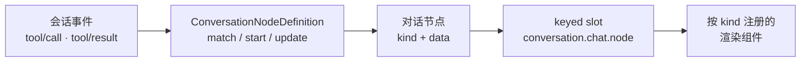

> **读完这篇你能**：给 `note_search` 的工具结果注册一张卡片——每条命中一张、能点开文件、能把「再搜相关笔记」送回会话；并且知道对话里的一个节点从会话事件到渲染组件的完整链路。
>
> **前置**：[在界面上看自己的数据](15-在界面上看自己的数据.md)。约 30 分钟。
>
> **示例代码**：[dsh-note-card](https://github.com/anthonyzhao-4926/blog/tree/main/code/dsh_plugin/dsh-note-card)

10 篇给模型加了 `note_search`：在笔记目录里按关键词搜，返回命中列表。功能有了，但结果在界面上是一坨等宽文本——路径不能点，行号没法跳，想让它"顺着这条命中再搜一轮"得自己打字。

这篇把这坨文本渲染成卡片：每条命中一张，点路径打开文件，点按钮把后续动作送回会话。

## 目标

- 一个客户端插件，把 `note_search` 的工具结果渲染成卡片列表：每条命中一张卡片，显示路径、行号、片段。
- 卡片上两个动作：「打开」在编辑器里跳到命中行；「再搜相关笔记」把一句话送回会话排队。
- 全部代码在 `dsh_plugin/dsh-note-card/`，装进前几篇一直在用的 test profile。

## 对话里的一个节点是怎么来的

先讲机制，再写代码。09 篇说过：会话里发生的每件事都会落盘成一条**会话事件**（`tool/call`、`tool/result`、`assistant/message`……）。界面上的对话不是"渲染模型的输出"，而是**重放这些事件**：



- **定义（Definition）**：业务包注册一个 `ConversationNodeDefinition`，回答三个问题——这条事件归哪个节点（`match` 从事件里提取稳定 id）、节点状态怎么随事件折叠（`start` / `update`）、最终产出什么节点数据（`buildViewNode`）。注册入口是 `ctx.uiConversation.events.register()`。
- **节点**：定义产出一个带 `kind` 和 `data` 的对象。`kind` 是分发键，`data` 是渲染要用的全部数据。
- **渲染**：聊天区是一个 keyed slot `conversation.chat.node`——按节点的 `kind` 找到注册的组件，把节点交给它。14 篇讲的 slot 机制在这里原样适用。

工具调用不需要我们自己写定义：内置的 `tool-call` 定义（仓库 `packages/client/ui-chat/src/client/conversation-nodes/tool.ts`）已经把 `tool/call` 和 `tool/result` 按 callId 配对、折叠成节点；渲染它的 ui-tool 包又往下分了一级——按**工具的 wire 名字**把每次调用分发到 keyed slot `tool.call.toolview`，没注册名字的工具走通用卡片。所以我们的插件只做最后一步：往 `tool.call.toolview` 里注册 `key: 'note_search'` 的组件。

什么时候才需要自己写 `ConversationNodeDefinition`？当卡片的数据**不是**某次工具调用——比如一个跨多轮、有开始/进度/结束三条事件的评审任务，内置定义不认识它，才轮到你声明自己的事件族和折叠逻辑。本篇的场景用不上，知道这条缝在哪就够了。

## 数据为什么从会话事件来

卡片要显示"路径、片段、行号"，这些从哪来？不能从工具函数来——浏览器端根本不执行工具。09 篇在 host 侧订阅的 `session/event` 是"记录已提交"的通知；浏览器侧拿到的是同一批事件的传输窗口：刷新页面、换个浏览器打开同一会话，界面必须能从会话日志重建出一样的对话。所以卡片的数据只能来自事件里持久化下来的东西。

一条 `tool/result` 事件里有两份数据：

| 字段 | 内容 | 给谁看 |
| --- | --- | --- |
| `content` | 工具结果的文本形态 | 模型（也给没注册卡片的界面兜底） |
| `meta` | 工具用 `output.presentationMeta(args, value)` 投影出的结构化 JSON | 界面卡片 |

`presentationMeta` 是 10 篇 `defineTool` 里 `output` 上的一个可选方法：工具执行完，它把"卡片需要的结构化事实"从结果值里投出来，由内核持久化到 `tool/result` 事件上。10 篇的 `note_search` 把命中列表原样投了一份：

```ts
// 10 篇 dsh-note-search 的工具定义里（delta）
output: {
    render: (value) => /* …给模型看的文本… */,
    presentationMeta: (_args, value) => ({ hits: value.hits }), // 给界面卡片
}
```

这就是跨进程的契约：host 侧工具投影 `meta`，浏览器侧卡片从 `block.meta` 读回来。两边只认这个 JSON 形状，谁也不 import 谁的实现。

## 目录结构

```text
dsh-note-card/                        ← 插件包（bundle）
├── src/
│   ├── index.ts                      ← 宿主半：空 apply，让本包成为 Loader 条目
│   └── client/
│       ├── index.ts                  ← 浏览器半：注册卡片
│       └── NoteSearchCard.tsx        ← 卡片组件
├── build.mjs                         ← 把浏览器半打成 lib/client.js
├── package.json                      ← dsh.bundle + dsh.client 声明
├── patch.yaml
├── tsconfig.json
└── install.sh
```

一个包两半的结构是 13 篇的事：宿主半被 Loader 加载，浏览器半（`src/client/`）打成 `lib/client.js`，靠 package.json 里的 `dsh.client` 声明和 `exports["./client"]` 导出交给客户端模块系统——扫描与加载是 14 篇讲的。这里只补前半句：宿主半的 `apply` 是空的，它存在的意义是让包出现在 Loader 条目里，扫描才有起点。

```ts
// src/index.ts 全文
import type { Context } from '@deepseek-ai/cordis'

export const name = 'dsh-note-card'

export function apply(_ctx: Context): void {}
```

## 浏览器半的构建

页面不认识 `node_modules`，也不认识 TSX。`lib/client.js` 必须是一个自包含的闭包工厂：整份文件调用一次 `window.__ModuleLoader__.load({ id, factory })`，`factory` 里用注入的 `require` 取模块。`react`、`@deepseek-ai/cordis` 这些由模块表提供（平台模块），不能打进产物——打进去就是页面里的第二份 React。`build.mjs` 全文：

```js
import { build } from 'esbuild'

await build({
    entryPoints: ['src/client/index.ts'],
    outfile: 'lib/client.js',
    bundle: true,
    format: 'cjs',
    platform: 'browser',
    target: 'es2024',
    sourcemap: true,
    jsx: 'automatic',
    external: [
        'react',
        'react/jsx-runtime',
        'react-dom',
        'react-dom/client',
        '@deepseek-ai/cordis',
        '@deepseek-ai/dsh-client-store',
        '@deepseek-ai/dsh-client-ui-slots',
        '@deepseek-ai/dsh-client-ui-primitives',
        '@deepseek-ai/dsh-client-ui-dockkit',
    ],
    banner: {
        js: 'window.__ModuleLoader__.load({ id: "dsh-note-card", factory: (require) => {\n'
            + 'var module = { exports: {} }; var exports = module.exports;',
    },
    footer: { js: 'return module.exports; } });' },
})
```

两处要说明：

- **`external` 清单就是平台模块清单。** 这些名字由 DSH 的模块表回答，`require('react')` 拿到的是页面里那一份 React。清单之外的依赖（本篇没有）全部内联进产物。
- **banner / footer 是格式要求。** esbuild 的 CJS 产物读写 `module.exports`，浏览器里没有这个变量，所以 banner 里先造一个；整个产物被包进 `window.__ModuleLoader__.load({...})` 的调用里，`id` 必须和 package.json 的包名一致。

## 卡片组件

`src/client/NoteSearchCard.tsx` 全文：

```tsx
/**
 * note_search 的卡片：每条命中一行，能打开文件，也能把后续动作送回会话。
 *
 * 组件是纯渲染：数据全部来自 props。工具结果在 block 里（会话事件投影的
 * 产物），打开文件的 openFile 是 slot 属主给的，送回会话的 sendPrompt 是
 * 注册时 inject 工厂注入的。组件里不读会话、不做 IO。
 */
import type { ToolCallPhaseProps, ToolCallViewProps } from '@deepseek-ai/dsh-client-ui-tool/client'

/** 一条命中：与 10 篇 note_search 的 output.presentationMeta 投影约定一致。 */
interface NoteSearchHit {
    readonly path: string
    readonly line: number
    readonly snippet: string
}

/** 注册时 inject 工厂注入的回调（见 index.ts）。 */
export interface NoteSearchCardInjected {
    /** 把一句话送回会话：'queue' 排成下一轮，'steer' 打断当前轮。 */
    readonly sendPrompt: (text: string, mode: 'queue' | 'steer') => void
}

type NoteSearchCardProps = ToolCallViewProps & NoteSearchCardInjected

/** result 阶段的 block：已配对的工具结果节点。 */
type ResultBlock = Extract<ToolCallPhaseProps, { readonly phase: 'result' }>['block']

/**
 * 从持久化的 result.meta 里校验出命中列表。meta 是会话日志里的数据——旧
 * 会话、别的版本写下的形状都可能不符；不符就返回 null，调用方退回原文。
 */
function readHits(meta: unknown): NoteSearchHit[] | null {
    if (typeof meta !== 'object' || meta === null) return null
    const hits = (meta as { readonly hits?: unknown }).hits
    if (!Array.isArray(hits)) return null
    const valid = hits.filter((hit): hit is NoteSearchHit =>
        typeof hit === 'object' && hit !== null
        && typeof (hit as NoteSearchHit).path === 'string'
        && typeof (hit as NoteSearchHit).line === 'number'
        && typeof (hit as NoteSearchHit).snippet === 'string')
    return valid.length === hits.length ? valid : null
}

/** content 里给模型看的那份文本，meta 缺席时的退路。 */
function resultText(block: ResultBlock): string {
    return block.content.map(part => (part.type === 'text' ? part.text : '')).join('\n')
}

export function NoteSearchCard(props: NoteSearchCardProps) {
    // 调用还在准备或进行：一行占位。结果到了，这个组件会拿着新 block 重渲染。
    if (props.phase !== 'result') {
        return <div style={{ opacity: 0.6, fontSize: 12 }}>{props.toolName} 搜索中…</div>
    }
    const { block } = props
    // 失败调用与 meta 形状不符的结果，都退回 content 原文——卡片是增强，不是门槛。
    const hits = block.isError ? null : readHits(block.meta)
    if (hits === null) {
        return <pre style={{ margin: 0, whiteSpace: 'pre-wrap', fontSize: 12 }}>{resultText(block)}</pre>
    }
    return (
        <div style={{ display: 'flex', flexDirection: 'column', gap: 6, fontSize: 12 }}>
            {hits.map(hit => (
                <div
                    key={`${hit.path}:${hit.line}`}
                    style={{ border: '1px solid var(--dsw-line, #444)', borderRadius: 8, padding: '6px 10px' }}
                >
                    <button
                        style={{ cursor: 'pointer', border: 'none', background: 'none', padding: 0, color: 'inherit', textDecoration: 'underline' }}
                        onClick={() => props.openFile(hit.path, { line: hit.line })}
                    >
                        {hit.path}:{hit.line}
                    </button>
                    <div style={{ opacity: 0.75, marginTop: 2 }}>{hit.snippet}</div>
                </div>
            ))}
            {hits.length > 0 && (
                <button
                    style={{ alignSelf: 'flex-start', cursor: 'pointer', borderRadius: 6, padding: '2px 10px' }}
                    onClick={() => props.sendPrompt(
                        `用 note_search 再搜一些和「${hits[0]!.path}」相关的笔记`, 'queue',
                    )}
                >
                    再搜相关笔记
                </button>
            )}
        </div>
    )
}
```

四处要说明：

**props 的三个来源。** `block`、`toolName`、`openFile` 是 slot 属主（ui-tool）给的；`sendPrompt` 是我们注册时 inject 的（下一节）；组件自己碰不到 `ctx`——客户端的规矩是组件只从 props 拿数据和回调，谁要给它新东西，谁去注册那一侧注入。

**phase。** 一次调用有三个阶段：`preparing`（参数还在流式生成）、`start`（已派发、等结果）、`result`（已落定）。卡片只关心 `result`；前两个阶段渲染一行占位，结果到了组件会拿着新 `block` 重渲染——同一个组件在实时流和历史重放两条路径上跑的是同一份代码。

**`readHits` 是校验，不是类型断言。** `meta` 来自会话日志：几天前写下的旧会话、别的版本投影的形状，都可能和今天的不一样。逐字段校验，不符就退回 `content` 原文。`as NoteSearchHit[]` 在这种边界上是撒谎。

**`openFile`。** slot 属主给的回调，`openFile(path, { line })` 让支持它的编辑器打开文件并跳到行——04 篇那种"插件影响界面"在这里反过来：界面把能力借给插件。

## 注册与回送

`src/client/index.ts` 全文：

```ts
/**
 * 浏览器半：把 note_search 的工具结果渲染成卡片。
 *
 * 挂的是 keyed slot `tool.call.toolview`：ui-tool 渲染每一次工具调用时，按
 * 工具的 wire 名字分发到这个 slot。key 写 'note_search' 就只接管
 * note_search 的卡片，别的工具照旧走通用卡片。
 */
import type { Context } from '@deepseek-ai/cordis'
// 只引入类型声明：ctx.sessions 与 tool.call.toolview 的 SlotMap 增强，
// 编译后剥离，运行时由 DSH 的模块表提供实现。
import type {} from '@deepseek-ai/dsh-api-session-controller/client'
import type {} from '@deepseek-ai/dsh-client-ui-tool/client'
import { NoteSearchCard, type NoteSearchCardInjected } from './NoteSearchCard.tsx'

export const inject = ['slots', 'sessions']

export function apply(ctx: Context): void {
    // ctx.slots.inject 等 ui-tool 把 tool.call.toolview 声明出来再执行回调；
    // 它卸载时这次注册跟着撤（14 篇讲过的声明生命周期）。
    ctx.slots.inject('tool.call.toolview', () => ctx.slots.register({
        name: 'tool.call.toolview',
        key: 'note_search',
        // session 作用域的 inject 工厂会收到当前 sessionId。送回会话的通道
        // 在这里闭包进组件 props——组件本身永远碰不到 ctx。
        inject: (sessionId): NoteSearchCardInjected => ({
            sendPrompt: (text, mode) => {
                void ctx.sessions.binding(sessionId)?.session.prompt([{ type: 'text', text }], mode)
            },
        }),
    }, NoteSearchCard))
}
```

三处要说明：

**key 是工具的 wire 名字。** `note_search` 一个字符都不能错；写错不报错，只是永远不渲染。注册一个已被占用的 key 会替换掉原来的视图——内置工具的内置卡片也是这么被换掉的。

**inject 工厂拿到 `sessionId`。** session 作用域的 slot，注册时的 `inject` 工厂会收到当前会话的 id；它返回的对象原样并进组件 props。`sendPrompt` 的闭包里有 `ctx.sessions`：按 id 借到当前会话的绑定，调 `session.prompt(content, mode)`。卡片还挂在屏幕上，会话绑定就一定被界面持有着，所以这里用借用语义的 `binding()` 而不是自己 retain。

**`mode` 的两个取值就是 host 侧的两个动词。** `session.prompt(content, 'queue')` 到了 host 是 `agent.followup(message)`——排成一条普通的下一轮提示词并唤醒；`'steer'` 是 `agent.steer(message)`——打断当前轮，在下一个 step 边界被模型读到（映射在 `packages/api/session-controller/src/commands.ts`，两个动词的契约在 `packages/core/agent`）。卡片替用户发话用 `'queue'`：把"再搜相关笔记"排进会话，聊完当前这轮再执行；`'steer'` 留给"立刻纠偏"的场景，别替用户打断正在跑的事。

## 装配

`patch.yaml` 插一行，指向宿主半：

```yaml
- insert:
    - id: dsh-note-card
      name: '/绝对路径/dsh-note-card/src/index.ts'
```

`install.sh` 做三件事：装依赖、构建浏览器半、装配。和 09 篇一样，它不写 profile 覆盖层——这个插件没有配置项。

```bash
#!/usr/bin/env bash
set -euo pipefail
cd "$(dirname "$0")"
pnpm install
# 浏览器半的产物：改了 src/client/ 之后要重跑这一步，页面拿到的才是新代码
pnpm run build
dsh plugin --profile test add link:.
```

```bash
cd dsh_plugin/dsh-note-card && bash install.sh
```

## 验证

装配看起来对：

```bash
dsh --profile test --dump-config | grep -A2 dsh-note-card
```

```yaml
- id: dsh-note-card
  name: >-
    file:///绝对路径/dsh-note-card/src/index.ts
```

界面验证要模型真的用一次 `note_search`。web 起起来，对模型说一句"用 note_search 在我的笔记里找 XX"。结果落定后，那一坨等宽文本变成一列卡片：点卡片上的 `路径:行号`，编辑器打开文件并跳到命中行；点「再搜相关笔记」，输入框没动，但会话里多了一条排队的用户消息，当前轮结束后它作为下一轮被模型读到。

刷新页面再打开同一会话，卡片还在——它重放的是 `tool/result` 事件里的 `meta`，不是任何内存里的东西。

改了 `src/client/` 下的代码要重跑 `pnpm run build` 再刷新页面：页面加载的是 `lib/client.js` 这个产物，不是源码。

## 注意事项

- **`meta` 是持久化数据。** 改 `presentationMeta` 的投影形状就是改会话日志里写下的格式：旧会话重放时，新卡片读到的是旧 `meta`，校验必须失败得起（本篇退回原文）。所以投影加字段比改字段安全，卡片读数据永远先校验。
- **卡片组件是纯渲染。** 不读会话状态、不发请求、不读时钟；数据来自 props，动作来自注入的回调。这不是风格要求：同一个组件要在实时流和历史重放两条路径上渲染出一样的结果，组件自己藏了数据源，两条路径就会分叉。
- **模型看不到卡片。** 卡片是给人看的；模型看到的永远是 `output.render` 产出的 `content` 文本。所以那份文本必须自足——"命中列表在卡片里"这种话模型收不到。
- **卡片只在 web 客户端生效。** headless / SDK 没有界面，工具结果照旧是 `content` 那份文本。卡片是增强，不是结果的一部分。
- **样式从简是故意的。** demo 用内联样式保持最小；真实插件用 CSS Modules 和 `--dsw-*` 设计变量（仓库 `docs/web-styling.md`），产品文案还要进本地化字典——那是客户端代码的完整规矩，本篇不展开。

---

**主线到此结束（本栏目前写到 15）。** 到这里，我们自己的插件能挂载、能动 UI、能清理、能配置、能热重载，能把 DSH 的某项能力换成自己的实现，能订阅内部事件，能给模型加工具、能拦截工具调用，能把规矩沉淀成 skill，能有自己的设置页，能在界面上展示自己的数据，也能把工具结果渲染成可点的卡片。

中间跳过的可以回头补：[让模型用上我自己的功能](11-让模型用上我自己的功能.md)、[在界面上看自己的数据](15-在界面上看自己的数据.md)。

卡片渲染依赖的 profile 目录结构与 patch 合成规则，见[profile 与插件包结构](参考/profile与插件包结构.md)；`ctx` 上还有哪些能力，见 [Cordis API 文档](../dsh/cordis_api.md)。
