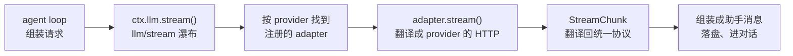
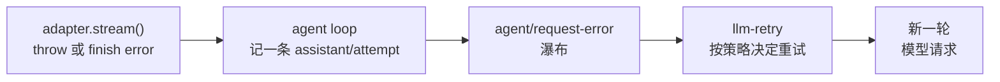

> **读完这篇你能**：写一个自己的模型提供方——把 DSH 的消息与流协议翻译成某个 HTTP 接口能听懂的格式——并且知道错误、重试、空补全这些边界该由谁负责。
>
> **前置**：[把工具结果渲染成卡片](16-把工具结果渲染成卡片.md)。约 35 分钟。
>
> **示例代码**：[dsh-llm-ollama](https://github.com/anthonyzhao-4926/blog/tree/main/code/dsh_plugin/dsh-llm-ollama)

前面 16 篇里，模型一直是 DSH 自带的那个：provider 路由叫 `deepseek-official`，模型名是 `deepseek-flash` 这类。想换成跑在本机的 Ollama，或者公司内网的网关，改个名字是不够的——那些端点收发的 JSON 跟 DSH 内部说的话不一样，中间得有人翻译。

翻译这层就是 **LLM adapter**。它是 08 篇那套三件套里的提供方角色：`ctx.llm` 是服务定义，agent loop 是消费者，adapter 夹在两者之间，一边是 DSH 的消息与流协议，一边是某家 provider 的 HTTP 接口。

这篇写一个接本地 Ollama 的 adapter。写完你会知道：一次模型请求在 DSH 里长什么样、一个 adapter 最少要实现什么、以及"错误该不该重试"这类决定为什么不在 adapter 手里。

## 目标

- 一个插件 `dsh-llm-ollama`，注册一条 provider 路由 `ollama`，把请求转发到 `http://127.0.0.1:11434/v1/chat/completions`。
- 支持流式文本、推理内容、工具调用与用量统计；工具的调用与结果能在两边正确往返。
- 让会话切到这条路由上——不是改一行配置就完，得知道"会话用哪个模型"是哪一层的事。
- 代码在 `dsh_plugin/dsh-llm-ollama/`，装进前几篇一直在用的 test profile。

## adapter 在 LLM 层的位置

先看一次请求的全过程：



关键在 C 这一步：**内核不认识任何一家 provider 的 JSON**。内核只认识 `GenerateOptions`（请求）和 `StreamChunk`（响应）这两个类型，谁要把请求发出去、怎么发，是 adapter 的事。会话记录、token 计量、重试、卡片渲染这些消费者全都建立在统一协议上，所以换 provider 不用动它们——这就是 08 篇那个"面向接口编程"的好处，这一篇是它在 LLM 上的实例。

`LlmAdapter` 是个抽象类（`packages/llm/llm/src/index.ts`），只有 `stream()` 是抽象的：

```ts
declare abstract class LlmAdapter {
  providerInfo(provider: string): LlmProviderInfo
  providerRetryPolicy(_provider: string): ResolvedRetryPolicy | undefined
  listModels(_provider: string): Promise<readonly LlmModelInfo[]>
  resolveModel(provider: string, model: string, _signal?: AbortSignal): Promise<LlmResolvedModelInfo>
  async prepareCall(provider: string, model: string, signal?: AbortSignal): Promise<PreparedAdapterCall>
  abstract stream(options: GenerateOptions): AsyncIterable<StreamChunk>
}
```

其余几个都有默认实现：`providerInfo` 默认返回路由名本身，`listModels` 默认返回空数组，`resolveModel` 默认只回显 provider 和模型名。这些默认值都是"我没什么额外信息可提供"的意思，够用一个最小 adapter。**唯一的硬要求是实现 `stream()`**。

注册也是同步一行（`ctx.llm.registerAdapter(providers, adapter)`）：传一组路由名和一个 adapter 实例。路由名是 DSH 内部的名字，跟真实端点无关——你完全可以注册 `ollama`、`lab-gateway`、`office-proxy` 三条路由指向同一个 adapter 实例，只要端口不同。重复注册同一个路由名会抛 `DUPLICATE_ADAPTER`（整批都不生效，不会注册一半）；注册随插件卸载一起消失，跟 05 篇的 effect 规矩一样。

## 流协议 `StreamChunk`

响应这一侧的协议是七个取值的联合类型（`packages/llm/llm/src/types.ts`）：

| chunk | 含义 |
| --- | --- |
| `block-start` | 第 `index` 个块开始，块类型是 `text` / `reasoning` / `tool-call` 之一 |
| `text-delta` | 第 `index` 个块的文本增量 |
| `reasoning-delta` | 第 `index` 个块的推理增量 |
| `tool-call-delta` | 第 `index` 次工具调用的参数增量（`id`、`name` 只在首个分片给全） |
| `block-end` | 第 `index` 个块结束，并带上拼好的完整块 |
| `usage` | 这一次调用的 token 用量 |
| `finish` | 结束，带原因 |

两个设计决定值得说：

**块用 `index` 关联。** 一次响应里文本、推理、多个工具调用是交错的，`block-start`/`*-delta`/`block-end` 靠 `index` 对上号。adapter 自己负责编号，从 0 开始递增就行。

**`block-end` 带完整的块。** 消费者不用自己把 delta 拼起来——想用增量（做打字机效果）就读 delta，想要结果就读 `block-end`。工具调用的参数尤其重要：它在协议里**全程是原始 JSON 字符串**，增量、块结束、落盘、回放，一路都是字符串，不解析。

这是个**闭集**：取值加一个，所有 `switch` 到它的消费者都会编译失败。所以版本升级时漏掉一处不太可能，代价是你也不能偷偷塞自定义 chunk。

## adapter 契约

文档里列了十来条，摘几条会直接影响代码的：

**`usage` 在 `finish` 之前，`finish` 之后什么都不发。** 这不是风格建议：token 计量、会话统计都靠这个顺序。所以要等 provider 的流结束标记，别自己在半路补一个 usage。

**两条错误路径，一个失败类型。** 传输或协议层的错（连不上、HTTP 非 2xx、JSON 坏了）就让 `stream()` 抛出去；provider 在流里报的错（额度用尽、上下文超限）没法抛，就用 `finish { kind: 'error', failure }` 收尾。两条路最后都归一成 `LlmFailure`：

```ts
interface LlmFailure {
  readonly message: string                    // 给人看的
  readonly code: string                       // 给程序路由的，稳定
  readonly status?: number                    // HTTP 状态码
  readonly providerRetryAfterMs?: number      // provider 要求的等待时长
  readonly requestId?: ProviderRequestId      // provider 侧的请求 id
}
```

`code` 是给程序看的，不是给人看的——上层按 `code` 判断，绝不解析 `message` 文本。

**一次 adapter 调用 = 一次 provider 尝试。** adapter 要关掉 HTTP 库自带的重试。重试是别人的事，理由下一节讲。

**空补全是可重试的错误，不是静默的成功。** provider 偶尔会正常结束但一个块都没有。放过去的话，模型就"什么都没说"地结束了这一轮，用户和 agent loop 都无从下手。adapter 要把它归类成 `EMPTY_RESPONSE` 失败。

**每个请求带应用标识头。** `attributionHeaders()` 给出 `user-agent`，adapter 合进请求头。这是给 provider 侧看"这个请求来自哪个应用"的，不含任何用户或会话信息。

还有一条 replay 状态（`replayState`），属于"要不要把 provider 的自有字段存进会话、下次请求再交回去"的高级话题，本机 Ollama 用不上，知道协议上留了这个位置就够。

## 请求对象

`stream()` 收到的 `GenerateOptions` 是一次**已经组装完**的请求（`packages/llm/llm/src/types.ts`）：

| 字段 | 内容 |
| --- | --- |
| `provider` / `model` | 路由名与模型名（`provider` 决定选哪个 adapter，adapter 内部一般不用再看它） |
| `messages` | 按 provider 视角排好的消息序列；循环组装的请求里，系统提示是开头一条 `system` 角色消息 |
| `system` | 一次性调用方单独给的系统提示（循环组装时不走这里） |
| `tools` | 工具 schema 列表，`{ name, description, parameters }` |
| `temperature` / `maxTokens` / `stop` | 采样与截断参数 |
| `signal` | 取消信号，adapter 必须透传给 HTTP 请求 |
| `sessionId` / `purpose` | 路由与辅助调用的标记（压缩、会话标题），可当透传元数据 |

`messages` 里的每条消息是 `{ id, role, content, source }`，`content` 是内容块数组。**没有"给 provider 的 JSON"这种东西**——那正是 adapter 要造出来的。而 `source` 记录这条消息是谁产生的（用户、模型、工具、插件），是给会话记录和凭据用的，翻译时可以不管。

## 插件代码

`src/dsh-llm-ollama.ts` 分四段：配置、注册、请求翻译、流翻译。

先是配置与注册：

```ts
export const name = 'dsh-llm-ollama'

// 注册 adapter 走 ctx.llm；没有这个服务，插件没有意义。
export const inject = ['llm']

export interface Config {
    /** 本 adapter 占用的 provider 路由名；会话的 provider 字段按它匹配。 */
    provider: string
    /** OpenAI 兼容端点前缀；Ollama 默认在 11434 端口暴露 `/v1`。 */
    baseURL: string
    /** 对外 advertise 的模型名，只影响选择器，不限制实际能请求的模型。 */
    models: string[]
}

export const Config: Schema<Config> = Schema.object({
    provider: Schema.string().default('ollama'),
    baseURL: Schema.string().default('http://127.0.0.1:11434/v1'),
    models: Schema.array(Schema.string()).default([]),
})

export function apply(ctx: Context, config: Config): void {
    // 注册本身就是 effect：卸载、重载、被 patch 停用时路由跟着摘掉。
    ctx.llm.registerAdapter([config.provider], new OllamaAdapter(config))
    console.log(`[${name}] provider "${config.provider}" 已接上 ${config.baseURL}`)
}
```

`models` 只是个候选名单，给界面上的模型选择器用。协议里写得很清楚：列表是**建议性的**，adapter 仍然可以接受名单外的模型名。所以它不能用来当白名单使。

`stream()` 本体：

```ts
    async * stream(options: GenerateOptions): AsyncIterable<StreamChunk> {
        const response = await fetch(`${this.config.baseURL}/chat/completions`, {
            method: 'POST',
            headers: {
                'content-type': 'application/json',
                // adapter 契约的一条：每个 provider 请求都带上应用标识头。
                ...attributionHeaders(),
            },
            body: JSON.stringify({
                model: options.model,
                messages: toWireMessages(options),
                stream: true,
                // 不加这个，OpenAI 兼容端点不会在流末尾补一个 usage 分片。
                stream_options: { include_usage: true },
                ...options.tools === undefined ? {} : { tools: toWireTools(options.tools) },
                ...options.temperature === undefined ? {} : { temperature: options.temperature },
                ...options.maxTokens === undefined ? {} : { max_tokens: options.maxTokens },
                ...options.stop === undefined ? {} : { stop: options.stop },
            }),
            signal: options.signal,
        })

        if (!response.ok || response.body === null) {
            // 传输与协议错误走 throw 这条路；provider 在流里报的错走 finish。
            throw new LlmError(
                `Ollama 请求失败：HTTP ${response.status} ${await response.text()}`,
                'TRANSPORT',
                { status: response.status },
            )
        }

        yield* translate(response.body)
    }
```

三个细节：`options.signal` 原样传给 `fetch`，用户中断会话时请求真的会断；可选字段用展开语法而不是给 `undefined`，免得往 provider 发一堆 `null`；HTTP 层的失败抛 `LlmError` 并带上状态码，上层的重试策略要读它。

消息翻译里有一处**不对称**值得单说：

```ts
function toWireMessages(options: GenerateOptions): WireMessage[] {
    const wire: WireMessage[] = []
    if (options.system !== undefined && options.system !== '') {
        wire.push({ role: 'system', content: options.system })
    }

    for (const message of options.messages) {
        const text = textOf(message.content)
        if (message.role === 'assistant') {
            const calls = message.content.filter((block): block is ToolCallBlock => block.type === 'tool-call')
            wire.push({
                role: 'assistant',
                content: text,
                ...calls.length === 0 ? {} : {
                    tool_calls: calls.map(call => ({
                        id: String(call.id),
                        type: 'function' as const,
                        function: { name: call.name, arguments: call.arguments },
                    })),
                },
            })
            continue
        }
        if (message.role === 'system') {
            if (text !== '') wire.push({ role: 'system', content: text })
            continue
        }
        for (const block of message.content) {
            if (block.type !== 'tool-result') continue
            wire.push({ role: 'tool', tool_call_id: String(block.toolCallId), content: textOf(block.content) })
        }
        if (text !== '') wire.push({ role: 'user', content: text })
    }
    return wire
}
```

DSH 里一条助手消息能同时装文本和多个工具调用，这与 OpenAI 格式一致；但 DSH 里工具结果是**用户角色消息里的一个内容块**，OpenAI 要的是独立的 `tool` 角色消息——所以一条带 N 个 `tool-result` 的用户消息会拆成 N 条 wire 消息。工具调用 id 用 `String(block.toolCallId)` 转回普通字符串，这个 id 是 11 篇里工具调用的那条身份线，两边必须对上，否则 provider 会拒绝结果。

流翻译是本篇最长的一段，核心是块编号与收尾顺序：

```ts
    function handle(chunk: WireChunk): StreamChunk[] {
        const out: StreamChunk[] = []
        const choice = chunk.choices?.[0]
        const delta = choice?.delta

        if (delta?.reasoning_content) {
            reasoning ??= { index: nextIndex++, text: '' }
            if (reasoning.text === '') {
                out.push({ type: 'block-start', index: reasoning.index, blockType: 'reasoning' })
            }
            reasoning.text += delta.reasoning_content
            out.push({ type: 'reasoning-delta', index: reasoning.index, text: delta.reasoning_content })
        }

        if (delta?.content) {
            text ??= { index: nextIndex++, text: '' }
            if (text.text === '') {
                out.push({ type: 'block-start', index: text.index, blockType: 'text' })
            }
            text.text += delta.content
            out.push({ type: 'text-delta', index: text.index, text: delta.content })
        }

        for (const call of delta?.tool_calls ?? []) {
            let open = toolCalls.get(call.index)
            if (open === undefined) {
                // id 与函数名只出现在第一个分片里，后面的分片只带参数增量。
                open = {
                    index: nextIndex++,
                    id: call.id ?? `call_${call.index}`,
                    name: call.function?.name ?? '',
                    args: '',
                }
                toolCalls.set(call.index, open)
                out.push({ type: 'block-start', index: open.index, blockType: 'tool-call' })
            }
            const argumentsDelta = call.function?.arguments ?? ''
            open.args += argumentsDelta
            out.push({
                type: 'tool-call-delta',
                index: open.index,
                id: ToolCallId(open.id),
                name: open.name,
                argumentsDelta,
            })
        }
        // 省略：usage、流内错误、finish_reason
        return out
    }
```

注意 `index` 是我们自己发的，跟 provider 给的编号无关：provider 的工具调用用 `index` 从 0 数，而 DSH 的块编号要把文本、推理、工具调用放在同一个序列里排队，所以维护一个独立的 `nextIndex`。

收尾按契约的顺序来：

```ts
    if (reasoning !== undefined) {
        yield { type: 'block-end', index: reasoning.index, block: { type: 'reasoning', text: reasoning.text } }
    }
    if (text !== undefined) {
        yield { type: 'block-end', index: text.index, block: { type: 'text', text: text.text } }
    }
    for (const open of toolCalls.values()) {
        yield {
            type: 'block-end',
            index: open.index,
            block: { type: 'tool-call', id: ToolCallId(open.id), name: open.name, arguments: open.args },
        }
    }
    if (usage !== undefined) yield { type: 'usage', usage }

    if (failure !== undefined) {
        yield { type: 'finish', reason: { kind: 'error', failure } }
        return
    }

    // 正常结束却一个块都没有，是可重试的 EMPTY_RESPONSE，不是静默的成功。
    const empty = text === undefined && reasoning === undefined && toolCalls.size === 0
    if (reason.kind === 'stop' && empty) {
        yield {
            type: 'finish',
            reason: {
                kind: 'error',
                failure: { message: 'Ollama 返回了空补全', code: EMPTY_RESPONSE_CODE },
            },
        }
        return
    }

    yield { type: 'finish', reason }
```

块结束事件是**统一在收尾时发**的，而不是在每个分片里判断"这一块结束了没有"。原因是 `finish` 之后不能再产出任何 chunk，而块结束又排在 `usage` 前面——把三者集中在收尾处按顺序发，顺序就只有一处可能写错，也只用检查一处。

## 错误与重试的分工

上面那段代码里没有任何重试。这是有意的，也是新人最容易做错的地方。

一次失败的完整路径是这样的：



- **adapter 只报事实。** 把 provider 说的失败原样翻成 `LlmFailure`，不管它要不要重试。`providerRetryAfterMs` 是 provider **要求**的等待时长，不是 adapter 的决定。
- **agent loop 负责落盘。** 失败的尝试不是直接丢掉，而是作为一条 `assistant/attempt` 记进会话——所以"模型这次没成功"这件事是可回查的，而不是一段空白。
- **重试由 `agent/request-error` 上的策略决定。** 内置的 `dsh-llm-retry`（`packages/llm/llm-retry/`）监听这个点，按策略要么返回 `{ kind: 'retry' }` 开新一轮，要么放弃、让失败成为这一轮的错误。

为什么不让 adapter 自己重试？因为重试是**可见的**：每一次尝试都要落盘、都算一次 token 消耗、都可能触发退避等待。这些事实属于会话，不属于某家 provider 的 HTTP 客户端。而且 adapter 里的重试对上层是隐形的——`llm-retry` 想限制"最多三次"时会数不到。

adapter 能做的贡献是**声明这条路由的重试策略**，覆盖 `providerRetryPolicy()`：

```ts
    override providerRetryPolicy(_provider: string): ResolvedRetryPolicy | undefined {
        return undefined   // 用默认：正常模式最多 5 次，带退避与抖动
    }
```

返回 `undefined` 就是"用默认策略"。策略在注册时被**快照**下来跟着这次调用走，所以中途改配置或换 adapter 不会影响一个正在失败的请求——这是那种"看起来多余、出事时才显好"的设计。

## provider 路由与会话选型

插件装好，路由挂上了，但会话还是走 `deepseek-official`。因为"用哪个模型"不在插件里，甚至不在 agent loop 里，而在一个专门的插件：`agent-default-model`（`packages/core/agent-default-model/`）。

它管的是**新建会话的默认模型选择**：

```ts
export interface Config {
  provider: string
  model: string
}
```

它同时挂了一个 settings 命名空间 `agent-default-model`，网页版的 Models 页写的就是它——写进 `$DSH_HOME/settings.yaml`，热生效。命令行这边最直接的改法是在 profile 的 `cordis.patch.yml` 里按 id 覆盖（03 篇的写法）：

```yaml
- id: agent-default-model
  config:
    provider: ollama
    model: qwen3:8b
```

保存即生效，不需要重启（配置热重载默认开着，07 篇）。**改这一行之前先确认路由已经挂上**：`provider` 写了一个没人注册的名字时，请求会在选 adapter 那一步以 `NO_ADAPTER` 失败——不是启动失败，是每次请求失败，日志里能看到。

那 `agent-loop` 的 `agents[].provider` 又是什么？那是**在 profile 里预先声明好的会话**。两者是"新会话的默认值"与"这个会话就用这个"的关系：默认值可以随时被 settings 覆盖，声明过的会话以声明为准。

## 装配

```text
dsh-llm-ollama/                   ← 插件包（bundle）
├── src/
│   └── dsh-llm-ollama.ts         ← adapter 插件
├── package.json
├── patch.yaml
├── tsconfig.json
└── install.sh
```

依赖三个：`@deepseek-ai/dsh-llm`（`LlmAdapter` 与协议类型）、`@deepseek-ai/cordis`、`@deepseek-ai/schemastery`（配置 schema）。

`patch.yaml` 插一行：

```yaml
- insert:
    - id: dsh-llm-ollama
      name: '/绝对路径/dsh-llm-ollama/src/dsh-llm-ollama.ts'
```

`install.sh` 跟 09 篇、12 篇一个套路：填绝对路径、装依赖、`dsh plugin add`。它不去动 `cordis.patch.yml`——因为那里已经可能有前面几篇留下的配置（08 篇的换源、12 篇的守卫），而"会话用哪个模型"这一行该由你自己决定：

```bash
cd dsh_plugin/dsh-llm-ollama && ./install.sh
```

## 验证

先确认路由挂上了：

```bash
dsh --profile test --dump-config | grep -A4 'id: dsh-llm-ollama'
```

```yaml
# == dsh-llm-ollama
- id: dsh-llm-ollama
  name: >-
    file:///绝对路径/dsh-llm-ollama/src/dsh-llm-ollama.ts
```

起 Ollama 拉一个带工具调用能力的模型（这里以 `qwen3:8b` 为例），然后按上一节把 `agent-default-model` 指过来：

```bash
ollama serve
ollama pull qwen3:8b
dsh --profile test --dump-config | grep -A4 'id: agent-default-model'
```

跑一句最简单的：

```bash
dsh --profile headless "用一句话说明你是谁"
```

启动日志里先出现 `[dsh-llm-ollama] provider "ollama" 已接上 http://127.0.0.1:11434/v1`，然后回答从本地模型流出来。**注意 Ollama 服务没起时**：请求抛 `TRANSPORT` 失败，会话里会留下一条 `assistant/attempt`，`llm-retry` 按默认策略退避重试——这正好能观察到"失败尝试是可见的"。

工具往返要单独验一次，它是 adapter 最容易写错的地方：让模型去读一个文件（`read` 工具），看会话里工具调用与结果能不能对上。工具结果插回 wire 时 `tool_call_id` 错了的话，Ollama 会直接返回 400，比在会话里看半天卡片快得多。

停用验证还是 03 篇的写法：

```yaml
- id: dsh-llm-ollama
  disabled: true
```

保存后路由消失，会话退回 `agent-default-model` 里的配置——如果那还指着 `ollama`，请求就会以 `NO_ADAPTER` 失败。

## 注意事项

- **契约不是可选项。** `usage` 在 `finish` 之前、`finish` 之后什么都不发、工具参数全程是原始 JSON 字符串、空补全归 `EMPTY_RESPONSE`——这几条看着琐碎，每一条都有消费者在依赖。跳过它们的 adapter 能在你的机器上跑通一次对话，然后在 token 统计或者回放会话时出错。
- **本条路由的 `code` 要稳定。** `LlmFailure.code` 是给程序路由用的：重试策略按 `code` 判断该不该重试（默认那几条是超时、限流、`EMPTY_RESPONSE`……），所以别把 provider 的原始错误码直接塞进去，也别随版本改它的拼写。要传原始文本，放 `message` 里。
- **本 adapter 不支持多模态。** `image` 与 `file` 内容块被 `textOf()` 跳过了。真要用视觉模型，得自己处理图片：文档里那块"请求图片计价"（`imageRequestPricing`）就是给这类 adapter 准备的，本篇不展开。
- **`reasoning_content` 不是标准字段。** 它是 DeepSeek 系与部分 OpenAI 兼容实现的扩展，Ollama 某些模型会用。读不到就当没有——别为了它去猜 provider 的私有格式。
- **别在 adapter 里读时钟、读环境变量做决定。** 同一次请求在实时流与会话回放两条路径上必须产出同样的结果。配置在注册时读一次、跟着实例走，运行期的动态决定（选哪个端点、用哪个 key）交给 07 篇那套配置热重载。
- **要密钥的话走凭据服务，不要读 `process.env`。** Ollama 在本机不需要密钥，公司网关几乎一定需要。25 篇讲凭据的分层解析与"存引用不存明文"；本篇的 `Config` 里刻意没有 `apiKey` 字段。

---

**下一篇**：[把插件打包成装配包](18-把插件打包成装配包.md)——把插件包从自己机器上搬出去，让同事一条命令装上，并且知道 bundle 与 profile 各自负责哪一半。
