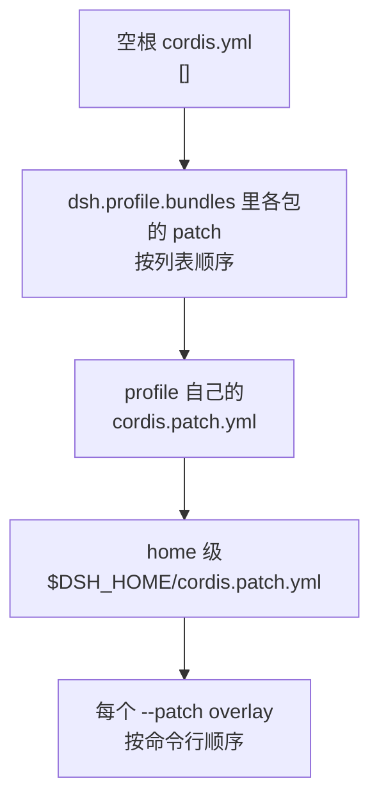

> **读完这篇你能**：把自己写的插件打包成同事一条命令就能装上的**装配包**，知道 `dsh.bundle` 与 `dsh.profile` 两份清单各管什么、四层 patch 谁先谁后，以及从 GitHub 安装时那道构建脚本的坎怎么过。
>
> **前置**：[用上自己的模型](17-用上自己的模型.md)。约 25 分钟。
>
> **示例代码**：[dsh-team-kit](https://github.com/anthonyzhao-4926/blog/tree/main/code/dsh_plugin/dsh-team-kit)

17 篇那个 Ollama 插件是自己机器上跑通的。想让同事也用上，可以把 `patch.yaml`、`install.sh` 连同源码目录整个拷给他——但那样每来一个人就多一份要维护的副本，而且绝对路径、依赖版本、构建步骤全靠口头交代。

正规的做法是把插件包做成**装配包**（bundle）：同事一条 `dsh plugin add` 命令，包自己带着"该往插件树里贴哪一层"的说明进去。

这篇的 demo 是一个团队装配包 `dsh-team-kit`：装上它，同事的 profile 会多一层配置——关掉自动起标题，并把团队约定写进每个会话的系统提示。

## 目标

- 一份能被 `dsh plugin add` 认出来的装配包，本地能装、从 GitHub 也能装。
- 把一个包该带的清单、构建、说明配齐：别人不需要问你任何问题就能装上。
- 弄清装配包与 profile 各自声明什么、四层 patch 的叠加顺序，以及装上去的那一层从哪来。

## 两个 manifest 的分工

安装机制建立在两个概念上，它们的清单都写在 `package.json` 的 `dsh` 键下，但回答的问题不同：

| | 声明 | 回答的问题 | 谁来写 |
| --- | --- | --- | --- |
| **装配包**（bundle） | `dsh.bundle` | 这个包贡献什么？——一个 patch 文件 | 你写，你分发 |
| **profile** | `dsh.profile` | 这套配置由哪些装配包、按什么顺序组成？ | 用户（或 `dsh plugin` 代劳） |

装配包清单最小形态就一行：

```json
{
  "name": "dsh-team-kit",
  "version": "0.1.0",
  "type": "module",
  "main": "lib/index.js",
  "files": ["lib", "cordis.patch.yml"],
  "dsh": { "bundle": { "patch": "./cordis.patch.yml" } }
}
```

`dsh.bundle.patch` 指向包里的 patch 文件。profile 那边则是：

```json
{
  "name": "dsh-profile-demo",
  "private": true,
  "dependencies": { "dsh-team-kit": "link:/path/to/dsh-team-kit" },
  "dsh": { "profile": { "bundles": ["@deepseek-ai/dsh-base", "dsh-team-kit"] } }
}
```

参考卡片里那张"装配清单"讲的就是后者。两边的分工可以直接背下来：**`dependencies` 管物理上装了哪些包，`dsh.profile.bundles` 管逻辑上按什么顺序贴层**；而 `dsh.bundle.patch` 是包自己交出来的那一层。

**没有东西同时是两者。** 一个包要么贡献一层（bundle），要么组织一堆层（profile）。`dsh plugin add` 也只认前者：它装完依赖后检查每个新依赖的 manifest，有 `dsh.bundle` 的追加进 `bundles`，没有的只当普通依赖并打印一条警告——库包（给插件 import 用的，不是给用户启用的）就走这条路。

有个细节值得留意：**警告是按"这次新装"给的**。以后某个版本给这个包补上了 `dsh.bundle`，再跑一次 `dsh plugin update` 它就会自动激活。判断依据是**已安装状态**，不是依赖差异——所以升级能让一个包"从不带层变成带层"。

## 加载顺序

安装完之后，生效配置是四层叠出来的：



（03 篇讲的 patch 合成规则在这里补全了最后两层：原来只写了"bundles → profile patch → home patch → `--patch`"，其中 home 级那一层是给**跨 profile 的机器本地偏好**用的。）

两条推论对写包的人很要紧：

**后应用的层按行胜出，且 patch 替换整行 `config`，不做深合并。** 所以你想改前一层某个行的配置，必须**重述这一行需要的每一个键**，而不是只写你改的那个。内置的 `dsh-web-app` 覆盖 `dsh-base` 的行时就是这么写的——它的 `cordis.patch.yml` 开头专门有一句注释提醒读者这件事。反过来说，`disabled` 是行级字段、不属于 `config`，所以开关一行只写 `disabled: true` 就够了。

**用户永远能覆盖你。** profile 自己的那一层排在你后面，用户不改你的包也能把你钉的默认值换掉。这带来一条写包的建议：**默认值给用户大概率会保留的那个**，其余交给配置 schema 的默认值去管。

还有一条边界：**内置装配包的名字始终从 dsh 安装目录解析**，pnpm 只管理树外的包。所以你的包可以放心依赖 `@deepseek-ai/dsh-base` 存在（它一定在），但没必要把它写进 `dependencies` 里。

## 装配包的结构

```text
dsh-team-kit/
├── src/
│   └── index.ts           ← 包自带的插件
├── cordis.patch.yml       ← 本包贡献的那一层
├── build.mjs              ← 从源码构建 lib/ 的脚本
├── package.json
├── tsconfig.json
├── install.sh             ← 本地开发用
└── README.md              ← 给同事看的安装说明
```

先说最要紧的一处差别。前几篇 demo 的 `patch.yaml` 长这样：

```yaml
- insert:
    - id: dsh-tool-guard
      name: '/绝对路径/dsh-tool-guard/src/dsh-tool-guard.ts'
```

那是**本地源码路径**，只对"源码就在这台机器上"成立——发出去就废了。装配包里的 patch 要按**包名**引用：

```yaml
# 自动起标题会额外花一次模型调用；团队里统一关掉，标题留给人写。
- id: session-title-llm
  disabled: true

- insert:
    - id: team-kit
      name: 'dsh-team-kit'
      config:
        conventions: |
          这个仓库的约定：
          - 提交信息用中文写，一次提交只做一件事。
          - 改动前先跑一遍相关测试，别把没验证的东西留在工作区。
```

`name: 'dsh-team-kit'` 解析的是包的主入口（`main`）。包一旦被 pnpm 装进 profile，Node 的模块解析就能按名字找到它；同一层里也顺手覆盖了一个内置行（关掉自动起标题）。

包自带的插件只有一个作用——把团队约定塞进系统提示：

```ts
export function apply(ctx: Context, config: Config): void {
    // section 注册即 effect：重复的 name 会抛错，卸载时自动摘掉。
    // order 小的排在前面，这里给大值，让团队约定落在提示靠后的位置。
    ctx.systemPrompt.section({
        name: 'team:conventions',
        order: 900,
        text: config.conventions,
    })
}
```

约定文本写在 `cordis.patch.yml` 的 `config` 里而不是代码里，于是同事想改自己那一条，不用碰你的代码——这正是上一节"给用户留出覆盖空间"的做法。

`files` 字段里有两项，**缺一不可**：`lib`（构建产物）和 `cordis.patch.yml`（那个层）。只写 `lib` 的话，包能装上，但 `dsh.bundle.patch` 指向的文件不在包里，装完什么都不会发生——这种错很难从日志里看出来，因为安装本身是成功的。

包名建议带 `dsh-` 前缀（内置包的正式名字是 `@deepseek-ai/dsh-*`），profile 的日志里一眼能看出哪个是插件。

## 构建与 `prepare`

demo 用 TypeScript 写，`main` 指向 `lib/index.js`：

```json
{
  "main": "lib/index.js",
  "scripts": {
    "build": "node build.mjs",
    "prepare": "node build.mjs"
  }
}
```

`build` 是给你自己用的，`prepare` 是给"从 git 安装"用的——下一节讲它的必要性。构建脚本要**自包含**：不能假设旁边有一份 monorepo checkout、不能依赖项目引用、最好也不做类型检查，只做转译：

```js
await build({
    entryPoints: ['src/index.ts'],
    outdir: 'lib',
    bundle: false,
    format: 'esm',
    platform: 'node',
    target: 'node22',
    sourcemap: false,
})
```

依赖保持 `external`（这里用 `bundle: false` 达到同样效果）：包在别人的 profile 里运行时，`@deepseek-ai/*` 由 profile 的 `node_modules` 解析，不该被打进你的产物。

## 表层组合包的命令行

有些装配包不只是贡献插件行，它定义的是一个**可运行的应用**：网页版、headless、SDK 各自是一个这样的包。它们要处理自己的命令行参数（`--port`、`--host`……），机制出人意料地朴素：**挂一个普通的提供方插件**。

以网页版为例，它在自己的 patch 里插了这么一行：

```yaml
- id: web-startup
  name: '@deepseek-ai/dsh-web-app/startup'
```

`/startup` 是包的一个子路径导出，内容是一个普通的 Cordis 插件：`inject = ['cmdlineArgs']`，用 commander 定义自己的 flag，解析完在 action 里把结果**提供成一个服务**（`webStartup`）。受这些参数配置的行则注入那个服务，在 `!!js` 表达式里读：

```yaml
- id: my-app
  name: '@example/my-app'
  inject: [myAppStartup]
  config:
    port: !!js ctx.myAppStartup.port ?? 8080
```

没有"启动钩子"这类特殊机制，只有服务依赖排序：Loader 会等每一行的普通注入就绪，再基于它求值那一行的 `!!js` 配置。启动器把自身 flag 之后的同一份参数交给每个插件，所以两个插件可以各自解析自己关心的那部分。

`--help` 时值得一提：提供方**不发布**那个服务，于是依赖它的行干脆不激活——所以你打 `dsh --profile web --help` 不会真的去绑端口。

要让自己的应用包有这套能力，你不需要动启动器：加一个 `/startup` 子路径导出，再在自己的 patch 里插一行引用它。

## 从 GitHub 安装

发布到 npm 不是必须的，同事可以直接从 git 装：

```sh
dsh plugin --profile demo add github:you/dsh-team-kit
```

但这条路有个坎，而且**两边各要出一半力**：

**git 安装拉的是源码，不是构建产物。** 没有任何环节会跑你的 `build` 脚本，所以一个 TypeScript 包到手时没有 `lib/`，加载会失败。这是作者的责任：给包加上 `prepare` 脚本（pnpm 在 git 安装后会运行它），并且保证它自包含。

**用户要为构建授权。** pnpm ≥10 在得到显式允许之前，拒绝运行 git 依赖的 `prepare` 脚本，所以第一次 `add` 会失败。这时 `dsh` 会指路：它认出你装的是 git 依赖，提示你把 pnpm 打印的那个包键加进 profile 的 `pnpm-workspace.yaml`：

```yaml
allowBuilds:
  dsh-team-kit: true
```

加完重跑即可。

**这一步要当成安全决定来对待。** 授权等于允许那个包的代码在安装时于你的机器上执行，而且不在 agent 运行的任何沙箱之内——沙箱管的是 agent 的读写，管不了 pnpm 的安装脚本。所以：只对源码可信的包授权，并且锁 commit（`github:you/dsh-team-kit#<sha>`），让作者后续的推送没法悄悄换掉你实际运行的东西。

不想让用户做这个决定，就改成分发构建产物，两种形式都不需要任何构建授权：

- **发布到 npm**：`pnpm publish` 时把 `lib/` 构建好，`dsh plugin add dsh-team-kit` 装到的就是预构建代码。
- **交付 tarball**：`pnpm pack` 打出 `.tgz`，同事 `dsh plugin add ./dsh-team-kit-0.1.0.tgz`。

## 验证

本地开发时用 `install.sh`（装依赖 → 构建 → 装进 test profile），先看层有没有挂上：

```bash
dsh --profile test --dump-config | grep -A6 '== dsh-team-kit'
```

```yaml
# == dsh-team-kit
- id: session-title-llm
  disabled: true

- id: team-kit
  name: dsh-team-kit
  config:
    conventions: |-
      这个仓库的约定：
      ...
```

`--dump-config` 把各层合成之后的结果打出来，按层分段（`== 包名`），所以同一行被谁覆盖过、最终长什么样，一眼能看出来。**装之前也值得跑一次**：`grep` 一下你要覆盖的行，确认它在前一层叫什么 id、`config` 里有哪些键——patch 整块替换 `config`，重述漏了键就是静默改行为。

模拟同事的安装路径，从 git 装一遍：

```bash
dsh plugin --profile demo add github:anthonyzhao-4926/dsh-team-kit
```

第一次应当**失败**，并打印 pnpm 拒绝构建脚本的提示；按提示往 `$DSH_HOME/profiles/demo/pnpm-workspace.yaml` 加 `allowBuilds` 后重跑，成功。然后再 `dsh --profile demo --dump-config` 确认层在。这一遍走下来，你对"同事会遇到什么"就有数了。

卸载验证：

```bash
dsh plugin --profile demo remove dsh-team-kit
```

依赖和被它带进来的层一起消失，profile 自己的 `cordis.patch.yml` 不动。

## 注意事项

- **重复的 `insert` 会把插件挂两遍。** 如果你的包在自己 patch 里插了行，用户又在 profile 的 `cordis.patch.yml` 里照着插一遍，同一行会出现两次——注册两遍路由或服务，其中一份必然在竞争里失败，整棵树可能起不来。所以推荐包自带 patch，用户那边就不要重复写。
- **`files` 里漏了 patch 文件，装上是静默无效的。** 安装成功、`bundles` 里有名字，但 patch 指向的文件不在包里，那一层是空的。发布前用 `pnpm pack` 看一眼 tarball 里到底有什么。
- **不要把你包的 patch 写成绝对路径。** 本地 link 时它能跑，发出去同事那边指向一个不存在的目录。打包分发的包一律按包名引用。
- **`prepare` 里别做重活。** 它在每次安装（包括同事装依赖）时都会跑：装 devDependencies、跑类型检查、调 monorepo 里的脚本，都会让安装变慢或者直接失败。只做转译。
- **版本要和 dsh 对得上。** 你的包依赖 `@deepseek-ai/dsh-*` 的某个版本区间，profile 里的内核是另一批版本；两者不匹配时不是启动失败，而是某个 `ctx` 上的服务不存在、等到用的时候才炸。`--dump-config` 加上启动日志是排查这条线最快的地方。
- **表层包记得处理 `--help`。** 提供方在 `--help` 时不发布服务，依赖它的行就不会激活——这是刻意设计，别用"启动时先绑端口再说"的写法绕过它。

---

**下一篇**：[让 agent 自己加功能](19-让agent自己加功能.md)——不写包、不重装，在运行中往插件树里挂一个内存插件，用完摘掉。
