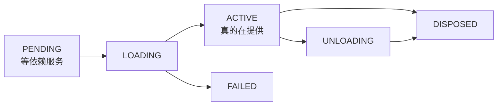

> **读完这篇你能**：不改配置文件、不装包、不重启，往一个正在跑的 DSH 进程里挂一截代码，用完摘掉；并且知道挂上去的插件归谁管、怎么确认它真的生效了。
>
> **前置**：[发给同事安装](18-发给同事安装.md)。约 30 分钟。
>
> **示例代码**：[dsh-live-greeter](https://github.com/anthonyzhao-4926/blog/tree/main/code/dsh_plugin/dsh-live-greeter)、[dsh-self-cordis](https://github.com/anthonyzhao-4926/blog/tree/main/code/dsh_plugin/dsh-self-cordis)

到 18 篇为止，我们见过的插件有一个共同点：**都是从磁盘上的配置文件读进来的**。`dsh plugin add` 改 `package.json`，03 篇的 patch 改 YAML 行，07 篇的热重载盯着文件变化——那条链路的起点永远是文件，终点是 Loader 按行 import 一个模块。

Cordis 本身没有这个限制。Loader 只是**一个普通插件**，它做的事是"读配置，然后对每一行调用 `ctx.plugin(...)`"。而 `ctx.plugin()` 是框架 API，任何插件都能调。

所以"运行中挂插件"不是 DSH 新加的能力，是**一直就在那儿、只是没人调**的东西。这篇把它调起来：挂一个内存里的插件，看它的生命周期归谁管，再收回它。

## 目标

- 一个插件 `dsh-live-greeter`，在 `apply` 里把一个内存插件挂进运行中的进程；被挂的插件注册一个模型能调的工具。
- 说清 `ctx.plugin()` 返回的是什么、它的状态机怎么走、"挂上了"和"生效了"差在哪。
- 弄清内存插件的清理归属：为什么它不需要谁记得手动清。
- 体验 DSH 已经把这套做成产品的那套工具集，并知道它的边界。

## 两条挂载路径

| | 静态路径（前 18 篇） | 动态路径（本篇） |
| --- | --- | --- |
| 谁调用 | Loader 按配置行 | 你自己的代码 |
| 输入 | 磁盘上的模块路径或包名 | 内存里的一段函数或 `{ apply }` 对象 |
| 存续 | 跟配置文件走，重启后还在 | 只在进程内存里，重启即消失 |
| 谁清理 | Loader 按行 dispose | 持有 fiber 的人 dispose |

一个挂载模型能帮你少踩一半的坑：**`ctx.plugin(fn)` 约等于 `element.appendChild(child)`**。它把一个子节点挂到当前上下文之下，返回一个句柄，句柄的 `dispose()` 就是 `removeChild`；而 `ctx.registry` 约等于 `element.children`——运行中检查插件树的入口。

## fiber 与 registry

`ctx.plugin()` 的返回值是 **fiber**：一次插件应用的运行时实例（`vendor/cordis/src/registry.ts`）。

```ts
plugin(plugin: Plugin, config?: any): Fiber & PromiseLike<Fiber>
```

它同时是个 thenable，这一点后面专门讲。fiber 上有两个东西要认识：

**`uid`** 是注册表给的编号，全局唯一，根 fiber 的 uid 是 0。**fiber 被 dispose 之后，uid 会变成 `null`**——这是"这个句柄已经死了"的判据。

**`state`** 是它的状态机：



`registry` 是插件注册表，它按**插件的回调函数**为键，记录这个插件的**所有 fiber**——同一个回调可以挂多次（每次一个 fiber），所以是「一对多」：

```ts
const runtime = { name, callback, fibers: new DisposableList(), Config: plugin.Config }
this._internal.set(callback, runtime)
```

它同时是运行期检查插件树的入口：`keys()` / `values()` / `entries()` / `forEach()`。而 `registry.delete(plugin)` 会把该插件的**每一个** fiber 都 dispose 掉再删记录——所以"按插件卸载"是一次收干净，不管你挂了几份。

## 挂载不等于生效

这是本篇最容易踩的坑，而且它**不报错**。

`ctx.plugin(fn)` 返回时，插件只是**已登记**；要等它**安定**（依赖都到位、`apply` 跑完），才是真的在提供能力。中间那个状态就是 `PENDING`：它在等一个 `inject` 里写了、但当前没人提供的服务。框架语义认为这是合法的——"服务一出现我就激活"——所以它安安静静地待着，什么都不发生。

三个不同的安定点，值得记住：

| 你做了 | 意味着 |
| --- | --- |
| `const fiber = ctx.plugin(fn)` | 已登记（可能还停在 PENDING） |
| `await fiber`（它是 thenable） | 已安定（成功了或失败了） |
| `fiber.state === ACTIVE` | 真的在提供能力 |

所以挂一个依赖 `tools` 的插件时，如果 `tools` 还没起来，你会看到 fiber 停在 PENDING。**判断"到底是谁没起来"，要看服务存储而不是当前上下文的可见性**：

```ts
ctx.get('tools')   // 对：读全局服务存储
ctx.tools          // 错：属性代理是拓扑敏感的
```

`ctx.<service>` 这个属性代理只对**声明过的注入**可靠。要判断"全局存储里有没有这个东西"，用 `ctx.get(name)`。这一条在排查"挂上了但没生效"时是决定性的。

## 清理的归属

子插件的 `dispose` 不是谁手动调的——它是**父 fiber 的一个 effect**。Cordis 里 `new Fiber(...)` 的构造函数就这么写的（`vendor/cordis/src/fiber.ts`）：

```ts
this.dispose = parent.fiber.effect(() => {
  const remove = runtime.fibers.push(this)
  return async () => {
    /* 摘掉自己、必要时删 runtime、卸载 */
  }
}, 'ctx.plugin()')
```

这句话是整篇的枢纽：**子插件的生死被登记为父 fiber 的一个 effect**。所以父 fiber 卸载时，子插件自动跟着走，不需要谁记得清。05 篇讲的"注册了东西必须交给 `ctx.effect`"在这里换了张脸：动态挂载最容易犯的错和 05 篇一模一样，区别只是触发点从"Loader 卸载一行"变成"你自己调 `dispose()`"。

顺带一提，清理是**反序**执行、而且**可以 await** 的：`ctx.effect(fn, label)` 收集 `fn` 返回的 disposer，卸载时倒着跑，返回 Promise 就等它完成。所以"卸载完成"不等于"回调同步返回了"——真要看，await 卸载。

## 运行中检查插件树

三条路，各自回答不同的问题：

| 用什么 | 能回答 | 出处 |
| --- | --- | --- |
| `ctx.registry` | 现在到底挂了多少东西（每个回调 + 它的所有 fiber） | `vendor/cordis/src/registry.ts` |
| `ctx.loader.locate(fiber)` | 这个 fiber 属于配置树的哪一行 | `vendor/loader/src/index.ts` |
| `ctx.get('loader')?.store` | 配置树还在加载，还是已经安定 | `vendor/loader/src/config/tree.ts` |

第二条有个好用的性质：**内存挂的插件不属于任何行**，`locate()` 对它返回 `undefined`。这正好是区分两条路径的判据——"这个插件是配置装进来的，还是运行期挂进来的"，问 Loader 就行。

## 内存插件

demo 的 `patch.yaml` 里**只有装配行**：

```yaml
# dsh-live-greeter 的 bundle 补丁：只有装配行。
# greeter-tool 是被运行期挂上去的，不在任何 patch 行里——
# 所以 dump 出来的配置树里找不到它。
- insert:
    - id: live-greeter-mount
      name: '/绝对路径/dsh-live-greeter/src/dsh-live-greeter.ts'
```

装配插件本身只做三件事：

```ts
export function apply(ctx: Context): void {
    // 返回的是 fiber，同时是 thenable：不 await 只是「已登记」，
    // await 它才是「已安定」——两者中间夹着 PENDING 这个状态。
    const fiber = ctx.plugin(greeterTool) as Fiber

    console.log(`[${name}] mounted uid=${String(fiber.uid)} state=${STATE_NAMES[fiber.state]}`)

    ctx.effect(() => {
        const off = ctx.on('internal/status', (changed, from) => {
            if (changed !== fiber) return
            // uid 每次重挂都不一样：这是「真的卸掉重挂了」而不是「复用了同一个 fiber」的证据。
            console.log(
                `[${name}] uid=${String(fiber.uid)} ${STATE_NAMES[from]} -> ${STATE_NAMES[changed.state]}`,
            )
        })
        return () => {
            off()
            console.log(`[${name}] unmounting uid=${String(fiber.uid)}`)
        }
    }, 'live-greeter: observe')
}
```

(`STATE_NAMES` 是本篇自己留的一份状态名数组——`FiberState` 是 `const enum`，编译后被内联，运行时没有那个对象可查。)

`internal/status` 是**框架内部事件**（`vendor/cordis/src/fiber.ts`），每次 fiber 状态迁移时带 `(fiber, 旧状态)` 发一次。注意 `internal/` 前缀：它不是业务事件（09、10 篇讲的那套），是框架自己的状态通知，用来观测最直接。

被挂的内存插件就是普通的插件写法——`name`、`inject`、`apply` 一个不少：

```ts
export const name = 'live-greeter'

/** 要工具注册表。没有它，这个 fiber 会停在 PENDING——而且不报错。 */
export const inject = ['tools']

export function apply(ctx: Context): void {
    ctx.tools.register(defineTool({
        name: 'live_greet',
        description: '跟一个人打招呼。由 dsh-live-greeter 在运行期挂上。',
        parameters: {
            whom: { type: 'string', required: true, description: '要打招呼的人。' },
        },
        output: {
            schema: {
                type: 'object',
                additionalProperties: false,
                properties: { whom: { type: 'string', required: true } },
            },
            render: (_args, value) => [{ type: 'text', text: `你好，${value.whom}。` }],
        },
        execute(args) {
            return Promise.resolve({ whom: args.whom })
        },
    }))
}
```

`ctx.plugin(greeterTool)` 传的是模块命名空间对象，它上面有 `apply`，所以合法——`ctx.plugin` 接受函数、类，或带 `apply` 的对象；传别的会抛 `invalid plugin, expect function or object with an "apply" method`。

## 影响范围

内存插件挂在**同一个进程**里，用的是**同一份服务存储**。所以它能 `ctx.tools.register` 一个新工具（所有会话立刻看得到），也能 `provide` 一个服务（别的会话读得到）。这不是缺陷，是"同进程"这个词的直接后果。

想收窄影响面，DSH 有作用域机制（`dsh-scope`）：

```ts
const scope = createScope(ctx, 'my-key')
// scope.ctx 上挂的东西只在这条作用域链里可见
scope.dispose()   // 异步，等它完成
```

`createScope` 内部也是 `ctx.plugin(scope)`——所以作用域同样是一个插件，同样受父 fiber 的 effect 管。本篇只用它说明"影响面可以收窄"，完整的注册表层机制够单独一篇。

## 自修改工具集

上面那套是**你自己**写代码挂插件。DSH 还有一份现成的产品：让**模型**在会话里定义并挂载插件。

`packages/extensions/` 下四个包：

| 包 | 角色 |
| --- | --- |
| `@deepseek-ai/dsh-tool-cordis` | 七个模型可见的工具 + 一段系统提示 |
| `@deepseek-ai/dsh-cordis-host-runner` | 定义注册表 + `node:vm` 沙箱 + Host 半生命周期 |
| `@deepseek-ai/dsh-cordis-client-runner` | 浏览器半的加载与应答 |
| `@deepseek-ai/dsh-client-ui-cordis` | 面板与卡片（人在上面批准） |

模型看到的七个工具，三个只读检查、四个生命周期操作：

- `cordis_inspect_list` / `cordis_inspect_query` / `cordis_inspect_self`：列出可查询的提供方、查某个服务的精确方法签名或 slot 树、看本会话已定义的动态插件。
- `cordis_define`：登记一个包版本（`plugin.kind: "new"` 或 `"existing"`），只做参数与语法校验，不运行。**包版本不可变**，所以出错之后是"追加一个新版本再切过去"，不是"改掉旧版本"。
- `cordis_run` / `cordis_stop` / `cordis_undefine`：激活、停止、连定义一起删。

demo 里那个 `dsh-self-cordis` 就是一条安装命令：它自己是组合包，`cordis.patch.yml` 里插两行，把上面四个包里的两个挂上。

```yaml
- insert:
    - id: cordis-host-runner
      name: '@deepseek-ai/dsh-cordis-host-runner'
      config:
        # 沙箱只对动态包函数体的同步部分计时，异步部分逃得出去。
        vmTimeoutMs: 5000

    - id: tool-cordis
      name: '@deepseek-ai/dsh-tool-cordis'
```

这里正好接上 18 篇的一个推论：**`dsh-tool-cordis` 和它的 runner 都不是组合包**（manifest 里没有 `dsh` 字段），所以 `dsh plugin add` 对它们只会打印一条 `declares no dsh.bundle` 的警告——它们是依赖，装配得靠某一层 patch 显式写行。

**装之前请把边界读完。** 官方 README 的措辞是"加载它应当和授予 bash 访问一样刻意"：

- **沙箱是给老实代码用的围栏，不是安全边界。** `vmTimeoutMs` 只围得住函数体的同步部分；异步的代码逃得出去。沙箱给动态包的 `ctx` 只有极少数方法，但动态包**照样能提供全局服务**，从而影响同一进程里的其他会话。
- **定义是会话级、进程本地的。** 只有定义它的会话看得见、管得着；其他会话读作不存在。重启即消失，会话日志里只留下 define 的参数与回执。
- **带浏览器半的包要人批准。** `cordis_run` 会返回 `awaiting-approval`，等人在面板上允许——工具不会替你等结果。

## 验证

demo A 的装法照 18 篇：

```bash
cd dsh_plugin/dsh-live-greeter && ./install.sh
```

然后看三个概念各自对应的现象：

```bash
# 1. 配置树里只有装配行——内存插件不在配置树里
dsh --profile test --dump-config | grep -c 'live-greeter-mount'   # 1
dsh --profile test --dump-config | grep -c 'greeter-tool'         # 0

# 2. 起一个会话，看启动日志里的 mounted 那一行
dsh --profile headless "用 live_greet 跟 小王 打个招呼"
```

日志里应当是 `mounted uid=… state=ACTIVE`。如果打出来的是 `PENDING`，去看 `missingServices` 那条线——它等的是哪个服务。

```bash
# 3. 改一行 patch 触发用户层热重载，观察 unmount 与 uid 变化
```

会看到 `unmounting uid=…`，然后是新的 `mounted uid=…`，**两个 uid 不一样**。这是"真的卸掉重挂了"而不是"复用了同一个 fiber"的肉眼证据（注册表的计数器单调递增）。

demo B 的验证是让模型走一遍：

```bash
cd dsh_plugin/dsh-self-cordis && ./install.sh
```

```text
cordis_inspect_list   → 看有哪些检查提供方
cordis_define         → 写一个 host 半（3~6 个字母的 idPrefix）
cordis_run            → mode: "run"
cordis_inspect_self   → 看版本指针与运行诊断
cordis_stop           → 停掉；定义还在
cordis_undefine       → 连定义一起删
```

最后**重启 dsh**，再问 `cordis_inspect_self`——空的。定义只在内存里。

## 注意事项

- **「挂上了」和「生效了」之间夹着 `PENDING`，而且它不报错。** 动态挂载最常见的失败现象就是"什么都没发生"。判据是 `fiber.state`，不是 `ctx.plugin()` 有没有返回。
- **用 `ctx.get(name)` 查可选服务，不要用 `ctx.tools` 这种属性代理。** 属性代理是拓扑敏感的——它回答的是"我这个位置能不能看见"，而你要问的往往是"全局存储里有没有"。这两者在动态挂载的场景里经常不一致。
- **uid 不是插件的身份。** 每次重挂都是新 uid（旧的那个 dispose 后变成 `null`）。要长期跟踪一个逻辑插件，用 `registry` 里的**回调函数**做键，别用 uid。
- **内存插件写不回配置文件。** 它是运行期的产物：重启就没了，`--dump-config` 里也没有它。要留下来的东西，得走 18 篇那条路——落进某个包的 patch 或源码。
- **"不写文件"不等于"没影响"。** 内存插件照样能注册工具、提供全局服务、占用事件。它在**当前进程**里的影响力，和从配置装进来的插件没有区别。
- **注销时看清自己站在哪。** 在插件 A 的 `apply` 里挂的插件，生命跟着 A 的 fiber；在会话上下文里挂的，跟着那条会话的 fiber。`registry.delete(callback)` 则是"把这个回调的所有 fiber 一起收掉"，适合做兜底清理。

---

**下一篇**：[DSH 升级之后](20-DSH升级之后.md)——内核还在预发布期，破坏性变更说来就来；知道哪些地方会动、怎么在升级后快速把插件对齐。
