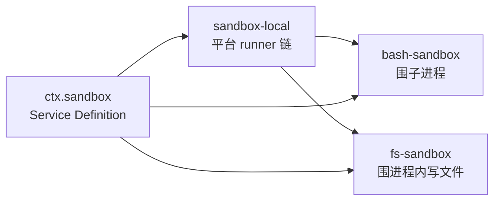

> **读完这篇你能**：说清 DSH 里「模型不能乱动文件」到底由几层东西管、每层的真实语义和失败形态，知道策略是从哪儿冒出来的，以及作为插件作者哪些边界该自己守、哪些不该抢。
>
> **前置**：[DSH 升级后的版本与兼容性排查](20-DSH 升级后的版本与兼容性排查.md)。约 30 分钟。
>
> **示例代码**：[dsh-fs-write-watch](https://github.com/anthonyzhao-4926/blog/tree/main/code/dsh_plugin/dsh-fs-write-watch)

12 篇讲过工具执行管线上的几个拦截点，也提过一句「沙箱是系统边界，`guard()` 是策略层」。那篇的重点在**拦截点在哪**，这篇把沙箱这一层的内部摊开：它到底有几个旋钮、每个旋钮的取值意味着什么、生效的策略从哪来、失败了会怎样。

先说结论：**「模型不能乱动文件」不是一条规则，而是三层彼此独立的东西**。它们经常被一起提到，但改一个不会动另一个。

## 目标

- 分清三层各管什么：能不能写（沙箱）、读没读过（观察策略）、怎么打包成给人用的一个开关（权限预设）。
- 弄清有效模式是怎么算出来的，以及为什么"切模式"是一次会话事件而不是一个设置项。
- 认识两种强制者的能力差异，以及 fail-closed 的落点。
- 知道加一层自己的边界该挂在哪，不该挂在哪。

## 三层各自的职责

| 层 | 回答的问题 | 实现 |
| --- | --- | --- |
| 沙箱 | 这次操作**能不能**落盘 | `ctx.sandbox`（服务定义）+ `sandbox-local`（提供方）+ `bash-sandbox` / `fs-sandbox`（消费者） |
| 观察策略 | 这个文件**读过没有** | `dsh-fs-observation-policy`，一个 event-only 插件 |
| 权限预设 | 上面两个旋钮**怎么打包**给人选 | `dsh-permission-presets` |

先看第一层的形状——它就是 08 篇那个三件套的又一次出现：



`ctx.sandbox` 把一段子进程 argv 包成「在某个文件效果策略下执行」的 argv，唯一的抽象方法是：

```ts
abstract confine(argv: readonly string[], policy: SandboxPolicy): ConfinedArgv
```

所以第三层和第一层的关系是：**预设不执行任何策略**，它只负责"记录选择 + 通过各旋钮自己的写路径改值"。这是很容易搞错的一处——预设是个 UI 概念，不是一道防线。

## 模式只管文件效果

三个取值，闭集：

| 模式 | 含义 |
| --- | --- |
| `read-only` | 只能读；写一律拒 |
| `workspace-write` | 工作区（加临时目录）可写，其余只读 |
| `danger-full-access` | 不围 |

词汇表里**只有**这些。网络访问、进程可见性、能创建多少子进程——这些**不在**沙箱模式的表达能力之内。子系统文档明确写了这条边界。所以「开了沙箱网络就安全了」这类期待是错的：它管的是文件效果，不是全部副作用。

有一个值得一提的细节：可写根不是"工作区"一个字符串，而是算出来的：

```ts
writableRoots(policy)   // workspaceRoot + /tmp + os.tmpdir()，去重且 canonical
```

每个平台 runner 还有自己的拼法（bwrap 用 `--ro-bind / /` 覆盖全盘再放开，Seatbelt 与 Landlock 各自显式授予 `/dev/null` 之类）。写文章时不必记住细节，只要知道"可写根是算出来的、不是写死的"。

## 策略从哪来

有效模式按这个优先级算：

```text
已批准的显式升级  >  会话日志里最后一条 sandbox/mode  >  部署默认
```

第二项值得停一下：**会话覆盖不是存在配置文件里的**。切模式就是往会话日志里追加一条 `sandbox/mode` 事件（`{ mode, source? }`，log-only、不进模型对话），重放会话时自然恢复成当时的值。所以「模式是一次事件，不是一个设置项」——这也解释了为什么它会话级生效、为什么重放能复原。

部署默认这一头有个反直觉的地方：**schema 的默认值是 `read-only`**。而 base profile 显式把它改成 `workspace-write` 并配 `ask`：

```yaml
# packages/bundle/base/cordis.patch.yml —— 部署装配样例
- name: '@deepseek-ai/dsh-sandbox-local'
- name: '@deepseek-ai/dsh-sandbox-policy'
  config:
    mode: !!js process.env.DSH_PERMISSION_MODE ?? 'workspace-write'
- name: '@deepseek-ai/dsh-fs-observation-policy'
- name: '@deepseek-ai/dsh-fs-sandbox'
```

设计意图很清楚：**默认收紧，要放开必须显式**。所以你在自己机器上看到的是 `workspace-write`，那是 base 层特意放开的，不是"系统默认如此"。

## 两类强制者

围栏有两种实现，能力差别不小：

| | 强制者 | 围什么 | 强度 |
| --- | --- | --- | --- |
| 子进程沙箱 | `bwrap` / Landlock（Linux）、Seatbelt（macOS）、ACL restricted token（Windows） | 被拉起的那个子进程 | 内核级；Windows 恒为 `partial` |
| 进程内围栏 | `fs-sandbox` | 当前进程里走 `ctx.fs` 的写 | 策略级，**不是安全边界** |

第二行的措辞不是我的评价，是包注释自己的话：`This is containment, not a security boundary`。它甚至明确接受一类残余 TOCTOU——祖先符号链接在复核与 `syscall` 之间被换掉。要隔离**不信任的代码**，那是子进程沙箱的事。

区分两种强制方式有实践意义：**进程内围栏能挡住模型的手，挡不住同一个进程里恶意代码的手**。所以 `write` 工具有沙箱不代表"在沙箱里跑"。

`SandboxEnforcement` 只有 `full` 和 `partial` 两个值，Windows ACL runner **恒定是 `partial`**：它必须保留 `Everyone` 的 `WRITE_RESTRICTED` 语义，而且 NTFS 硬链接能绕过一个文件对象上的路径限制。要求绝对边界的消费者应该自己拒绝 `partial`——不要假设 API 会给 `full`。

## fail-closed 长什么样

这是设计上最硬的一条：**没有任何 runner 可用时，命令不跑**。不是"不围就跑"，是直接拒绝。

```text
沙箱链走到 'unavailable' → 抛 SandboxUnavailableError
  code: SANDBOX_UNAVAILABLE
```

Service Definition 的注释把这条写成了明文规定：`silent unconfined passthrough is forbidden`——**静默不围是禁止的**。所以 Linux 上没装 `bwrap` 且内核不支持 Landlock 时，表现是"所有需要围栏的 bash 都不执行"，而不是"悄悄放行"。

还有一个容易混的区分：**"被拒绝"和"跑不起来"必须分开报**。消费者先判 runner 失败再判拒绝，因为"runner 失败意味着命令根本没跑"。`ConfinedArgv` 为此带了两套 stderr 词表：

- `denialSignatures` 是**围栏生效**的指纹（bwrap 的 EROFS、Landlock 的 EACCES、Seatbelt 的 EPERM）；
- `runnerFailureRules` 是 **runner 自己崩了**的证据。

自己写 runner 或换 runner 时，这两套词表是最容易配错的东西——配错的后果是"拒绝"被当成"没跑起来"，或者反过来。

## 观察策略的真实语义

规划里原来写的"观察策略三档模式"在代码里并不存在。真实的它是一个 **event-only 插件**：不注册服务、不做任何文件 I/O，只在两个单槽瀑布上回答"这次写/改该怎么设防"，并把观察到的事实记进自己的一张 `WeakMap`。

它实现的是**先读后写 + 版本 CAS**：

| 文件状态 | 写（`fs/write-intent`） | 改（`fs/edit-intent`） |
| --- | --- | --- |
| 没读过 | `createIfAbsent` | `FS_NOT_OBSERVED`——直接拒 |
| 读过、现在不存在 | `createIfAbsent` | `FS_NOT_FOUND` |
| 读过、存在 | `replaceIfVersion`（带上版本） | 版本守卫：版本变了就拒 |

也就是说：**编辑一个没读过的文件会被拒；读过了但中途被别人改过，也会被拒**。所谓"版本新鲜"是授权标准——注意它不是"你看全了"：窗口读也能授权整文件覆盖。

四处已知限制值得记在笔记里：

1. **观察状态不跨会话恢复**。resume 一个新会话之后，之前读过的文件又算"没读过"。
2. **没有 agent session 的调用永远满足不了编辑条件**——写一律是 `createIfAbsent`。
3. **绕过工具直接调 `ctx.fs` 的读不发 `fs/observed`**，所以也不会被记为"读过"。
4. 授权标准是"版本新鲜"而非"看全"。

最后一条实践警告：`fs/write-intent` 和 `fs/edit-intent` 都是**单槽瀑布、先注册者赢**，`fs-observation-policy` 已经占了槽。想加自己的权限、审计、拦截，正确的位置是 `tools/execute` 瀑布，**不要去抢这两个槽**——抢了就是把内置策略顶掉。

## 越界时模型看到什么

这一层决定模型能不能自己纠正，所以值得单独看。越界写会抛 `FS_SANDBOX_DENIED`，工具层把它换成共享标记，并在同一轮附上升级提示：

```text
[sandbox: file access denied under read-only mode]
[sandbox: escalation available — retry this exact <subject> once with …]
```

观察策略的两个码则被规范成给模型看的**补救句**：

```text
cannot modify "<path>": file has not been read — read the file, then retry
<原因> — re-read the file, then retry
```

这两句是给模型的行动指令，不是给人看的日志。写插件时如果自己造了一类拒绝，照这个样子给一句"下一步做什么"，比只回一个错误码有用得多。

升级（改宽模式重试）本身也有约束：

- `sandbox_permissions` 必须与 `justification` **成对**出现，理由不能为空；
- 目标模式必须**严格更宽**才算数，否则直接抛错、根本不问人；
- schema 里的枚举是闭集，但"严格更宽"是执行期按当次有效模式判的。

## 权限预设打包了什么

就两个旋钮：

```ts
interface PresetSpec {
    sandbox: SandboxMode
    approval: ApprovalPolicy
    name?: string
    description?: string
}
```

内置两项：`workspace-write`（`workspace-write` + `ask`）和 `danger-full-access`（`danger-full-access` + `never`）。还有一个 `'custom'`——它是**派生状态**，不是表项、也不是事件值：当会话的实际组合对不上任何预设时显示为它。

预设的写路径是"先记选择，再逐旋钮写"：先 append 一条 `permission/preset` 事件（log-only 的用户意图），然后走各旋钮自己的写路径改值。**它自己不执行任何策略**，所以"预设名字看着对、实际值不对"这种情况不可能是预设造成的，一定是某个旋钮被单独改过。

## 边界观察器

demo 是一个**只读**的观察器：它不注册任何拦截器、不抢 `fs/*` 的单槽决策，只把三层的事实摊出来。三块内容刚好对应三层。

第一块，订阅 `fs/observed` 记录观察事实：

```ts
    // fs/observed 是记录型事件：必须同步、不许抛，所以这里只做一次 Map.set。
    ctx.on('fs/observed', (target, observation, actor) => {
        const session = sessionOf(actor)
        if (session === undefined) return
        const byPath = observed.get(session) ?? new Map<string, string>()
        const mark = observation.kind === 'present' ? `v:${observation.version}` : 'absent'
        byPath.set(target.displayPath, mark)
        observed.set(session, byPath)
    })
```

用 `WeakMap` 以会话为键——插件的观察状态不该阻止会话被回收。注意 `fs/observed` 是**同步、不许抛**的记录型事件：工具层不兜这个 `emit`，抛异常会把工具变成 `isError`，但那时候写操作早就落盘了。

第二块，订阅会话事件看模式切换：

```ts
    // sandbox/mode 是 log-only 事件：切模式只往会话日志里追加一条，重放即恢复。
    ctx.on('session/event', (session, event) => {
        if (event.type !== 'sandbox/mode') return
        console.log(`[${name}] ${session.id} 文件效果模式 -> ${String(event.data.mode)}`)
    })
```

第三块，注册一个无参数工具，读**当前有效策略**：

```ts
        execute(_args, exec) {
            // 有效模式 = 已批准的显式升级 > 会话日志里最后一条 sandbox/mode > 部署默认。
            const session = exec.agent?.session
            const policy = ctx.sandboxPolicy.resolve(session === undefined ? {} : { session })
            const files = session === undefined ? undefined : observed.get(session)
            return {
                mode: policy.mode,
                workspaceRoot: policy.workspaceRoot,
                observedFiles: files?.size ?? 0,
            }
        },
```

`ctx.sandboxPolicy.resolve()` 是**唯一**该用来问"现在有效模式是什么"的入口——它把上面那条优先级链替你走完。不要自己去读配置或翻会话日志：链子以后可能变，而 `resolve` 不会。

## 验证

```bash
cd code/dsh_plugin/dsh-fs-write-watch && ./install.sh
```

三步，每步对应一层：

```text
1. 会话里让模型调 policy_report
   → mode 应当和界面上权限选择器显示的一致

2. 让模型对同一个文件「先 read、再 edit」
   → 成功；然后换个没读过的文件直接 edit
   → 应当拿到 "file has not been read — read the file, then retry"

3. 把模式切到 read-only，让模型再写同一个文件
   → 应当拿到 [sandbox: file access denied under read-only mode]
```

第三步入如果切到 `danger-full-access` 再试一次，标记会消失——这正好证明**围栏来自那两处，不是工具自带的**。观察器自己什么都没做，它只是把事实读了出来。

## 注意事项

- **别把 `fs` 围栏当安全边界。** 它是策略围栏，包注释自己就写着 `containment, not a security boundary`。要隔离不信任的代码，用子进程沙箱；要挡模型的手，`fs-sandbox` 够用。这两件事不要互相替代。
- **加自己的边界去 `tools/execute` 瀑布。** `fs/write-intent` / `fs/edit-intent` 是单槽先到先得，内置策略已经占了；插自己的处理器会把内置策略顶掉，而且不会报错——只是行为变成你的了。
- **`fs/observed` 的监听器必须同步且不抛。** 它走 `ctx.emit`，工具层不兜；抛出来只会让工具变 `isError`，而写已经落盘了。
- **不要假设 `ctx.get('sandbox')` 一定有值。** 宿主没装围栏时它就是 `undefined`，此时任何"我用沙箱兜住了"的说法都是假的。检查它，然后 fail-closed 或显式降级成"我不做这件事"。
- **观察状态不跨会话。** 它存在内存里、按会话分；resume 之后文件都算"没读过"。要自己的持久观察记录，得自己落盘。
- **`partial` 不是"差不多"。** Windows ACL runner 恒为 `partial`。如果你的插件要求绝对边界，显式拒绝 `partial`，别让它悄悄降级。
- **改模式只有一条写路径。** `setSandboxMode` 之外没有别的东西改模式状态，而它会话日志里追加事件。要自己实现"切换模式"的功能，走这条路径；直接改配置或内存状态会导致重放结果和当时不一致。

---

**下一篇**：[危险操作的审批通道](22-危险操作的审批通道.md)——把沙箱从"能不能"换成"要不要"：危险操作前停下来问人，以及让人在几个方案里选一个。
