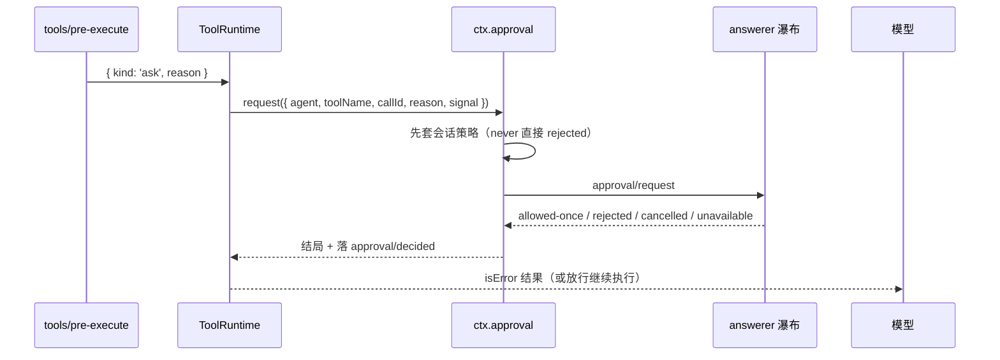

> **读完这篇你能**：把「危险操作前停下来问人」接进自己的插件；弄清审批的四个结局、为什么没人应答等于拒绝、审计记录落在哪；以及分清审批、提问、plan mode 这三条通道各自的强制力。
>
> **前置**：[别让模型乱动我的文件](21-别让模型乱动我的文件.md)。约 25 分钟。
>
> **示例代码**：[dsh-ask-before-bash](https://github.com/anthonyzhao-4926/blog/tree/main/code/dsh_plugin/dsh-ask-before-bash)

21 篇讲的是「能不能」——沙箱说这次动作做不了。这篇讲「该不该」：动作本身做得了，但值不值得为它停下来问一句。

在 DSH 里，**让人拍板不是一个弹窗，而是一条有契约、有审计、有明确失败方向的问答通道**。12 篇提过一句「`pre-execute` 返回 `ask`，然后由 `ctx.approval.request()` 处理」，把细节留给了这里。

## 目标

- 从 `tools/pre-execute` 返回 `ask` 开始，跟到模型拿到结果为止，看清这条链上每一步是谁在做。
- 记住 `ApprovalOutcome` 的四个取值以及"只有一个是放行"这条纪律。
- 分清审批、提问、plan mode 三条通道：各自回答什么、强制力从哪来。
- 知道在哪些位置问人会直接失败，以及为什么这样设计。

## 审批是一条通道

`ctx.approval` 是审批服务，它只回答一个问题：**这个特定的动作能不能做**。契约是"一次性"的——批准的是这一次调用，不是这类操作。

从工具管线到答案，完整接线是这样：



四个结局都要记住，因为**只有一个是放行**：

| 结局 | 含义 | 该怎么处理 |
| --- | --- | --- |
| `allowed-once` | 这一次批准了 | 放行 |
| `rejected` | 人点了拒绝 | 当成拒绝 |
| `cancelled` | 调用方取消（`signal` 中止或分发中途中止） | 当成拒绝 |
| `unavailable` | 没人能答 | 当成拒绝 |

后三个都**必须**按拒绝处理。这不是保守建议，是这条通道最要紧的性质：**无人能答时必须 fail-closed**。没有 answerer、没有审批服务、没有 agent、answerer 抛错、answerer 返回词表外的值——全部落到拒绝或 `'unavailable'`，绝不默认放行。

工具侧是这么获取服务的：`ctx.get('approval')` 机会式获取，拿不到就降级为 deny，而不是报错。所以**插件用 `inject: ['approval']` 写死会让它在 headless 之类的 profile 下永远挂起**——写成可选依赖才对。

无人应答时模型看到的文案是：

```text
tool "<name>" requires approval, but no approval channel is available
```

headless profile 就是这种情形：它叠在 base 上，不装配远程转发与任何界面 answerer，而 base 的审批默认是 `ask`。所以"在 headless 里跑一个需要审批的命令"必然得到这句。

## 会话级策略与 `never`

审批有一个会话级的策略旋钮，取值只有两个：`ask` 和 `never`。

`never` 的行为很干脆：**在服务内部、分发之前就把请求判掉**。源码注释明确说，即便有人在服务之后用 `prepend: true` 注册监听器，也越不过它。所以"临时放行一次"不能靠挂监听器，这条路是堵死的——这是设计意图，不是遗漏。

`never` 生效时，模型会收到一句运行上下文：

```text
Approval prompts are disabled in this session: actions that require approval are rejected
automatically — do not request sandbox escalation (do not set `sandbox_permissions`).
```

这句话是给模型看的，意思是"别再申请了"。你在会话里看到它，就是 `approval/policy = 'never'` 的直接表象。

有一处**文档和代码不一致**，写插件时会踩：子系统文档说用 `ctx.approval.effectivePolicy(session)` 读有效策略，但源码里 `effectivePolicy` 是 private，仓库内的调用点只有服务自己。外部插件要读有效策略，只能自己折叠：

```ts
const policy = ctx.approval.overrideOf(session) ?? ctx.approval.config.policy ?? 'ask'
```

## 审计对

每次问都会在会话日志里落**一对**事件：

```text
approval/asked    { id, toolName, reason, … }
approval/decided  { id, outcome, … }
```

两条用同一个 `ApprovalRequestId` 配对。两个都是 **log-only**——它们不进模型对话，模型看到的是工具结果加运行上下文快照。所以"审计在会话记录里，不在对话里"：要查谁在什么时候问了什么、结论如何，读会话日志的这两类事件。

成对出现是**不变量**，不是惯例。`approval/asked` 落在 turn 外、toolName 为空、同 id 重复开启，都会让不变量失败；`approval/decided` 没有配对的 asked、或 outcome 不在词表内，同样失败。这带来一个非常具体的限制：

**在打开的 turn 之外问人，会直接抛错。** 报错原文解释了原因——两条审计事件必须被 turn 包住，因为 turn 是可重放日志的提交边界，两条 turn 之间的事件在重载时会被当成崩溃残尾丢掉。所以插件想在"动手之前"问人，必须借一个正在进行的工具调用（这是 demo 的做法），或者在 prompt 阶段问。

取消有两条路：`signal` 已经中止 → 立刻 `cancelled`；分发过程中中止 → 竞速取胜，迟到的回答被丢弃。工具侧把这类拒绝额外标成 `approvalCancelled`，归因给"调用方取消"而不是普通拒绝——所以日志里这两种"拒绝"是可分的。

## 提问与审批的分工

`ctx.userQuestions` 是另一条 seam，回答的不是是非题，而是**问答题**：要信息、要选择。一个问题带 id、可选选项、可选多选、可选自定义文本，还带一个"展示意图"让能识别的界面把它渲染成对应形态——目前只有 `plan-review` 一种。

模型侧的使用者就是 `ask_user_question` 工具。两条 seam 的分工可以一句话钉住：

> **审批是「这次动作准不准」的闭集判定；提问是「人要给信息或做选择」的开放问答。**

一个刻意的限制：**子代理问不了人**。`userQuestions.ask` 带 agent 时，要求它是注册表里同一个活实例、且是运行根，否则分别抛 `CALLER_NOT_LIVE` 和 `DELEGATED_CALLER`。后者的报错文本本身就是给模型的建议。也就是说，"子代理卡在那里等人"在当前设计里是被禁止的——这是有意为之，别绕。

展示意图还有个前置断言：`intent` 里声明的"批准选项"必须是该问题自己的选项之一，且该问题必须带详情，否则直接抛 `BAD_INTENT`。理由写在注释里：否则会把"提问者从没提供过的选项"或"对不可见内容的批准"摆到用户面前。

## plan mode 的软约束

第三条是 plan mode，也是最容易被误解的一条。**它不是拦截器。** 子系统文档的原文就是：

```text
Plan mode is soft guidance.
```

它不禁任何工具，做的是两件事：给每次模型请求加一段部署自己写的指导语；提供一个 `exit_plan_mode` 工具，把完整方案交给人评审。沙箱模式和审批策略各自独立，**谁也不读写 plan 状态**。

所以"开了 plan mode 模型就不能执行了"是错的——拦住模型的是它自己的分寸。真正的硬边界仍然来自审批与沙箱。如果你需要"没批准就不能动手"，要用审批，不能用 plan mode。

plan mode 的几个失败面值得知道（都是设计好的路径，不是崩溃）：

- 没有 `userQuestions` 通道 → 抛 `no user-questions channel is available to review the plan…`；
- 评审期间插件被重载 → 抛 `the plan-mode service was reloaded while the plan was under review; present the plan again`；
- 用户选"继续规划" → 这被当成**一次失败调用**，带着反馈回去；
- 用户直接关掉评审去说话 → 转成一句说明，模型据此继续。

还有个真实的持久化缺口：在"某轮最后一个被接受的 pre-step 之后"做出的选择只存在于进程内，进程若在此之前退出就丢了。

## 危险命令先问人

demo 做的事很小：对匹配危险模式的 `bash` 调用返回 `ask`，然后什么都不管。

```ts
    // 返回 { kind: 'ask' } 只表示「这事要问人」；谁来问、怎么问是审批服务的事。
    // 没有审批服务时工具侧会降级为拒绝，不会因为没人接管就放行。
    ctx.on('tools/pre-execute', async (exec, next) => {
        if (exec.name !== 'bash') return next()
        const command = (exec.arguments as { command?: unknown }).command
        if (typeof command !== 'string') return next()
        const hit = NEEDS_APPROVAL.find(entry => entry.pattern.test(command))
        return hit === undefined ? next() : { kind: 'ask', reason: hit.reason }
    })
```

三个细节：

- **只返回 `ask`，不自己找人问。** 谁来问、怎么问、没人答怎么办，全是审批服务的事。插件越少碰这段越好。
- **`next()` 是管线里后面的处理器。** 不命中就交回去，别直接返回 `{ kind: 'allow' }`——那会把后面别人的检查也一起放掉。
- **`reason` 写给模型也写给用户。** 它进 `approval/asked`，也进用户看到的审批卡。

第二块是审计打印，纯观察：

```ts
    // 问与答各落一条事件，用同一个 id 配对；会话日志里能查到完整审计。
    ctx.on('session/event', (session, event) => {
        if (event.type === 'approval/asked') {
            console.log(`[${name}] 问：${String(event.data.toolName)}（${String(event.data.reason ?? '无理由')}）`)
        }
        if (event.type === 'approval/decided') {
            console.log(`[${name}] 答：${String(event.data.outcome)}`)
        }
    })
```

危险模式表就三条，够演示：

```ts
const NEEDS_APPROVAL: readonly { pattern: RegExp; reason: string }[] = [
    { pattern: /\bgit\s+push\b/, reason: '这条命令会推送到远端仓库，请确认目标和分支。' },
    { pattern: /\b(rm|mv)\s+-[a-zA-Z]*r/, reason: '递归删除或移动，确认路径无误再继续。' },
    { pattern: /\b(npm|pnpm|yarn)\s+publish\b/, reason: '这会发布一个包，发出去就撤不回。' },
]
```

## 验证

```bash
cd code/dsh_plugin/dsh-ask-before-bash && ./install.sh
```

三步，每步对应一条性质：

```text
1. 让模型跑 git status，再跑 git push
   → 前者直接过；后者界面上出现审批卡，理由是那句中文

2. 批准它，然后让模型再跑一次同样的 git push
   → 还会问。allowed-once 只管上一次那一次调用

3. 用 --profile headless 再跑一次
   → 模型收到 tool "bash" requires approval, but no approval channel is available
```

第二步入如果拒绝，模型收到的失败原因会是 `the user rejected tool "bash"`——注意它**只知道被拒了**，不会知道是谁拒的、为什么。所以 `reason` 是唯一传达"为什么问"的机会，值得写清楚。

再把会话策略切成 `never` 试一次：不再弹卡，模型直接收到自动拒绝，而且系统提示里会出现那句 `Approval prompts are disabled in this session…`。这是策略层生效的现场。

## 注意事项

- **别在 turn 之外问人。** `approval.request()` 必须在打开的 turn 内，否则抛错——审计对必须被 turn 包住，否则重载时会被当成崩溃残尾清掉。插件的 `apply()` 阶段、会话空闲期都不行。
- **审批服务是可选依赖。** 用 `ctx.get('approval')`，不要 `inject: ['approval']`。后者会让插件在 headless 或纯 SDK 装配下一直挂起等一个永远不会出现的服务。
- **别试图用监听器绕过 `never`。** 它在服务内部、分发之前就判掉了。要"临时放行"就让人真的改一次策略，或者用沙箱升级那条路。
- **`allowed-once` 是一次性的。** 想做"这个会话内以后都别再问这个命令"，那不是审批的语义——审批刻意不做持久授权（ACP 桥的注释专门写了"绝不从未知客户端响应推断持久授权"）。
- **审计事件不要手工 append。** 成对是不变量：turn 外、toolName 为空、同 id 重复、outcome 不在词表内，都会让不变量失败。要记录自己的审计，用插件自己的事件名。
- **子代理问不了人。** `DELEGATED_CALLER` 是设计而非缺陷：子代理被种上的是 `never` 策略，所以"无人能答的自代理自动收紧"。要人拍板的动作，放在主会话里。
- **plan mode 请当作写作规范而不是保险。** 它不拦工具。要硬边界，用审批或沙箱。

---

**下一篇**：[会话一长就爆](23-会话一长就爆.md)——上下文撑不住的时候，DSH 有哪几条路：溢出落盘、中段裁剪、整段换成摘要，以及原事件为什么一条都不删。
