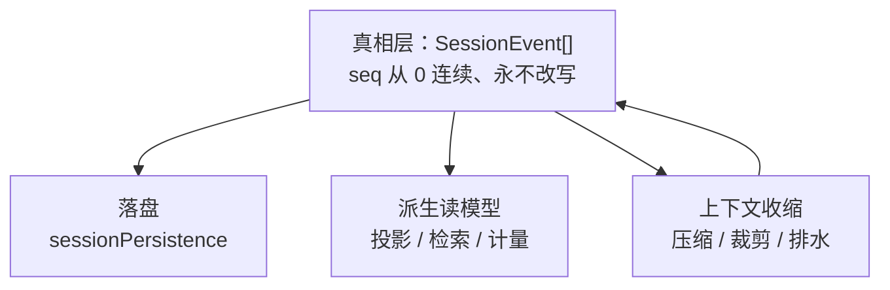

> **读完这篇你能**：说清「会话一长就爆」背后其实是五件不同的事，知道每件什么时候发生、动了哪份数据、能不能撤；会注册一个自己的投影单元，把会话里发生过什么折成一本账读出来。
>
> **前置**：[危险操作的审批通道](22-危险操作的审批通道.md)。约 35 分钟。
>
> **示例代码**：[dsh-session-digest](https://github.com/anthonyzhao-4926/blog/tree/main/code/dsh_plugin/dsh-session-digest)

「会话一长就爆」这句需求，其实混了**五件互不相同的事**。它们共享同一条事件日志，但触发的时机、动的是哪份数据、可逆不可逆都不一样。把它们当成一件事，后面每个判断都会错。

一句话总纲：**会话日志是唯一真相，其它全部是围绕它的落盘、派生读模型与上下文收缩。**

## 目标

- 认识会话的真相层，以及围绕它的四层结构各是什么。
- 分清压缩、裁剪、排水：三者时机不同、落点不同、可逆性不同。
- 知道"checkpoint"在仓库里指的是四种完全不同的东西。
- 给会话加一个自己的投影单元，并提供一个工具读它。

## 唯一真相与四层派生



真相层是 `SessionEvent` 的追加序列：序号从 0 连续，**永不改写**。当前的 `SESSION_FORMAT_VERSION` 是 3，而这个版本号写在**头记录**里——头（版本、cwd、血缘、是否 seeded）与日志正文是分开存的。

下面四层都可以从这份日志重新算出来（除了物理落盘本身），所以它们**坏掉不会损坏真相**：投影缓存旧了可以重算，全文索引可以直接丢掉重建。

## 落盘

落盘是一条标准的服务 seam：`ctx.sessionPersistence` 是抽象服务（`create` / `open` / `stat` / `list`），返回一个 handle（`read` / `append` / `flush` / `close`）。出厂只有一个后端实现。

几个值得记住的物理事实：

- **一会话一文件**：路径是 `<root>/--<项目slug>--/<编码后的 sessionId>/session.v3.jsonl.zstd`。项目 slug 与编码后的 id 一起保证了"同一个项目、同一个会话"能稳定定位。
- **首行是头记录**（`type: 'session'`），之后一行一个事件。所以"读会话"不是读一个大 JSON，而是逐行解析。
- **默认逐帧 Zstd 压缩**。`append` 是分批 `fsync` 的，而 `flush` 是一个真正的**持久性屏障**——它返回就意味着数据落住了。
- 文件名里的 v3 跟头里的格式版本是配套的。

`flush` 这个屏障有一个专门的消费者：**持久性检查点**插件。它在 `llm/stream` 之前、`tools/execute` 之前、以及 `agent/pre-step` 里调用 `ctx.sessions.flush()`，而且**失败即 fail-closed**——模型请求或工具根本不会被调用。这条策略的意思是：宁可什么都不做，也不要让"做过的事"丢在缓冲区里。

## 崩尾恢复

进程被 kill 的时候，最后一行可能只写了一半。这个后端的处理是**截断撕裂的尾巴**：只丢写坏的那一小段，前面完整记录救回来之后重写文件。

而"最后一个 turn 没有收尾事件"（比如崩溃时 turn 才进行到一半）不是靠写入方补的——**是读方补 closers**。也就是说：恢复出来的会话，其"结局"是读的时候推导出来的，不是当时写下的。

这个设计对插件有一层含义：**不要假设日志里每个 turn 都有配对的结束事件**。要写"成对"的消费者，得自己兜住缺失。

## 派生读模型

三条路，互相不知道对方存在：

| 路 | 服务 | 是什么 |
| --- | --- | --- |
| 投影 | `ctx.sessionProjections` | 把事件折成一组纯函数算出来的状态 |
| 检索 | `ctx.sessionQuery` | 精确读、过滤、血缘、事件关系 |
| 计量 | `ctx.tokenMeter` | 重放事件折出压力与花费（下一篇） |

**投影**是三条路里唯一给插件留了正式扩展点的：你注册一个"单元"，写一个纯函数 `apply(state, event)`，**订阅 `session/event` 是框架的事**。框架订一次，把每个事件折过每个单元；客户端只收成品值。

这正好把 09 篇的东西框架化了：09 篇你手写"自己订阅、自己累加"，这里你只写折叠函数，不写订阅。而注册本身是 effect（`register()` 返回 disposer），插件卸载后这个 key 就从快照里消失，客户端把它读成"这个能力不在"。

投影还分两边：

| | 声明位置 | 需要客户端那一半吗 |
| --- | --- | --- |
| wire 单元 | `SessionProjectionMap` | 需要：值要发给页面 |
| host-only 单元 | `SessionProjectionStateMap` | **不需要** |

这个区分对本篇的 demo 很关键：只写 host-only 单元，就不用碰 14 篇那套浏览器半的构建。

**检索**这边有两处现状要知道，因为它们直接影响"想回查几天前聊过什么"这个需求：

- 出厂把全文检索**关掉**了——索引行的配置是 `openAt: never`，意思是"永远不要为它开那个索引"。
- 给模型的 5 个检索工具**不在任何出厂装配里**：它们是一个独立的工具包，谁想要谁自己挂。

所以这个需求在出厂状态下是**不成立**的，需要你自己补两处配置。这不是遗漏，是刻意把成本留到有人真的要的时候——索引会占空间，打开就会产生开销。

## 上下文收缩：三件不同的事

这一层是最容易混的地方。三个机制的输入、落点、时机都不一样：

| 机制 | 输入 | 落点 | 什么时候发生 |
| --- | --- | --- | --- |
| 排水 spill | 刚产生的工具结果文本 | 模型看到的结果被换成预览 + 定位符 | 结果**进日志之前** |
| 裁剪 prune | 表面上的 `tool/result` 节点 | 新追加一条替换节点 + 前一条标价 | 结果**已经在日志里之后** |
| 压缩 compaction | 表面上的一段事件区间 | 一条摘要 `user/message` | 压力越过阈值时 |

所以正确的因果链是：

```text
排水（产生时） → 进日志 → 裁剪（压力逼近时） → 压缩（越阈值时）
```

**排水**是"太长了，落成文件，模型只看预览和怎么去拿"。它的服务和实现都极小——`ctx.spillStore` 只有一个方法 `saveText`；策略由另一个插件消费：超过 `maxInlineBytes` 就排水。

**裁剪**是"这段工具结果的中段没用，挖掉"。它的阈值是按字符数的：超过 8192 就保留头 4096、尾 1024，中间换掉。注意它发生在**压缩之前、表面稳定快照上**，并且会给前一条 `tool/result` 追加一条 `compaction/prune` 标价事件——所以它是可追溯的。

**压缩**是"这一大段换成一段摘要"。它把表面上的一段区间替换成一条 `user/message`（摘要本身），日志里留下 `compaction/start`、`compaction/summary`、`compaction/end` 三条事件。默认阈值是"用掉 80% 就压"，压完保留约 16%。

三个机制里，压缩是唯一"读者能感觉到丢东西"的——因为摘要是有损的。

**但原事件一条都不会删。** 压缩只是在表面上用 `surfaceOp: replace` 把那段事件**遮蔽**掉。所以：

- `--dump-config` 或读日志仍然能看到全部历史；
- 投影这类只读消费者算出来的计数，反映的是**真实发生过的事**，不是"表面上还剩什么"。

这条性质值得记牢：会话日志里"发生过"和"模型看得见"是两个不同的集合，压缩只动后者。

## 四个 checkpoint

`checkpoint` 这个词在仓库里出现在四个完全不同的地方。写文档时如果不点名区分，读者一定会把它们当成一个词：

| 叫法 | 是什么 |
| --- | --- |
| 压缩的 checkpoint 来源标记 | 压缩产生的那条替换用 `user/message` 的**来源标记**，让消费者认出"这条消息是一次压缩的检查点"。它是表面节点，不是文件 |
| 持久性检查点 | 前面提过的那个插件：在关键动作前 `flush()`，失败 fail-closed |
| 投影检查点 | `ctx.sessionProjectionCache` 把每个投影单元的状态按会话落盘 |
| 投影缓存的强制写入点 | 会话创建、`turn/end`、会话销毁这三个时刻一定写 |

第三条和第四条是配套的：缓存是**折叠捷径**，用它可以跳过重放历史，代价是**可能旧**——但因为写入点被钉在三个确定的时刻，它**永不错**。少算的部分用日志补齐就行。

这个"可能旧但永不错"的性质，正是所有缓存型派生的通用契约。

## 会话账本

demo 注册一个 host-only 投影单元，记"这个会话被压缩过几次、工具结果被裁剪过几次"，再开一个工具让模型能读这本账。

单元的定义就是一个纯函数加一点元信息：

```ts
const definition = {
    key: 'sessionDigest' as const,
    // 折叠语义一变就把版本号加一：旧的持久化行会被丢掉，而不是接着用。
    stateVersion: 1,
    stateSchema: digestSchema,
    init: (): DigestState => zero,
    // 纯函数：不关心的事件必须返回同一个引用，下游才不会白算。
    apply: (state: DigestState, event: SessionEvent): DigestState => {
        if (event.type === 'compaction/end' && event.data.error === undefined) {
            return { ...state, compactions: state.compactions + 1 }
        }
        if (event.type === 'compaction/prune') {
            return {
                ...state,
                prunes: state.prunes + 1,
                lastShadowedTokens: event.data.shadowedTokenCount,
            }
        }
        return state
    },
}
```

三个细节值得留意：

- **`stateVersion` 是给持久化用的闸门。** 折叠语义一改就加一，旧缓存行会被丢弃、从日志重算——而不是拿旧数据接着用，算出一个安静错误的结果。
- **不关心的事件必须返回同一个引用**（`return state`）。这是"纯折叠"的约定：返回新对象会让下游白算，累积起来就是性能问题。
- **`stateSchema` 用 zod**，而插件的 `Config` 用 Schemastery。这是仓库的惯例分工，两者别混。

注册和读取分居两处：

```ts
export function apply(ctx: Context): void {
    // 注册本身就是 effect：卸载时这个 key 从快照里消失，不用自己记账。
    ctx.sessionProjections.register(definition)
    …
}

        execute: (_args, exec) => {
            const session = exec.agent?.session
            if (session === undefined) return 'no agent-bound caller'
            // stateOf 会把该单元当场补算到会话当前游标，所以注册晚于事件也能读到正确值。
            const state = ctx.sessionProjections.stateOf(session, 'sessionDigest')
            return JSON.stringify(state ?? zero)
        },
```

`stateOf()` 的语义是"把该单元**当场补算**到会话当前游标，再返回"。所以**单元注册晚于事件也没关系**——它会懒建 cell、把历史补上。这一点对"插件热重载之后账本还对"很重要。

也正因为它是 host-only 单元，这里用的是 `stateOf`（读单个单元的状态），而 `snapshot()` 只返回 wire 单元——那是发给页面的那份。

类型上要做一次模块增强，让 `stateOf` 的返回类型对得上：

```ts
declare module '@deepseek-ai/dsh-session-projection/types' {
    interface SessionProjectionStateMap {
        /** 本会话的压缩 / 裁剪流水账。 */
        sessionDigest: DigestState
    }
}
```

## 验证

```bash
cd code/dsh_plugin/dsh-session-digest && ./install.sh
```

四步，从装配一路走到账本：

```bash
# 1. 先看装配对不对
dsh --profile test --dump-config | grep -A3 'id: dsh-session-digest'

# 2. 造一个大工具结果，看排水是否生效
#    （默认 maxInlineBytes 是 50000，可以先在 profile 里把它调小）
dsh --profile test "读一下仓库里最大的那个文件，把前 200 行贴出来"

# 3. 在会话里输入 /compact，看日志里的压缩行
#    应当出现类似：compaction (…) shadowed N surface nodes (seqs A-B, ~T tokens)

# 4. 让模型读账本
dsh --profile test "调 session_digest 看看这个会话被压缩过几次"
```

第四步应当返回 `{"compactions":1,"prunes":0,"lastShadowedTokens":…}`——账本记下了第三步那次压缩。

有一处**看起来矛盾但其实正确**的现象值得专门看一眼：压缩之后，表面上那段事件没了，但账本里的 `compactions` 是 1。因为 `compaction/end` 是**真实发生过的事件**，它一直在日志里；而 `compaction/summary`、`compaction/prune` 这类事件是 **log-only** 的——它们**永远不进模型上下文**，只给记账和审计用。

这就是"日志是真相、表面是投影"最具象的一个例子。

## 注意事项

- **别把压缩当成删除。** 原事件只在表面上被 `surfaceOp: replace` 遮蔽，日志里一条不少。要"回查原始内容"，读日志就行；要"模型看得见什么"，看的是表面。
- **出厂状态查不了历史。** 全文检索的索引默认 `openAt: never`，给模型的 5 个检索工具也不在任何出厂装配里。要这个能力得自己补两处配置，并且清楚它会带来索引开销。
- **别假设 turn 有成对的结束事件。** 崩溃恢复时中断的 turn 由**读方**补 closers，日志里可能没有配对的收尾。
- **持久性检查点失败是 fail-closed。** `flush()` 失败时模型请求和工具体根本不会被调用。这是刻意的：宁可不动，也不要做了却没落住。
- **投影单元必须是纯函数。** 不关心的事件返回同一个引用；有副作用或返回新对象都会让下游白算。另外改语义就加 `stateVersion`——这不是版本洁癖，是防止旧缓存行被当成新语义接着用。
- **host-only 与 wire 单元别写混。** 前者进 `SessionProjectionStateMap`、用 `stateOf` 读、不需要客户端那一半；后者进 `SessionProjectionMap`、用 `snapshot` 读、要写浏览器半。写错了的表现是"值算出来了但页面上没有"或者反过来。
- **落盘后端是第一层，不要绕过它写文件。** 直接往磁盘写事件会破坏"seq 连续、可重放"的前提，而压缩、投影、检索全都建立在这个前提上。

---

**下一篇**：[会话用量与成本的计量](24-会话用量与成本的计量.md)——同样是重放日志，这次折的是 token 和钱：可重放计量怎么做到续跑还对得上，以及外发上报时脱敏该在哪一层做。
