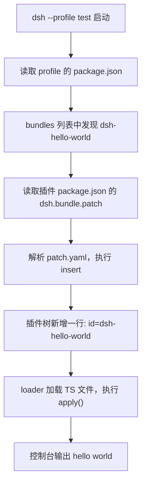

## 我们的目标

写一个最小插件，让它在 DSH 的 `test` profile 启动时打印一句 `hello world`。

## 目录结构

```text
dsh-hello-world/                         ← 插件包（bundle）
├── dsh-hello-world.ts                   ← 插件本体：name + apply
├── package.json                        ← 身份 + dsh.bundle 声明
└── patch.yaml                          ← 挂载指令
```

## 第一步：写一个最小插件

```ts
// dsh-hello-world.ts
import type { Context } from '@deepseek-ai/cordis'

export const name = 'dsh-hello-world'

export function apply(ctx: Context) {
    console.log('hello world')
}
```

- `name`：插件的唯一 id
- `apply`：挂载时执行什么

仅此而已。这就是一个合法插件。

但是要区分一下注册和挂载两个动作，注册是我们将 bundle 添加到profile 中。挂载是运行时概念，dsh 启动时将某个功能挂载到 dsh 的运行时上下文中。

## 第二步：把它变成 bundle

光有代码不够，DSH 不知道"这段代码该怎么进插件树"。所以一个 bundle 需要两个文件：

### package.json —— 身份 + 声明

```json
{
  "name": "dsh-hello-world",
  "version": "0.1.0",
  "type": "module",
  "dependencies": {
    "@deepseek-ai/cordis": "^4.0.1"
  },
  "dsh": {
    "bundle": {
      "patch": "./patch.yaml"
    }
  }
}
```

注意最后那个 `dsh.bundle.patch`——**这是 DSH 专属字段**，npm/pnpm 完全不认识它。DSH 靠它找到补丁文件。

### patch.yaml —— 说明书

```yaml
- insert:
    - id: dsh-hello-world
      name: '/绝对/路径/dsh-hello-world.ts'
```

意思是：往插件树里插一行——id 叫 `dsh-hello-world`，代码在哪个文件。



> 小坑：`name` 要用绝对路径。DSH 加载器的基准目录是 profile 目录本身，相对路径会找不到文件。

## 第三步：装进 test profile

```bash
cd 你的插件目录
dsh plugin --profile test add link:.
```

这条命令做了三件事：

1. 把 `link:.` 翻译成插件目录的绝对路径
2. 在 profile 目录里执行 `pnpm add`（是的，它只是 pnpm 的"转手人"）

## 第四步：验证

```bash
dsh --profile test --dump-config
```

这条命令会把组合好的插件树打印出来。看到这一节就成功了：

```yaml
# == dsh-hello-world
- id: dsh-hello-world
  name: /绝对路径/dsh-hello-world.ts
```

然后启动 DSH，日志里出现 `hello world`。
