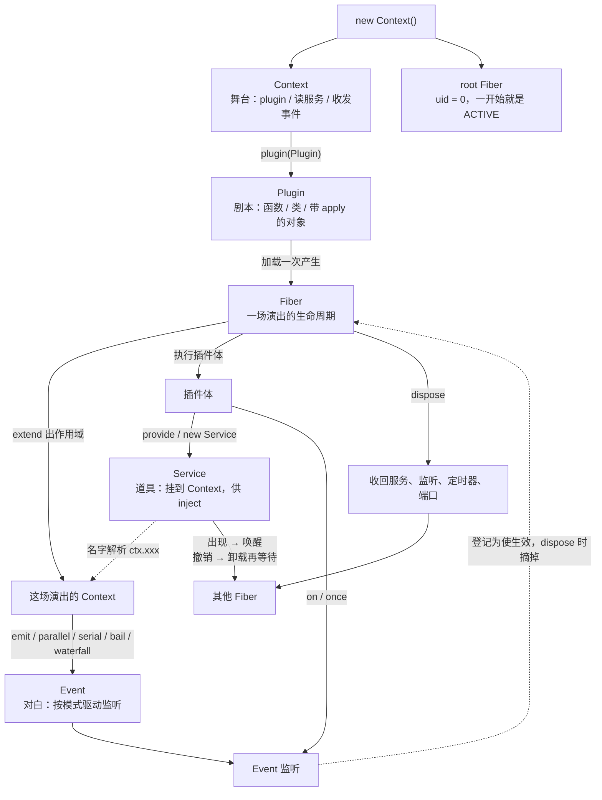

## Cordis API 文档

> 基于当前仓库源码整理（`cordis@4.0.0-rc.8`）。  
> **API 尚未稳定，可能不经通知变更。**  
> 论文：[A Programming Paradigm for Spatiotemporal Composability](https://github.com/cordiverse/paper)  
> 入门：[cordis-primer](https://deepseek-harness.github.io/deepseek-harness/reference/cordis-primer)

**Cordis** 是一套面向「时空可组合性」的**元框架**。

- **元框架**：本身不规定「怎么写 HTTP、怎么连数据库」，而是提供一套把功能拼起来的运行时。应用、机器人、工具链都可以建在它上面。
- **时空可组合性**：插件既能按依赖关系在「空间」上组合（谁依赖谁、谁和谁隔离），也能按生命周期在「时间」上组合（何时加载、何时卸载、使生效的逻辑如何回收）。

Cordis 的核心不是 HTTP 路由（按 URL 分发请求），而是下面五个概念。首次出现时的含义：

| 词汇               | 是什么                                                        | 使用之后                                                                              |
| ---------------- | ---------------------------------------------------------- | --------------------------------------------------------------------------------- |
| **Context（上下文）** | 一次运行里插件拿到的「工作环境」。通过它加载插件、读服务、收发事件。每个插件实例拿到的是带作用域的 Context。 | 得到一套可运行的世界：可以 `plugin`、读服务、收发事件。`new Context()` 之后进程里才有 root Fiber；没有它，后面什么都跑不起来。 |
| **Plugin（插件）**   | 一段可被加载的功能：函数、类，或带 `apply` 方法的对象。加载一次就产生一条 Fiber。           | 插件体开始跑，可能挂上服务、监听事件、打开资源。依赖这些服务的其他插件会从等待变为启动。卸载后这些都收回。                             |
| **Service（服务）**  | 挂到 Context 上、可供其他插件注入的能力，例如 `ctx.timer`、`ctx.loader`。      | 别人可以 `inject` 并调用它。服务一出现，等待它的 Fiber 被唤醒；服务一撤，那些 Fiber 卸掉并回到等待。                    |
| **Fiber（纤程）**    | 一次插件运行的生命周期单元，经历加载、激活、卸载、失败等状态。                            | 你能 `await` 它何时就绪、`update` 它换配置、`dispose` 它整段收回。一条 Fiber 卸掉，它登记过的监听、定时器、端口都会一起清。   |
| **Event（事件）**    | 插件之间的消息通道。用 `on` 监听、用 `emit` 等派发。                          | 插件不必互相 import。一次派发会按模式（同步 / 并行 / 短路 / 洋葱）驱动已注册的监听；监听随 Fiber 卸载自动摘掉，不会漏听、也不会卸不干净。  |

五者的关系可以看成：**Context 是舞台，Plugin 是剧本，Fiber 是一次演出，Service 是台上的道具，Event 是演员之间的对白。**

- `new Context()` 先搭舞台，并带上一条永远 ACTIVE 的 root Fiber。
- `ctx.plugin(Plugin)` 按剧本开演，长出一条新 Fiber，以及只属于这场演出的 Context（作用域）。
- 插件体在这场演出里 `provide` 服务、`on` 事件。服务挂在 Context 上，但所有权在 Fiber：卸演出就把道具撤走。
- 别的 Fiber 用 `inject` 等道具。道具一摆好，等待的演出开场；道具一撤，那些演出先散场再排队。
- 事件从 Context 派发，监听却记在 Fiber 上。演出结束，对白听筒一起收走。



本文档按公开 npm 包梳理**可编程 API**（给 TypeScript / JavaScript 调用的接口），不是 HTTP REST 文档。


---

### 包一览

**包**：独立发布的 npm 模块，可单独安装。本仓库是 monorepo（一个 git 仓库里放多个包）。

| 包名                                | 是什么                                                                           | 使用之后                                                                         |
| --------------------------------- | ----------------------------------------------------------------------------- | ---------------------------------------------------------------------------- |
| `cordis`                          | 核心运行时：Context、插件、服务、事件、Fiber、日志。                                              | 进程里出现可组合的运行时。业务以插件为单位加载、卸载，依赖自动排队。                                           |
| `@cordisjs/plugin-loader`         | **Loader（加载器）**：按配置树（一份嵌套的插件清单）加载插件，管理 **Entry（配置条目）** 和 **Group（分组）**。       | 插件不再手写一长串 `ctx.plugin`。改配置就能增删插件；运行时关掉自己会被记回配置。出现 `ctx.loader`。              |
| `@cordisjs/plugin-include`        | 从 YAML / JSON 配置文件读出插件树并挂到 Loader 上。YAML / JSON 是两种常见的文本配置格式。                 | 磁盘上的 `cordis.yml` 变成真正跑着的插件树。改文件（或 HMR 刷新）会增删、重载对应插件；`fiber.update` 默认可写回文件。 |
| `@cordisjs/plugin-group`          | 配置树里的分组插件，用来把多条 Entry 收成一组。实现上是对 loader 里 `Group` 的再导出。                       | 一组插件能一起移动、一起关。关分组不等于立刻拆掉节点，但 `disabled` 会传给子孙，子孙停跑。                          |
| `@cordisjs/plugin-timer`          | 定时器服务。提供延时、间隔，以及**节流**（限制执行频率）和**防抖**（停止触发后再执行）。定时器随 Fiber 卸载自动清掉。            | 出现 `ctx.timer` / `ctx.timeout` 等。插件卸掉后定时器不会继续响，避免「插件没了回调还在跑」。                |
| `@cordisjs/plugin-hmr`            | **HMR（Hot Module Replacement，热更新）**：文件改了只重载受影响的插件，尽量不重启整个进程。依赖 Node 内部的模块加载器。 | 改业务插件源码后，旧实例卸掉、新代码按原配置再挂上，进程和无关插件保持活着。改框架自身文件则走 `loader.exit()`（通常整进程重启）。    |
| `@cordisjs/plugin-logger-console` | **Exporter（导出器）** 的一种：把框架里的日志记录打印到终端 / 浏览器控制台。                                | 终端开始出现带时间、级别、通道名的日志。不装它时，日志只进内存环形缓冲，屏幕上看不到。                                  |
| `@cordisjs/utils`                 | 未对外发布的私有工具包，目前提供随 Context 回收的 `List`。                                         | `list.push` 的元素会随当前 Fiber 消失，不必在 disposer 里手写删除。                             |
| `create-cordis`                   | **脚手架 CLI**：命令行工具，用来从模板生成新项目。CLI 即 Command Line Interface（命令行界面）。             | 磁盘上多出一个可 `install` / `start` 的项目目录，而不是空文件夹。                                  |

---

### 核心概念

除开篇五个词外，阅读 API 时还会反复遇到这些：

| 词汇 | 是什么 | 使用之后 |
| --- | --- | --- |
| **Effect（使生效）** | 动词：使一段逻辑在 Fiber 生命期内生效，例如监听事件、开端口、设定时器。Fiber 卸载时按相反顺序 **dispose（释放）**。不是纯函数语境里的「副作用」。 | 资源被纳入当前 Fiber。插件一卸，端口、监听、定时器按相反顺序关掉，避免泄漏。 |
| **dispose / disposer** | 释放函数。调用后撤销已使生效的逻辑（取消监听、关定时器等）。 | 只收回这一段，插件其余部分继续跑。整条 Fiber dispose 时也会自动调到它。 |
| **Inject（注入）** | 声明「我依赖哪些服务」。依赖还没就绪时，这条 Fiber 停在 `PENDING`（等待），不会执行插件体。 | 启动顺序不用手排。依赖晚到就晚启动；依赖被撤就先卸再等，恢复后又自动再装。 |
| **Isolate（隔离）** | 把某个服务名切到独立命名空间。两个隔离域里可以各有一个叫 `db` 的服务，互不可见。 | 同名服务可以并存（例如两个插件各用各的数据库）。事件默认也按隔离域过滤，不会串台。 |
| **Intercept（拦截配置）** | 向下游 Context 叠一层服务配置，不改插件代码也能改行为（例如换日志名、调日志级别）。 | 下游读到的是合并后的配置。例如只对某个子树打开 DEBUG，其它地方仍是 INFO。 |
| **extend** | 以当前 Context 为原型再派生一个「影子」Context，可附加自己的属性。isolate / intercept 都建立在它上面。 | 子 Context 多了自有字段或另一套隔离 / 拦截表；读不到的属性仍回落到父级，父级本身不被改写。 |
| **Registry（注册表）** | 记录「哪个插件函数正在跑、对应哪些 Fiber」。 | 可以按插件函数查出所有实例，或一下卸掉该插件的全部 Fiber（HMR 重载就靠这个）。 |
| **Reflect（反射）** | 负责服务的提供、查找、属性混入。读 `ctx.foo` 时实际走这里。 | `ctx.foo` 能解析到当前隔离域里的实现；未注入就读会抛错，避免 silently 拿到 `undefined`。 |
| **mixin（混入）** | 把某个服务上的方法提升到 Context 上，于是可以写 `ctx.plugin()` 而不必写 `ctx.registry.plugin()`。 | 调用点变短，方法仍绑在原服务上。卸掉提供 mixin 的 Fiber 后，这些提升的名字也会从 Context 上消失。 |

最小示例：先提供一个计数服务，再注入它并打日志。跑完之后：`counter` 服务存在且值为 1，依赖它的那段回调已经执行过；如果接着 `dispose` 掉 Counter 那条 Fiber，回调所在的 inject Fiber 会卸掉，再 `provide` 回来时会重新执行一遍。

```ts
import { Context, Service } from 'cordis'

// 把计数能力做成服务：构造时 provide 到 Context，名字叫 counter
class Counter extends Service {
  value = 0
  constructor(ctx: Context) {
    super(ctx, 'counter') // 第二个参数是服务名，之后用 ctx.counter 访问
  }
  increase() {
    this.value += 1
  }
}

const root = new Context() // 根上下文；同时创建 uid 为 0 的 root Fiber

await root.plugin(Counter) // 加载插件：new Counter(ctx)，服务就绪

// 声明依赖 counter：没就绪时这段回调不会跑
await root.inject(['counter'], (ctx) => {
  ctx.counter.increase()
  ctx.logger.info('value = %d', ctx.counter.value) // %d 表示整数
})
```

---

### `cordis` 核心

安装包名就是 `cordis`。

```ts
import {
  Context,        // 运行时入口 / 工作环境
  Service,        // 可注入服务的基类
  Inject,         // 依赖声明，也可当装饰器 @Inject()
  Fiber,          // 一次插件运行的生命周期
  FiberState,     // Fiber 状态枚举：PENDING / LOADING / ACTIVE 等
  Logger,         // 单条日志通道（info / warn / error / debug）
  LoggerLevel,    // 日志级别数字：ERROR=0 … DEBUG=3
  CordisError,    // 框架错误，如在已停用 Context 上使逻辑生效
  ValidationError, // 插件 Config 校验失败
} from 'cordis'
```

- **`FiberState`**：Fiber 的状态枚举（等待、加载中、已激活等），见 [Fiber 与 Effect](#fiber-与-effect)。
- **`Logger` / `LoggerLevel`**：日志对象和级别（error / warn / info / debug）。
- **`CordisError`**：框架自己的错误类型，目前主要用于「在已停用的 Context 上使新逻辑生效」。
- **`ValidationError`**：插件配置没通过 schema 校验时抛出的错误。**schema** 是「配置长什么样」的描述。

---

#### Context

```ts
const ctx = new Context()
// 创建根 Context + root Fiber，并挂上 events / logger / reflect / registry
```

构造时会创建 **root Fiber**（根纤程，`uid` 为 `0`，一开始就是激活态），并挂上四个内置服务：`events`、`logger`、`reflect`、`registry`。

实例本身是 **Proxy**（ES 代理对象：读写属性时可以插入自定义逻辑）。因此 `ctx.foo` 不会只是普通字段，而会走 Reflect 去解析对应服务。

**使用之后**：进程里出现可加载插件的根环境。此后 `ctx.plugin` / `ctx.on` / `ctx.provide` 才有对象可挂；构造本身不会加载任何业务插件，业务要自己 `plugin` 或交给 Loader。

##### 静态成员

**symbol** 是 JavaScript 的唯一键，用来在对象上挂框架内部数据，避免和用户字段撞名。

| 成员 | 说明 |
| --- | --- |
| `Context.is(value)` | 判断值是不是 Context。 |
| `Context.effect` | 给 disposer 挂「使生效」元数据（标签、子节点）用的 symbol。 |
| `Context.filter` | 事件过滤 symbol。带这个方法的 `thisArg` 可以决定哪些监听能收到事件。 |
| `Context.isolate` | 隔离表 symbol，存「服务名 → 隔离域」。 |
| `Context.intercept` | 拦截配置表 symbol，存「服务名 → 叠加配置」。 |

##### 实例属性

| 属性 | 类型 | 说明 |
| --- | --- | --- |
| `root` | `this` | 根 Context，一般是 `new Context()` 得到的那个。 |
| `baseUrl` | `string \| undefined` | 解析相对模块路径时的基准 URL。Loader / Include 会写入，例如当前工作目录的 `file:` 地址。 |
| `fiber` | `Fiber` | 当前这条 Fiber。 |
| `events` | `EventsService` | 事件服务。 |
| `logger` | `LoggerService` | 日志服务。 |
| `reflect` | `ReflectService` | 属性 / 服务反射。 |
| `registry` | `RegistryService` | 插件注册表。 |

下列方法通过 mixin 直接挂在 Context 上，写起来和访问对应服务等价：

- 来自 `registry`：`plugin`（加载插件）、`inject`（按依赖加载一段回调）
- 来自 `fiber`：`effect`（使一段逻辑生效）
- 来自 `events`：`on`、`once`、`emit`、`parallel`、`serial`、`bail`、`waterfall`（见 [事件](#事件-events)）
- 来自 `reflect`：`get`、`set`、`provide`、`accessor`、`mixin`

##### `ctx.extend(meta?)`

以当前 Context 为原型创建一个**影子 Context**：外表像新对象，读不到的属性会落到原来的 Context 上。可把 `meta` 里的自有属性贴上去。isolate / intercept 都用它实现「同一棵树上分出不同视角」。

**使用之后**：得到一个新的 `ctx` 视角。在 child 上 `plugin` 出来的 Fiber 认 child 为父环境（隔离表、拦截表、自有字段都跟 child 走）；原来的 `ctx` 不被改写，两边的插件可以并存。

```ts
// 派生影子 Context：读不到的属性回落到 ctx，自有属性 foo 只挂在 child 上
const child = ctx.extend({ foo: 1 })
```

##### `ctx.isolate(name, label?)`

把服务名 `name` 切到独立**隔离域**（同一服务名的另一套存储）。

- 不传 `label`：每次调用生成新的本地隔离，互不共享。
- 传入同一个 **`symbol` 标签**：多个 Context 共用这一域。

**使用之后**：这个 Context 上的 `name` 与父级脱钩。父级 `provide('foo')` 填不满这里；这里 `provide('foo')` 也看不见父级的 `foo`。等待 `foo` 的子插件只会盯着这个域，不会被外面的同名服务唤醒。带同一 `label` 的多个 Context 则共享这一槽，相当于「开一个小房间给这几个人用」。

```ts
const ctx1 = root.isolate('foo')
const ctx2 = root.isolate('foo')          // 未传 label，每次都是新域，与 ctx1 看不到彼此的 foo
const shared = Symbol('shared')           // 同一个 symbol 当作隔离标签
const a = root.isolate('foo', shared)
const b = root.isolate('foo', shared)    // 传入同一 label，a / b 共享 foo
```

##### `ctx.intercept(name, config)`

向下游叠加一层名为 `name` 的拦截配置。下游服务可通过 `Service[Service.resolveConfig]()` 把祖先到当前的配置合并起来。

**使用之后**：不改插件源码，只改这条 Context 往下的行为。例如拦截 `logger` 后，下游默认日志名和级别变了，但上游和旁路不受影响。配置是叠上去的，更里层还可以再叠一层覆盖。

```ts
// 向下游叠一层 logger 配置：改日志名，并把级别提到 DEBUG(3)
const child = ctx.intercept('logger', { name: 'my-plugin', level: 3 })
// 这条 debug 在默认 INFO 级别下本来打不出来，拦截后才能看到
child.logger.debug('only visible under this intercept')
```

---

#### 插件 Plugin

插件有三种形态，均可带**静态元数据**（写在函数 / 类 / 对象上的字段，加载器读取它们，而不是运行时才算）。

**使用 `ctx.plugin` 之后**：注册表里多一条 Runtime（或复用已有的），并长出一条新 Fiber。有 `inject` 且依赖未齐时 Fiber 停在 `PENDING`，插件体不跑；依赖齐了才执行，对外提供的服务这时才出现。`await` 这条 Fiber 等于「等到它 ACTIVE，或等它失败把错误抛出来」。`dispose` 后监听和资源收回，依赖它的下游会跟着卸掉。

```ts
interface Plugin.Base<T> {
  name?: string                       // 展示名；缺省用函数名，apply 则忽略
  Config?: StandardSchemaV1<any, T>   // 配置 schema，加载前同步校验
  inject?: Inject                     // 依赖的服务；未就绪则 Fiber 停在 PENDING
  provide?: string | string[]         // 文档/元数据用，声明本插件会提供哪些服务
  intercept?: Dict<boolean>           // 文档/元数据用，声明会拦截哪些服务配置
}
```

**`Dict`**：键为字符串的普通对象，来自依赖库 `cosmokit`。

##### 1. 函数插件

```ts
function foo(ctx: Context, config: { bar?: string }) {
  ctx.on('ready', () => {}) // 监听事件；卸载时随 Fiber 自动摘掉
  return () => {
    // 返回值是 disposer：Fiber 卸载时调用，用来收尾
  }
}

await ctx.plugin(foo, { bar: 'baz' }) // 第二个参数传入配置，函数插件体里就是 config
```

##### 2. 对象插件

必须有 `apply(ctx, config)`。加载器实际执行的是这个方法。

```ts
const plugin = {
  name: 'foo',           // Fiber / 日志里显示的名字
  inject: ['timer'],     // 等 ctx.timer 就绪后才执行 apply
  apply(ctx: Context, config: any) {
    ctx.timer.timeout(() => {}, 1000) // 1 秒后执行；Fiber 卸载则定时器一并清掉
  },
}

await ctx.plugin(plugin) // 对象插件：实际跑的是 apply
```

##### 3. 类插件

用 `new` 构造。若实现了 `[Service.init]`，构造完成后会把返回值当成 Effect 执行。Effect 可以是 disposer、异步 disposer，或产生多个 disposer 的迭代器。

```ts
class Foo {
  static inject = ['logger'] // 类上的静态元数据：依赖 logger
  constructor(ctx: Context, config: { n: number }) {
    ctx.logger.info('n = %d', config.n)
  }
}

await ctx.plugin(Foo, { n: 1 }) // 用 new Foo(ctx, { n: 1 }) 构造
```

##### 配置校验

`plugin.Config` 需符合 [Standard Schema](https://github.com/standard-schema/standard-schema)（一套让 Zod / Valibot / ArkType 等校验库能被统一调用的接口）。Cordis **只支持同步**校验。

- 校验失败：抛 `ValidationError`，消息里带 issue path（出错字段路径）。
- schema 返回 Promise：抛 `TypeError('Async config validation is not supported')`。

`ctx.plugin()` 的返回值是 **thenable Fiber**。**thenable** 指实现了 `.then()`、因而可以被 `await` 的对象。这里 `await fiber` 会等到 Fiber 进入 `ACTIVE`（已激活）；失败则抛出插件体里的错误。

带 `Config` 时：非法配置当场失败，插件体不会跑，避免「配错了还半启动」。`dispose` 之后这条 Context 不能再 `plugin` / `on` / `effect`，否则抛 `INACTIVE_EFFECT`——防止卸掉的插件把新逻辑挂回已死的环境。

```ts
const fiber = ctx.plugin(Foo, config) // 立刻返回 thenable Fiber，插件可能仍在 LOADING
await fiber          // 等到 ACTIVE；插件体抛错则这里也会抛
await fiber.dispose() // 卸载：逆序回收使生效的逻辑，uid 置为 null
```

无效插件（不是函数，也没有 `apply` 方法）会抛：

```text
invalid plugin, expect function or object with an "apply" method
```

**停用的 Context**：所属 Fiber 已经 dispose，不能再使新逻辑生效。此时再调用 `plugin` / `effect` / `on` 会抛 `CordisError('INACTIVE_EFFECT')`。

---

#### Registry

`ctx.registry` 管理「**插件运行时（Runtime）** → 多条 Fiber」。同一个插件函数可以加载多次（不同配置、不同父 Context），它们共享一条 Runtime，各自是一条 Fiber。

**使用之后**：可以按「插件函数」而不是按单条 Fiber 操作。`delete(Foo)` 会卸掉 Foo 的所有实例（HMR 先 delete 再重新 plugin，配置还在旧 Fiber 上）。`get` / `has` 用来判断某插件在不在跑。`plugin` / `inject` 的效果见上一节。

| 方法 | 说明 | 使用之后 |
| --- | --- | --- |
| `plugin(plugin, config?)` | 加载插件，返回 thenable Fiber。 | 多一条运行中的实例；可能唤醒依赖它的下游。 |
| `inject(deps, callback)` | 等价于 `plugin({ inject, apply: callback })`：先等依赖，再跑这段函数。 | 依赖齐之前回调不跑；齐了才执行，依赖撤了再卸。 |
| `resolve(plugin)` | 解析出作为 Map 键的函数：插件本身是函数就用它，否则用 `plugin.apply`。 | 后续 `get` / `delete` 用的是这个函数，不是对象外壳。 |
| `get(plugin)` | 取这条插件的 `Plugin.Runtime`。 | 能看到该插件当前所有 Fiber。 |
| `has(plugin)` | 是否已注册。 | 判断「这个插件还在不在跑」。 |
| `delete(plugin)` | 注销，并 dispose 其下全部 Fiber。 | 该插件所有实例一起卸掉；HMR 靠它换新模块。 |
| `keys()` / `values()` / `entries()` / `forEach()` | 遍历运行时。 | 可列出进程里正在管的全部插件。 |
| `size` | 已注册插件数。 | 不含同一插件的多条 Fiber，只计不同的插件函数。 |
| `counter` | 递增分配 Fiber 的 **uid**（实例编号）。 | 每条新 Fiber 拿到不重复的 uid，dispose 后不再复用。 |

```ts
ctx.registry.get(Foo)      // 按插件函数取出 Runtime；从未加载过则 undefined
ctx.registry.delete(Foo)   // 注销 Runtime，并 dispose 它下面的全部 Fiber
```

`Plugin.Runtime`：

```ts
interface Plugin.Runtime {
  name?: string                   // 展示名
  fibers: DisposableList<Fiber>   // 该插件当前所有实例；可按插入序遍历、按值删除
  callback: Function              // 真正执行的函数（函数插件本身或 apply）
  Config?: StandardSchemaV1       // 与 Plugin.Base.Config 相同，用于校验
}
```

**`DisposableList`**：核心里的通用列表。`push` 返回删除函数；`clear` 按相反顺序取出元素，方便做 dispose。

---

#### Service 与依赖注入

**依赖注入**：插件不自己 `new` 依赖，而是声明「我需要 `foo`」，由运行时在 `foo` 就绪后再启动它。

**使用之后**：`new Service(ctx, 'http')` 立刻把实例 `provide` 出去，等待 `http` 的 Fiber 会被唤醒。实现 `[Service.init]` 时，构造结束还不算对外就绪——init 跑完（含异步）之后依赖方才看得到它，避免「服务在、资源还没打开」。`Service.check` 返回 `false` 时，依赖方当作服务不存在，可以做运行时开关。`resolveConfig` 让同一套代码在不同 intercept 下读到不同超时、不同名字。

```ts
// T 是 intercept 配置的类型；没配置可写成 never
abstract class Service<T = never> {
  constructor(ctx: Context, name: string) // 内部会 ctx.reflect.provide(name, this)
}
```

`T` 是该服务可被 intercept 的配置类型。构造时会 `ctx.reflect.provide(name, this)`，把实例挂到 Context，之后别人就能 `inject(['该名字'])`。

##### 静态 symbol

| Symbol | 用途 |
| --- | --- |
| `Service.init` | 构造后执行的初始化 Effect。 |
| `Service.check` | 可用性检查。返回 `false` 时，依赖方当作「这个服务还不存在」。 |
| `Service.config` | 标记「我有 intercept 配置」，并带上配置类型 `T`。 |
| `Service.invoke` | 让服务实例可以当函数调用，例如 `ctx.logger()` 再返回一个具名 Logger。 |
| `Service.extend` | 扩展影子实例（配合 Context 的追踪代理）。 |
| `Service.tracker` | **Tracker（追踪器）**：记录这个对象和哪个服务名、哪个 `ctx` 字段关联，便于跨 Context 访问时改写 `this.ctx`。 |
| `Service.resolveConfig` | 把 intercept 链上的配置合并成一份。 |

```ts
class Http extends Service<{ timeout?: number }> {
  static inject = ['timer'] // 依赖 timer；未就绪则本服务所在 Fiber 等待

  constructor(ctx: Context) {
    super(ctx, 'http') // 服务名 http，之后可 ctx.http
  }

  // 构造完成后作为 Effect 执行；可返回 disposer / 异步 disposer
  async [Service.init]() {
    return () => {} // Fiber 卸载时调用
  }

  get timeout() {
    // 从祖先到当前收集 intercept['http']，合并后读 timeout
    return this[Service.resolveConfig]().timeout ?? 3000
  }
}
```

##### Inject

```ts
type Inject = string[] | Record<string, any>

// 1. 数组：只声明依赖名；foo、bar 都就绪后才跑回调
ctx.inject(['foo', 'bar'], (ctx) => { /* 这里可以安全读 ctx.foo / ctx.bar */ })

// 2. 对象：依赖 logger，并给它叠一层 intercept（改日志名）
ctx.inject({ logger: { name: 'worker' } }, (ctx) => { /* ... */ })

// 3. 装饰器（TypeScript 5+）：标在 class 上 = 整个服务依赖 foo
@Inject('foo')
class Bar extends Service {
  constructor(ctx: Context) {
    super(ctx, 'bar')
  }

  // 标在方法上：foo 就绪后才调用；返回值当作使生效的 disposer
  @Inject('foo')
  onFooReady() {
    return () => {} // foo 消失或本 Fiber 卸载时执行
  }
}
```

**装饰器 `@Inject()`** 只能用在 class 或 class method 上。方法级注入会在 `[Service.init]` 阶段通过 `ctx.inject` 挂上；服务消失时自动 dispose。

依赖未就绪时，对应 Fiber 为 `PENDING`，不会执行插件体。依赖恢复后自动刷新（内部 `_refresh`）再加载。

**使用 inject 之后**：回调 / 方法里可以安全读依赖，不必自己轮询。依赖被撤：方法级注入的 disposer 先跑，整段逻辑停；依赖回来：再跑一遍，等于自动重绑。对象形式还能顺带 intercept，例如这段回调里的日志都叫 `worker`，外面不受影响。

---

#### Reflect

服务查找、提供、属性混入都走 `ctx.reflect`。下列方法也 mixin 到 Context。

##### `ctx.provide(name, value?, check?)`

在当前 Fiber 上**注册服务**（把一个值放到名为 `name` 的槽里）。同一隔离域里同名服务不可重复注册。返回 disposer，调用后撤销该服务。

**使用之后**：同隔离域里等待 `name` 的 Fiber 从 `PENDING` 进入加载。发 `internal/service`。再 `provide` 同名会抛错。`dispose()` 或所属 Fiber 卸载后槽被清空，下游卸掉并重新等待。可选 `check()` 返回 `false` 时，槽还在，但依赖方当它不存在——适合「实现了但暂时不可用」。

```ts
const dispose = ctx.provide('foo', { bar: 1 }) // 在当前 Fiber 的隔离域里注册 foo
ctx.foo.bar  // 1；依赖方 inject(['foo']) 后才能这样读
dispose()    // 撤销服务；依赖 foo 的 Fiber 会回到 PENDING
```

可选 `check()`：返回 `false` 时，依赖该服务的 Fiber 会视为依赖未满足。

##### `ctx.get(name, strict?)` / `ctx.set(name, value)`

- **`get`**：按当前 isolate 查找实现。`strict` 默认 `true`，意思是「提供方 Fiber 必须是 `ACTIVE` 才看得到」。
- **`set`**：改已经 provide 过的值；只能由当初提供该服务的同一个 Fiber 设置。

**使用之后**：`get` 在服务还在 LOADING 时（strict）拿不到值，避免用到半成品。`set` 只换槽里的值，不换提供方 Fiber，依赖关系不变；跨 Fiber 写会抛错，防止两个插件抢同一个槽。

未 inject 就读服务、未 provide 就写服务会抛错：

```text
cannot get property "foo" without inject
cannot set property "foo" without provide
```

##### `ctx.accessor(name, { get, set? })`

声明**计算属性**（每次读写都走自定义 get / set），而不是存一份服务实例。mixin 内部就是用 accessor 实现的。

**使用之后**：`ctx.xxx` 每次读写都现算。同名不能再 `provide` 成服务，撞名会抛错。登记 accessor 的 Fiber 卸掉后，这个名字从 Context 上消失。

##### `ctx.mixin(source, mixins)`

把某个对象或服务上的方法提升到 Context。框架启动时就用它把 `plugin`、`on`、`effect` 摊平到 `ctx`。

**使用之后**：可以写 `ctx.timeout()` 而不写 `ctx.timer.timeout()`。提升出去的函数仍绑在原服务上，`this` 和追踪代理不丢。提供 mixin 的 Fiber 卸掉后，这些名字一并消失，下游再调用会变成「没有这个属性」。

```ts
// 把 ctx.timer 上的三个方法提升到 ctx 上（同名）
ctx.mixin('timer', ['timeout', 'interval', 'debounce'])
ctx.timeout(() => {}, 1000) // 等价于 ctx.timer.timeout(...)
```

`mixins` 可以是字符串数组（同名提升），或 `{ 源键: 目标键 }` 映射（改名提升）。

##### 其他

| 方法 | 说明 |
| --- | --- |
| `reflect.trace(value)` | 按当前 Context 生成**可追踪代理**：访问带 Tracker 的对象时，自动换成「站在当前 ctx 视角」的版本。效果：在隔离 / 拦截过的 ctx 里调服务方法，方法内部的 `this.ctx` 仍是调用方的 ctx，不会串回提供方。 |
| `reflect.bind(fn)` | 包装函数，调用时 `this` 和参数都会先 `trace` 一遍。事件监听默认会 bind。效果：监听里拿到的服务实例带着正确的调用方视角。 |
| `reflect.notify(names, filter?)` | 通知依赖这些服务名的 Fiber 重新检查依赖并刷新。效果：服务可用性变化后，等待方会自动装上或卸下，不必手写唤醒。 |

---

#### 事件 Events

通过 TypeScript 的 **`declare module`（模块扩充）** 把事件名合并进核心的 `Events` 接口，这样 `ctx.on('message', ...)` 才能得到参数类型。

**使用事件之后**：插件之间只靠事件名协作，不必互相引用。`on` 登记的监听绑在当前 Fiber 上——Fiber 一卸，监听消失，不会接到已死插件上。`once` 触发一次就摘掉。`prepend` 让你插到队头（例如抢在默认 `internal/update` 之前改配置）。`global` 忽略 filter，连隔离域外的监听也能收到。

```ts
declare module 'cordis' {
  interface Events {
    'app/ready'(): void                      // 无参数
    'message'(text: string): void            // 一个字符串参数
    'check'(value: number): boolean | void   // 可返回 boolean，供 bail / serial 短路
  }
}
```

##### 监听

```ts
const dispose = ctx.on('message', (text) => {
  ctx.logger.info(text)
}) // 返回 disposer；调用后不再收到 message

ctx.once('app/ready', () => {})  // 只触发一次，然后自动摘掉
dispose()                         // 手动取消 message 监听
```

`options`：

```ts
interface EventOptions {
  prepend?: boolean   // true：插到队列头，先于已有监听执行
  global?: boolean    // true：忽略 Context.filter，所有监听都收到
}
```

```ts
ctx.on('message', handler, true) // 第三个参数传 true = { prepend: true }
ctx.on('internal/update', handler, {
  global: true,   // 不受 filter 过滤
  prepend: true,  // 插到队头，先于默认的 update 处理
})
```

##### 派发模式

同一批监听，按不同策略执行：

| 方法 | 同步 | 语义 | 使用之后 |
| --- | --- | --- | --- |
| `ctx.emit(name, ...args)` | 同步 | 全部执行，互不等待。某个监听抛错会中断后续。 | 立刻通知所有人。适合「广播一声、不关心返回值」。一人抛错，后面的监听这次收不到。 |
| `ctx.parallel(name, ...args)` | 异步 | 用 `Promise.allSettled`（等全部结束，失败不互相取消）。有拒绝则抛 **`AggregateError`**（把多个错误收在 `.errors` 里）。 | 所有监听都会跑完。适合「多家同时干活」。有失败时你拿到全部错误，而不是只看到第一个。 |
| `ctx.serial(name, ...args)` | 异步 | 按顺序 `await`。监听返回 **bailed** 值则短路并返回该值。 | 谁先处理完谁说了算。后面的监听这次不会跑。适合「责任链：有人认领就停」。 |
| `ctx.bail(name, ...args)` | 同步 | 与 serial 相同，但不 `await`。 | 同步责任链。适合拦截「该不该继续」这类马上能回答的问题。 |
| `ctx.waterfall(name, ...args, inner)` | 同步 | **洋葱模型**：每个监听收到 `next`，可先处理后调用 `next()`，也可直接返回从而跳过后面的监听。没人接手时落到最后一个参数 `inner`。 | 可以包一层再放行（改配置、改返回值），也可以中途截住。`fiber.update`、属性 get/set 都走这条，所以能插入自己的保存 / 校验逻辑。 |

**bailed（已拦截）**：返回值不是 `null` / `false` / `undefined`，就认为「这件事处理完了」。`isBailed(value)` 即此判断。

**`thisArg`**：派发时可选的第一个对象参数，会作为监听函数的 `this`，并参与 `Context.filter` 过滤（例如「只有同一隔离域的监听能收到」）。

```ts
ctx.emit(session, 'message', text)      // session 作为 thisArg，并参与 filter
ctx.parallel(session, 'message', text)  // 异步并行派发，同样带 thisArg
```

waterfall 示例：两个监听都做 `value + next()`，内层返回 `2`，外层再加，得到 `1+1+2 = 4`。

```ts
ctx.on('transform', (value, next) => value + next()) // 外层：1 + 内层结果
ctx.on('transform', (value, next) => value + next()) // 内层：1 + inner()
ctx.waterfall('transform', 1, () => 2)  // 1 + (1 + 2) = 4；最后的 () => 2 是 inner
```

---

#### Fiber 与 Effect

`Fiber` 是一次插件运行。root Context 自带 `uid === 0` 且状态为 `ACTIVE` 的 Fiber。

**Effect** 在本文译为动词**使生效**：调用 `ctx.effect()` 即使一段逻辑随 Fiber 生效，并在卸载时回收。这和「副作用 / side effect」（函数是否改了外部状态）不是一回事。`ctx.effect()`、插件返回值、`Service.init` 的返回值，都会被收进当前 Fiber 的使生效表。

**使用 Fiber 之后**：你拿到的是「这一次插件运行」的把手。`await` 它 = 等到就绪或失败；`dispose` = 整段收回，依赖它服务的下游跟着停；`restart` = 先清再建（配置不变）；`update` = 换配置再走一遍，Loader 默认还会把新配置写回文件。状态进入 `ACTIVE` 时，它 `provide` 的服务才对外可见；进入 `FAILED` 时错误打进 logger，依赖方当服务不存在。

##### 状态

```ts
enum FiberState {
  PENDING,     // 依赖未就绪，插件体还没跑
  LOADING,     // 正在执行插件体 / 初始化 Effect
  ACTIVE,      // 已激活，可对外提供服务
  FAILED,      // 执行出错
  DISPOSED,    // 已销毁（uid 被置空）
  UNLOADING,   // 正在按相反顺序回收 effect
}
```

##### 公开字段 / 方法

| 成员 | 说明 |
| --- | --- |
| `uid` | 实例编号；dispose 后为 `null`。root 为 `0`。 |
| `ctx` | 该 Fiber 的 Context。 |
| `config` | 经过 schema 校验后的配置。 |
| `state` | 当前 `FiberState`。 |
| `runtime` | 所属 `Plugin.Runtime`。 |
| `inject` | 解析后的依赖表（服务名 → intercept 配置或 `null`）。 |
| `dispose()` | 卸载。插件 Fiber 返回 `Promise<void>`。效果：逆序回收使生效的逻辑，`uid` 变 `null`，发 `internal/plugin` / `internal/status`。 |
| `await()` | 等到 **`inertia`（惯性异步）** 结束。inertia 是加载 / 卸载尚未收尾时挂着的那条 Promise；若失败则抛出。效果：调用方不用自己轮询 `state`。 |
| `restart()` | 先卸再装。效果：监听和资源重建一遍，配置不变；中间下游会短暂看不到服务。 |
| `update(config, noSave?)` | 校验配置后走 `internal/update` waterfall，再 restart。`noSave` 为 true 时，Loader 不会把配置写回文件。效果：插件按新配置再跑；默认还会改磁盘上的配置。 |
| `effect(fn, label?)` | 使一段逻辑生效。`label` 只用于调试时展示。效果：返回的 disposer 可提前收回这一段；Fiber 卸时也会收到。 |
| `getEffects()` | 当前 effect 的元数据树（标签 + 子节点）。效果：便于调试「这条插件到底挂了哪些资源」。 |
| `name` | 运行时名称；没有则沿父链回退，直到 `'root'`。效果：日志默认通道名、`inspect(ctx)` 显示名都来自它。 |
| `assertActive()` | 已 dispose 则抛 `CordisError`。效果：在死 Context 上登记新逻辑会立刻失败，而不是默默挂上去。 |

##### Effect

```ts
type Disposable<T = any> = () => T // 释放函数；调用后撤销已使生效的逻辑

type Effect =
  | Disposable                    // 同步 disposer
  | Iterable<Disposable>          // 例如 function*，可 yield 多个 disposer
  | Promise<Disposable>           // 异步拿到一个 disposer
  | AsyncIterable<Disposable>     // 异步生成器，按序产出 disposer
```

```ts
const dispose = ctx.effect(() => {
  const server = listen()
  return () => server.close() // Fiber 卸载或手动 dispose() 时关端口
}, 'listen()')                // label 只用于 getEffects() / 调试展示

// 生成器：登记多个 disposer，卸载时按 step2 → step1 逆序执行
ctx.effect(function* () {
  yield () => step1()
  yield () => step2()
})

// 异步：等 open() 完成后再登记关闭逻辑
await ctx.effect(async () => {
  const res = await open()
  return () => res.close()
})
```

`effect()` 返回的 disposer 自身也是 thenable：`await` 它得到的是「异步 dispose 函数」。插件体和 `Service.init` 的返回值同样按 Effect 收集。

**使用 `effect` 之后**：端口、定时器、监听被框架记账。插件异常或被 unload 时按登记的反序关掉，后开的先关。生成器可以一次登记多步，保证 `step2` 的清理先于 `step1`。异步 effect 在 `open()` 完成前 Fiber 若开始卸载，不会留下「打开了却没人关」的窗口（epoch 对不上就不再 collect）。

`fiber.update()` 会触发：

```ts
// fiber 是 thisArg；next 是洋葱模型的下一环（默认会写 config 并 restart）
ctx.waterfall(fiber, 'internal/update', config, noSave, next)
```

监听者可改写配置，或选择不调用 `next` 从而短路。Loader 用这条链把配置写回文件。

---

#### 隔离 isolate 与拦截 intercept

##### isolate

服务在存储里的真正键不是字符串 `'db'`，而是 `ctx[Context.isolate]['db']` 这个 symbol。不同隔离域拿到不同 symbol，因此同名服务互不可见。

**使用 isolate 之后**：多套同名服务可以同时存在。测试里给插件单独塞一个假 `db`，不会污染全局；两个业务插件也可以各连各的库。以该服务为 `thisArg` 发出的事件，默认只有同一隔离域的监听能收到，避免「A 的 db 事件打到 B」。Loader 配置里的 `isolate: { db: true }` / `{ db: 'shared' }` 是同一机制的配置写法。

```ts
const isolated = root.isolate('db')      // 切出一套独立的 db 存储
isolated.provide('db', localDb)         // 只填 isolated 的槽，root.db 仍是原来的值
```

Service 默认带 filter：只有 isolate 标签相同的 Context，才能收到「以该服务为 `thisArg`」发出的事件。

##### intercept

`ctx.intercept(name, config)` 把配置挂到 **原型链**（对象找不到自有属性就往父对象找）上。`Service[Service.resolveConfig](base?, head?)` 从祖先走到当前，收集同名配置后用 `Object.assign` 合并；若服务的 `Config` 带 `merge` 方法，则走自定义合并。

**使用 intercept 之后**：同一服务在不同子树里读到不同配置，而服务实现只有一份。Loader 的 `{ await: true }` 会让「还在加载」时 `ctx.loader` 对依赖方表现为未就绪，从而推迟那些必须等整棵树装完才启动的插件。

Loader 自身也声明了 intercept：

```ts
interface Loader.Intercept {
  await?: boolean // true：树上还有加载任务时，Loader 的 check 失败，依赖它的 Fiber 继续等
}
```

---

#### Logger

`ctx.logger` 是**可调用服务**（因为实现了 `Service.invoke`）：直接 `.info()` 用当前 Fiber 的默认名字；`ctx.logger('http')` 则得到一个名为 `http` 的 Logger。

**使用之后**：每条日志送给所有 Exporter，并写入内存环形缓冲。默认没有控制台导出器时，屏幕上什么都没有，但 `ctx.logger.buffer` 里能翻到最近 1000 条。级别不够的记录直接丢掉，不会进导出器。`intercept('logger', …)` 只影响这条 Context 往下的默认名和级别。Error 若带 `cause` 或 `errors`，会拆开再打，避免聚合错误只显示一层。

```ts
ctx.logger.info('hello %s', 'world')  // 用当前 Fiber 名；%s 替换成 world
ctx.logger('http').error(err)         // 另开名为 http 的通道，适合按模块过滤
ctx.logger.warn('deprecated')
ctx.logger.debug('verbose')           // 默认 INFO 级别下不会输出
```

级别数字越大越啰嗦：

```ts
enum LoggerLevel {
  ERROR = 0, // 只看错误
  WARN = 1,
  INFO = 2,  // 默认
  DEBUG = 3, // 最啰嗦
}
```

默认级别为 `INFO`。可用 intercept 覆盖。未指定 `name` 时，用当前 Fiber 名称做 **hyphenate**（把 `CamelCase` / 空格变成 `camel-case` 这种短横线形式）。

```ts
// 下游默认日志名改成 worker，并放开 DEBUG
ctx.intercept('logger', { name: 'worker', level: LoggerLevel.DEBUG })
```

##### Exporter

**Exporter** 是日志的出口：每条日志会送给所有已注册的导出器，由它们决定打印、落盘还是丢掉。

**使用 `logger.exporter` 之后**：新出口立刻开始收后续日志（含级别过滤）。返回的 disposer 摘掉这个出口，其它出口不受影响。插件 Fiber 卸载时也会自动摘，避免「插件没了还往它的文件里写」。

```ts
interface Exporter {
  colors?: number | false                 // 终端颜色等级；false 关闭
  maxLength?: number                      // 单行截断长度，默认 10240
  levels?: Record<string, number>         // 可含 default，按 logger 名覆盖级别
  formatters?: Record<string, Formatter>  // 自定义 %x 占位符怎么把值收成字符串
  export(message: Message): void          // 真正处理一条日志
}

const dispose = ctx.logger.exporter({
  levels: { default: LoggerLevel.DEBUG }, // 未单独配置的 logger 都用 DEBUG
  export(message) {
    // message.sn 序号、ts 时间戳、name 通道名、type 级别、args 参数、fiber 弱引用
  },
}) // 返回 disposer，调用后这个出口不再收日志
```

内置一个 **ring buffer（环形缓冲区）**：只保留最近 `bufferSize`（默认 1000）条，超出就丢掉最旧的。默认格式化占位符：`%s` 字符串、`%d` / `%i` 整数、`%f` 数字、`%o` / `%O` JSON、`%c` 空、`%C` 带颜色的名字。

`Logger.format(exporter, message)` / `Logger.color` / `Logger.code` 可用于自定义渲染。

---

#### 内部事件

框架自己发出的事件。一般不必手动订阅，除非在写 Loader、HMR 这类**基础设施插件**（给别的插件提供运行环境，而不是业务功能）。

| 事件 | 参数 | 时机 | 订了之后能做什么 |
| --- | --- | --- | --- |
| `internal/plugin` | `(fiber)` | Fiber 创建或销毁（`uid` 被置空）。 | 跟踪插件列表、画生命周期图；Loader 靠它识别「插件自己把自己关了」。 |
| `internal/status` | `(fiber, oldState)` | Fiber 状态变化。 | 做状态栏、等某插件 ACTIVE；进入 / 离开 ACTIVE 时还会触发服务 notify。 |
| `internal/service` | `(name, value)` | 服务提供 / 撤销后通知。带 isolate filter。 | 在 inject 之外响应「某个服务出现/消失」，例如刷新 UI。 |
| `internal/update` | `(config, noSave, next)` | `fiber.update()` 的 waterfall。 | 改写配置、拒绝更新、或先落盘再 `next()`。不调 `next` 则默认的 restart 不会发生。 |
| `internal/listener` | `(name, listener, options)` | `ctx.on()` 注册前。若 bail 得到返回值，就用它代替默认注册。 | 把特定事件存到别处（Loader 把 `internal/update` 收到 Fiber 自己的钩子列表）。 |
| `internal/dispatch` | `(mode, name, args, thisArg)` | 名称不以 `internal/` 开头的事件派发前。`mode` 是 emit / parallel 等。 | 做事件总线的调试 / 追踪，看不到 `internal/*` 自身以免递归。 |
| `internal/get` | `(ctx, name, error, next)` | 读取尚未声明的属性时的 waterfall。 | 给未声明的名字补一层兼容或更好的报错。不调 `next` 就不会走到默认查找。 |
| `internal/set` | `(ctx, name, value, error, next)` | 写入服务属性时的 waterfall。 | 拦截或记录对服务的赋值。 |

---

### `@cordisjs/plugin-loader`

**Loader** 按**配置树**加载插件。配置树是一份可嵌套的清单：每项是一个插件，分组节点的 `config` 又是子清单。

`cordis` 的 CLI 会先挂上 Loader，再创建 Include 入口（去读 `cordis.yml`）。

**使用之后**：出现 `ctx.loader`。`create` / `update` / `remove` 会改内存树并 `write()`（根 Loader 的 write 是空的，Include 才会落盘）。插件 `fiber.update` 默认把新配置写回对应 Entry；插件自己 `dispose` 且不是 HMR / 祖先在卸时，这条会被标 `disabled` 并记住——下次启动不会再开。`fiber.entry` 被填上，报错堆栈能指到配置文件的 id。

```ts
import Loader from '@cordisjs/plugin-loader'

const ctx = new Context()
// 相对路径 import 的起点；末尾斜杠表示「目录」
ctx.baseUrl = pathToFileURL(process.cwd()).href + '/'
await ctx.plugin(Loader, { baseUrl: ctx.baseUrl }) // 可选；传入则写入 ctx.baseUrl
```

挂载后 Context 上出现 `ctx.loader`。

#### Loader

继承 **`EntryTree`（条目树）**：内存里的整棵配置，负责 id 解析、增删改、递归等待加载完成。

| 成员 | 说明 |
| --- | --- |
| `config.baseUrl` | 写入 `ctx.baseUrl`，作为相对路径 import 的起点。 |
| `envData` | 来自环境变量 `process.env.CORDIS_SHARED` 的 JSON；没有则默认 `{ startTime }`。用于多进程共享启动信息。 |
| `internal` | Node 的内部 **ESM ModuleLoader**（ES 模块加载器）。要访问它，进程需加 `--expose-internals`，或安装可选依赖 `node-addon-require-builtin`。HMR 依赖这个。 |
| `builtins` | **伪协议** `cordis:<name>` 对应的内置模块表。`import` 遇到此前缀就不走文件系统，而从这张表取。 |
| `locate(fiber?)` | 沿父链找到所属 Loader Entry 的 id。 |
| `unwrapExports(exports)` | 解开 `default` / `__esModule` 互操作。打包器和 Node 对「默认导出」的包法不一致，这里统一取出真正的插件。 |
| `showLog(entry, type)` | 打印 apply / reload / unload 一类加载日志。 |
| `exit()` | 默认空实现（**no-op**：调用了但什么也不做）。HMR 发现框架自身文件被改时会调它，宿主可以改写成退出进程。 |
| `write()` | 根 Loader 是 no-op；Include 会覆盖为「写回配置文件」。 |

`Service.check`：若 intercept 了 `{ await: true }`，且树上还有没跑完的加载任务，Loader 视为未就绪。

效果：依赖 `loader` 的插件会等整棵树装完再启动，而不是 Loader 服务一出现就跑。

#### EntryOptions

配置树中的一条插件记录：

```ts
interface EntryOptions {
  id: string                              // 配置内唯一；没有则 Loader 生成 8 位 hex
  name: string                            // 模块说明符：包名、相对路径或 cordis:xxx
  config?: any                            // 传给插件的配置；分组节点则是子清单
  group?: boolean | null                  // true：本节点是分组，config 为 EntryOptions[]
  disabled?: boolean | null               // true：不加载；分组自身不停，但会传给子孙
  inject?: Inject | null                  // 额外注入，合并进插件自带的 inject
  intercept?: Dict | null                 // 叠给该 Entry 的服务配置
  isolate?: Dict<true | string> | null    // true=本地域，字符串=命名全局域
}
```

- **`name`**：**模块说明符**，即 `import` 能理解的名字：npm 包名、相对路径，或 `cordis:<builtin>`。写上之后 Loader 会去 import 并 `plugin`。
- **`group: true`**：该节点是分组，`config` 为子 `EntryOptions[]`。分组自己不会因为 `disabled` 停掉，但 `disabled` 会传给子孙——效果是「组还在树上，孩子都不跑」。
- **`disabled: true`**：这条不 `init`。已在跑的会被 dispose。去掉 disabled 后 `refresh` / 下次 update 会再装上。
- **`isolate[name] = true`**：该 Entry 的本地隔离域，后缀形如 `#<entryId>`。效果：只有它自己（和它声明的本地域）看得到这套服务。
- **`isolate[name] = 'label'`**：全局命名隔离域，后缀形如 `@label`，同名 label 共享。效果：配置里写同一个 label 的几条插件共用一套服务。
- **`inject` / `intercept`**：叠在插件自带声明之上。效果：不改插件代码也能加依赖、改服务配置。
- **`config`**：传给插件的配置。在 YAML 里可用 `!!js` 表达式，见 [表达式插值](#表达式插值)。表达式在该 Entry 的 Context 上求值，因此能读到当时已有的服务。

#### EntryTree

| 方法 | 说明 | 使用之后 |
| --- | --- | --- |
| `entries()` | 递归遍历全部 Entry（含子树）。 | 能列出现在树上真实在管的每一条，含子 Include。 |
| `getTasks()` | 尚未完成的 init 任务或 Fiber inertia。 | 用来判断「还在加载吗」；空数组表示树已静下来。 |
| `await()` | 等到任务清空。 | 后面的代码可以假定配置里的插件都已 ACTIVE 或 FAILED。 |
| `ensureId(options)` | 没有 id 则生成 8 位 **hex**（十六进制随机串）。 | 新条目有了稳定 id，之后才能 `update` / `remove` / 写回。 |
| `resolve(id)` | 用 `父:子` 形式解析跨树 Entry。分隔符是 `:`。 | 拿到跨 Include 边界的那一行，找不到则抛错。 |
| `resolveGroup(id \| null)` | `null` 表示根组。 | 后续 `create` 知道往哪插。 |
| `create(options, parent?, position?)` | 插入一条并 `write()`。 | 对应插件开始加载（未 disabled 时）；配置文件（若是 Include）会多一行。 |
| `remove(id)` | 删除并 `write()`。 | Fiber dispose，树上和文件里都没了。 |
| `update(id, options, parent?, position?)` | 更新字段，或改父节点 / 位置。 | 可能 restart Fiber、换隔离域、换组；文件同步。 |
| `import(name, getOuterStack?)` | 加载模块。`getOuterStack` 用于把报错堆栈接到配置文件的位置。 | 得到插件导出。失败时堆栈会多几行 `at file.yml#id`，方便对上配置。 |

```ts
const id = await ctx.loader.create({
  name: '@cordisjs/plugin-timer', // 插入根组；会自动补 id 并 write()
})

await ctx.loader.update(id, { disabled: true }) // 关掉这条，配置写回
ctx.loader.remove(id)                           // 从树上删掉并 write()
await ctx.loader.await()                        // 等到所有 init / inertia 结束
```

#### Entry / EntryGroup

**`Entry`**：配置里的一行，对应一次（或待执行的）插件加载，持有 `fiber`。主要方法：

- `update`：改 options，必要时重启 Fiber。效果：配置变了才动手；`disabled` 会停掉已有 Fiber。
- `refresh`：若尚未创建 Fiber 且未 disabled，则 `init`。效果：祖先从 disabled 恢复时，把该开的孩子拉起来。
- `init`：import 模块并 `registry.plugin`。效果：`entry.fiber` 被赋值，加载日志打出 apply。
- `evaluate`：在该 Entry 的 Context 上求值一段 JS 表达式。效果：`!!js` 能读到这条插件视角下的服务。

**`EntryGroup`**：一组 Entry 的容器（根树或某个 `group: true` 节点）。

| 方法 | 说明 | 使用之后 |
| --- | --- | --- |
| `create(options)` | 创建或复用 Entry 并 update。 | id 已存在则搬到本组并按新 options 重跑。 |
| `remove(id)` | dispose Fiber 并从 store 删除。 | 发 `loader/partial-dispose`；默认还会从 `data` 里摘掉。 |
| `update(config[])` | 按 id 做 **diff**（新旧清单对比）：有则更新、无则删除、多则新增。 | 整组对齐到新清单，适合「文件重读」或 Group 收到 `internal/update`。 |
| `stop()` | 停掉组内全部 entry。 | 组被卸时调用；孩子 Fiber 全部 dispose。 |

#### Loader 事件

```ts
interface Events {
  'exit'(signal: NodeJS.Signals): Promise<void> // 进程信号；可供宿主做优雅退出
  'loader/config-update'(): void                 // 配置即将写回文件
  'loader/entry-init'(entry: Entry): void        // 刚 new 出 Entry，模块尚未 import
  'loader/partial-dispose'(
    entry: Entry,
    legacy: Partial<EntryOptions>, // 变化前的旧字段
    active: boolean,               // true：仍留在树上，只是字段变了
  ): void
  'loader/patch-context'(entry: Entry, next: () => void): void // waterfall：next 里才 fiber.update
}
```

- **`loader/entry-init`**：刚 new 出 Entry、尚未加载模块。
- **`loader/patch-context`**：更新隔离 / 拦截 / 父 Context 时的 waterfall，`next` 里会真正 `fiber.update`。
- **`loader/partial-dispose`**：Entry 部分字段变化或被移除。`legacy` 是旧 options，`active` 表示是否仍留在树上。
- **`loader/config-update`**：配置即将写回文件。

`internal/update` 在带 entry 的 Fiber 上还会：

1. 把 config（若 `Config` 有 `simplify` 就先简化）写回 `entry.options.config`，再 `tree.write()`。
2. 打 reload 日志。

若插件自己调用 `fiber.dispose()`，且不是 HMR、也不是祖先树在卸，Loader 会把该 entry 标为 `disabled` 并写回配置——相当于「运行时关掉自己，并记住下次不要再开」。

#### 表达式插值

配置里可以嵌一段要在 Context 上执行的 JavaScript，而不是写死字面量。

```ts
interface JsExpr { __jsExpr: string } // YAML !!js 反序列化后的形态

evaluate(ctx, expr)      // 等价于 with (ctx) eval(expr)，能读到 ctx 上的服务
interpolate(ctx, value)  // 递归走对象 / 数组，遇到 JsExpr 就 evaluate
isJsExpr(value)          // 判断是不是 { __jsExpr }
```

YAML 用自定义标签 `!!js` 表示这种表达式，加载时在该 Entry 的 Context 上求值。`eval` 能读到 `ctx` 上的服务，因此配置可以引用运行时状态。

**使用之后**：配置不再全是死字面量，可以写成「用当前 ctx 上的某个服务算出端口」。代价是配置求值依赖加载顺序，并且 `eval` 能碰到该 Context 上的东西，只适合受信任的配置文件。

---

### `@cordisjs/plugin-include`

把 YAML / JSON 配置文件变成一棵 EntryTree。依赖 `loader`（必须先加载 Loader）。

**使用之后**：文件里的清单变成正在跑的插件。改文件再 `refresh`（HMR 会自动调）会按 diff 增删重载。在运行里 `fiber.update` 且未 `noSave` 时，新配置写回这个文件（先写 `.tmp` 再改名）。只读文件上的 `write` 会抛错，内存树仍可改但不会落盘。`patches` 只影响这次加载，源文件保持原样——适合「同一份配置，不同环境微调」。`initial` 则在文件缺失时先把骨架写出去，避免首次启动直接失败。

```ts
await ctx.loader.create({
  name: '@cordisjs/plugin-include',
  config: {
    path: './cordis.yml',     // 相对 ctx.baseUrl；支持 .yml / .yaml / .json
    initial: [],              // 文件不存在时先写出这份清单再读
    patches: [],              // 运行时补丁，不改源文件
    enableLogs: true,         // 打印 apply / reload / unload
  },
})
```

支持扩展名：`.yml` / `.yaml` / `.json`。

- **readonly（只读）**：文件不可写时进入只读；再 `write()` 会抛 `cannot overwrite readonly config`。
- 写入先写 `filename.tmp`，再 **rename**（改名覆盖），避免写到一半损坏原文件。并 **debounce** 到下一个 **macrotask**（事件循环里的宏任务，相当于 `setTimeout(0)`）再真正落盘，避免一次更新触发多次写。
- 文件不存在且提供了 `initial`：先把这份初始清单写出去，再读回来。

#### PatchOptions

**运行时补丁**：在读入的配置上再叠一层修改，不要求去改源文件。

```ts
interface PatchOptions {
  id?: string                 // 目标条目；insert 且无 id 时表示往根清单插
  insert?: EntryOptions[]     // 有此字段：插入，而不是覆盖
  name?: string               // 校验目标 name，不匹配则跳过，防止补错条目
  config?: any
  group?: boolean | null
  disabled?: boolean | null
  inject?: any
  intercept?: any
  isolate?: any
}
```

- 有 `insert`：无 `id` 则插入根清单；有 `id` 则插入那个 group。
- 无 `insert`：必须有 `id`，按字段覆盖目标。

`refresh()`：文件内容变了就重读，并 `root.update`。HMR 看到配置文件变更会调它。

若 `internal/update` 传来的 `path` 没变，Include 只用内存里的 `data` 刷新子树，不会当成「换了一个文件」往下传 `next`。

---

### `@cordisjs/plugin-group`

配置树里的分组节点。包本身只是把 loader 里的 `Group` 再导出一次，方便在 `name` 字段里写 `@cordisjs/plugin-group`。

**使用之后**：`config` 里的子插件作为一组被管理。热更新这份 group 的 config 会 diff 孩子：多的装上、少的卸掉、改的重启。把若干插件收进 group，就可以整组移动、整组 disable 子孙，而不必一条条改。

```ts
import Group from '@cordisjs/plugin-group' // 与 loader 内部的 Group 是同一个类
```

配置里通常这样写：

```yaml
- id: main
  name: '@cordisjs/plugin-group'   # 分组节点，config 是子清单
  config:
    - id: timer
      name: '@cordisjs/plugin-timer'
    - id: app
      name: ./plugins/app.ts
      disabled: true              # 这条不加载；main 分组本身仍是开着的
```

`Group` 在 `[Service.init]` 里用这份 `config` 调用 `update`，并监听 `internal/update`，以便热更新配置时同步子树。

---

### `@cordisjs/plugin-timer`

```ts
import TimerService from '@cordisjs/plugin-timer'

await ctx.plugin(TimerService) // 之后可用 ctx.timer，以及 mixin 上来的 ctx.timeout 等
```

mixin 到 Context 的方法：`timeout`、`interval`、`throttle`、`debounce`。另有已废弃的别名 `setTimeout` / `setInterval`（旧名字，请改用前者）。

**使用之后**：出现 `ctx.timer`，并且可以直接 `ctx.timeout(...)`。所有定时器都挂在当前 Fiber 上——插件一卸，回调不会再响，也不会留下「Context has been disposed」之后还在 setInterval 的幽灵。和裸 `setTimeout` 的差别就在于这层自动回收。

**重载**：同一个函数名，按参数不同有多种用法。

| 方法 | 重载 | 说明 | 使用之后 |
| --- | --- | --- | --- |
| `ctx.timeout(fn, ms)` | 返回 `() => void` | `ms` 毫秒后执行 `fn`，到时或手动调用返回值都会清掉定时器。 | 延迟任务纳入 Fiber。提前 `stop()` 则回调不跑；到时后 disposer 自己摘掉，不占 effect 表。 |
| `ctx.timeout(ms)` | 返回 `Promise<void>` | 睡一段时间。Fiber dispose 时这条 Promise 会 **reject**（失败结束），错误信息为 `Context has been disposed`。 | `await` 可被插件卸载打断，避免卸了还接着往下跑。 |
| `ctx.interval(fn, ms)` | 返回 disposer | 每隔 `ms` 执行一次，等价于受生命周期管理的 `setInterval`。 | 周期任务随插件生死；不调 disposer、只靠 Fiber 卸也能停。 |
| `ctx.interval(ms)` | 返回 `AsyncIterableIterator` | 可用 `for await` 按节拍循环；dispose 时迭代器抛错。**AsyncIterableIterator** 即异步可迭代器。 | 写成循环的心跳；`break` / `return` 会结束并清 timer。 |
| `ctx.throttle(fn, ms, noTrailing?)` | 返回带 `dispose` 的包装函数 | **节流**：每隔至少 `ms` 才真正执行一次。`noTrailing` 为 true 时，冷却结束不再补一次「尾巴」调用。 | 高频事件（resize、输入）被压成均匀触发。`dispose` 后尾调用也不会补。 |
| `ctx.debounce(fn, ms)` | 返回带 `dispose` 的包装函数 | **防抖**：连续触发时只在停下来 `ms` 之后执行最后一次。 | 只在「停手」后跑一次。`dispose` 会取消尚未执行的那一次。 |

```ts
const stop = ctx.timeout(() => {}, 1000) // 1 秒后执行；返回 disposer
stop()                                  // 提前取消，回调不会跑

await ctx.timeout(500)                  // 睡 500ms；Fiber 卸载则 Promise reject

for await (const _ of ctx.interval(1000)) { // 每秒来一拍
  break                                     // 用 return() 结束迭代并清掉 interval
}

const onResize = ctx.debounce(() => {}, 200) // 停触发 200ms 后才真正执行
onResize()
onResize.dispose()                           // 取消防抖包装，进行中的等待也会清掉
```

---

### `@cordisjs/plugin-hmr`

**HMR（热更新）**：监视源文件，改动后只重载受影响的插件。依赖 `loader` 和 `timer`，且 Loader 必须拿到 Node 内部 `ModuleLoader`（启动参数 `--expose-internals`）。

**使用之后**：开发时改插件源码，旧 Fiber dispose、新模块按原 `config` / `entry` 再挂上，进程和无关插件继续跑。改配置文件则只 `refresh` 那棵 Include。改到框架入口依赖（externals）时调用 `loader.exit()`——默认什么都不做，宿主通常改成退出再拉起，因为框架自身没法安全热换。重载失败会回滚模块缓存并恢复旧插件，避免「卸了又装不上、服务全空」。出现 `ctx.hmr`，并可监听 `hmr/reload` 做自己的缓存清理。

```ts
import Hmr from '@cordisjs/plugin-hmr'

await ctx.plugin(Hmr, {
  base: '.',              // 监视根目录；相对 ctx.baseUrl
  root: ['.'],            // 要听的子路径，默认当前目录
  ignored: ['**/node_modules', '**/.*', 'cache', 'data'],
  debounce: 100,          // 100ms 内的多次改动合并成一次重载
  // 其余字段（如 awaitWriteFinish）原样传给 chokidar
})
```

**chokidar**：常用的文件系统监视库，HMR 用它听 `root` 下的改动。

服务名：`ctx.hmr`。

行为概要：

1. chokidar 监听 `root`。
2. 变更落在 CLI 入口的依赖树（称为 **externals**，框架自身那批模块）→ 调用 `loader.exit()`。默认是空的，通常由宿主改成退出进程再拉起。
3. 变更出现在 ESM **`loadCache`**（Node 已加载模块的缓存）里 → 分析依赖，只重载受影响插件。
4. 变更是某个 Include 的配置文件 → `include.refresh()`。
5. 其他 → 发 `hmr/change`。

重载成功发 `hmr/reload`。若重新 `import` 失败，会**回滚**（把模块缓存恢复成改之前），并打日志。

```ts
interface Events {
  'hmr/change'(url: string): void // 改动既不是插件模块也不是配置文件
  'hmr/reload'(reloads: Map<Plugin, {
    filename: string              // 被重载的插件入口文件
    runtime?: Plugin.Runtime      // 重载前的 Runtime，用来复用旧 Fiber 的 config
  }>): void
}
```

---

### `@cordisjs/plugin-logger-console`

把日志打到 console。Node 与浏览器的入口不同：

**使用之后**：`ctx.logger.info` 等会在终端出现带时间、级别、着色通道名的一行。不装它时日志只进内存缓冲。装上之后 Loader 的 apply / reload 日志也看得见。插件卸掉则这个出口摘掉，控制台不再收它登记期间的格式。

- Node：用 `util.inspect`（把任意值收成带颜色的字符串）和 `supports-color`（探测终端颜色等级）。
- Browser：用 `console.log` / `warn` / `error`。

```ts
import ConsoleExporter from '@cordisjs/plugin-logger-console'

await ctx.plugin(ConsoleExporter, {
  colors: 3,                  // 颜色等级 0–3；false / 0 关闭。Node 下默认跟终端走
  maxLength: 10240,           // 单行超出则截断并加 ...
  levels: { default: 2 },     // 按 logger 名覆盖级别
  showDiff: false,            // true：行尾显示与上一条的时间差
  showTime: 'yyyy-MM-dd hh:mm:ss ',
  label: { width: 10, margin: 1, align: 'left' }, // 通道名列宽、间距、对齐
})
```

构造时调用 `ctx.logger.exporter(this)`，把自己登记为导出器。插件名是 `logger-console`。

---

### `@cordisjs/utils`

内部包，未发布到 npm。提供随 Context / Fiber 回收的列表：

**使用之后**：`push` 进去的元素在当前 Fiber 卸载时自动删除，遍历和 `filter` 不会再碰到它们。适合「插件自己的处理函数表」——不必在 disposer 里对账。和 `DisposableList` 不同，忘记 dispose 单条也不会泄漏到插件死后。

```ts
import { List } from '@cordisjs/utils'

const list = new List<Handler>(ctx, 'handlers') // 第二个参数是 effect 的 trace 标签
list.push(handler)     // 登记为使生效；当前 Fiber 卸载时这条会自动删掉
list.length            // 当前条数
for (const item of list) {}
for (const item of list.filter(x => x.enabled)) {} // 惰性过滤，不生成中间数组
```

和核心里的 `DisposableList` 不同：`List.push` 绑在当前 Fiber 的 effect 上，生命周期跟插件走；`DisposableList` 只是通用列表，不自动绑定 Fiber。

---

### `create-cordis`

**脚手架**：从网上的模板包拉下一份项目骨架，改好 `package.json` 名字，可选地装依赖并启动。默认模板 `@cordisjs/boilerplate`，要求 Node `>= 22`。

**使用之后**：工作目录里多出一个以项目名命名的文件夹，内含模板解包后的文件；`package.json` 的 `name` 已改成项目名。`--prod` 会去掉开发依赖和工作区字段，得到更接近「只跑生产」的树。`--git` 会留下空的 git 仓库。`--yes` 只生成文件，不装依赖、不启动。`stageYarnBin` 成功时，目录里出现 `.yarn/releases/yarn-*.cjs`（必要时还改 `.yarnrc.yml`），之后用 yarn 1 进这个目录也会交给这份二进制。

```bash
npm create cordis@latest my-app
# 等价于 npx，并指定模板包
npx create-cordis my-app -t @cordisjs/boilerplate
```

| 参数 | 别名 | 说明 |
| --- | --- | --- |
| `<name>` | | 项目目录名 |
| `--template` | `-t` | npm 上的模板包名 |
| `--ref` | `-r` | **dist-tag**（发布标签，如 `latest` / `beta`），默认 `latest` |
| `--forced` | `-f` | 目标已存在也覆盖 |
| `--yes` | `-y` | 跳过「是否现在安装」的提问，也不装依赖 |
| `--git` | `-g` | 在新目录执行 `git init` |
| `--prod` | `-p` | 去掉模板的 `devDependencies`（开发依赖）和 `workspaces`（monorepo 工作区字段） |
| `--mirror` | `-m` | 预留给 **yargs**（命令行参数解析库），源码里没有再读这个值 |

可编程入口：

```ts
import scaffold, { stageYarnBin } from 'create-cordis'

await scaffold({
  name: 'cordis',                      // CLI 标题里的产品名
  version: '0.3.0',                    // 打印用
  template: '@cordisjs/boilerplate',   // 从 npm 拉的模板包
})

await stageYarnBin({
  rootDir,                             // 新项目目录
  registry,                            // npm registry，如 https://registry.npmjs.org
  agent: { name: 'yarn', version: '1.22.22' }, // 调用方的包管理器
})
```

**`stageYarnBin`**：按调用方的 yarn 版本和 `.yarnrc.yml` 里的 **`yarnPath`**（指向仓库内 yarn 可执行文件的路径），必要时下载并放置 yarn 二进制，让全局 yarn 1 也能驱动较新的 yarn。

---

### CLI

`cordis` 包自带 **`bin.js`**（npm 安装后可当作命令执行的入口脚本），做的事情等价于：

**使用之后**：以当前目录为 `baseUrl`，读 `./cordis.yml` 并加载整棵插件树。进程会一直活着（只要有插件没把自己卸完）。没有 yml 且 Include 没给 `initial` 时会失败退出。加上 `--expose-internals` 后 Loader 拿得到内部 ModuleLoader，HMR 才能清缓存热重载。

```ts
const ctx = new Context()
ctx.baseUrl = pathToFileURL(process.cwd()).href + '/' // 当前工作目录
await ctx.plugin(Loader)
await ctx.loader.create({
  name: '@cordisjs/plugin-include',
  config: { path: './cordis.yml' }, // 相对 baseUrl 读配置树
})
```

即：把当前工作目录当作 `baseUrl`，读取 `./cordis.yml` 作为插件树。需要 HMR 时建议：

```bash
# --expose-internals：HMR 需要访问 Node 内部 ModuleLoader
# --import tsx：启动前加载 tsx，才能直接跑 TypeScript
node --expose-internals --import tsx ./node_modules/cordis/bin.js
```

- **`--expose-internals`**：允许加载 Node 内部模块，HMR 才能清 ESM 缓存。
- **`--import tsx`**：启动时先加载 [tsx](https://github.com/privatenumber/tsx)，以便直接跑 TypeScript。本仓库用的是 `@cordiverse/tsx` 分支。

---

### TypeScript 扩展约定

插件通过 `declare module 'cordis'` 把服务和事件**合并进**核心类型（接口同名即合并，而不是覆盖）。这样使用方写 `ctx.foo`、`ctx.on('foo/ready')` 时才有补全。

**使用之后**：编辑器能补全 `ctx.foo` 和事件参数；写错事件名或漏 inject 会在编译期被标出来。这只影响类型，运行时仍要 `plugin(Foo)` 才会真有 `ctx.foo`。不扩充的话，运行能跑，但 `ctx.foo` 会是类型错误。`InjectKey` 收窄后，`@Inject('xxx', config)` 只能用声明了配置类型的服务名，配错服务会在类型上失败。

```ts
import { Context, Service } from 'cordis'

// 接口同名即合并：使用方写 ctx.foo、ctx.on('foo/ready') 才有类型
declare module 'cordis' {
  interface Context {
    foo: Foo
  }

  interface Events {
    'foo/ready'(): void
  }
}

class Foo extends Service {
  constructor(ctx: Context) {
    super(ctx, 'foo') // 服务名必须和 Context 上扩充的字段一致
  }
}

export default Foo
```

使用方：

```ts
await ctx.plugin(Foo)           // 加载后 ctx.foo 才存在
ctx.foo                         // 类型来自上面的 declare module
ctx.on('foo/ready', () => {})   // 事件名同样来自模块扩充
```

**`InjectKey`**：可以从 `Context` 上选出「实现了 `[Service.config]`」的服务名。因此只有声明了配置类型的服务，才能出现在 `@Inject('xxx', config)` 的类型检查里；随便写一个字符串会报类型错误。

---

### 错误码与异常

| 类型 | 条件 |
| --- | --- |
| `CordisError('INACTIVE_EFFECT')` | 在已 dispose 的 Fiber 上调用 `effect` / `on` / `plugin` / `update` / `restart`。 |
| `ValidationError` | 插件 `Config` 校验失败，消息带 issue path。 |
| `TypeError('Async config validation is not supported')` | schema 的 `validate` 返回了 Promise。 |
| `TypeError('Invalid effect')` | `effect` 或插件返回了既不是函数、也不是可迭代 / Promise 的值。 |
| `Error('invalid plugin, ...')` | 插件形态无法解析。 |
| `Error('service "x" has been registered at <name>')` | 同一隔离域里重复 `provide`。 |
| `Error('cannot resolve entry id')` | Loader 按 id 找不到 Entry。 |
| `Error('cannot overwrite readonly config')` | Include 试图写入只读文件。 |
| `Error('--expose-internals is required for HMR service')` | HMR 拿不到内部 ModuleLoader。 |
| `Error('Context has been disposed')` | `timeout` / `interval` 在 Fiber 卸载后还没结束。 |

---

### 典型启动组合

手工把日志、加载器、配置文件串起来，效果接近 CLI：

```ts
import { Context } from 'cordis'
import Loader from '@cordisjs/plugin-loader'
import LoggerConsole from '@cordisjs/plugin-logger-console'
import { pathToFileURL } from 'node:url'

const ctx = new Context()
ctx.baseUrl = pathToFileURL(process.cwd()).href + '/'

await ctx.plugin(LoggerConsole) // 先挂控制台导出器，后面的加载日志才看得见
await ctx.plugin(Loader)

await ctx.loader.create({
  name: '@cordisjs/plugin-include',
  config: {
    path: './cordis.yml',
    enableLogs: true, // 打印 apply / reload / unload
  },
})

await ctx.loader.await() // 等到配置树里的插件都加载完（或失败）
```

`cordis.yml` 示例：

```yaml
- id: logger
  name: '@cordisjs/plugin-logger-console'
  config:
    showTime: 'hh:mm:ss '   # 只显示时分秒

- id: timer
  name: '@cordisjs/plugin-timer'

- id: app
  name: ./src/index.ts      # 相对 Include 文件所在目录
  inject:
    - timer                 # 等 timer 就绪再加载 app
  isolate:
    db: true                # app 自己的 db，和其他插件互不可见
  intercept:
    logger:
      name: app             # 这条插件打出来的日志通道名
```

这份配置的含义：先开控制台日志和定时器，再加载本地 `./src/index.ts`；它声明依赖 `timer`，把 `db` 服务隔到自己的本地域，并把日志名改成 `app`。

**跑起来之后**：终端看得到带时分秒的日志；`ctx.timeout` 可用；`app` 等 timer 就绪才执行。`app` 里 `provide('db')` 不影响其它插件的 `db`；它打出来的日志通道名是 `app` 而不是文件名。关掉 `app` 那条或把它 `disabled: true`，只有 app 卸掉，logger 和 timer 继续在。
