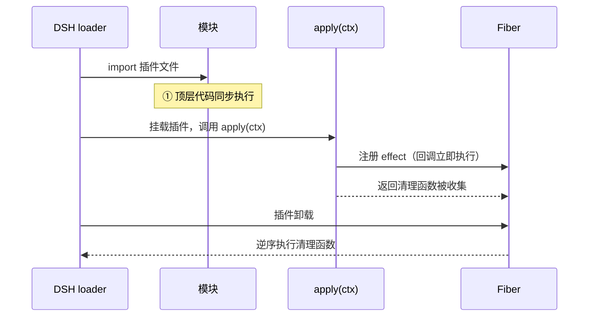

上一篇《自定义聊天背景》里，我们用了 `ctx.effect(() => webServer.register(...))`，当时留了一句话："`ctx.effect` 下一篇着重讲解"。这篇就把它彻底讲透。

先记住一句话：`ctx.effect` 是 Cordis 生命周期的地基。路由、事件监听、子插件……所有"需要随插件卸载而消失"的东西，底层都是它。

## 插件生命周期

先看演示插件的完整代码：

```ts
// dsh-effect-func.ts
import type { Context } from '@deepseek-ai/cordis'

export const name = 'dsh-effect-func'

// ① 同步阶段：模块顶层代码随插件加载同步执行（此时 apply 尚未运行）
console.log('[dsh-effect-func] ① 同步阶段：插件模块被加载')

export function apply(ctx: Context) {
    // ② 异步阶段：apply 在插件注册完成后执行（并非加载时立即执行）
    console.log('[dsh-effect-func] ② 异步阶段：apply 执行')

    // ③ effect 回调同步立即执行，返回的清理函数交给框架收集
    ctx.effect(() => {
        console.log('[dsh-effect-func] ③ effect 回调同步立即执行（返回清理函数）')
        return () => {
            // ④ 插件卸载时：框架逆序调用已收集的清理函数
            console.log('[dsh-effect-func] ④ 卸载时：effect 清理函数执行')
        }
    })
}
```

运行结果，日志严格按这个顺序出现：

```text
[dsh-effect-func] ① 同步阶段：插件模块被加载
[dsh-effect-func] ② 异步阶段：apply 执行
[dsh-effect-func] ③ effect 回调同步立即执行（返回清理函数）
[dsh-effect-func] ④ 卸载时：effect 清理函数执行
```


四个阶段其实分属两个大阶段：

- ① 发生在"加载模块"时：JS 引擎 import 这个文件，顶层代码同步执行。此刻 DSH 的插件树还没开始动，`ctx` 还不存在——所以顶层代码里拿不到 `ctx`。
- ②③④ 发生在"挂载插件"时：DSH 把插件插进插件树，loader 调用 `apply(ctx)`。`apply` 一执行，里面的 `ctx.effect` 回调同步、立即执行一次；它返回的清理函数被框架收起来，等插件卸载时再放出来执行。

配一张时序图：



## fiber 是什么

前面的时序图里出现了一个词：Fiber。它是理解 effect 绕不开的主角，先花半分钟认识它。

fiber = 一个插件的一次运行实例。

- 每次插件被挂载（`ctx.plugin(...)`），Cordis 就创建一个 fiber。DSH 的插件树里，每个节点其实就是一个 fiber。
- 同一个插件被挂载两次（比如在两个地方各启用一次），就有两个各自独立的 fiber，互不干扰。

## 清理的必要性

上一篇[自定义聊天背景](自定义聊天背景.md)里我们写过这么一段：

```ts
ctx.effect(() => webServer.register({
    kind: 'exact',
    path: IMAGE_URL,
    handler: ...,
}))
```

当时说了一句"不用 `ctx.effect` 也能注册进去"。没错，能注册，但后果是：

1. 插件被禁用（卸载）时，路由还在；
2. 下次再启用插件，`webServer.register` 对同一条 `(kind, path)` 直接抛 `duplicate route`——因为 DSH 把路由当"组合级契约"，撞了就是配置错误。

所以规律很朴素：凡是"你装上去的东西、卸下来时必须拆掉"的，就交给 `ctx.effect`。
