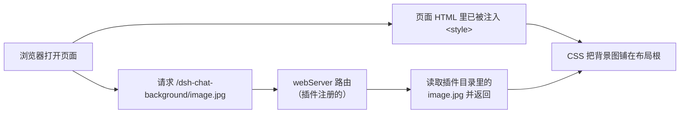
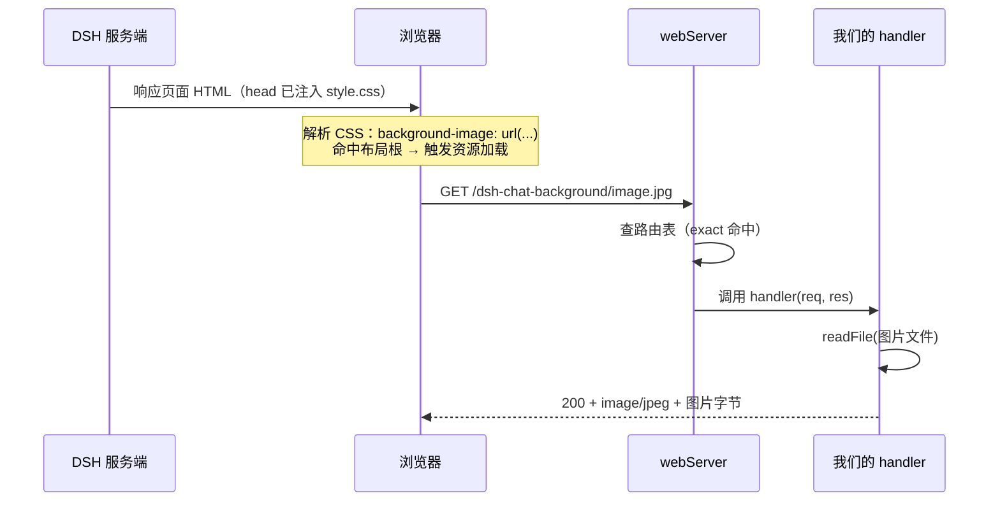

hello world 没啥吸引力，我们再练习一个设置聊天背景的插件。实现如下效果


## 我们的目标

写一个插件，把一张本地图片设为 DSH 的聊天背景。

## 这个插件要打通两条路

hello world 只是打印一句话，而这个插件要"动 UI"。页面是 DSH 自己渲染的，插件想影响它，需要打通两条路：

1. 让浏览器能拿到图片：图片在插件目录里，浏览器可访问不到你的磁盘。所以我们 要在 DSH 的 webServer 上注册一个 HTTP 路由：浏览器请求某个地址时，服务器把图片文件返回给它。
2. 让页面穿上背景：页面不知道"背景长什么样"。DSH 提供了一个钩子 `webserver/index-inject`，允许插件往每个页面的 `<head>` 里注入一段 `<style>`。



## 目录结构

```text
dsh-chat-background/                    ← 插件包（bundle）
├── src/                                ← 源码目录
│   ├── dsh-chat-background.ts          ← 插件本体：name + apply
│   └── style.css                       ← 背景样式（独立文件，方便改）
├── image.jpg                           ← 你的背景图片
├── package.json                        ← 身份 + dsh.bundle 声明
├── patch.yaml                          ← 挂载指令
└── tsconfig.json                       ← 类型配置（让编辑器认识 node:fs）
```

## 第一步：准备图片

把想用的背景图放到插件根目录，本教程用 `image.jpg`。

> 为什么图片不能写进代码？一是几 MB 的图会让代码文件爆炸；二是浏览器根本读不到你磁盘上的文件，必须走 HTTP 路由，这是唯一的正规通道。

## 第二步：写插件本体


```ts
// src/dsh-chat-background.ts
import { readFileSync } from 'node:fs'
import { readFile } from 'node:fs/promises'
import type { Context } from '@deepseek-ai/cordis'
// 只引入类型声明（module augmentation），编译后剥离，运行时零开销
import type {} from '@deepseek-ai/dsh-host-webserver'

export const name = 'dsh-chat-background'

// 图片在插件根目录（../），样式表与源码同目录；都用 import.meta.url 解析
const IMAGE_PATH = new URL('../image.jpg', import.meta.url).pathname
const IMAGE_URL = '/dsh-chat-background/image.jpg'
const STYLE = readFileSync(new URL('./style.css', import.meta.url), 'utf8')

export function apply(ctx: Context): void {
    // 1. 注册路由：浏览器请求 IMAGE_URL 时返回图片
    ctx.inject(['webServer'], (serverCtx) => {
        const webServer = serverCtx.webServer
        ctx.effect(() => webServer.register({
            kind: 'exact',
            path: IMAGE_URL,
            handler: async (_req, res) => {
                res.writeHead(200, { 'content-type': 'image/jpeg' })
                res.end(await readFile(IMAGE_PATH))
            },
        }))
    })

    // 2. 注入样式：把 style.css 内容原样注入每个 index 响应
    ctx.on('webserver/index-inject', (table) => {
        table.push({ kind: 'style', text: STYLE })
    })
}
```

这段代码做了两件事：第 1 段注册图片路由，第 2 段注入样式。我们按顺序拆开讲。

### 第 1 段：注册图片路由

```ts
ctx.inject(['webServer'], (serverCtx) => {
    const webServer = serverCtx.webServer
    ctx.effect(() => webServer.register({
        kind: 'exact',
        path: IMAGE_URL,
        handler: async (_req, res) => {
            res.writeHead(200, { 'content-type': 'image/jpeg' })
            res.end(await readFile(IMAGE_PATH))
        },
    }))
})
```

表面看只是"注册一个路由"，其实是三层嵌套，每一层解决一个问题。

最外层 `ctx.inject(['webServer'], ...)`：声明"我依赖 webServer"

`webServer` 是 DSH 内置的 HTTP 服务器服务（Cordis Service）。它自己也有启动过程——要监听端口、准备就绪。插件执行到 `apply()` 时，webServer 很可能还没准备好。`ctx.inject` 就是告诉 Cordis："我依赖 webServer，等它可用了再叫我"。Cordis 会替我们等，服务就绪后才执行里面的回调。

中间层 `webServer.register({...})`：往路由表里加一条

`register` 接收一个路由描述对象：

- `kind: 'exact'`：路径逐字匹配。浏览器请求的地址必须和 `path` 一模一样（`/dsh-chat-background/image.jpg` 一个字符都不能差）。另一个可选值是 `'prefix'`，匹配 `path` 和 `path/<任意内容>`，适合托管一个目录。
- `handler`：拥有响应的完整生命周期。服务器把请求交给 handler，写什么状态码、返回什么内容都由它决定（甚至可以挂起连接做 SSE）。所以我们必须自己 `res.writeHead(...)` 声明状态码和类型，`res.end(...)` 结束响应。
- 重复注册同一条 (kind, path) 会直接抛错——DSH 认为路由是"组合级契约"，撞了就是配置错误。

`handler` 内部就三行：`res.writeHead(200, { 'content-type': 'image/jpeg' })` 告诉浏览器"这是张 JPEG 图片"；`await readFile(IMAGE_PATH)` 把插件目录里的图片读进内存；`res.end(...)` 把字节流发给浏览器。

`register` 还有返回值：一个注销函数（把这条路由从表里删掉）。这个返回值是留给最内层用的。

最内层 `ctx.effect(...)`：把注销函数绑进插件生命周期

```ts
ctx.effect(() => webServer.register({ ... }))
```

`ctx.effect` 接收一个函数，该函数会立即执行，函数的返回值也是一个函数，当卸载当前插件时执行清理动作（下一篇着重讲解）。

等插件被卸载（禁用、移除、重载）时，Cordis 会逆序执行所有清理函数。


于是 `register` 返回的注销函数就有了归属：插件活着，路由在；插件卸载，路由自动消失。

这里不使用 `ctx.effect` 包装 `webServer.register` 也是可以的，路由一样可以注册进去，只是卸载插件时不会执行清理动作，下次再启用插件时 `register` 就会抛"duplicate route"异常。

> 记忆口诀：`inject` 等就绪，`register` 进表，`effect` 管清理。

- 请求来了会发生什么



### 第 2 段：注入样式

```ts
ctx.on('webserver/index-inject', (table) => {
    table.push({ kind: 'style', text: STYLE })
})
```

`webserver/index-inject` 是 DSH 的"往页面里塞东西"事件：每次渲染页面 HTML 时，DSH 发出这个事件，`table` 就是要注入的内容列表。我们 push 一条 `style`，内容就是 style.css 的全文，DSH 会把它渲染成 `<style>...</style>` 放进每个页面的 `<head>`。

`new URL('./style.css', import.meta.url)`：以插件源码文件自己的位置为基准找文件，不依赖你从哪个目录启动 DSH（这是比写相对路径更稳的写法）。

如果你问我为什么我知道是要监听`webserver/index-inject`这个事件？事实上我也不知道。写这个教程时，将 dsh 源码克隆下来放到目录中，AI 可以帮你解决一切。

## 第三步：写样式（核心思路：透出，而不是各铺各的）

```css
/* src/style.css */
/* 布局根（AppFrame.frame）铺一张背景图，同时覆盖侧边栏与聊天区 */
div:has(> [data-shell-overlay]) {
  background-image: url('/dsh-chat-background/image.jpg');
  background-size: cover;
}

/* 侧边栏列：局部置空 fill 变量，透出布局根背景 */
div:has(> [data-shell-overlay]) > div:first-child {
  --dsw-specific-sidebar-fill: transparent;
}

/* 聊天列根：背景置透明，透出布局根背景 */
div:has(> [data-shell-overlay]) [data-slot='conversation'] > [data-phase] {
  background: transparent;
}
```

## 第四步：bundle 三件套

### package.json —— 身份 + 声明

```json
{
  "name": "dsh-chat-background",
  "version": "0.1.0",
  "type": "module",
  "dependencies": {
    "@deepseek-ai/cordis": "^4.0.1",
    "@deepseek-ai/dsh-host-webserver": "^0.1.2-alpha.2"
  },
  "dsh": {
    "bundle": {
      "patch": "./patch.yaml"
    }
  }
}
```

`@deepseek-ai/dsh-host-webserver` 是 DSH 的 web 服务包，我们在第二步说过——它负责提供 `ctx.webServer` 和 `webserver/index-inject` 的类型声明。装上它，代码里的类型才会齐全。

### patch.yaml —— 说明书（注意指向 src 目录）

```yaml
- insert:
    - id: dsh-chat-background
      name: '/你的插件绝对路径/dsh-chat-background/src/dsh-chat-background.ts'
```

## 第五步：安装、启动、验证

```bash
cd 你的插件目录
pnpm install          # 装上依赖（含 dsh-host-webserver）
dsh plugin --profile test add link:.
dsh --profile test --dump-config   # 插件树里应出现 dsh-chat-background
dsh --profile test --no-open       # 启动，web 端口 3080
```
