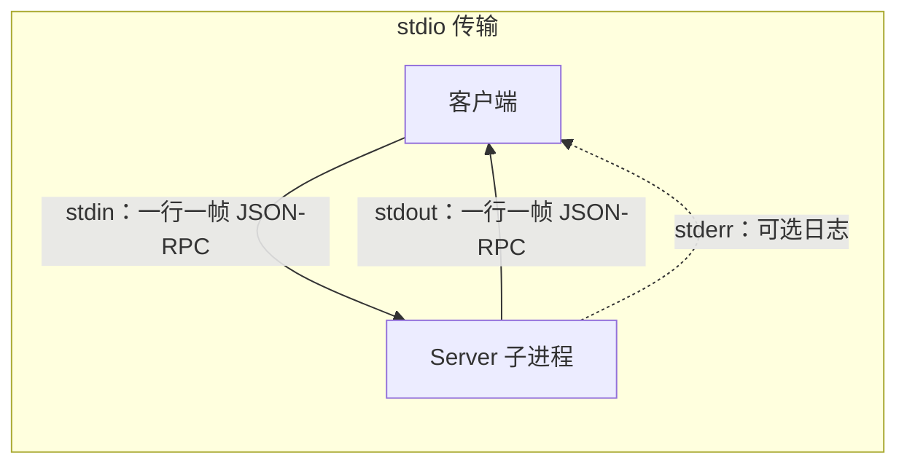
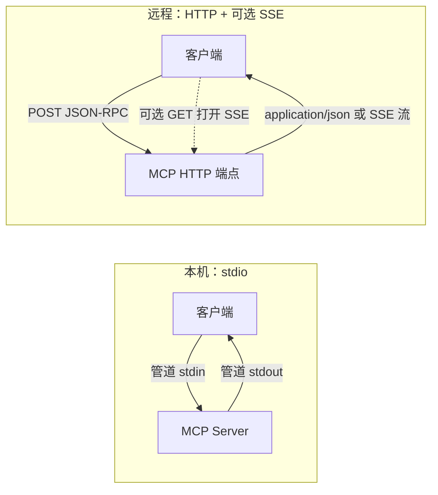

# MCP 传输层：stdio、HTTP 与 SSE

本文说明 [Model Context Protocol](https://modelcontextprotocol.io) 中 **stdio**、**HTTP**、**SSE** 的含义、关系与行为要点。规范以 [Transports（2025-11-25）](https://modelcontextprotocol.io/specification/2025-11-25/basic/transports.md) 为准；旧版 [HTTP + SSE（2024-11-05）](https://modelcontextprotocol.io/specification/2024-11-05/basic/transports) 仍常见于存量实现。

---

## 规范里是「三种传输」还是「两种」？

MCP **标准传输只有两种**：

1. **stdio**（标准输入 / 标准输出）进程间通信

1. **Streamable HTTP**（可流式 HTTP；取代 2024 版的 **HTTP + SSE** 双端点模型）

日常口语里的 **「HTTP」** 与 **「SSE」** 通常指远程场景下 **同一套 HTTP 传输里的两种机制**：用 **POST / GET** 承载请求与响应，用 **SSE（**`text/event-stream`**）** 做服务端向客户端的 **流式推送**。它们被统一在 **Streamable HTTP** 中描述，而不是与 stdio 并列的第三种独立传输名称。

---

## 1. stdio

### 模型

客户端 **启动 MCP Server 为子进程**，通过操作系统管道通信：**stdin / stdout** 交换 JSON-RPC 消息，**不依赖** MCP 自带的 HTTP 监听端口（除非 Server 内部再去访问其他网络服务）。

### 规范要点

| 方向 | 说明 |
| --- | --- |
| Client → Server | 向子进程 **stdin** 写入 MCP 消息；每条消息为 **一行** UTF-8 JSON-RPC；**消息体内不得包含未转义的换行**（换行即帧分隔符）。 |
| Server → Client | 向 **stdout** 写入合法 MCP 消息；**stdout 只能用于协议消息**，否则客户端解析会失败。 |
| stderr | Server **可以**向 **stderr** 输出日志（信息 / 调试 / 错误）；Client 可收集或忽略；**不应**假定 stderr 一定表示协议错误。 |
| 生命周期 | 关闭 stdin、终止子进程即断开连接。 |

### 典型场景

本机 IDE（如 Cursor）、桌面客户端启动本地 `npx` 或二进制 MCP：部署简单、无浏览器 **Origin** / CORS 问题、默认不对外暴露 MCP 端口。

### 示意图（横向）

---

## 2. HTTP（Streamable HTTP 中的角色）

### 模型

Server 作为 **独立进程**，可接受 **多个客户端连接**。在 **Streamable HTTP** 下，通常有 **单一 MCP 路径（endpoint）**，同时支持 **POST** 与 **GET**（以及规范中的 **DELETE** 用于结束会话等）。

### Client → Server：POST

- 每个 JSON-RPC 消息 **单独一次 HTTP POST** 到 MCP endpoint。

- 请求头 `Accept` 须同时列出 `application/json` 与 `text/event-stream`，表示客户端能接受「单次 JSON 响应」或「SSE 流式响应」。

- POST 内容为 **单个** JSON-RPC request、notification 或 response。

**响应约定（摘要）**：

- 若 POST 的是 **notification 或 response**：成功时 Server 常返回 **HTTP 202 Accepted** 且无 body。

- 若 POST 的是 **request**：Server 可返回

- `Content-Type: application/json`：一个 JSON 对象；或

- `Content-Type: text/event-stream`：在本次 POST 响应上建立 **SSE**，流式下发多条服务端消息，并最终包含对该 request 的 JSON-RPC response。

### 可选：GET（服务端主动下行）

- Client 可对 MCP endpoint 发 **GET**；若 Server 支持，则打开 **SSE**，用于 **无需 Client 先发 POST** 的场景下 Server 向 Client 推送 JSON-RPC request / notification。

- 若不支持，Server 可返回 **405 Method Not Allowed**。

### 会话：`MCP-Session-Id`

初始化后 Server 可在响应中返回 `MCP-Session-Id`；后续 POST / GET / DELETE 应按规范携带，以绑定同一会话。

### 安全（规范要求）

- 校验 `Origin`，缓解 **DNS 重绑定** 攻击。

- 本机服务宜绑定 **127.0.0.1**，而非 **0.0.0.0**。

- 应对连接做 **认证** 等加固。

---

## 3. SSE（Server-Sent Events）

### SSE 是什么

SSE 是 HTTP 的一种响应形式：`Content-Type: text/event-stream`，按 HTML 标准中的 [Server-sent events](https://html.spec.whatwg.org/multipage/server-sent-events.html) 使用 **event / data / id / retry** 等字段传输数据。

### 在 MCP 中的用途

- **流式下行**：在一次 Client 请求对应的连接上，Server 可先发 notifications、甚至 Server 发起的 requests，再返回对本次 Client request 的 response。

- **断线续传**：事件可带 `id`；Client 使用 `Last-Event-ID` 请求续传（规范中的 resumability）。

- **连接策略**：Server 可主动关闭连接并通过 `retry` 指导 Client 间隔重连，避免长连接占满资源（与「永远挂一条 SSE」的直觉略有不同）。

### 旧版：HTTP + SSE（2024-11-05）

已被 **Streamable HTTP** 取代，但实现上仍常见：

1. **SSE 端点**：Client 建立连接后，Server 首先发送 `endpoint`**事件**，给出 **POST 消息的 URI**。

1. **POST 端点**：Client 将所有 JSON-RPC 发到该 URI；Server → Client 的方向主要通过 SSE 的 `message`**事件**，data 中为 JSON。

**向后兼容思路（规范摘要）**：Client 可先对 URL **POST** `InitializeRequest`；若失败（如 400 / 404 / 405），再 **GET** 该 URL 尝试旧版 SSE 并等待 `endpoint`**事件**。

---

## 对照小结

| 概念 | 在 MCP 中的含义 |
| --- | --- |
| **stdio** | 子进程 + stdin/stdout 行协议；本机集成最常用 |
| **HTTP** | 远程时以 **POST** 为主发送消息；**GET** 可选用于 SSE 下行；**DELETE** 可选结束会话 |
| **SSE** | 在 POST 响应或 GET 长连接上以 **event-stream** 向 Client **推送多条服务端消息** |

---

## 参考链接

- [MCP Transports — 2025-11-25](https://modelcontextprotocol.io/specification/2025-11-25/basic/transports.md)

- [MCP Transports — 2024-11-05（HTTP + SSE）](https://modelcontextprotocol.io/specification/2024-11-05/basic/transports)

- [Server-Sent Events（WHATWG）](https://html.spec.whatwg.org/multipage/server-sent-events.html)
