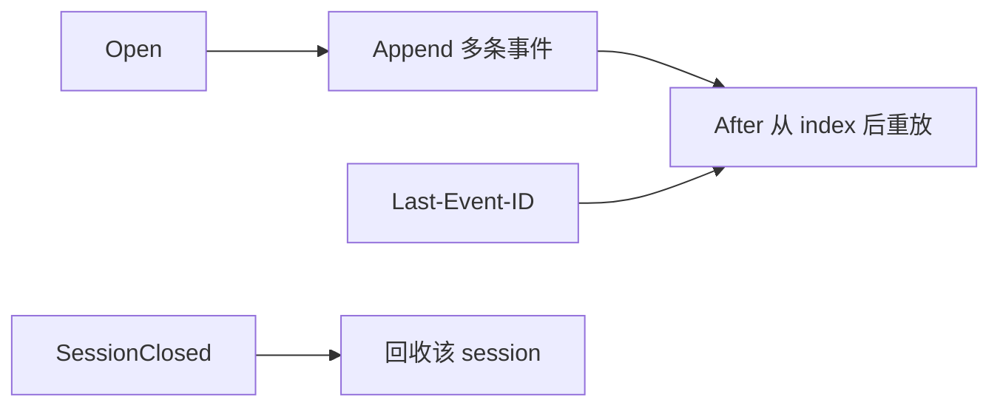

> 初学MCP，不用关心本文

端点续传是在 [[Streamable HTTP]] 时在 `mcp.StreamableHTTPOptions.EventStore` 配置的。

其原理是给 Streamable HTTP 的 SSE 流做事件落盘/缓存，从而在断线后按 Last-Event-ID 续传、重放还没被客户端收到的消息

该字段是一个接口类型，允许我们有自己的实现。

## 接口方法

```go
type EventStore interface {
	Open(_ context.Context, sessionID, streamID string) error
	Append(_ context.Context, sessionID, streamID string, data []byte) error
	After(_ context.Context, sessionID, streamID string, index int) iter.Seq2[[]byte, error]
	SessionClosed(_ context.Context, sessionID string) error
}
```



#### `Open(ctx, sessionID, streamID string) error`

- **含义**：即将有一个属于 `sessionID`、ID 为 `streamID` 的 **出站流** 要开始写事件。  
- **用途**：初始化该 session/stream 的底层结构（内存分桶、文件、目录等），保证后续 `Append` / `After` 合法。  
- **约定**：对同一 `(sessionID, streamID)` 重复调用应 **幂等或安全**（如 `MemoryEventStore` 在 `Open` 中懒初始化 map）。  
- **错误**：一般在 **无法分配资源** 时返回；仅“已打开过”时通常仍返回 `nil`。

#### `Append(ctx, sessionID, streamID string, data []byte) error`

- **含义**：向该流 **尾部追加** 一块出站事件的原始数据（一般为已序列化、准备写入 SSE `data:` 的字节，具体格式由 transport 约定）。  
- **调用时机**：服务端每发出（或缓冲）一个需要被重放保存的事件时，会 append 相应数据。  
- **实现要点**：保持 **追加顺序**，重放时能按顺序从某 `index` 之后迭代；注意 **并发** 与 **容量**（配合上限、淘汰、TTL；不能单靠 `SessionClosed` 清理）。

#### `After(ctx, sessionID, streamID string, index int) iter.Seq2[[]byte, error]`

- **含义**：返回迭代器，按顺序产出 `index`**之后** 的数据块（与 SDK 内部 event id / `Last-Event-ID` 的索引约定一致）。  
- **典型场景**：客户端重连时从断点续传，避免从头推送。  
- **硬性约定**（见 `event.go` 注释）：

1. 迭代一旦产出 **非 nil 的 error**，应 **停止**；调用方认为流不可用或不可恢复。  
2. 若 `index`**之后已有数据被丢弃**（例如内存淘汰），迭代器必须 **立刻** 返回 error，**不得只返回部分数据**——否则客户端会误以为中间无丢失，状态会错乱。`MemoryEventStore` 在 `index` 早于已 purge 的最早块时，会返回含 `ErrEventsPurged` 的错误。  
3. 流须 `Open`**过之后** 再对之调用 `After`。

#### `SessionClosed(ctx, sessionID string) error`

- **含义**：该 **MCP 会话整体结束**（其下所有 stream 一并结束），store 可删除与该 `sessionID` 相关的状态，释放资源。  
- **注意**：**不能假定一定会被调用**（进程崩溃、客户端消失等），因此生产实现还需 **超时淘汰、容量上限** 等自愈手段。

# 简单实现

先看一下如何使用

```go
	// StreamableHTTPOptions.EventStore：持久化 SSE 事件，便于客户端用 Last-Event-ID 续传（见 mcp.StreamableHTTPOptions）。
	eventStore := mcp.NewMemoryEventStore(nil)
	options := &mcp.StreamableHTTPOptions{
		EventStore: eventStore,
	}
	handler := mcp.NewStreamableHTTPHandler(func(*http.Request) *mcp.Server {
		return server
	}, options)
```

`MemoryEventStore`是该接口的一个默认实现，将数据保存在了内存。

## 业务自定义实现

生产可以换成 Redis

TODO: 待完善
