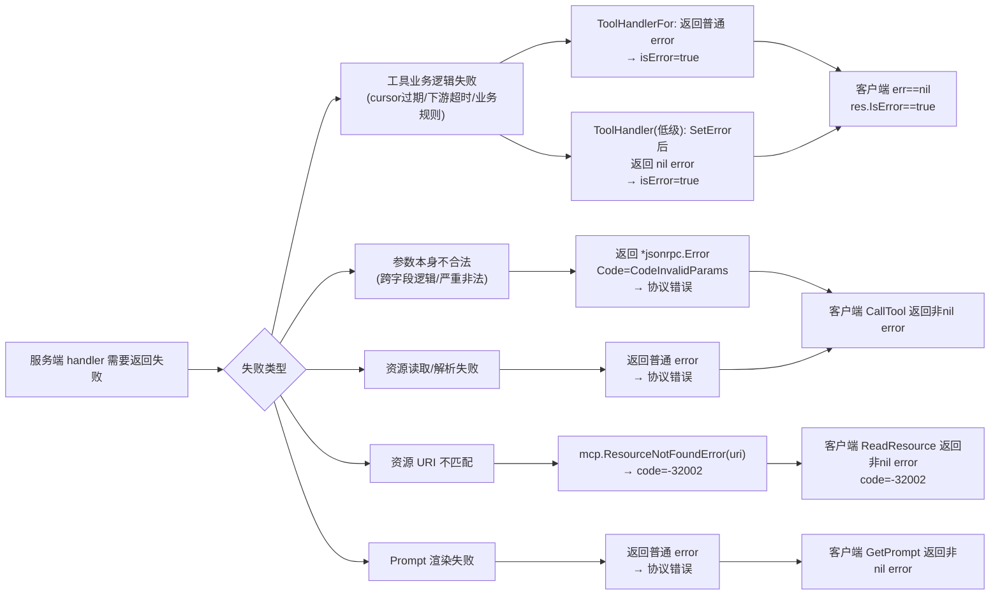

> 传统 API 的错误信息是给开发者看的，开发者会读文档、调试、修复代码。而 MCP 工具的调用方是 LLM，LLM 会实时解读错误信息，并据此决定下一步动作（重试、换参数、告知用户还是放弃）。
>
> 错误信息写得好不好，直接影响 LLM 的决策质量。

## 1. 核心概念：两类失败

MCP 协议将失败分为截然不同的两类，**选错会导致客户端误判**：

| 类型 | 触发方式 | JSON-RPC 响应形态 | 客户端感知 |
| --- | --- | --- | --- |
| **协议错误** | SDK 框架自动产生，或 handler 主动返回 `*jsonrpc.Error` | `{"error": {"code": ..., "message": ...}}` | `CallTool()` 返回非 nil `error` |
| **工具业务错误** | `ToolHandlerFor` 返回普通 `error` 或手动 `SetError` | `{"result": {"isError": true, "content": [...]}}` | `err == nil` 但 `res.IsError == true` |

**关键区分原则**：

- **协议错误**：请求本身不合法，或服务端无法处理该请求（工具不存在、参数 schema 不匹配、内部严重故障等）。客户端不应依赖 `result` 的内容。

- **工具业务错误**：请求合法，工具正常运行，但执行结果是失败的（例如 cursor 过期、下游超时、业务规则不满足等）。LLM 客户端 **仍可读取** `content` 内的错误描述，并据此重试或提示用户。

### 1.1 谁来负责产生协议错误？

**一个常见的误解**：协议错误都是框架自动处理的，开发者只需要关心工具业务错误。这个说法方向正确，但不够完整。

协议错误分为两种来源：

**① 框架自动产生（开发者无需干预）**

| 场景 | 触发者 |
| --- | --- |
| 工具名不存在（unknown tool） | SDK 内置 |
| 请求 JSON Schema 校验失败（字段类型、必填项） | SDK 内置 |
| Prompt 名不存在 | SDK 内置 |
| 请求体不是合法 JSON | 传输层 |

对于这类错误，开发者只需要**知道它们的存在**，以便正确设计工具的 Schema 和注册工具名，代码层面无需任何处理。

**② 开发者主动返回（框架无法替你判断）**

有些参数组合在**业务语义**上根本无法执行，但 JSON Schema 无法表达这种跨字段约束，需要开发者在 handler 内主动返回 `*jsonrpc.Error`：

```go
// 跨字段逻辑校验：schema 无法表达"开始时间不能晚于结束时间"
if in.StartTime.After(in.EndTime) {
    return nil, out, &jsonrpc.Error{
        Code:    jsonrpc.CodeInvalidParams,
        Message: "start_time 不能晚于 end_time",
    }
}
```

这里选择协议错误而不是业务错误（`isError=true`）的原因：**客户端不修正参数就无法重试成功**，语义上属于「请求本身不合法」。

**开发者职责总结**：

| 错误来源 | 开发者需要做什么 |
| --- | --- |
| 框架自动的协议错误 | 正确设计 Schema 和工具名即可，无需写代码 |
| 开发者主动的协议错误 | 识别「参数组合在语义上非法」的场景，返回 `*jsonrpc.Error` |
| 工具业务错误 | 日常最常见——执行过程中的失败，返回普通 `error` → `isError=true` |

---

## 2. 工具（Tool）错误处理

### 2.1 泛型 `mcp.AddTool`（推荐方式）

`mcp.AddTool` 接受类型化的 `ToolHandlerFor`，签名为：

```go
func(ctx context.Context, req *mcp.CallToolRequest, in InputType) (*mcp.CallToolResult, OutputType, error)
```

SDK 根据返回的 `error` 类型，自动决定走哪条路径：

```
普通 error（fmt.Errorf / errors.New / 自定义 error）
    └─→ CallToolResult.isError = true（工具业务错误）

*jsonrpc.Error
    └─→ JSON-RPC error 对象（协议错误）
```

**示例 A — 普通 error → 业务错误**

`cmd/mcp-pagination-demo/main.go` 中，cursor 过期时返回普通 `error`，客户端收到的是成功的 RPC result，但 `isError` 为 true：

```go
// cmd/mcp-pagination-demo/main.go
func queryLogTool(_ context.Context, _ *mcp.CallToolRequest, in queryLogIn) (*mcp.CallToolResult, queryLogOut, error) {
    start, err := resolveCursor(in.Cursor)
    if err != nil {
        // 返回普通 error → SDK 填充 CallToolResult.IsError = true
        return nil, queryLogOut{}, err
    }
    // ...
}
```

客户端收到的 JSON-RPC 响应（示意）：

```json
{
  "jsonrpc": "2.0",
  "id": 1,
  "result": {
    "content": [{ "type": "text", "text": "invalid or expired cursor" }],
    "isError": true
  }
}
```

**示例 B —**`*jsonrpc.Error`**→ 协议错误**

当业务逻辑判断参数组合不合法，希望让客户端 `CallTool` 直接返回 `error` 时：

```go
import "github.com/modelcontextprotocol/go-sdk/jsonrpc"

func myTool(_ context.Context, req *mcp.CallToolRequest, in myInput) (*mcp.CallToolResult, myOutput, error) {
    if in.StartTime.After(in.EndTime) {
        return nil, myOutput{}, &jsonrpc.Error{
            Code:    jsonrpc.CodeInvalidParams,
            Message: "start_time 不能晚于 end_time",
        }
    }
    // ...
}
```

客户端表现：`res, err := session.CallTool(...)` 中 `err != nil`，`res` 不可用。

## 3. 入参校验失败

泛型 `mcp.AddTool` 在进入业务 handler **之前**会自动执行：

1. **JSON Schema 校验**：对 `arguments` 按工具声明的 `InputSchema` 验证字段类型、必填项、枚举值等。

1. **默认值填充**：schema 中有 `default` 时自动注入。

校验失败时，**handler 函数体不会被执行**，SDK 直接返回 JSON-RPC 协议错误（`InvalidParams` 语义），客户端 `CallTool` 得到非 nil `error`。

```
客户端传入类型错误的 arguments
    └─→ SDK schema 校验失败
        └─→ JSON-RPC error { "code": -32602, "message": "..." }
            └─→ 客户端 CallTool 返回 error，handler 未被调用
```

**实践建议**：

- 对于**格式层面**的约束（字段类型、必填、枚举），依赖 SDK 的 schema 校验，无需在 handler 内重复。

- 对于**业务层面**的约束（如时间范围逻辑、跨字段关联），在 handler 内校验并返回合适的错误。

---

## 4. 资源（Resource）错误处理

资源 handler 签名为：

```go
func(ctx context.Context, req *mcp.ReadResourceRequest) (*mcp.ReadResourceResult, error)
```

资源错误分为两种情况：

### 4.1 资源未找到 → `mcp.ResourceNotFoundError`

URI 不匹配时，应使用 SDK 提供的 `ResourceNotFoundError`，它会产生 MCP 标准错误码 `-32002`，并在 `data.uri` 字段中携带请求的 URI：

```go
// cmd/mcp-resource-demo/main.go
func readDemoMarkdown(_ context.Context, req *mcp.ReadResourceRequest) (*mcp.ReadResourceResult, error) {
    if req.Params.URI != demoResourceURI {
        // 使用标准 ResourceNotFoundError，而不是普通 fmt.Errorf
        return nil, mcp.ResourceNotFoundError(req.Params.URI)
    }
    // ...
}
```

客户端收到的 JSON-RPC error（示意）：

```json
{
  "code": -32002,
  "message": "Resource not found",
  "data": { "uri": "file:///wrong/path" }
}
```

### 4.2 读取失败 → 普通 `error`

读文件、网络请求等 I/O 失败，返回普通 `error` 即可，SDK 将其作为协议/实现错误传递给客户端：

```go
data, err := os.ReadFile(demoMarkdownFile)
if err != nil {
    // 普通 error → 协议错误，客户端 ReadResource 返回非 nil error
    return nil, fmt.Errorf("读取 %s: %w", demoMarkdownFile, err)
}
```

### 4.3 资源错误处理决策

```
URI 不存在/不匹配
    └─→ mcp.ResourceNotFoundError(uri)  →  code: -32002

读取/解析失败（I/O、权限、格式错误）
    └─→ fmt.Errorf(...)  →  协议错误，客户端 ReadResource 返回 error

鉴权失败（HTTP 层）
    └─→ HTTP 401/403，MCP 层不感知
```

---

## 5. 提示词（Prompt）错误处理

提示词 handler 签名为：

```go
func(ctx context.Context, req *mcp.GetPromptRequest) (*mcp.GetPromptResult, error)
```

提示词错误**没有** `isError` 机制，所有 handler 返回的 `error` 都会变成 **JSON-RPC 协议错误**：

```go
// cmd/mcp-error-analysis/main.go
func promptHandler(_ context.Context, req *mcp.GetPromptRequest) (*mcp.GetPromptResult, error) {
    var buf strings.Builder
    if err := errorAnalysisTmpl.Execute(&buf, data); err != nil {
        // 普通 error → 协议错误（对应 code: -32603 内部错误）
        return nil, fmt.Errorf("渲染提示词模板: %w", err)
    }
    // ...
}
```

**已知名称不存在**：SDK 内置逻辑会在进入 handler 前返回 `InvalidParams` 错误（`-32602`），handler 不会被执行。

客户端侧：

```go
res, err := session.GetPrompt(ctx, &mcp.GetPromptParams{Name: "error-analysis-prompt", Arguments: args})
if err != nil {
    // 所有提示词失败均从 err 感知，不存在 res.IsError 字段
    log.Fatalf("GetPrompt: %v", err)
}
// 成功时才能使用 res.Messages
```

---

## 6. 中间件中的错误处理

### 6.1 接收中间件（ReceivingMiddleware）

通过 `srv.AddReceivingMiddleware` 注册，可以在 handler 执行前后拦截：

```go
srv.AddReceivingMiddleware(func(next mcp.MiddlewareHandler) mcp.MiddlewareHandler {
    return func(ctx context.Context, req *mcp.Request) (any, error) {
        // 前置处理（如日志、鉴权）
        res, err := next(ctx, req)
        // 后置处理：统一错误包装
        if err != nil {
            log.Printf("MCP request %s failed: %v", req.Method, err)
        }
        return res, err
    }
})
```

### 6.2 在中间件中修改 `CallToolResult`

如果中间件需要将工具结果中的业务错误转换为协议错误（或反之），可以类型断言后修改：

```go
srv.AddReceivingMiddleware(func(next mcp.MiddlewareHandler) mcp.MiddlewareHandler {
    return func(ctx context.Context, req *mcp.Request) (any, error) {
        res, err := next(ctx, req)
        if toolRes, ok := res.(*mcp.CallToolResult); ok && toolRes.IsError {
            // 可以在这里记录业务错误、上报监控等
            log.Printf("tool business error: %v", toolRes.GetError())
        }
        return res, err
    }
})
```

> **注意**：`GetError()` 只在服务端中间件中有意义；客户端收到的 `CallToolResult` 中，该方法不可用。

---

## 7. 客户端侧：如何接收和区分错误

客户端需要在**三层**分别处理错误，缺少任何一层都可能丢失失败信息：

```go
// 第 1 层：连接/传输失败
session, err := client.Connect(ctx, transport, nil)
if err != nil {
    log.Fatalf("connect: %v", err)  // 无法继续，无有效 session
}

// 第 2 层：RPC 协议错误（工具不存在、schema 校验失败、协议错误等）
res, err := session.CallTool(ctx, &mcp.CallToolParams{
    Name:      "query_log",
    Arguments: args,
})
if err != nil {
    log.Fatalf("CallTool protocol error: %v", err)  // res 不可用
}

// 第 3 层：工具业务错误（handler 返回普通 error，isError = true）
if res.IsError {
    log.Printf("tool reported failure: %+v", res.Content)
    // 可以选择重试、提示用户或告知 LLM
}

// 仅在上述三层均通过时，才能安全消费 res.Content 中的正常数据
```

与分页 demo 的对应关系：

```go
// cmd/mcp-pagination-demo/client/main.go
res, err := session.CallTool(ctx, &mcp.CallToolParams{
    Name:      "query_log",
    Arguments: args,
})
if err != nil {
    log.Fatalf("CallTool: %v", err)
}
if res.IsError {
    log.Fatalf("tool error: %+v", res.Content)
}
```

---

## 8. 常用错误码速查

| 来源 | 常量 | 值 | 含义 | 典型场景 |
| --- | --- | --- | --- | --- |
| JSON-RPC 标准 | `CodeParseError` | `-32700` | 请求体不是合法 JSON | 损坏的请求体、编码错误 |
| JSON-RPC 标准 | `CodeInvalidRequest` | `-32600` | 不符合 JSON-RPC 2.0 格式 | 缺少 `method`、`jsonrpc` 字段 |
| JSON-RPC 标准 | `CodeMethodNotFound` | `-32601` | 方法不存在 | 打错 MCP 方法名 |
| JSON-RPC 标准 | `CodeInvalidParams` | `-32602` | 参数不合法 | 工具不存在（unknown tool）、未知 prompt、schema 校验失败 |
| JSON-RPC 标准 | `CodeInternalError` | `-32603` | 服务端内部错误 | 未捕获 panic、模板渲染失败 |
| MCP SDK 扩展 | `CodeResourceNotFound` | `-32002` | 资源未找到 | `mcp.ResourceNotFoundError(uri)` |

**使用示例**：

```go
import "github.com/modelcontextprotocol/go-sdk/jsonrpc"

// 在 handler 中主动返回标准错误码
return nil, zero, &jsonrpc.Error{
    Code:    jsonrpc.CodeInvalidParams,
    Message: "cursor 格式错误，须为 base64url 编码的令牌",
}
```

---

## 9. 运输层与进程级错误

`http.ListenAndServe`、`gin.Run`、`server.Run(ctx, transport)` 等属于**宿主进程/传输层**错误，不属于 MCP 协议内的 tool/resource/prompt 错误，统一使用 `log.Fatal` 处理：

```go
// HTTP 传输（cmd/mcp-http-auth-demo/main.go）
if err := http.ListenAndServe(addr, handler); err != nil {
    log.Fatalf("ListenAndServe failed: %v", err)
}

// Stdio 传输（cmd/mcp-weekly-report/main.go）
if err := server.Run(context.Background(), &mcp.StdioTransport{}); err != nil {
    log.Fatal(err)
}

// Gin 包装（cmd/mcp-hello/main.go）
if err := r.Run(addr); err != nil {
    log.Fatalf("server stopped: %v", err)
}
```

这类错误发生时，MCP 会话已经无法建立或已断开，无需（也无法）向客户端发送 MCP 协议层错误。

**HTTP 层鉴权失败**（如 Bearer Token 校验）也属于传输层，在 MCP handler 之前拦截，直接返回 HTTP 4xx，不产生任何 MCP 协议消息：

```go
// cmd/mcp-http-auth-demo/main.go
func bearerAuth(expected string, next http.Handler) http.Handler {
    return http.HandlerFunc(func(w http.ResponseWriter, r *http.Request) {
        // 鉴权失败：HTTP 401，MCP 层完全不感知
        http.Error(w, "invalid token", http.StatusUnauthorized)
        return
    })
}
```

---

## 10. 错误处理决策树



---

## 11. 最佳实践汇总

### 11.1 工具错误处理原则

| 场景 | 推荐做法 |
| --- | --- |
| cursor/token 过期 | 返回普通 `error`（`isError=true`） |
| 下游 I/O 超时（可重试） | 返回普通 `error` + 错误描述 |
| 业务规则冲突（参数组合非法） | 返回 `*jsonrpc.Error{Code: InvalidParams}` |
| 严重内部错误（不可恢复） | 返回 `*jsonrpc.Error{Code: InternalError}` |

### 11.2 错误信息质量

```go
// 好的错误信息：包含上下文、可诊断
return nil, out, fmt.Errorf("查询日志失败 service=%s range=%s: %w", svc, timeRange, err)

// 避免的错误信息：过于模糊
return nil, out, fmt.Errorf("error")
```

### 11.3 错误包装（`%w`）

使用 `fmt.Errorf` 时始终用 `%w` 而非 `%v` 包装 `error`，以保留 `errors.Is` / `errors.As` 的可用性：

```go
if err := db.Query(sql); err != nil {
    return nil, out, fmt.Errorf("数据库查询: %w", err)  // ✓ 保留可解包性
}
```

### 11.4 不要在 handler 中 panic

SDK 不保证对所有传输方式都能 recover panic。应在 handler 内捕获所有可预见的错误，并以 `error` 形式返回：

```go
func myTool(ctx context.Context, req *mcp.CallToolRequest, in myInput) (*mcp.CallToolResult, myOutput, error) {
    defer func() {
        if r := recover(); r != nil {
            // 极端情况下的保底，正常业务不应依赖此
            log.Printf("unexpected panic: %v", r)
        }
    }()
    // ...
}
```

### 11.5 `ResourceNotFoundError` 而不是普通 `error`

资源 URI 不存在时，**必须**使用 `mcp.ResourceNotFoundError`，而不是 `fmt.Errorf`。前者携带标准错误码 `-32002` 和 `data.uri`，客户端和 LLM 可以据此区分「未找到」和「内部错误」。

### 11.6 客户端三层校验缺一不可

```
Connect 失败 → 无 session，直接退出
CallTool/GetPrompt/ReadResource 返回 error → RPC 层失败，res 不可用
res.IsError == true（仅 CallTool）→ 工具业务失败，仍可读 res.Content
```

三层均通过，才能将 `res.Content` 传递给后续逻辑。
